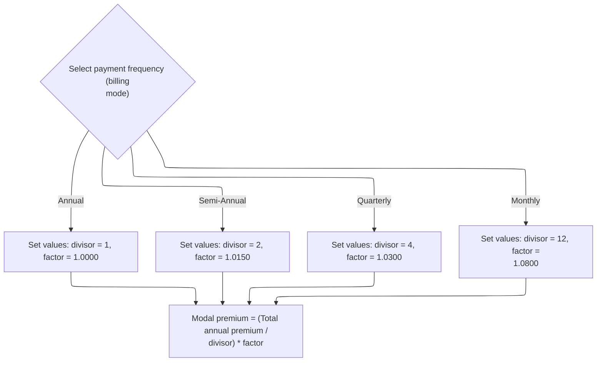

This document outlines the process for changing a policyholder's insurance plan. The flow checks eligibility, verifies age requirements for the new plan, recalculates premiums and riders, adjusts for billing mode, and finalizes the change. The process begins with a plan change request and ends with an updated policy and confirmation.

# Validating and Initiating Plan Change

<SwmSnippet path="/QCBLLESRC/SVCMNT.cbl" line="194">

---

In `4100-CHANGE-PLAN`, we check if the policy is either active or in grace. If not, we set an error code and message, and exit. This prevents plan changes on policies that aren't in force.

```cobol
       4100-CHANGE-PLAN.
           IF NOT PM-STATUS-ACTIVE AND NOT PM-STATUS-GRACE
               MOVE 13 TO WS-RESULT-CODE
               MOVE 'PLAN CHANGE: POLICY MUST BE ACTIVE OR IN GRACE'
                   TO WS-RESULT-MESSAGE
               EXIT PARAGRAPH
           END-IF
```

---

</SwmSnippet>

<SwmSnippet path="/QCBLLESRC/SVCMNT.cbl" line="201">

---

Next, we update the plan code and call 1100-LOAD-PLAN-PARAMETERS to pull in all the new plan's settings.

```cobol
           MOVE PM-PLAN-CODE TO PM-OLD-PLAN-CODE
           MOVE PM-NEW-PLAN-CODE TO PM-PLAN-CODE
           PERFORM 1100-LOAD-PLAN-PARAMETERS
```

---

</SwmSnippet>

<SwmSnippet path="/QCBLLESRC/SVCMNT.cbl" line="204">

---

Back in 4100-CHANGE-PLAN, right after loading the new plan parameters, we check if the policyholder's age fits the new plan's allowed range. If not, we revert the plan code and exit with an error.

```cobol
           IF PM-ATTAINED-AGE < PM-MIN-ISSUE-AGE OR
              PM-ATTAINED-AGE > PM-MAX-ISSUE-AGE
               MOVE 14 TO WS-RESULT-CODE
               MOVE 'PLAN CHANGE: AGE OUTSIDE NEW PLAN LIMITS'
                   TO WS-RESULT-MESSAGE
               MOVE PM-OLD-PLAN-CODE TO PM-PLAN-CODE
               EXIT PARAGRAPH
           END-IF
```

---

</SwmSnippet>

<SwmSnippet path="/QCBLLESRC/SVCMNT.cbl" line="212">

---

After passing all the checks, we call 3100-REPRICE-POLICY to recalculate the premium and related amounts based on the new plan and the policyholder's details.

```cobol
           PERFORM 3100-REPRICE-POLICY
```

---

</SwmSnippet>

## Calculating New Premium and Riders

```mermaid
%%{init: {"flowchart": {"defaultRenderer": "elk"}} }%%
flowchart TD
    node1["Start repricing policy"] --> node2{"Attained age?"}
    click node1 openCode "QCBLLESRC/SVCMNT.cbl:373:374"
    click node2 openCode "QCBLLESRC/SVCMNT.cbl:374:380"
    node2 -->|"#lt;=30"| node3["Set mortality rate: 0.8500"]
    node2 -->|"#lt;=40"| node3
    node2 -->|"#lt;=50"| node3
    node2 -->|"#lt;=60"| node3
    node2 -->|"#gt;60"| node3
    click node3 openCode "QCBLLESRC/SVCMNT.cbl:375:379"
    node3 --> node4{"Gender?"}
    click node4 openCode "QCBLLESRC/SVCMNT.cbl:381:382"
    node4 -->|"Female"| node5["Set gender factor: 0.9200"]
    node4 -->|"Male"| node5
    click node5 openCode "QCBLLESRC/SVCMNT.cbl:381:382"
    node5 --> node6{"Smoker?"}
    click node6 openCode "QCBLLESRC/SVCMNT.cbl:383:384"
    node6 -->|"Yes"| node7["Set smoker factor: 1.7500"]
    node6 -->|"No"| node7
    click node7 openCode "QCBLLESRC/SVCMNT.cbl:383:384"
    node7 --> node8{"Occupation class?"}
    click node8 openCode "QCBLLESRC/SVCMNT.cbl:385:390"
    node8 -->|"1"| node9["Set occupation factor: 1.0000"]
    node8 -->|"2"| node9["Set occupation factor: 1.1500"]
    node8 -->|"3"| node9["Set occupation factor: 1.4000"]
    node8 -->|"Other"| node9["Set occupation factor: 1.0000"]
    click node9 openCode "QCBLLESRC/SVCMNT.cbl:386:389"
    node9 --> node10{"UW class?"}
    click node10 openCode "QCBLLESRC/SVCMNT.cbl:391:396"
    node10 -->|"'PR'"| node11["Set UW factor: 0.9000"]
    node10 -->|"'ST'"| node11["Set UW factor: 1.0000"]
    node10 -->|"'TB'"| node11["Set UW factor: 1.2500"]
    node10 -->|"Other"| node11["Set UW factor: 1.0000"]
    click node11 openCode "QCBLLESRC/SVCMNT.cbl:392:395"
    node11 --> node12["Calculate base annual premium"]
    click node12 openCode "QCBLLESRC/SVCMNT.cbl:397:401"
    node12 --> node13["Process riders"]
    click node13 openCode "QCBLLESRC/SVCMNT.cbl:402:413"
    subgraph loop1["For each rider"]
        node13 --> node14{"Is rider active and valid?"}
        click node14 openCode "QCBLLESRC/SVCMNT.cbl:404:405"
        node14 -->|"Yes"| node15["Calculate and add rider premium"]
        click node15 openCode "QCBLLESRC/SVCMNT.cbl:406:411"
        node15 --> node13
        node14 -->|"No"| node13
    end
    node13 --> node16["Calculate gross premium"]
    click node16 openCode "QCBLLESRC/SVCMNT.cbl:414:416"
    node16 --> node17["Calculate tax amount"]
    click node17 openCode "QCBLLESRC/SVCMNT.cbl:417:418"
    node17 --> node18["Calculate total premium"]
    click node18 openCode "QCBLLESRC/SVCMNT.cbl:419:420"
    node18 --> node19["Calculate premium delta"]
    click node19 openCode "QCBLLESRC/SVCMNT.cbl:421:422"
    node19 --> node20["Recalculate modal premium"]
    click node20 openCode "QCBLLESRC/SVCMNT.cbl:423:423"

classDef HeadingStyle fill:#777777,stroke:#333,stroke-width:2px;
```



<SwmSnippet path="/QCBLLESRC/SVCMNT.cbl" line="373">

---

In `3100-REPRICE-POLICY`, we start by assigning the base mortality rate based on age using fixed constants. This is the first step in building up the premium calculation, and the choice of constants directly impacts the result.

```cobol
       3100-REPRICE-POLICY.
           EVALUATE TRUE
               WHEN PM-ATTAINED-AGE <= 30 MOVE 0.8500 TO PM-BASE-MORTALITY-RATE
               WHEN PM-ATTAINED-AGE <= 40 MOVE 1.2000 TO PM-BASE-MORTALITY-RATE
               WHEN PM-ATTAINED-AGE <= 50 MOVE 2.1500 TO PM-BASE-MORTALITY-RATE
               WHEN PM-ATTAINED-AGE <= 60 MOVE 4.1000 TO PM-BASE-MORTALITY-RATE
               WHEN OTHER                 MOVE 7.2500 TO PM-BASE-MORTALITY-RATE
           END-EVALUATE
```

---

</SwmSnippet>

<SwmSnippet path="/QCBLLESRC/SVCMNT.cbl" line="381">

---

After setting the mortality rate, we set the gender factor—0.92 for females, 1.0 otherwise. This feeds into the premium calculation.

```cobol
           IF PM-FEMALE MOVE 0.9200 TO PM-GENDER-FACTOR
           ELSE MOVE 1.0000 TO PM-GENDER-FACTOR END-IF
```

---

</SwmSnippet>

<SwmSnippet path="/QCBLLESRC/SVCMNT.cbl" line="383">

---

After gender, we set the smoker factor—1.75 for smokers, 1.0 otherwise. This further adjusts the premium calculation.

```cobol
           IF PM-SMOKER MOVE 1.7500 TO PM-SMOKER-FACTOR
           ELSE MOVE 1.0000 TO PM-SMOKER-FACTOR END-IF
```

---

</SwmSnippet>

<SwmSnippet path="/QCBLLESRC/SVCMNT.cbl" line="385">

---

After smoker, we set the occupation factor based on occupation class. Higher classes mean higher premiums.

```cobol
           EVALUATE PM-OCCUPATION-CLASS
               WHEN 1 MOVE 1.0000 TO PM-OCCUPATION-FACTOR
               WHEN 2 MOVE 1.1500 TO PM-OCCUPATION-FACTOR
               WHEN 3 MOVE 1.4000 TO PM-OCCUPATION-FACTOR
               WHEN OTHER MOVE 1.0000 TO PM-OCCUPATION-FACTOR
           END-EVALUATE
```

---

</SwmSnippet>

<SwmSnippet path="/QCBLLESRC/SVCMNT.cbl" line="391">

---

After occupation, we set the underwriting factor based on the underwriting class. Preferred gets a discount, standard is neutral, and 'TB' is penalized.

```cobol
           EVALUATE PM-UW-CLASS
               WHEN 'PR' MOVE 0.9000 TO PM-UW-FACTOR
               WHEN 'ST' MOVE 1.0000 TO PM-UW-FACTOR
               WHEN 'TB' MOVE 1.2500 TO PM-UW-FACTOR
               WHEN OTHER MOVE 1.0000 TO PM-UW-FACTOR
           END-EVALUATE
```

---

</SwmSnippet>

<SwmSnippet path="/QCBLLESRC/SVCMNT.cbl" line="397">

---

Now we compute the base annual premium using all the factors set above. Then, we loop over up to 5 riders, adding their premiums (with special logic for 'ADB01'), and sum them up for the total rider premium.

```cobol
           COMPUTE PM-BASE-ANNUAL-PREMIUM =
               (PM-SUM-ASSURED / 1000) * PM-BASE-MORTALITY-RATE
               * PM-GENDER-FACTOR * PM-SMOKER-FACTOR
               * PM-OCCUPATION-FACTOR * PM-UW-FACTOR
           MOVE ZEROS TO PM-RIDER-ANNUAL-TOTAL
           PERFORM VARYING WS-RIDER-IDX FROM 1 BY 1
               UNTIL WS-RIDER-IDX > 5
               IF PM-RIDER-CODE(WS-RIDER-IDX) NOT = SPACES AND
                  PM-RIDER-ACTIVE(WS-RIDER-IDX)
                   IF PM-RIDER-CODE(WS-RIDER-IDX) = 'ADB01'
                       COMPUTE PM-RIDER-ANNUAL-PREM(WS-RIDER-IDX) =
                           (PM-RIDER-SUM-ASSURED(WS-RIDER-IDX)/1000)*0.1800
                   END-IF
                   ADD PM-RIDER-ANNUAL-PREM(WS-RIDER-IDX)
                       TO PM-RIDER-ANNUAL-TOTAL
               END-IF
           END-PERFORM
```

---

</SwmSnippet>

<SwmSnippet path="/QCBLLESRC/SVCMNT.cbl" line="414">

---

After summing up the base, rider, and fee amounts, and applying tax, we get the total annual premium and the premium delta. Then we call 3200-RECALCULATE-MODAL to adjust the premium for the billing frequency.

```cobol
           COMPUTE PM-GROSS-ANNUAL-PREMIUM =
               PM-BASE-ANNUAL-PREMIUM + PM-RIDER-ANNUAL-TOTAL
               + PM-ANNUAL-POLICY-FEE
           COMPUTE PM-TAX-AMOUNT =
               PM-GROSS-ANNUAL-PREMIUM * PM-TAX-RATE
           COMPUTE PM-TOTAL-ANNUAL-PREMIUM =
               PM-GROSS-ANNUAL-PREMIUM + PM-TAX-AMOUNT
           COMPUTE PM-PREMIUM-DELTA =
               PM-TOTAL-ANNUAL-PREMIUM - WS-OLD-TOTAL-PREMIUM
           PERFORM 3200-RECALCULATE-MODAL.
```

---

</SwmSnippet>

## Adjusting Premium for Billing Mode



<SwmSnippet path="/QCBLLESRC/SVCMNT.cbl" line="425">

---

In `3200-RECALCULATE-MODAL`, we set the divisor and factor for the modal premium based on billing mode. Each mode has its own values, which affect the final payment amount.

```cobol
       3200-RECALCULATE-MODAL.
           EVALUATE PM-BILLING-MODE
               WHEN 'A' MOVE 1 TO WS-MODAL-DIVISOR
                        MOVE 1.0000 TO WS-MODAL-FACTOR
               WHEN 'S' MOVE 2 TO WS-MODAL-DIVISOR
                        MOVE 1.0150 TO WS-MODAL-FACTOR
               WHEN 'Q' MOVE 4 TO WS-MODAL-DIVISOR
                        MOVE 1.0300 TO WS-MODAL-FACTOR
               WHEN 'M' MOVE 12 TO WS-MODAL-DIVISOR
                        MOVE 1.0800 TO WS-MODAL-FACTOR
           END-EVALUATE
```

---

</SwmSnippet>

<SwmSnippet path="/QCBLLESRC/SVCMNT.cbl" line="436">

---

After setting the divisor and factor, we calculate the modal premium by dividing the total annual premium and applying the factor. This gives the actual payment amount for the billing mode.

```cobol
           COMPUTE PM-MODAL-PREMIUM =
               (PM-TOTAL-ANNUAL-PREMIUM / WS-MODAL-DIVISOR)
               * WS-MODAL-FACTOR.
```

---

</SwmSnippet>

## Finalizing the Plan Change

<SwmSnippet path="/QCBLLESRC/SVCMNT.cbl" line="213">

---

Back in 4100-CHANGE-PLAN, after repricing, we add the service fee, set the amendment status to applied, and mark the operation as successful with a message.

```cobol
           ADD PM-SERVICE-FEE TO PM-SERVICE-FEE-CHARGED
           MOVE 'AP' TO PM-AMENDMENT-STATUS
           MOVE 0 TO WS-RESULT-CODE
           MOVE 'PLAN CHANGE APPLIED' TO WS-RESULT-MESSAGE.
```

---

</SwmSnippet>

&nbsp;

*This is an auto-generated document by Swimm 🌊 and has not yet been verified by a human*

<SwmMeta version="3.0.0" repo-id="Z2l0aHViJTNBJTNBTElGRTQwMCUzQSUzQW11ZGFzaW4x" repo-name="LIFE400"><sup>Powered by [Swimm](https://app.swimm.io/)</sup></SwmMeta>
