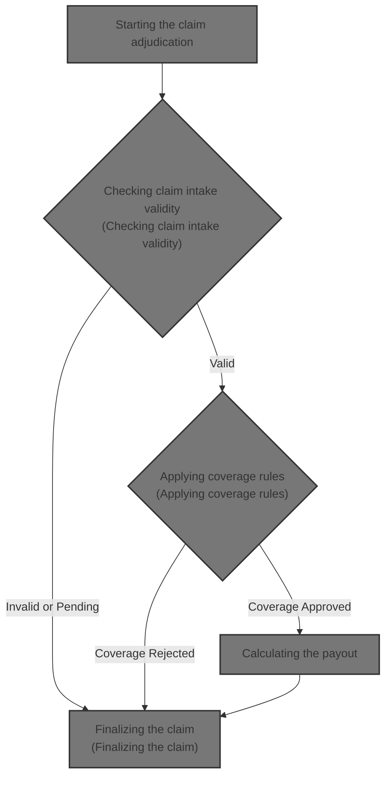
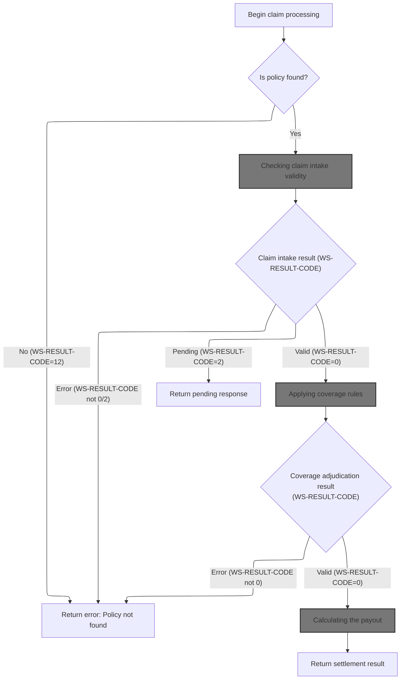
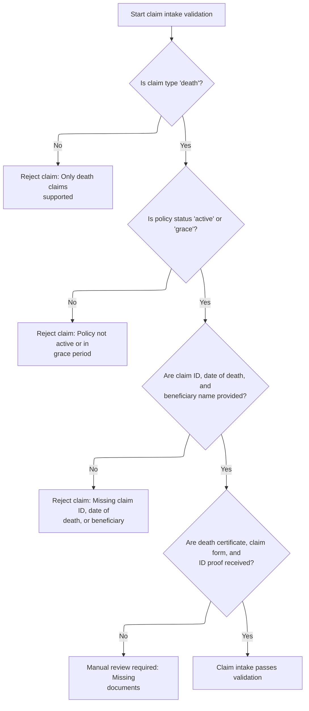
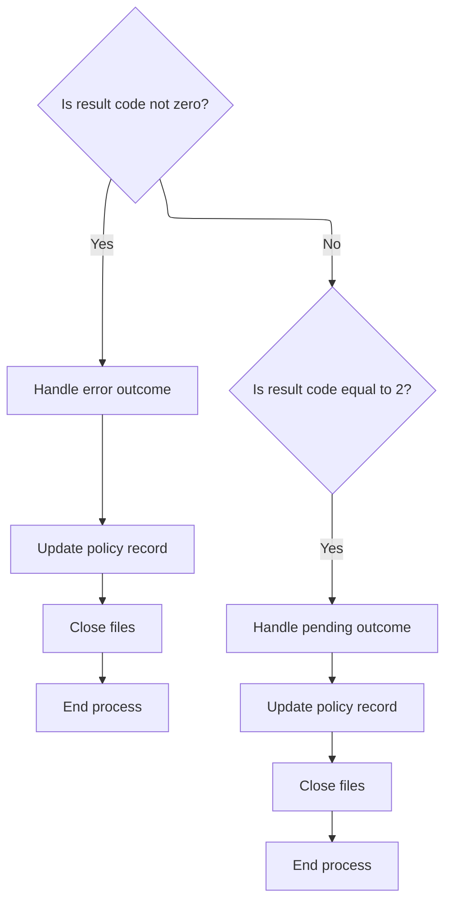
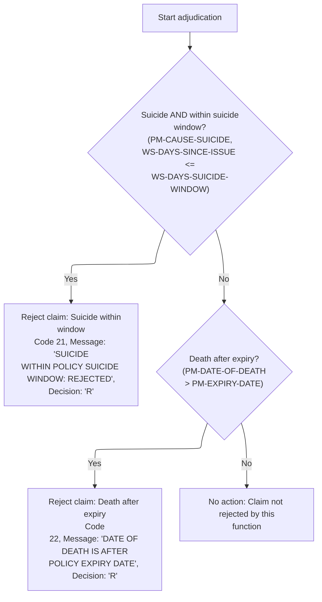

# Overview

This document describes the flow of adjudicating life insurance claims. The process validates claim intake, applies coverage rules, and calculates the settlement amount, returning a result code, message, and payout amount.



## Dependencies

### Program

- CLMADJB (<SwmPath>[QCBLLESRC/CLMADJB.cbl](QCBLLESRC/CLMADJB.cbl)</SwmPath>)

### Copybook

- POLDATA (<SwmPath>[QCPYSRC/POLDATA.cpy](QCPYSRC/POLDATA.cpy)</SwmPath>)

## Input and Output Tables/Files used

### CLMADJB (<SwmPath>[QCBLLESRC/CLMADJB.cbl](QCBLLESRC/CLMADJB.cbl)</SwmPath>)

| Table / File Name                                                                                                                              | Type | Description                                                     | Usage Mode   | Key Fields / Layout Highlights |
| ---------------------------------------------------------------------------------------------------------------------------------------------- | ---- | --------------------------------------------------------------- | ------------ | ------------------------------ |
| CLMPF                                                                                                                                          | File | Claim-policy cross-reference for linking claims to policies     | Input/Output | File resource                  |
| POLMST                                                                                                                                         | File | Policy master file with policy, insured, and claim details      | Input/Output | File resource                  |
| <SwmToken path="QCBLLESRC/CLMADJB.cbl" pos="100:3:9" line-data="               REWRITE WS-POLICY-MASTER-REC">`WS-POLICY-MASTER-REC`</SwmToken> | File | In-memory policy record for adjudication and settlement updates | Output       | File resource                  |

# Workflow

# Starting the claim adjudication



This section governs the start of claim adjudication, determining whether a claim can proceed based on policy existence, claim intake validity, coverage rules, and payout calculation. It sets result codes and messages for each outcome.

| Rule ID | Category        | Rule Name                               | Description                                                                                                                                                                                                                                          | Implementation Details                                                                                                                                                                                           |
| ------- | --------------- | --------------------------------------- | ---------------------------------------------------------------------------------------------------------------------------------------------------------------------------------------------------------------------------------------------------- | ---------------------------------------------------------------------------------------------------------------------------------------------------------------------------------------------------------------- |
| BR-001  | Data validation | Policy not found error                  | If the policy record is not found for the provided policy ID, an error code and message are returned, and the adjudication process stops.                                                                                                            | Error code is 12. Error message is 'POLICY RECORD NOT FOUND'. Output format: result code (number), result message (string, up to 100 characters, left-aligned, space padded).                                    |
| BR-002  | Decision Making | Claim intake validation result handling | If claim intake validation fails, an error code and message are returned, and the adjudication process stops. If validation is pending, a pending response is returned. If validation is successful, the process continues to coverage adjudication. | Error codes and messages are set according to validation outcome. Pending code is 2. Output format: result code (number), result message (string, up to 100 characters, left-aligned, space padded).             |
| BR-003  | Decision Making | Coverage adjudication result handling   | If coverage adjudication fails, an error code and message are returned, and the adjudication process stops. If coverage adjudication is successful, the process continues to settlement calculation.                                                 | Error codes and messages are set according to coverage outcome. Output format: result code (number), result message (string, up to 100 characters, left-aligned, space padded).                                  |
| BR-004  | Writing Output  | Settlement calculation and response     | If settlement calculation completes, the settlement result is returned as the final output of the adjudication process.                                                                                                                              | Settlement result is returned. Output format: result code (number), result message (string, up to 100 characters, left-aligned, space padded), settlement amount (number, format not specified in this section). |

<SwmSnippet path="/QCBLLESRC/CLMADJB.cbl" line="82">

---

In <SwmToken path="QCBLLESRC/CLMADJB.cbl" pos="82:1:3" line-data="       MAIN-PROCESS.">`MAIN-PROCESS`</SwmToken>, we open the policy and claim files, move the incoming policy ID into the working record, and try to read the policy master file. If the policy isn't found, we set a result code and message, call the error handler, close files, and exit. This is the entry point for the claim adjudication flow.

```cobol
       MAIN-PROCESS.
           OPEN I-O POLMST
           OPEN I-O CLMPF
           MOVE LK-POLICY-ID TO PM-POLICY-ID
           READ POLMST
               INVALID KEY
                   MOVE 12 TO WS-RESULT-CODE
                   MOVE 'POLICY RECORD NOT FOUND' TO WS-RESULT-MESSAGE
                   PERFORM 9000-RETURN-ERROR
```

---

</SwmSnippet>

<SwmSnippet path="/QCBLLESRC/CLMADJB.cbl" line="91">

---

We prep the claim and policy records, load plan parameters, and then validate the claim intake to make sure it's ready for adjudication.

```cobol
                   CLOSE POLMST CLMPF
                   GOBACK
           END-READ
           MOVE LK-CLAIM-ID TO PM-CLAIM-ID
           PERFORM 1000-INITIALIZE
           PERFORM 1100-LOAD-PLAN-PARAMETERS
           PERFORM 1200-VALIDATE-CLAIM-INTAKE
```

---

</SwmSnippet>

## Checking claim intake validity



This section validates claim intake for death claims, ensuring eligibility, completeness, and required documentation before further processing.

| Rule ID | Category        | Rule Name                 | Description                                                                                                                                                                              | Implementation Details                                                                                                                                                                  |
| ------- | --------------- | ------------------------- | ---------------------------------------------------------------------------------------------------------------------------------------------------------------------------------------- | --------------------------------------------------------------------------------------------------------------------------------------------------------------------------------------- |
| BR-001  | Data validation | Death claim eligibility   | Claims are only accepted if the claim type is 'death'. Claims of other types are rejected with a specific result code and message.                                                       | Result code is set to 11. Result message is set to 'ONLY DEATH CLAIMS ARE SUPPORTED'. Output format: result code (number), result message (string, up to 100 characters).               |
| BR-002  | Data validation | Policy status eligibility | Claims are only processed if the policy status is 'active' or 'grace'. Claims with other statuses are rejected with a specific result code and message.                                  | Result code is set to 12. Result message is set to 'POLICY IS NOT ACTIVE OR IN GRACE PERIOD'. Output format: result code (number), result message (string, up to 100 characters).       |
| BR-003  | Data validation | Mandatory claim fields    | Claims are rejected if claim ID, date of death, or beneficiary name are missing. Each field is checked for presence, and missing values trigger a specific result code and message.      | Result code is set to 13. Result message is set to 'MISSING CLAIM ID DATE OF DEATH OR BENEFICIARY'. Output format: result code (number), result message (string, up to 100 characters). |
| BR-004  | Data validation | Required document receipt | Claims are flagged for manual review if any required documents (death certificate, claim form, ID proof) are not received. A specific result code and message are set for this scenario. | Result code is set to 14. Result message is set to 'MISSING REQUIRED DOCUMENTS - MANUAL REVIEW'. Output format: result code (number), result message (string, up to 100 characters).    |

<SwmSnippet path="/QCBLLESRC/CLMADJB.cbl" line="164">

---

In <SwmToken path="QCBLLESRC/CLMADJB.cbl" pos="164:1:7" line-data="       1200-VALIDATE-CLAIM-INTAKE.">`1200-VALIDATE-CLAIM-INTAKE`</SwmToken>, we check if the claim is a death claim. If not, we set a result code and message and exit. Only death claims are processed here.

```cobol
       1200-VALIDATE-CLAIM-INTAKE.
      * CL-201: ONLY DEATH CLAIMS SUPPORTED
           IF NOT PM-CLAIM-DEATH
               MOVE 11 TO WS-RESULT-CODE
               MOVE 'ONLY DEATH CLAIMS ARE SUPPORTED'
                   TO WS-RESULT-MESSAGE
               EXIT PARAGRAPH
           END-IF
```

---

</SwmSnippet>

<SwmSnippet path="/QCBLLESRC/CLMADJB.cbl" line="173">

---

We only process claims for active or grace period policies, everything else gets rejected.

```cobol
           IF NOT PM-STATUS-ACTIVE AND NOT PM-STATUS-GRACE
               MOVE 12 TO WS-RESULT-CODE
               MOVE 'POLICY IS NOT ACTIVE OR IN GRACE PERIOD'
                   TO WS-RESULT-MESSAGE
               EXIT PARAGRAPH
           END-IF
```

---

</SwmSnippet>

<SwmSnippet path="/QCBLLESRC/CLMADJB.cbl" line="180">

---

Here we check if claim ID, date of death, or beneficiary name are missing. If any are absent, we reject the claim and exit.

```cobol
           IF PM-CLAIM-ID = SPACES OR
              PM-DATE-OF-DEATH = 0 OR
              PM-BENEFICIARY-NAME = SPACES
               MOVE 13 TO WS-RESULT-CODE
               MOVE 'MISSING CLAIM ID DATE OF DEATH OR BENEFICIARY'
                   TO WS-RESULT-MESSAGE
               EXIT PARAGRAPH
           END-IF
```

---

</SwmSnippet>

<SwmSnippet path="/QCBLLESRC/CLMADJB.cbl" line="189">

---

Finally in validation, we check if all required documents are received. If any are missing, we set a result code for manual review and flag the claim as pending.

```cobol
           IF PM-DEATH-CERT-RECD NOT = 'Y' OR
              PM-CLAIM-FORM-RECD NOT = 'Y' OR
              PM-ID-PROOF-RECD NOT = 'Y'
               MOVE 14 TO WS-RESULT-CODE
               MOVE 'MISSING REQUIRED DOCUMENTS - MANUAL REVIEW'
                   TO WS-RESULT-MESSAGE
               MOVE 2 TO WS-RESULT-CODE
           END-IF.
```

---

</SwmSnippet>

## Handling validation outcomes



This section governs how claims are handled after validation, specifically addressing error and pending outcomes based on the result code.

| Rule ID | Category        | Rule Name                        | Description                                                                                                                                                                                                                 | Implementation Details                                                                                                                                        |
| ------- | --------------- | -------------------------------- | --------------------------------------------------------------------------------------------------------------------------------------------------------------------------------------------------------------------------- | ------------------------------------------------------------------------------------------------------------------------------------------------------------- |
| BR-001  | Decision Making | Error outcome handling           | When the result code is not zero, the claim is treated as an error. The error outcome is handled, the policy record is updated, files are closed, and the process ends. No further claim processing occurs in this context. | Result code values are numeric. Policy record is updated, files are closed, and process ends. No payout or further adjudication is performed in this context. |
| BR-002  | Decision Making | Pending outcome handling         | When the result code is equal to 2, the claim is marked as pending. The pending outcome is handled, the policy record is updated, files are closed, and the process ends. No payout is calculated in this context.          | Result code value of 2 indicates pending status. Policy record is updated, files are closed, and process ends. No payout calculation occurs in this context.  |
| BR-003  | Decision Making | Post-outcome process termination | After handling either error or pending outcomes, the policy record is updated, files are closed, and the process ends. No further claim processing or payout calculation occurs in this context.                            | Policy record is updated, files are closed, and process ends. No further steps are executed in this section.                                                  |

<SwmSnippet path="/QCBLLESRC/CLMADJB.cbl" line="98">

---

Back in <SwmToken path="QCBLLESRC/CLMADJB.cbl" pos="82:1:3" line-data="       MAIN-PROCESS.">`MAIN-PROCESS`</SwmToken>, after validation, if the result code isn't zero, we call the error handler, update the record, close files, and exit. No further steps are run.

```cobol
           IF WS-RESULT-CODE NOT = 0
               PERFORM 9000-RETURN-ERROR
               REWRITE WS-POLICY-MASTER-REC
               CLOSE POLMST CLMPF
               GOBACK
           END-IF
```

---

</SwmSnippet>

<SwmSnippet path="/QCBLLESRC/CLMADJB.cbl" line="104">

---

Next we call the investigation routine to see if the claim needs more review. This step checks contestability and suspicious causes before moving on.

```cobol
           PERFORM 1300-DETERMINE-INVESTIGATION
```

---

</SwmSnippet>

<SwmSnippet path="/QCBLLESRC/CLMADJB.cbl" line="105">

---

If investigation is triggered, we mark the claim as pending, update the record, close files, and exit. No payout is calculated yet.

```cobol
           IF WS-RESULT-CODE = 2
               PERFORM 9000-RETURN-PENDING
               REWRITE WS-POLICY-MASTER-REC
               CLOSE POLMST CLMPF
               GOBACK
           END-IF
```

---

</SwmSnippet>

<SwmSnippet path="/QCBLLESRC/CLMADJB.cbl" line="111">

---

After investigation, we run coverage adjudication to check for exclusions like suicide or death after expiry. This step can reject the claim before payout calculation.

```cobol
           PERFORM 1400-ADJUDICATE-COVERAGE
```

---

</SwmSnippet>

## Applying coverage rules



This section determines whether a claim should be rejected based on suicide exclusion or policy expiry. It sets the claim decision and result message if rejection criteria are met.

| Rule ID | Category        | Rule Name                   | Description                                                                                                                                                                                                                                                            | Implementation Details                                                                                                                                                                                                                                                                                                  |
| ------- | --------------- | --------------------------- | ---------------------------------------------------------------------------------------------------------------------------------------------------------------------------------------------------------------------------------------------------------------------- | ----------------------------------------------------------------------------------------------------------------------------------------------------------------------------------------------------------------------------------------------------------------------------------------------------------------------- |
| BR-001  | Decision Making | Suicide exclusion rejection | If the cause of death is suicide and the death occurred within the suicide exclusion window, the claim is rejected. The result code is set to 21, the result message is set to 'SUICIDE WITHIN POLICY SUICIDE WINDOW: REJECTED', and the claim decision is set to 'R'. | Result code is 21 (number, 2 digits). Result message is 'SUICIDE WITHIN POLICY SUICIDE WINDOW: REJECTED' (string, up to 100 characters). Claim decision is 'R' (string, 1 character). Suicide exclusion window is calculated as suicide years \* 365. Days since issue is calculated as date of death minus issue date. |
| BR-002  | Decision Making | Expiry date rejection       | If the date of death is after the policy expiry date, the claim is rejected. The result code is set to 22, the result message is set to 'DATE OF DEATH IS AFTER POLICY EXPIRY DATE', and the claim decision is set to 'R'.                                             | Result code is 22 (number, 2 digits). Result message is 'DATE OF DEATH IS AFTER POLICY EXPIRY DATE' (string, up to 100 characters). Claim decision is 'R' (string, 1 character).                                                                                                                                        |
| BR-003  | Decision Making | No rejection action         | If neither suicide exclusion nor expiry date rejection conditions are met, no action is taken by this section. The claim is not rejected by this function.                                                                                                             | No output is set by this section if neither condition is met.                                                                                                                                                                                                                                                           |

<SwmSnippet path="/QCBLLESRC/CLMADJB.cbl" line="231">

---

In <SwmToken path="QCBLLESRC/CLMADJB.cbl" pos="231:1:5" line-data="       1400-ADJUDICATE-COVERAGE.">`1400-ADJUDICATE-COVERAGE`</SwmToken>, we check if death was suicide within the exclusion window or after policy expiry. If either condition is met, we reject the claim with a specific code and message.

```cobol
       1400-ADJUDICATE-COVERAGE.
      * CL-401: SUICIDE WITHIN SUICIDE WINDOW
           COMPUTE WS-DAYS-SUICIDE-WINDOW =
               PM-SUICIDE-YRS * 365
           COMPUTE WS-DAYS-SINCE-ISSUE =
               PM-DATE-OF-DEATH - PM-ISSUE-DATE
           IF PM-CAUSE-SUICIDE AND
              WS-DAYS-SINCE-ISSUE <= WS-DAYS-SUICIDE-WINDOW
               MOVE 21 TO WS-RESULT-CODE
               MOVE 'SUICIDE WITHIN POLICY SUICIDE WINDOW: REJECTED'
                   TO WS-RESULT-MESSAGE
               MOVE 'R' TO PM-CLAIM-DECISION
               EXIT PARAGRAPH
           END-IF
```

---

</SwmSnippet>

<SwmSnippet path="/QCBLLESRC/CLMADJB.cbl" line="246">

---

After coverage checks, we either reject the claim for suicide within the window or for death after expiry, setting the result code and decision accordingly.

```cobol
           IF PM-DATE-OF-DEATH > PM-EXPIRY-DATE
               MOVE 22 TO WS-RESULT-CODE
               MOVE 'DATE OF DEATH IS AFTER POLICY EXPIRY DATE'
                   TO WS-RESULT-MESSAGE
               MOVE 'R' TO PM-CLAIM-DECISION
           END-IF.
```

---

</SwmSnippet>

## Handling coverage outcomes

This section determines whether a claim proceeds to settlement or is halted for error handling, based on the outcome of coverage checks.

| Rule ID | Category        | Rule Name                               | Description                                                                                                                                                                | Implementation Details                                                                                                                    |
| ------- | --------------- | --------------------------------------- | -------------------------------------------------------------------------------------------------------------------------------------------------------------------------- | ----------------------------------------------------------------------------------------------------------------------------------------- |
| BR-001  | Decision Making | Coverage failure error handling         | If the coverage check result code is not zero, the claim process triggers error handling, updates the policy record, closes files, and exits without calculating a payout. | Result code is a number; zero indicates success, non-zero indicates failure. No payout calculation occurs if error handling is triggered. |
| BR-002  | Decision Making | Coverage success proceeds to settlement | If the coverage check result code is zero, the claim process proceeds to calculate the settlement amount and settle the claim.                                             | Result code is a number; zero indicates successful coverage check. Settlement calculation and claim settlement are performed.             |

<SwmSnippet path="/QCBLLESRC/CLMADJB.cbl" line="112">

---

Back in <SwmToken path="QCBLLESRC/CLMADJB.cbl" pos="82:1:3" line-data="       MAIN-PROCESS.">`MAIN-PROCESS`</SwmToken>, after coverage checks, if the result code isn't zero, we call the error handler, update the record, close files, and exit. No payout calculation happens.

```cobol
           IF WS-RESULT-CODE NOT = 0
               PERFORM 9000-RETURN-ERROR
               REWRITE WS-POLICY-MASTER-REC
               CLOSE POLMST CLMPF
               GOBACK
           END-IF
```

---

</SwmSnippet>

<SwmSnippet path="/QCBLLESRC/CLMADJB.cbl" line="118">

---

After coverage checks, we calculate the settlement amount, factoring in sum assured, rider benefits, and deductions. This step determines the actual payout.

```cobol
           PERFORM 1500-CALCULATE-SETTLEMENT
           PERFORM 1600-SETTLE-CLAIM
```

---

</SwmSnippet>

## Calculating the payout

```mermaid
%%{init: {"flowchart": {"defaultRenderer": "elk"}} }%%
flowchart TD
    node1["Base payout: sum assured"]
    click node1 openCode "QCBLLESRC/CLMADJB.cbl:258:258"
    node1 --> node2{"Is cause of death accidental?"}
    click node2 openCode "QCBLLESRC/CLMADJB.cbl:260:270"
    node2 -->|"Yes"| loop1
    node2 -->|"No"| node3{"Is policy in grace period?"}
    
    subgraph loop1["For each rider (1 to 5)"]
        loopEntry["Start rider check"]
        loopEntry --> node4{"Is ADB rider active?"}
        click node4 openCode "QCBLLESRC/CLMADJB.cbl:263:265"
        node4 -->|"Yes"| node5["Add ADB rider sum assured"]
        click node5 openCode "QCBLLESRC/CLMADJB.cbl:265:267"
        node5 --> node6["Mark ADB found"]
        click node6 openCode "QCBLLESRC/CLMADJB.cbl:267:267"
        node6 --> node7["Next rider"]
        node4 -->|"No"| node7["Next rider"]
        node7 --> loopExit["All riders checked"]
        loopExit --> node3
    end
    node3{"Is policy in grace period?"} -->|"Yes"| node8["Deduct unpaid premium"]
    click node8 openCode "QCBLLESRC/CLMADJB.cbl:273:273"
    node3 -->|"No"| node9{"Is policy loan balance > 0?"}
    node8 --> node9
    node9 -->|"Yes"| node10["Deduct loan balance"]
    click node10 openCode "QCBLLESRC/CLMADJB.cbl:277:278"
    node9 -->|"No"| node11{"Is claim payment amount negative?"}
    node10 --> node11
    node11 -->|"Yes"| node12["Set claim payment amount to zero"]
    click node12 openCode "QCBLLESRC/CLMADJB.cbl:282:282"
    node11 -->|"No"| node13["Final claim payment amount"]
    click node13 openCode "QCBLLESRC/CLMADJB.cbl:258:283"

classDef HeadingStyle fill:#777777,stroke:#333,stroke-width:2px;

%% Swimm:
%% %%{init: {"flowchart": {"defaultRenderer": "elk"}} }%%
%% flowchart TD
%%     node1["Base payout: sum assured"]
%%     click node1 openCode "<SwmPath>[QCBLLESRC/CLMADJB.cbl](QCBLLESRC/CLMADJB.cbl)</SwmPath>:258:258"
%%     node1 --> node2{"Is cause of death accidental?"}
%%     click node2 openCode "<SwmPath>[QCBLLESRC/CLMADJB.cbl](QCBLLESRC/CLMADJB.cbl)</SwmPath>:260:270"
%%     node2 -->|"Yes"| loop1
%%     node2 -->|"No"| node3{"Is policy in grace period?"}
%%     
%%     subgraph loop1["For each rider (1 to 5)"]
%%         loopEntry["Start rider check"]
%%         loopEntry --> node4{"Is ADB rider active?"}
%%         click node4 openCode "<SwmPath>[QCBLLESRC/CLMADJB.cbl](QCBLLESRC/CLMADJB.cbl)</SwmPath>:263:265"
%%         node4 -->|"Yes"| node5["Add ADB rider sum assured"]
%%         click node5 openCode "<SwmPath>[QCBLLESRC/CLMADJB.cbl](QCBLLESRC/CLMADJB.cbl)</SwmPath>:265:267"
%%         node5 --> node6["Mark ADB found"]
%%         click node6 openCode "<SwmPath>[QCBLLESRC/CLMADJB.cbl](QCBLLESRC/CLMADJB.cbl)</SwmPath>:267:267"
%%         node6 --> node7["Next rider"]
%%         node4 -->|"No"| node7["Next rider"]
%%         node7 --> loopExit["All riders checked"]
%%         loopExit --> node3
%%     end
%%     node3{"Is policy in grace period?"} -->|"Yes"| node8["Deduct unpaid premium"]
%%     click node8 openCode "<SwmPath>[QCBLLESRC/CLMADJB.cbl](QCBLLESRC/CLMADJB.cbl)</SwmPath>:273:273"
%%     node3 -->|"No"| node9{"Is policy loan balance > 0?"}
%%     node8 --> node9
%%     node9 -->|"Yes"| node10["Deduct loan balance"]
%%     click node10 openCode "<SwmPath>[QCBLLESRC/CLMADJB.cbl](QCBLLESRC/CLMADJB.cbl)</SwmPath>:277:278"
%%     node9 -->|"No"| node11{"Is claim payment amount negative?"}
%%     node10 --> node11
%%     node11 -->|"Yes"| node12["Set claim payment amount to zero"]
%%     click node12 openCode "<SwmPath>[QCBLLESRC/CLMADJB.cbl](QCBLLESRC/CLMADJB.cbl)</SwmPath>:282:282"
%%     node11 -->|"No"| node13["Final claim payment amount"]
%%     click node13 openCode "<SwmPath>[QCBLLESRC/CLMADJB.cbl](QCBLLESRC/CLMADJB.cbl)</SwmPath>:258:283"
%% 
%% classDef HeadingStyle fill:#777777,stroke:#333,stroke-width:2px;
```



This section determines the final claim payout amount for a life insurance policy claim, applying all relevant additions and deductions as per business rules. It ensures the payout is calculated consistently and in accordance with product requirements.

| Rule ID | Category    | Rule Name                       | Description                                                                                                              | Implementation Details                                                                                                                                                                                                                                                                                                                       |
| ------- | ----------- | ------------------------------- | ------------------------------------------------------------------------------------------------------------------------ | -------------------------------------------------------------------------------------------------------------------------------------------------------------------------------------------------------------------------------------------------------------------------------------------------------------------------------------------- |
| BR-001  | Calculation | Base payout is sum assured      | The claim payout starts with the sum assured as the base amount.                                                         | The sum assured is a number representing the insured amount for the policy. The claim payment amount is initialized to this value.                                                                                                                                                                                                           |
| BR-002  | Calculation | Accidental death rider addition | If the cause of death is accidental, add the sum assured for each active ADB rider (up to 5 riders) to the claim payout. | The rider code must be <SwmToken path="QCBLLESRC/CLMADJB.cbl" pos="263:19:19" line-data="                   IF PM-RIDER-CODE(PM-RIDER-IDX) = &#39;ADB01&#39; AND">`ADB01`</SwmToken> and the rider status must be active ('A'). Up to 5 riders are checked. For each qualifying rider, its sum assured is added to the claim payment amount. |
| BR-003  | Calculation | Grace period premium deduction  | If the policy is in the grace period, deduct the unpaid modal premium from the claim payout.                             | The modal premium is a number representing the unpaid premium due. This amount is subtracted from the claim payment amount if the policy is in grace period.                                                                                                                                                                                 |
| BR-004  | Calculation | Policy loan deduction           | If there is an outstanding policy loan balance, deduct it from the claim payout.                                         | The policy loan balance is a number representing the outstanding loan. This amount is subtracted from the claim payment amount if greater than zero.                                                                                                                                                                                         |
| BR-005  | Calculation | No negative payout              | If the calculated claim payout is negative after all additions and deductions, set the payout amount to zero.            | The final claim payment amount cannot be negative. If it is, it is set to zero.                                                                                                                                                                                                                                                              |

<SwmSnippet path="/QCBLLESRC/CLMADJB.cbl" line="256">

---

In <SwmToken path="QCBLLESRC/CLMADJB.cbl" pos="256:1:5" line-data="       1500-CALCULATE-SETTLEMENT.">`1500-CALCULATE-SETTLEMENT`</SwmToken>, we start with the sum assured, then check for accidental death. If so, we loop through up to 5 riders for <SwmToken path="QCBLLESRC/CLMADJB.cbl" pos="263:19:19" line-data="                   IF PM-RIDER-CODE(PM-RIDER-IDX) = &#39;ADB01&#39; AND">`ADB01`</SwmToken> and add their sum assured if active.

```cobol
       1500-CALCULATE-SETTLEMENT.
      * CL-501: BASE PAYOUT = SUM ASSURED
           MOVE PM-SUM-ASSURED TO PM-CLAIM-PAYMENT-AMT
      * CL-502: ADD ADB RIDER SA IF ACCIDENTAL DEATH
           IF PM-CAUSE-ACCIDENT
               PERFORM VARYING PM-RIDER-IDX FROM 1 BY 1
                   UNTIL PM-RIDER-IDX > 5
                   IF PM-RIDER-CODE(PM-RIDER-IDX) = 'ADB01' AND
                      PM-RIDER-ACTIVE(PM-RIDER-IDX)
                       ADD PM-RIDER-SUM-ASSURED(PM-RIDER-IDX)
                           TO PM-CLAIM-PAYMENT-AMT
                       MOVE 'Y' TO WS-ADB-FOUND
                   END-IF
               END-PERFORM
           END-IF
```

---

</SwmSnippet>

<SwmSnippet path="/QCBLLESRC/CLMADJB.cbl" line="272">

---

Next we deduct modal premium if the policy is in grace period. This reduces the payout as required.

```cobol
           IF PM-STATUS-GRACE
               SUBTRACT PM-MODAL-PREMIUM FROM PM-CLAIM-PAYMENT-AMT
           END-IF
```

---

</SwmSnippet>

<SwmSnippet path="/QCBLLESRC/CLMADJB.cbl" line="276">

---

We deduct loan balance if there's any outstanding.

```cobol
           IF PM-POLICY-LOAN-BALANCE > 0
               SUBTRACT PM-POLICY-LOAN-BALANCE
                   FROM PM-CLAIM-PAYMENT-AMT
           END-IF
```

---

</SwmSnippet>

<SwmSnippet path="/QCBLLESRC/CLMADJB.cbl" line="281">

---

After all calculations, if the payout is negative, we set it to zero. No negative settlements are allowed.

```cobol
           IF PM-CLAIM-PAYMENT-AMT < 0
               MOVE ZEROS TO PM-CLAIM-PAYMENT-AMT
           END-IF.
```

---

</SwmSnippet>

## Finalizing the claim

<SwmSnippet path="/QCBLLESRC/CLMADJB.cbl" line="120">

---

After calculating the settlement, we update the policy record, close files, and exit. This wraps up the claim adjudication process.

```cobol
           REWRITE WS-POLICY-MASTER-REC
           CLOSE POLMST CLMPF
           GOBACK.
```

---

</SwmSnippet>

&nbsp;

*This is an auto-generated document by Swimm 🌊 and has not yet been verified by a human*

<SwmMeta version="3.0.0" repo-id="Z2l0aHViJTNBJTNBTElGRTQwMCUzQSUzQW11ZGFzaW4x" repo-name="LIFE400"><sup>Powered by [Swimm](https://app.swimm.io/)</sup></SwmMeta>
