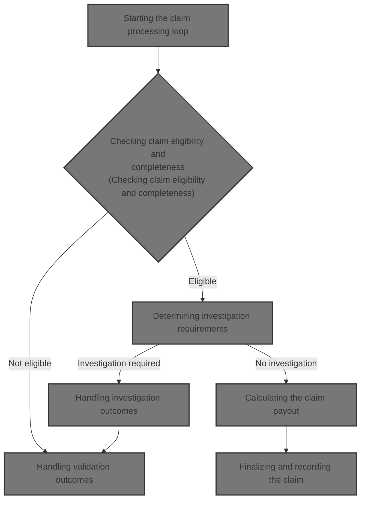
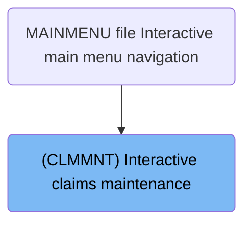
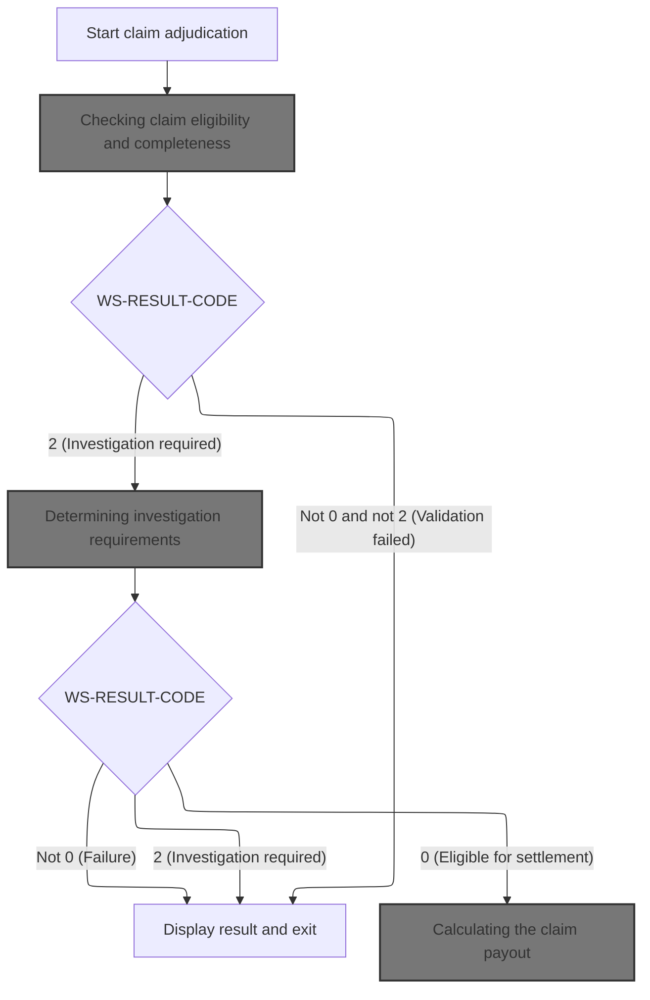
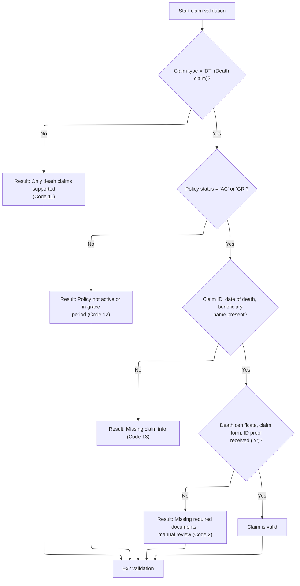
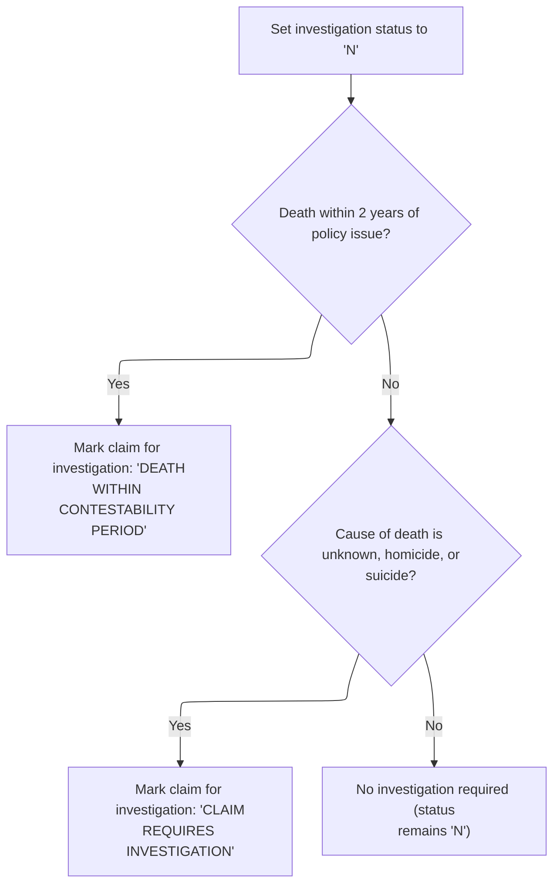
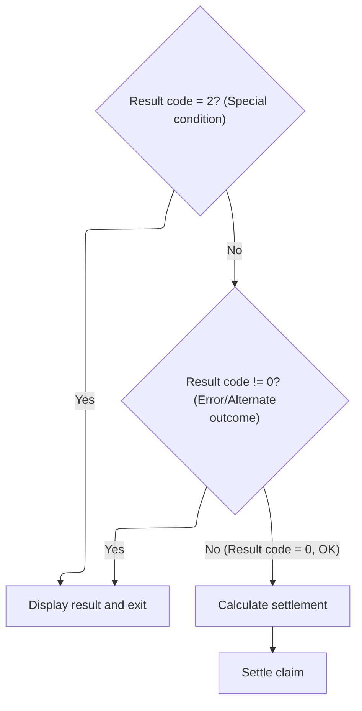

# Overview

This document explains the flow of interactive claims maintenance. Users are guided through claim processing, including policy validation, claim adjudication, investigation, and settlement. The flow ensures claims are validated, investigated when necessary, and settled according to business rules, with results displayed to the user.



## Dependencies

### Program

- CLMMNT (<SwmPath>[QCBLLESRC/CLMMNT.cbl](QCBLLESRC/CLMMNT.cbl)</SwmPath>)

### Copybook

- POLDATA (<SwmPath>[QCPYSRC/POLDATA.cpy](QCPYSRC/POLDATA.cpy)</SwmPath>)

# Where is this program used?

This program is used once, as represented in the following diagram:



## Input and Output Tables/Files used

### CLMMNT (<SwmPath>[QCBLLESRC/CLMMNT.cbl](QCBLLESRC/CLMMNT.cbl)</SwmPath>)

| Table / File Name                                                                                                                                                | Type | Description                                               | Usage Mode   | Key Fields / Layout Highlights |
| ---------------------------------------------------------------------------------------------------------------------------------------------------------------- | ---- | --------------------------------------------------------- | ------------ | ------------------------------ |
| <SwmToken path="QCBLLESRC/CLMMNT.cbl" pos="84:3:7" line-data="                   WRITE CLM-DSP-RECORD FORMAT IS &#39;CLMRESULT&#39;">`CLM-DSP-RECORD`</SwmToken> | File | Screen display buffer for claim maintenance UI            | Output       | File resource                  |
| CLMDSPF                                                                                                                                                          | File | Workstation transaction log for claim maintenance screens | Input/Output | File resource                  |
| CLMPF                                                                                                                                                            | File | Indexed claim processing file for individual claims       | Input/Output | File resource                  |
| <SwmToken path="QCBLLESRC/CLMMNT.cbl" pos="179:3:5" line-data="           WRITE CLMPF-RECORD">`CLMPF-RECORD`</SwmToken>                                          | File | Serialized claim record for storage in claim file         | Output       | File resource                  |
| POLMST                                                                                                                                                           | File | Indexed master file of life insurance policy contracts    | Input/Output | File resource                  |
| <SwmToken path="QCBLLESRC/CLMMNT.cbl" pos="178:3:9" line-data="           REWRITE WS-POLICY-MASTER-REC">`WS-POLICY-MASTER-REC`</SwmToken>                        | File | In-memory policy master record for update and rewrite     | Output       | File resource                  |

# Workflow

# Starting the claim processing loop

```mermaid
%%{init: {"flowchart": {"defaultRenderer": "elk"}} }%%
flowchart TD
    node1["Open claim files"] --> loop1
    click node1 openCode "QCBLLESRC/CLMMNT.cbl:74:76"
    subgraph loop1["Repeat until WS-CONTINUE = 'N'"]
        node2["Display claim header"] --> node3{"Exit requested? (*IN03='1' or
*IN12='1')"}
        click node2 openCode "QCBLLESRC/CLMMNT.cbl:78:78"
        node3 -->|"Yes"| node7["Set WS-CONTINUE to 'N' and exit loop"]
        click node3 openCode "QCBLLESRC/CLMMNT.cbl:79:80"
        node3 -->|"No"| node4{"Policy found? (WS-POLMST-STATUS='00')"}
        click node4 openCode "QCBLLESRC/CLMMNT.cbl:81:84"
        node4 -->|"No"| node5["Show 'Policy not found' message"]
        click node5 openCode "QCBLLESRC/CLMMNT.cbl:82:84"
        node5 --> node7
        node4 -->|"Yes"| node6["Display claim details"]
        click node6 openCode "QCBLLESRC/CLMMNT.cbl:86:86"
        node6 --> node8{"Exit requested again? (*IN03='1' or
*IN12='1')"}
        click node8 openCode "QCBLLESRC/CLMMNT.cbl:87:88"
        node8 -->|"Yes"| node7
        node8 -->|"No"| node9["Display documents"]
        click node9 openCode "QCBLLESRC/CLMMNT.cbl:90:90"
        node9 --> node10{"Adjudicate requested? (*IN06='1')"}
        click node10 openCode "QCBLLESRC/CLMMNT.cbl:91:92"
        node10 -->|"Yes"| node11["Adjudicate claim"]
        click node11 openCode "QCBLLESRC/CLMMNT.cbl:92:93"
        node11 --> node7
        node10 -->|"No"| node2
    end
    node7["Loop end"] --> node12["Close claim files"]
    click node12 openCode "QCBLLESRC/CLMMNT.cbl:97:97"
    node12 --> node13["End process"]
    click node13 openCode "QCBLLESRC/CLMMNT.cbl:98:98"
classDef HeadingStyle fill:#777777,stroke:#333,stroke-width:2px;

%% Swimm:
%% %%{init: {"flowchart": {"defaultRenderer": "elk"}} }%%
%% flowchart TD
%%     node1["Open claim files"] --> loop1
%%     click node1 openCode "<SwmPath>[QCBLLESRC/CLMMNT.cbl](QCBLLESRC/CLMMNT.cbl)</SwmPath>:74:76"
%%     subgraph loop1["Repeat until <SwmToken path="QCBLLESRC/CLMMNT.cbl" pos="77:5:7" line-data="           PERFORM UNTIL WS-CONTINUE = &#39;N&#39;">`WS-CONTINUE`</SwmToken> = 'N'"]
%%         node2["Display claim header"] --> node3{"Exit requested? (*<SwmToken path="QCBLLESRC/CLMMNT.cbl" pos="79:4:4" line-data="               IF *IN03 = &#39;1&#39; OR *IN12 = &#39;1&#39;">`IN03`</SwmToken>='1' or
%% *<SwmToken path="QCBLLESRC/CLMMNT.cbl" pos="79:15:15" line-data="               IF *IN03 = &#39;1&#39; OR *IN12 = &#39;1&#39;">`IN12`</SwmToken>='1')"}
%%         click node2 openCode "<SwmPath>[QCBLLESRC/CLMMNT.cbl](QCBLLESRC/CLMMNT.cbl)</SwmPath>:78:78"
%%         node3 -->|"Yes"| node7["Set <SwmToken path="QCBLLESRC/CLMMNT.cbl" pos="77:5:7" line-data="           PERFORM UNTIL WS-CONTINUE = &#39;N&#39;">`WS-CONTINUE`</SwmToken> to 'N' and exit loop"]
%%         click node3 openCode "<SwmPath>[QCBLLESRC/CLMMNT.cbl](QCBLLESRC/CLMMNT.cbl)</SwmPath>:79:80"
%%         node3 -->|"No"| node4{"Policy found? (<SwmToken path="QCBLLESRC/CLMMNT.cbl" pos="81:5:9" line-data="               ELSE IF WS-POLMST-STATUS NOT = &#39;00&#39;">`WS-POLMST-STATUS`</SwmToken>='00')"}
%%         click node4 openCode "<SwmPath>[QCBLLESRC/CLMMNT.cbl](QCBLLESRC/CLMMNT.cbl)</SwmPath>:81:84"
%%         node4 -->|"No"| node5["Show 'Policy not found' message"]
%%         click node5 openCode "<SwmPath>[QCBLLESRC/CLMMNT.cbl](QCBLLESRC/CLMMNT.cbl)</SwmPath>:82:84"
%%         node5 --> node7
%%         node4 -->|"Yes"| node6["Display claim details"]
%%         click node6 openCode "<SwmPath>[QCBLLESRC/CLMMNT.cbl](QCBLLESRC/CLMMNT.cbl)</SwmPath>:86:86"
%%         node6 --> node8{"Exit requested again? (*<SwmToken path="QCBLLESRC/CLMMNT.cbl" pos="79:4:4" line-data="               IF *IN03 = &#39;1&#39; OR *IN12 = &#39;1&#39;">`IN03`</SwmToken>='1' or
%% *<SwmToken path="QCBLLESRC/CLMMNT.cbl" pos="79:15:15" line-data="               IF *IN03 = &#39;1&#39; OR *IN12 = &#39;1&#39;">`IN12`</SwmToken>='1')"}
%%         click node8 openCode "<SwmPath>[QCBLLESRC/CLMMNT.cbl](QCBLLESRC/CLMMNT.cbl)</SwmPath>:87:88"
%%         node8 -->|"Yes"| node7
%%         node8 -->|"No"| node9["Display documents"]
%%         click node9 openCode "<SwmPath>[QCBLLESRC/CLMMNT.cbl](QCBLLESRC/CLMMNT.cbl)</SwmPath>:90:90"
%%         node9 --> node10{"Adjudicate requested? (*<SwmToken path="QCBLLESRC/CLMMNT.cbl" pos="91:4:4" line-data="                       IF *IN06 = &#39;1&#39;">`IN06`</SwmToken>='1')"}
%%         click node10 openCode "<SwmPath>[QCBLLESRC/CLMMNT.cbl](QCBLLESRC/CLMMNT.cbl)</SwmPath>:91:92"
%%         node10 -->|"Yes"| node11["Adjudicate claim"]
%%         click node11 openCode "<SwmPath>[QCBLLESRC/CLMMNT.cbl](QCBLLESRC/CLMMNT.cbl)</SwmPath>:92:93"
%%         node11 --> node7
%%         node10 -->|"No"| node2
%%     end
%%     node7["Loop end"] --> node12["Close claim files"]
%%     click node12 openCode "<SwmPath>[QCBLLESRC/CLMMNT.cbl](QCBLLESRC/CLMMNT.cbl)</SwmPath>:97:97"
%%     node12 --> node13["End process"]
%%     click node13 openCode "<SwmPath>[QCBLLESRC/CLMMNT.cbl](QCBLLESRC/CLMMNT.cbl)</SwmPath>:98:98"
%% classDef HeadingStyle fill:#777777,stroke:#333,stroke-width:2px;
```



This section manages the interactive claim processing loop, handling user-driven workflow decisions, policy validation, and claim adjudication.

| Rule ID | Category                        | Rule Name                  | Description                                                                                                                                                                                                                                                                                                                                                                                                                                                                                                                                     | Implementation Details                                                                                                                                                                                                                                                                      |
| ------- | ------------------------------- | -------------------------- | ----------------------------------------------------------------------------------------------------------------------------------------------------------------------------------------------------------------------------------------------------------------------------------------------------------------------------------------------------------------------------------------------------------------------------------------------------------------------------------------------------------------------------------------------- | ------------------------------------------------------------------------------------------------------------------------------------------------------------------------------------------------------------------------------------------------------------------------------------------- |
| BR-001  | Data validation                 | Policy not found message   | If the policy status is not '00', a 'POLICY NOT FOUND - PLEASE <SwmToken path="QCBLLESRC/CLMMNT.cbl" pos="82:14:16" line-data="                   MOVE &#39;POLICY NOT FOUND - PLEASE RE-ENTER&#39;">`RE-ENTER`</SwmToken>' message is displayed and written to the display record in the CLMRESULT format.                                                                                                                                                                                                                                     | The message 'POLICY NOT FOUND - PLEASE <SwmToken path="QCBLLESRC/CLMMNT.cbl" pos="82:14:16" line-data="                   MOVE &#39;POLICY NOT FOUND - PLEASE RE-ENTER&#39;">`RE-ENTER`</SwmToken>' is written to the display record. Output format is CLMRESULT, which is a string record. |
| BR-002  | Decision Making                 | User exit request          | If either exit flag (\*<SwmToken path="QCBLLESRC/CLMMNT.cbl" pos="79:4:4" line-data="               IF *IN03 = &#39;1&#39; OR *IN12 = &#39;1&#39;">`IN03`</SwmToken> or \*<SwmToken path="QCBLLESRC/CLMMNT.cbl" pos="79:15:15" line-data="               IF *IN03 = &#39;1&#39; OR *IN12 = &#39;1&#39;">`IN12`</SwmToken>) is set to '1', the claim processing loop is terminated by setting <SwmToken path="QCBLLESRC/CLMMNT.cbl" pos="77:5:7" line-data="           PERFORM UNTIL WS-CONTINUE = &#39;N&#39;">`WS-CONTINUE`</SwmToken> to 'N'. | <SwmToken path="QCBLLESRC/CLMMNT.cbl" pos="77:5:7" line-data="           PERFORM UNTIL WS-CONTINUE = &#39;N&#39;">`WS-CONTINUE`</SwmToken> is set to 'N' to end the loop. No output format is affected directly by this rule.                                                               |
| BR-003  | Decision Making                 | Repeated exit check        | After displaying claim details and documents, the loop checks for exit flags again, allowing the user to terminate processing at multiple points.                                                                                                                                                                                                                                                                                                                                                                                               | <SwmToken path="QCBLLESRC/CLMMNT.cbl" pos="77:5:7" line-data="           PERFORM UNTIL WS-CONTINUE = &#39;N&#39;">`WS-CONTINUE`</SwmToken> is set to 'N' if exit is requested. No output format is affected directly by this rule.                                                          |
| BR-004  | Writing Output                  | Display claim header       | The claim header is displayed at the start of each loop iteration, ensuring the user sees current claim and policy information.                                                                                                                                                                                                                                                                                                                                                                                                                 | Claim header is displayed to the user. Format is not specified, but it is a user-facing output.                                                                                                                                                                                             |
| BR-005  | Invoking a Service or a Process | Claim adjudication request | If claim adjudication is requested (\*<SwmToken path="QCBLLESRC/CLMMNT.cbl" pos="91:4:4" line-data="                       IF *IN06 = &#39;1&#39;">`IN06`</SwmToken> = '1'), the claim is adjudicated by invoking the adjudication process.                                                                                                                                                                                                                                                                                                     | Adjudication is triggered by user input. No output format is specified in this rule, but the process is invoked.                                                                                                                                                                            |

<SwmSnippet path="/QCBLLESRC/CLMMNT.cbl" line="73">

---

In <SwmToken path="QCBLLESRC/CLMMNT.cbl" pos="73:1:3" line-data="       MAIN-PROCESS.">`MAIN-PROCESS`</SwmToken>, we open the claim display, policy master, and claim files to prep for the interactive claim workflow. This sets up the environment for the loop that handles all claim operations.

```cobol
       MAIN-PROCESS.
           OPEN I-O CLMDSPF
           OPEN I-O POLMST
           OPEN I-O CLMPF
```

---

</SwmSnippet>

<SwmSnippet path="/QCBLLESRC/CLMMNT.cbl" line="77">

---

After opening files, we enter the main loop and display the claim header on every iteration. This keeps the screen updated with current claim and policy info.

```cobol
           PERFORM UNTIL WS-CONTINUE = 'N'
               PERFORM 1000-DISPLAY-HEADER
```

---

</SwmSnippet>

<SwmSnippet path="/QCBLLESRC/CLMMNT.cbl" line="79">

---

We check exit flags and stop the loop if either is set.

```cobol
               IF *IN03 = '1' OR *IN12 = '1'
                   MOVE 'N' TO WS-CONTINUE
```

---

</SwmSnippet>

<SwmSnippet path="/QCBLLESRC/CLMMNT.cbl" line="81">

---

If the policy status isn't '00', we display a 'POLICY NOT FOUND' message and write the result to the display record. No claim details are shown until a valid policy is found.

```cobol
               ELSE IF WS-POLMST-STATUS NOT = '00'
                   MOVE 'POLICY NOT FOUND - PLEASE RE-ENTER'
                       TO CLMSG
                   WRITE CLM-DSP-RECORD FORMAT IS 'CLMRESULT'
```

---

</SwmSnippet>

<SwmSnippet path="/QCBLLESRC/CLMMNT.cbl" line="85">

---

After displaying claim details and documents, we check \*<SwmToken path="QCBLLESRC/CLMMNT.cbl" pos="91:4:4" line-data="                       IF *IN06 = &#39;1&#39;">`IN06`</SwmToken>. If it's set, we call <SwmToken path="QCBLLESRC/CLMMNT.cbl" pos="92:3:7" line-data="                           PERFORM 4000-ADJUDICATE-CLAIM">`4000-ADJUDICATE-CLAIM`</SwmToken> to process the claim. The loop ends when <SwmToken path="QCBLLESRC/CLMMNT.cbl" pos="88:9:11" line-data="                       MOVE &#39;N&#39; TO WS-CONTINUE">`WS-CONTINUE`</SwmToken> is 'N', then files are closed and we return.

```cobol
               ELSE
                   PERFORM 2000-DISPLAY-CLAIM-DETAIL
                   IF *IN03 = '1' OR *IN12 = '1'
                       MOVE 'N' TO WS-CONTINUE
                   ELSE
                       PERFORM 3000-DISPLAY-DOCS
                       IF *IN06 = '1'
                           PERFORM 4000-ADJUDICATE-CLAIM
                       END-IF
                   END-IF
               END-IF
           END-PERFORM
           CLOSE CLMDSPF POLMST CLMPF
           GOBACK.
```

---

</SwmSnippet>

# Evaluating and settling the claim



This section orchestrates the end-to-end adjudication of a life insurance claim, including validation, investigation decision, and settlement calculation. It ensures claims are processed according to business rules for eligibility, investigation triggers, and payout computation.

| Rule ID | Category        | Rule Name                          | Description                                                                                                                                                                                                                                               | Implementation Details                                                                                                                                                             |
| ------- | --------------- | ---------------------------------- | --------------------------------------------------------------------------------------------------------------------------------------------------------------------------------------------------------------------------------------------------------- | ---------------------------------------------------------------------------------------------------------------------------------------------------------------------------------- |
| BR-001  | Data validation | Claim eligibility validation       | If the claim fails eligibility or completeness checks, the process stops and a result message is displayed indicating the reason for failure.                                                                                                             | A result code not equal to 0 or 2 indicates validation failure. The result message provides the reason. Result code is a two-digit number, result message is up to 100 characters. |
| BR-002  | Calculation     | Claim payout calculation           | If the claim is eligible for settlement, the claim payout is calculated by adding core benefits, including extra accidental death benefits if applicable, and subtracting outstanding premiums and policy loans. The final payout amount is not negative. | The payout amount is calculated based on policy data, including sum assured, rider codes, status, and balances. The final payout is a non-negative number.                         |
| BR-003  | Decision Making | Investigation requirement decision | If the claim passes validation but requires investigation, the process determines investigation requirements and may stop processing if investigation is still required.                                                                                  | A result code of 2 indicates investigation is required. The result message provides the reason. Result code is a two-digit number, result message is up to 100 characters.         |

<SwmSnippet path="/QCBLLESRC/CLMMNT.cbl" line="149">

---

In <SwmToken path="QCBLLESRC/CLMMNT.cbl" pos="149:1:5" line-data="       4000-ADJUDICATE-CLAIM.">`4000-ADJUDICATE-CLAIM`</SwmToken>, we reset the result code/message and call <SwmToken path="QCBLLESRC/CLMMNT.cbl" pos="153:3:7" line-data="           PERFORM 4100-VALIDATE-CLAIM">`4100-VALIDATE-CLAIM`</SwmToken> to check claim eligibility and completeness before moving on.

```cobol
       4000-ADJUDICATE-CLAIM.
           MOVE ZEROS TO WS-RESULT-CODE
           MOVE SPACES TO WS-RESULT-MESSAGE
      * VALIDATE
           PERFORM 4100-VALIDATE-CLAIM
```

---

</SwmSnippet>

## Checking claim eligibility and completeness



This section validates whether a submitted claim is eligible for processing and whether all required information and documents are present. It determines if the claim can proceed or if it requires manual review or is rejected for specific reasons.

| Rule ID | Category        | Rule Name                      | Description                                                                                                                                                                                                                                              | Implementation Details                                                                                                                                                           |
| ------- | --------------- | ------------------------------ | -------------------------------------------------------------------------------------------------------------------------------------------------------------------------------------------------------------------------------------------------------- | -------------------------------------------------------------------------------------------------------------------------------------------------------------------------------- |
| BR-001  | Data validation | Death claim eligibility        | Only death claims are eligible for automated validation. If the claim type is not 'death', the process returns a result code of 11 and the message 'ONLY DEATH CLAIMS ARE SUPPORTED'.                                                                    | Result code: 11. Result message: 'ONLY DEATH CLAIMS ARE SUPPORTED'. The result code is a number (2 digits). The result message is a string (up to 100 characters).               |
| BR-002  | Data validation | Policy status eligibility      | Claims are only eligible if the policy is active or in grace period. If the policy status is not 'active' or 'grace', the process returns a result code of 12 and the message 'POLICY IS NOT ACTIVE OR IN GRACE PERIOD'.                                 | Result code: 12. Result message: 'POLICY IS NOT ACTIVE OR IN GRACE PERIOD'. The result code is a number (2 digits). The result message is a string (up to 100 characters).       |
| BR-003  | Data validation | Required claim fields presence | A claim is considered incomplete if the claim ID, date of death, or beneficiary name is missing. In such cases, the process returns a result code of 13 and the message 'MISSING CLAIM ID DATE OF DEATH OR BENEFICIARY'.                                 | Result code: 13. Result message: 'MISSING CLAIM ID DATE OF DEATH OR BENEFICIARY'. The result code is a number (2 digits). The result message is a string (up to 100 characters). |
| BR-004  | Data validation | Required documents received    | All required documents (death certificate, claim form, ID proof) must be received for the claim to be considered valid. If any document is missing, the process returns a result code of 2 and the message 'MISSING REQUIRED DOCUMENTS - MANUAL REVIEW'. | Result code: 2. Result message: 'MISSING REQUIRED DOCUMENTS - MANUAL REVIEW'. The result code is a number (2 digits). The result message is a string (up to 100 characters).     |

<SwmSnippet path="/QCBLLESRC/CLMMNT.cbl" line="182">

---

In <SwmToken path="QCBLLESRC/CLMMNT.cbl" pos="182:1:5" line-data="       4100-VALIDATE-CLAIM.">`4100-VALIDATE-CLAIM`</SwmToken>, we check if the claim is a death claim. If not, we set a result code/message and exit validation early.

```cobol
       4100-VALIDATE-CLAIM.
           IF NOT PM-CLAIM-DEATH
               MOVE 11 TO WS-RESULT-CODE
               MOVE 'ONLY DEATH CLAIMS ARE SUPPORTED'
                   TO WS-RESULT-MESSAGE
               EXIT PARAGRAPH
           END-IF
```

---

</SwmSnippet>

<SwmSnippet path="/QCBLLESRC/CLMMNT.cbl" line="189">

---

Next we check if the policy is active or in grace. If not, we set a result code/message and exit validation.

```cobol
           IF NOT PM-STATUS-ACTIVE AND NOT PM-STATUS-GRACE
               MOVE 12 TO WS-RESULT-CODE
               MOVE 'POLICY IS NOT ACTIVE OR IN GRACE PERIOD'
                   TO WS-RESULT-MESSAGE
               EXIT PARAGRAPH
           END-IF
```

---

</SwmSnippet>

<SwmSnippet path="/QCBLLESRC/CLMMNT.cbl" line="195">

---

Then we check for missing claim ID, date of death, or beneficiary name. If any are missing, we set a result code/message and exit validation.

```cobol
           IF PM-CLAIM-ID = SPACES OR PM-DATE-OF-DEATH = 0 OR
              PM-BENEFICIARY-NAME = SPACES
               MOVE 13 TO WS-RESULT-CODE
               MOVE 'MISSING CLAIM ID DATE OF DEATH OR BENEFICIARY'
                   TO WS-RESULT-MESSAGE
               EXIT PARAGRAPH
           END-IF
```

---

</SwmSnippet>

<SwmSnippet path="/QCBLLESRC/CLMMNT.cbl" line="202">

---

Finally we check if all required documents are received. If not, we set result code 2 and a message for manual review.

```cobol
           IF PM-DEATH-CERT-RECD NOT = 'Y' OR
              PM-CLAIM-FORM-RECD NOT = 'Y' OR
              PM-ID-PROOF-RECD NOT = 'Y'
               MOVE 2 TO WS-RESULT-CODE
               MOVE 'MISSING REQUIRED DOCUMENTS - MANUAL REVIEW'
                   TO WS-RESULT-MESSAGE
           END-IF.
```

---

</SwmSnippet>

## Handling validation outcomes

This section governs how the system responds to the outcome of claim validation, determining whether to display results and exit or proceed to further investigation based on the validation result code.

| Rule ID | Category        | Rule Name                                | Description                                                                                                                                                   | Implementation Details                                                                                                                                           |
| ------- | --------------- | ---------------------------------------- | ------------------------------------------------------------------------------------------------------------------------------------------------------------- | ---------------------------------------------------------------------------------------------------------------------------------------------------------------- |
| BR-001  | Decision Making | Non-accepted validation outcome handling | If the validation result code is neither 0 nor 2, the system displays the result and exits the current process.                                               | The result code is a two-digit number. Displayed result includes the result message, which is up to 100 characters, left-aligned, padded with spaces if shorter. |
| BR-002  | Decision Making | Manual review required outcome handling  | If the validation result code is 2, the system displays the result and exits the current process, indicating that manual review or investigation is required. | The result code is a two-digit number. Displayed result includes the result message, which is up to 100 characters, left-aligned, padded with spaces if shorter. |

<SwmSnippet path="/QCBLLESRC/CLMMNT.cbl" line="154">

---

Back in <SwmToken path="QCBLLESRC/CLMMNT.cbl" pos="92:3:7" line-data="                           PERFORM 4000-ADJUDICATE-CLAIM">`4000-ADJUDICATE-CLAIM`</SwmToken>, after validation, we check the result code. If it's not 0 or 2, we display the result and exit early.

```cobol
           IF WS-RESULT-CODE NOT = 0 AND WS-RESULT-CODE NOT = 2
               PERFORM 9000-DISPLAY-RESULT
               EXIT PARAGRAPH
           END-IF
```

---

</SwmSnippet>

<SwmSnippet path="/QCBLLESRC/CLMMNT.cbl" line="158">

---

If validation returns code 2, we display the result and exit, since investigation or manual review is needed.

```cobol
           IF WS-RESULT-CODE = 2
               PERFORM 9000-DISPLAY-RESULT
               EXIT PARAGRAPH
           END-IF
```

---

</SwmSnippet>

<SwmSnippet path="/QCBLLESRC/CLMMNT.cbl" line="163">

---

Next we call <SwmToken path="QCBLLESRC/CLMMNT.cbl" pos="163:3:7" line-data="           PERFORM 4200-CHECK-INVESTIGATION">`4200-CHECK-INVESTIGATION`</SwmToken> to see if the claim needs investigation based on contestability period or cause of death.

```cobol
           PERFORM 4200-CHECK-INVESTIGATION
```

---

</SwmSnippet>

## Determining investigation requirements



This section determines if a claim should be flagged for investigation based on the timing of the death and the cause of death. It sets the investigation status and provides a reason message for downstream processing.

| Rule ID | Category        | Rule Name                           | Description                                                                                                                                                                                 | Implementation Details                                                                                                                                                                                                                             |
| ------- | --------------- | ----------------------------------- | ------------------------------------------------------------------------------------------------------------------------------------------------------------------------------------------- | -------------------------------------------------------------------------------------------------------------------------------------------------------------------------------------------------------------------------------------------------- |
| BR-001  | Decision Making | Contestability period investigation | If the death occurs within two years of the policy issue date, the claim is marked for investigation and the result message is set to 'DEATH WITHIN CONTESTABILITY PERIOD - INVESTIGATION'. | The contestability period is defined as 2 years (730 days). The investigation status is set to 'P'. The result code is set to 2. The result message is set to 'DEATH WITHIN CONTESTABILITY PERIOD - INVESTIGATION' (string, up to 100 characters). |
| BR-002  | Decision Making | Cause of death investigation        | If the cause of death is unknown, homicide, or suicide, the claim is marked for investigation and the result message is set to 'CLAIM REQUIRES INVESTIGATION'.                              | The investigation status is set to 'P'. The result code is set to 2. The result message is set to 'CLAIM REQUIRES INVESTIGATION' (string, up to 100 characters).                                                                                   |
| BR-003  | Decision Making | No investigation required           | If neither the contestability period nor the cause of death investigation criteria are met, the claim is not marked for investigation and the investigation status remains 'N'.             | The investigation status remains 'N'. No result code or message is set for this scenario.                                                                                                                                                          |

<SwmSnippet path="/QCBLLESRC/CLMMNT.cbl" line="210">

---

In <SwmToken path="QCBLLESRC/CLMMNT.cbl" pos="210:1:5" line-data="       4200-CHECK-INVESTIGATION.">`4200-CHECK-INVESTIGATION`</SwmToken>, we calculate days since policy issue and check if death is within two years. If so, we mark the claim for investigation and exit.

```cobol
       4200-CHECK-INVESTIGATION.
           MOVE 'N' TO PM-INVESTIGATION-STATUS
           COMPUTE WS-DAYS-SINCE-ISSUE =
               PM-DATE-OF-DEATH - PM-ISSUE-DATE
           COMPUTE WS-DAYS-CONTESTABLE = 2 * 365
           IF WS-DAYS-SINCE-ISSUE <= WS-DAYS-CONTESTABLE
               MOVE 'P' TO PM-INVESTIGATION-STATUS
               MOVE 2 TO WS-RESULT-CODE
               MOVE 'DEATH WITHIN CONTESTABILITY PERIOD - INVESTIGATION'
                   TO WS-RESULT-MESSAGE
               EXIT PARAGRAPH
           END-IF
```

---

</SwmSnippet>

<SwmSnippet path="/QCBLLESRC/CLMMNT.cbl" line="222">

---

If the cause of death is unknown, homicide, or suicide, we mark the claim for investigation and set result code/message accordingly.

```cobol
           IF PM-CAUSE-UNKNOWN OR PM-CAUSE-HOMICIDE OR PM-CAUSE-SUICIDE
               MOVE 'P' TO PM-INVESTIGATION-STATUS
               MOVE 2 TO WS-RESULT-CODE
               MOVE 'CLAIM REQUIRES INVESTIGATION' TO WS-RESULT-MESSAGE
           END-IF.
```

---

</SwmSnippet>

## Handling investigation outcomes



This section governs the decision-making process after an investigation, determining whether to display the result and exit or to proceed with claim settlement based on the result code.

| Rule ID | Category        | Rule Name                          | Description                                                                                                                                      | Implementation Details                                                                                                                                                                                       |
| ------- | --------------- | ---------------------------------- | ------------------------------------------------------------------------------------------------------------------------------------------------ | ------------------------------------------------------------------------------------------------------------------------------------------------------------------------------------------------------------ |
| BR-001  | Decision Making | Special condition exit             | When the result code equals 2, the process displays the investigation outcome and exits without further processing.                              | The result code value 2 triggers this rule. The output is a display of the result message, which is up to 100 characters (alphanumeric, left-aligned, space-padded if shorter).                              |
| BR-002  | Decision Making | Coverage failure exit              | If the result code is not zero after coverage adjudication, the process displays the result and exits without calculating or settling the claim. | Any non-zero result code after coverage adjudication triggers this rule. The output is a display of the result message, which is up to 100 characters (alphanumeric, left-aligned, space-padded if shorter). |
| BR-003  | Decision Making | Successful adjudication settlement | If the result code is zero after coverage adjudication, the process proceeds to calculate the settlement and finalize the claim.                 | A result code of zero triggers calculation and settlement. The calculation and settlement steps are invoked in sequence.                                                                                     |

<SwmSnippet path="/QCBLLESRC/CLMMNT.cbl" line="164">

---

Back in <SwmToken path="QCBLLESRC/CLMMNT.cbl" pos="92:3:7" line-data="                           PERFORM 4000-ADJUDICATE-CLAIM">`4000-ADJUDICATE-CLAIM`</SwmToken>, if investigation is required (code 2), we display the result and exit early.

```cobol
           IF WS-RESULT-CODE = 2
               PERFORM 9000-DISPLAY-RESULT
               EXIT PARAGRAPH
           END-IF
```

---

</SwmSnippet>

<SwmSnippet path="/QCBLLESRC/CLMMNT.cbl" line="169">

---

After investigation, we call <SwmToken path="QCBLLESRC/CLMMNT.cbl" pos="169:3:7" line-data="           PERFORM 4300-ADJUDICATE-COVERAGE">`4300-ADJUDICATE-COVERAGE`</SwmToken> to decide if the claim is eligible based on policy and death details.

```cobol
           PERFORM 4300-ADJUDICATE-COVERAGE
```

---

</SwmSnippet>

<SwmSnippet path="/QCBLLESRC/CLMMNT.cbl" line="170">

---

If coverage adjudication fails, we display the result and exit early.

```cobol
           IF WS-RESULT-CODE NOT = 0
               PERFORM 9000-DISPLAY-RESULT
               EXIT PARAGRAPH
           END-IF
```

---

</SwmSnippet>

<SwmSnippet path="/QCBLLESRC/CLMMNT.cbl" line="175">

---

After coverage is approved, we call <SwmToken path="QCBLLESRC/CLMMNT.cbl" pos="175:3:7" line-data="           PERFORM 4400-CALCULATE-SETTLEMENT">`4400-CALCULATE-SETTLEMENT`</SwmToken> to compute the claim payout, then <SwmToken path="QCBLLESRC/CLMMNT.cbl" pos="176:3:7" line-data="           PERFORM 4500-SETTLE-CLAIM">`4500-SETTLE-CLAIM`</SwmToken> to finalize the claim.

```cobol
           PERFORM 4400-CALCULATE-SETTLEMENT
           PERFORM 4500-SETTLE-CLAIM
```

---

</SwmSnippet>

## Calculating the claim payout

```mermaid
%%{init: {"flowchart": {"defaultRenderer": "elk"}} }%%
flowchart TD
    node1["Set claim payment to sum assured
(PM-SUM-ASSURED)"]
    click node1 openCode "QCBLLESRC/CLMMNT.cbl:248:248"
    node1 --> node2{"Was cause of death accidental?
(PM-CAUSE-ACCIDENT)"}
    click node2 openCode "QCBLLESRC/CLMMNT.cbl:249:258"
    node2 -->|"Yes"| node3["Process accident benefit riders"]
    node2 -->|"No"| node4{"Is policy in grace period?
(PM-STATUS-GRACE)"}
    click node3 openCode "QCBLLESRC/CLMMNT.cbl:250:257"
    node3 --> node4
    node4 -->|"Yes"| node5["Deduct premium (PM-MODAL-PREMIUM) from
claim payment"]
    click node4 openCode "QCBLLESRC/CLMMNT.cbl:259:261"
    node4 -->|"No"| node6{"Outstanding loan balance > 0?
(PM-POLICY-LOAN-BALANCE)"}
    click node5 openCode "QCBLLESRC/CLMMNT.cbl:260:260"
    node5 --> node6
    node6 -->|"Yes"| node7["Deduct loan balance
(PM-POLICY-LOAN-BALANCE) from claim
payment"]
    click node6 openCode "QCBLLESRC/CLMMNT.cbl:262:265"
    node6 -->|"No"| node8{"Is claim payment negative?
(PM-CLAIM-PAYMENT-AMT < 0)"}
    click node7 openCode "QCBLLESRC/CLMMNT.cbl:263:264"
    node7 --> node8
    node8 -->|"Yes"| node9["Set claim payment to zero"]
    click node8 openCode "QCBLLESRC/CLMMNT.cbl:266:268"
    node8 -->|"No"| node10["Final claim payment"]
    click node9 openCode "QCBLLESRC/CLMMNT.cbl:267:267"
    click node10 openCode "QCBLLESRC/CLMMNT.cbl:248:268"

    subgraph loop1["For each rider (WS-RIDER-IDX 1 to 5)"]
        node3 --> node11{"Is rider ADB01 and active?
(PM-RIDER-CODE, PM-RIDER-ACTIVE)"}
        click node11 openCode "QCBLLESRC/CLMMNT.cbl:252:253"
        node11 -->|"Yes"| node12["Add rider sum assured
(PM-RIDER-SUM-ASSURED) to claim payment"]
        click node12 openCode "QCBLLESRC/CLMMNT.cbl:254:255"
        node12 --> node3
        node11 -->|"No"| node3
    end
classDef HeadingStyle fill:#777777,stroke:#333,stroke-width:2px;

%% Swimm:
%% %%{init: {"flowchart": {"defaultRenderer": "elk"}} }%%
%% flowchart TD
%%     node1["Set claim payment to sum assured
%% (<SwmToken path="QCBLLESRC/CLMMNT.cbl" pos="248:3:7" line-data="           MOVE PM-SUM-ASSURED TO PM-CLAIM-PAYMENT-AMT">`PM-SUM-ASSURED`</SwmToken>)"]
%%     click node1 openCode "<SwmPath>[QCBLLESRC/CLMMNT.cbl](QCBLLESRC/CLMMNT.cbl)</SwmPath>:248:248"
%%     node1 --> node2{"Was cause of death accidental?
%% (<SwmToken path="QCBLLESRC/CLMMNT.cbl" pos="249:3:7" line-data="           IF PM-CAUSE-ACCIDENT">`PM-CAUSE-ACCIDENT`</SwmToken>)"}
%%     click node2 openCode "<SwmPath>[QCBLLESRC/CLMMNT.cbl](QCBLLESRC/CLMMNT.cbl)</SwmPath>:249:258"
%%     node2 -->|"Yes"| node3["Process accident benefit riders"]
%%     node2 -->|"No"| node4{"Is policy in grace period?
%% (<SwmToken path="QCBLLESRC/CLMMNT.cbl" pos="189:15:19" line-data="           IF NOT PM-STATUS-ACTIVE AND NOT PM-STATUS-GRACE">`PM-STATUS-GRACE`</SwmToken>)"}
%%     click node3 openCode "<SwmPath>[QCBLLESRC/CLMMNT.cbl](QCBLLESRC/CLMMNT.cbl)</SwmPath>:250:257"
%%     node3 --> node4
%%     node4 -->|"Yes"| node5["Deduct premium (<SwmToken path="QCBLLESRC/CLMMNT.cbl" pos="260:3:7" line-data="               SUBTRACT PM-MODAL-PREMIUM FROM PM-CLAIM-PAYMENT-AMT">`PM-MODAL-PREMIUM`</SwmToken>) from
%% claim payment"]
%%     click node4 openCode "<SwmPath>[QCBLLESRC/CLMMNT.cbl](QCBLLESRC/CLMMNT.cbl)</SwmPath>:259:261"
%%     node4 -->|"No"| node6{"Outstanding loan balance > 0?
%% (<SwmToken path="QCBLLESRC/CLMMNT.cbl" pos="262:3:9" line-data="           IF PM-POLICY-LOAN-BALANCE &gt; 0">`PM-POLICY-LOAN-BALANCE`</SwmToken>)"}
%%     click node5 openCode "<SwmPath>[QCBLLESRC/CLMMNT.cbl](QCBLLESRC/CLMMNT.cbl)</SwmPath>:260:260"
%%     node5 --> node6
%%     node6 -->|"Yes"| node7["Deduct loan balance
%% (<SwmToken path="QCBLLESRC/CLMMNT.cbl" pos="262:3:9" line-data="           IF PM-POLICY-LOAN-BALANCE &gt; 0">`PM-POLICY-LOAN-BALANCE`</SwmToken>) from claim
%% payment"]
%%     click node6 openCode "<SwmPath>[QCBLLESRC/CLMMNT.cbl](QCBLLESRC/CLMMNT.cbl)</SwmPath>:262:265"
%%     node6 -->|"No"| node8{"Is claim payment negative?
%% (<SwmToken path="QCBLLESRC/CLMMNT.cbl" pos="248:11:17" line-data="           MOVE PM-SUM-ASSURED TO PM-CLAIM-PAYMENT-AMT">`PM-CLAIM-PAYMENT-AMT`</SwmToken> < 0)"}
%%     click node7 openCode "<SwmPath>[QCBLLESRC/CLMMNT.cbl](QCBLLESRC/CLMMNT.cbl)</SwmPath>:263:264"
%%     node7 --> node8
%%     node8 -->|"Yes"| node9["Set claim payment to zero"]
%%     click node8 openCode "<SwmPath>[QCBLLESRC/CLMMNT.cbl](QCBLLESRC/CLMMNT.cbl)</SwmPath>:266:268"
%%     node8 -->|"No"| node10["Final claim payment"]
%%     click node9 openCode "<SwmPath>[QCBLLESRC/CLMMNT.cbl](QCBLLESRC/CLMMNT.cbl)</SwmPath>:267:267"
%%     click node10 openCode "<SwmPath>[QCBLLESRC/CLMMNT.cbl](QCBLLESRC/CLMMNT.cbl)</SwmPath>:248:268"
%% 
%%     subgraph loop1["For each rider (<SwmToken path="QCBLLESRC/CLMMNT.cbl" pos="250:5:9" line-data="               PERFORM VARYING WS-RIDER-IDX FROM 1 BY 1">`WS-RIDER-IDX`</SwmToken> 1 to 5)"]
%%         node3 --> node11{"Is rider <SwmToken path="QCBLLESRC/CLMMNT.cbl" pos="252:19:19" line-data="                   IF PM-RIDER-CODE(WS-RIDER-IDX) = &#39;ADB01&#39; AND">`ADB01`</SwmToken> and active?
%% (<SwmToken path="QCBLLESRC/CLMMNT.cbl" pos="252:3:7" line-data="                   IF PM-RIDER-CODE(WS-RIDER-IDX) = &#39;ADB01&#39; AND">`PM-RIDER-CODE`</SwmToken>, <SwmToken path="QCBLLESRC/CLMMNT.cbl" pos="253:1:5" line-data="                      PM-RIDER-ACTIVE(WS-RIDER-IDX)">`PM-RIDER-ACTIVE`</SwmToken>)"}
%%         click node11 openCode "<SwmPath>[QCBLLESRC/CLMMNT.cbl](QCBLLESRC/CLMMNT.cbl)</SwmPath>:252:253"
%%         node11 -->|"Yes"| node12["Add rider sum assured
%% (<SwmToken path="QCBLLESRC/CLMMNT.cbl" pos="254:3:9" line-data="                       ADD PM-RIDER-SUM-ASSURED(WS-RIDER-IDX)">`PM-RIDER-SUM-ASSURED`</SwmToken>) to claim payment"]
%%         click node12 openCode "<SwmPath>[QCBLLESRC/CLMMNT.cbl](QCBLLESRC/CLMMNT.cbl)</SwmPath>:254:255"
%%         node12 --> node3
%%         node11 -->|"No"| node3
%%     end
%% classDef HeadingStyle fill:#777777,stroke:#333,stroke-width:2px;
```



This section determines the claim payout for a life insurance policy, applying business rules for accident benefits, premium and loan deductions, and ensuring the payout is not negative.

| Rule ID | Category    | Rule Name                       | Description                                                                                                                                                                                                                                                                      | Implementation Details                                                                                                                                                                                                                                                                                                      |
| ------- | ----------- | ------------------------------- | -------------------------------------------------------------------------------------------------------------------------------------------------------------------------------------------------------------------------------------------------------------------------------- | --------------------------------------------------------------------------------------------------------------------------------------------------------------------------------------------------------------------------------------------------------------------------------------------------------------------------- |
| BR-001  | Calculation | Base payout initialization      | The claim payout is initially set to the policy's sum assured amount before any further adjustments are made.                                                                                                                                                                    | The sum assured is a number representing the guaranteed payout for the policy. The claim payment is set to this value at the start of the calculation process.                                                                                                                                                              |
| BR-002  | Calculation | Accident benefit rider addition | If the cause of death is accidental, add the sum assured of each active <SwmToken path="QCBLLESRC/CLMMNT.cbl" pos="252:19:19" line-data="                   IF PM-RIDER-CODE(WS-RIDER-IDX) = &#39;ADB01&#39; AND">`ADB01`</SwmToken> accident benefit rider to the claim payout. | The rider code must be <SwmToken path="QCBLLESRC/CLMMNT.cbl" pos="252:19:19" line-data="                   IF PM-RIDER-CODE(WS-RIDER-IDX) = &#39;ADB01&#39; AND">`ADB01`</SwmToken> and the rider must be active. For each such rider, its sum assured (a number) is added to the claim payout. Up to 5 riders are checked. |
| BR-003  | Calculation | Grace period premium deduction  | If the policy is in the grace period, deduct the modal premium from the claim payout.                                                                                                                                                                                            | The modal premium is a number representing the periodic premium due. This amount is subtracted from the claim payout if the policy is in grace period.                                                                                                                                                                      |
| BR-004  | Calculation | Loan balance deduction          | If there is an outstanding policy loan balance greater than zero, deduct the loan balance from the claim payout.                                                                                                                                                                 | The loan balance is a number representing the amount owed by the policyholder. This amount is subtracted from the claim payout if it is greater than zero.                                                                                                                                                                  |
| BR-005  | Calculation | Negative payout prevention      | If the claim payout becomes negative after deductions, set the claim payout to zero to prevent negative payments.                                                                                                                                                                | The final claim payment amount cannot be negative; if it is, it is set to zero (0).                                                                                                                                                                                                                                         |

<SwmSnippet path="/QCBLLESRC/CLMMNT.cbl" line="247">

---

In <SwmToken path="QCBLLESRC/CLMMNT.cbl" pos="247:1:5" line-data="       4400-CALCULATE-SETTLEMENT.">`4400-CALCULATE-SETTLEMENT`</SwmToken>, we set the payout to sum assured, then add extra for each active <SwmToken path="QCBLLESRC/CLMMNT.cbl" pos="252:19:19" line-data="                   IF PM-RIDER-CODE(WS-RIDER-IDX) = &#39;ADB01&#39; AND">`ADB01`</SwmToken> rider if death was accidental.

```cobol
       4400-CALCULATE-SETTLEMENT.
           MOVE PM-SUM-ASSURED TO PM-CLAIM-PAYMENT-AMT
           IF PM-CAUSE-ACCIDENT
               PERFORM VARYING WS-RIDER-IDX FROM 1 BY 1
                   UNTIL WS-RIDER-IDX > 5
                   IF PM-RIDER-CODE(WS-RIDER-IDX) = 'ADB01' AND
                      PM-RIDER-ACTIVE(WS-RIDER-IDX)
                       ADD PM-RIDER-SUM-ASSURED(WS-RIDER-IDX)
                           TO PM-CLAIM-PAYMENT-AMT
                   END-IF
               END-PERFORM
           END-IF
```

---

</SwmSnippet>

<SwmSnippet path="/QCBLLESRC/CLMMNT.cbl" line="259">

---

If the policy is in grace, we subtract the modal premium from the payout.

```cobol
           IF PM-STATUS-GRACE
               SUBTRACT PM-MODAL-PREMIUM FROM PM-CLAIM-PAYMENT-AMT
           END-IF
```

---

</SwmSnippet>

<SwmSnippet path="/QCBLLESRC/CLMMNT.cbl" line="262">

---

If there's a policy loan balance, we subtract it from the payout.

```cobol
           IF PM-POLICY-LOAN-BALANCE > 0
               SUBTRACT PM-POLICY-LOAN-BALANCE
                   FROM PM-CLAIM-PAYMENT-AMT
           END-IF
```

---

</SwmSnippet>

<SwmSnippet path="/QCBLLESRC/CLMMNT.cbl" line="266">

---

If the payout drops below zero after deductions, we set it to zero to avoid negative payments.

```cobol
           IF PM-CLAIM-PAYMENT-AMT < 0
               MOVE ZEROS TO PM-CLAIM-PAYMENT-AMT
           END-IF.
```

---

</SwmSnippet>

## Finalizing and recording the claim

<SwmSnippet path="/QCBLLESRC/CLMMNT.cbl" line="178">

---

Back in <SwmToken path="QCBLLESRC/CLMMNT.cbl" pos="92:3:7" line-data="                           PERFORM 4000-ADJUDICATE-CLAIM">`4000-ADJUDICATE-CLAIM`</SwmToken>, after calculating settlement, we update the policy and claim records and display the final result.

```cobol
           REWRITE WS-POLICY-MASTER-REC
           WRITE CLMPF-RECORD
           PERFORM 9000-DISPLAY-RESULT.
```

---

</SwmSnippet>

&nbsp;

*This is an auto-generated document by Swimm 🌊 and has not yet been verified by a human*

<SwmMeta version="3.0.0" repo-id="Z2l0aHViJTNBJTNBTElGRTQwMCUzQSUzQW11ZGFzaW4x" repo-name="LIFE400"><sup>Powered by [Swimm](https://app.swimm.io/)</sup></SwmMeta>
