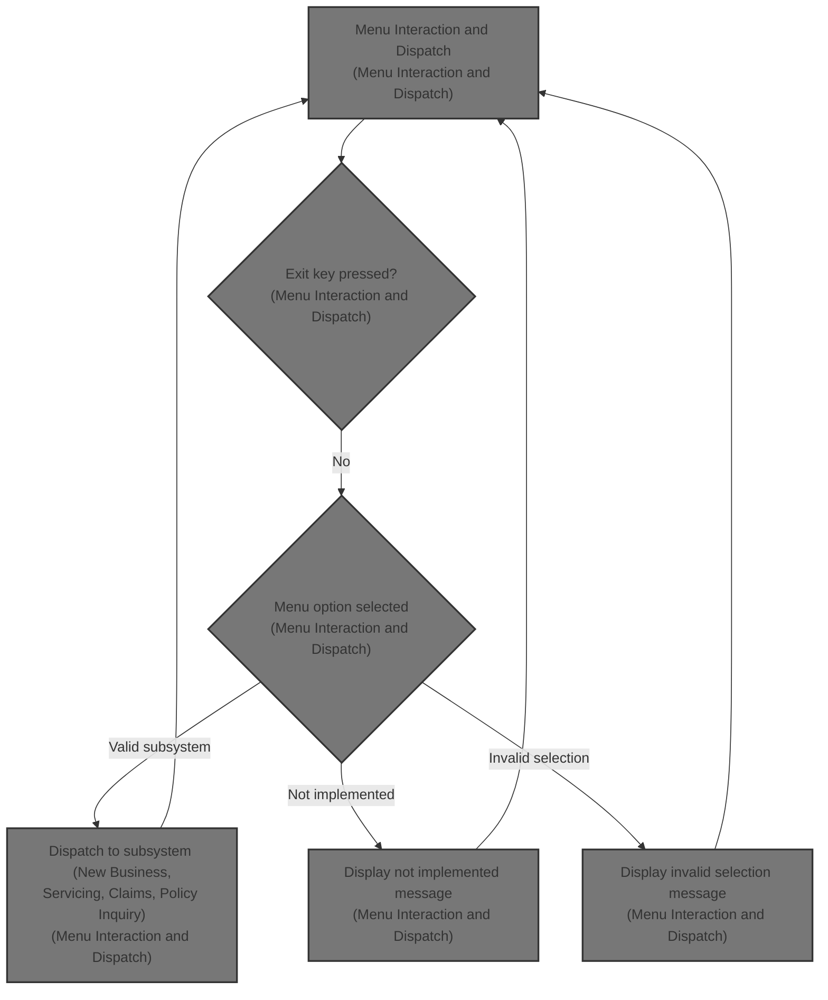
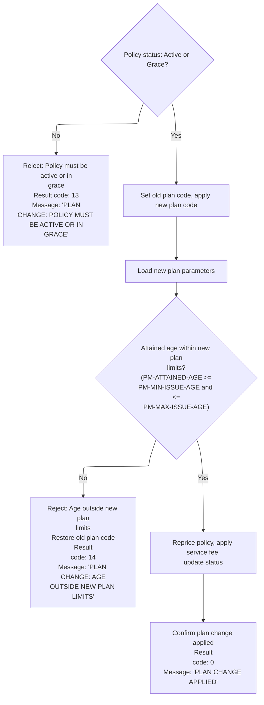

# Overview

This document explains the flow of menu interaction and subsystem dispatch. The main menu allows users to access core subsystems or sign off, processing user input and displaying relevant messages.



## Dependencies

### Programs

- MAINMENU (<SwmPath>[QCBLLESRC/MAINMENU.cbl](QCBLLESRC/MAINMENU.cbl)</SwmPath>)
- NBUWMNT (<SwmPath>[QCBLLESRC/NBUWMNT.cbl](QCBLLESRC/NBUWMNT.cbl)</SwmPath>)
- SVCMNT (<SwmPath>[QCBLLESRC/SVCMNT.cbl](QCBLLESRC/SVCMNT.cbl)</SwmPath>)
- CLMMNT (<SwmPath>[QCBLLESRC/CLMMNT.cbl](QCBLLESRC/CLMMNT.cbl)</SwmPath>)
- POLMSTINQ (<SwmPath>[QCBLLESRC/POLMSTINQ.cbl](QCBLLESRC/POLMSTINQ.cbl)</SwmPath>)

### Copybook

- POLDATA (<SwmPath>[QCPYSRC/POLDATA.cpy](QCPYSRC/POLDATA.cpy)</SwmPath>)

## Input and Output Tables/Files used

### MAINMENU (<SwmPath>[QCBLLESRC/MAINMENU.cbl](QCBLLESRC/MAINMENU.cbl)</SwmPath>)

| Table / File Name                                                                                                                                    | Type | Description                                          | Usage Mode   | Key Fields / Layout Highlights |
| ---------------------------------------------------------------------------------------------------------------------------------------------------- | ---- | ---------------------------------------------------- | ------------ | ------------------------------ |
| <SwmToken path="QCBLLESRC/MAINMENU.cbl" pos="63:3:5" line-data="               WRITE DSP-RECORD FORMAT IS &#39;MAINSCR&#39;">`DSP-RECORD`</SwmToken> | File | Single 80-char record for menu screen display/output | Output       | File resource                  |
| MNUDSPF                                                                                                                                              | File | Main menu display screen for user navigation         | Input/Output | File resource                  |

### NBUWMNT (<SwmPath>[QCBLLESRC/NBUWMNT.cbl](QCBLLESRC/NBUWMNT.cbl)</SwmPath>)

| Table / File Name                                                                                                                                       | Type | Description                                                    | Usage Mode   | Key Fields / Layout Highlights |
| ------------------------------------------------------------------------------------------------------------------------------------------------------- | ---- | -------------------------------------------------------------- | ------------ | ------------------------------ |
| <SwmToken path="QCBLLESRC/NBUWMNT.cbl" pos="142:3:7" line-data="           WRITE NB-DSP-RECORD FORMAT IS &#39;NBRIDERS&#39;">`NB-DSP-RECORD`</SwmToken> | File | Screen buffer for new business interactive session data        | Output       | File resource                  |
| NBUWDSPF                                                                                                                                                | File | Workstation transaction records for new business entry screens | Input/Output | File resource                  |
| POLMST                                                                                                                                                  | File | Indexed master file of life insurance policy contracts         | Input/Output | File resource                  |
| <SwmToken path="QCBLLESRC/NBUWMNT.cbl" pos="200:3:9" line-data="                   WRITE WS-POLICY-MASTER-REC">`WS-POLICY-MASTER-REC`</SwmToken>        | File | In-memory policy master record for update/write operations     | Output       | File resource                  |

### CLMMNT (<SwmPath>[QCBLLESRC/CLMMNT.cbl](QCBLLESRC/CLMMNT.cbl)</SwmPath>)

| Table / File Name                                                                                                                                                | Type | Description                                           | Usage Mode   | Key Fields / Layout Highlights |
| ---------------------------------------------------------------------------------------------------------------------------------------------------------------- | ---- | ----------------------------------------------------- | ------------ | ------------------------------ |
| <SwmToken path="QCBLLESRC/CLMMNT.cbl" pos="84:3:7" line-data="                   WRITE CLM-DSP-RECORD FORMAT IS &#39;CLMRESULT&#39;">`CLM-DSP-RECORD`</SwmToken> | File | Screen output records for claims workflow steps       | Output       | File resource                  |
| CLMDSPF                                                                                                                                                          | File | User claim maintenance screen transaction data        | Input/Output | File resource                  |
| CLMPF                                                                                                                                                            | File | Claim master records for adjudication and settlement  | Input/Output | File resource                  |
| <SwmToken path="QCBLLESRC/CLMMNT.cbl" pos="179:3:5" line-data="           WRITE CLMPF-RECORD">`CLMPF-RECORD`</SwmToken>                                          | File | Single claim record for output to claim file          | Output       | File resource                  |
| POLMST                                                                                                                                                           | File | Policy master records with insured and plan details   | Input/Output | File resource                  |
| <SwmToken path="QCBLLESRC/NBUWMNT.cbl" pos="200:3:9" line-data="                   WRITE WS-POLICY-MASTER-REC">`WS-POLICY-MASTER-REC`</SwmToken>                 | File | In-memory policy master record for update and rewrite | Output       | File resource                  |

### SVCMNT (<SwmPath>[QCBLLESRC/SVCMNT.cbl](QCBLLESRC/SVCMNT.cbl)</SwmPath>)

| Table / File Name                                                                                                                                                | Type | Description                                                | Usage Mode   | Key Fields / Layout Highlights |
| ---------------------------------------------------------------------------------------------------------------------------------------------------------------- | ---- | ---------------------------------------------------------- | ------------ | ------------------------------ |
| POLMST                                                                                                                                                           | File | Indexed master record of life insurance policies           | Input/Output | File resource                  |
| <SwmToken path="QCBLLESRC/SVCMNT.cbl" pos="88:3:7" line-data="                   WRITE SVC-DSP-RECORD FORMAT IS &#39;SVCRESULT&#39;">`SVC-DSP-RECORD`</SwmToken> | File | Screen display buffer for interactive servicing operations | Output       | File resource                  |
| SVCDSPF                                                                                                                                                          | File | Interactive policy servicing screen transaction log        | Input/Output | File resource                  |
| SVCPF                                                                                                                                                            | File | Indexed file for policy servicing amendment records        | Input/Output | File resource                  |
| <SwmToken path="QCBLLESRC/SVCMNT.cbl" pos="191:3:5" line-data="           WRITE SVCPF-RECORD">`SVCPF-RECORD`</SwmToken>                                          | File | Buffer for writing servicing amendment details             | Output       | File resource                  |
| <SwmToken path="QCBLLESRC/NBUWMNT.cbl" pos="200:3:9" line-data="                   WRITE WS-POLICY-MASTER-REC">`WS-POLICY-MASTER-REC`</SwmToken>                 | File | Working copy of policy master for in-memory updates        | Output       | File resource                  |

### POLMSTINQ (<SwmPath>[QCBLLESRC/POLMSTINQ.cbl](QCBLLESRC/POLMSTINQ.cbl)</SwmPath>)

| Table / File Name | Type | Description                                           | Usage Mode   | Key Fields / Layout Highlights |
| ----------------- | ---- | ----------------------------------------------------- | ------------ | ------------------------------ |
| INQ-DSP-RECORD    | File | 80-char display/output record for inquiry screen data | Output       | File resource                  |
| POLMST            | File | Indexed master file for life insurance policy records | Input        | File resource                  |
| SVCDSPF           | File | Workstation file for user screen input/output records | Input/Output | File resource                  |

# Workflow

# Menu Interaction and Dispatch

```mermaid
%%{init: {"flowchart": {"defaultRenderer": "elk"}} }%%
flowchart TD
    node1["Session setup: open menu, get date and
user"]
    click node1 openCode "QCBLLESRC/MAINMENU.cbl:52:58"
    
    subgraph loop1["Repeat until WS-CONTINUE = 'N'"]
        node2["Display menu and read input"]
        click node2 openCode "QCBLLESRC/MAINMENU.cbl:60:64"
        node2 --> node3{"Exit key pressed? (*IN03 or *IN12 = '1')"}
        click node3 openCode "QCBLLESRC/MAINMENU.cbl:65:68"
        node3 -->|"Yes"| node4["Set WS-CONTINUE to 'N'"]
        click node4 openCode "QCBLLESRC/MAINMENU.cbl:66:68"
        node4 --> loop1_exit
        node3 -->|"No"| node5{"Menu selection (WS-SELECTION)"}
        click node5 openCode "QCBLLESRC/MAINMENU.cbl:70:71"
        node5 -->|"1"| node6["Call 'NBUWMNT'"]
        click node6 openCode "QCBLLESRC/MAINMENU.cbl:73:73"
        node6 --> node2
        node5 -->|"2"| node7["Call 'SVCMNT'"]
        click node7 openCode "QCBLLESRC/MAINMENU.cbl:75:75"
        node7 --> node2
        node5 -->|"3"| node8["Call 'CLMMNT'"]
        click node8 openCode "QCBLLESRC/MAINMENU.cbl:77:77"
        node8 --> node2
        node5 -->|"4"| node9["Call 'POLMSTINQ'"]
        click node9 openCode "QCBLLESRC/MAINMENU.cbl:79:79"
        node9 --> node2
        node5 -->|"5"| node10["Show 'REPORTS MENU - NOT YET
IMPLEMENTED'"]
        click node10 openCode "QCBLLESRC/MAINMENU.cbl:81:83"
        node10 --> node2
        node5 -->|"90"| node11["Set WS-CONTINUE to 'N'"]
        click node11 openCode "QCBLLESRC/MAINMENU.cbl:85:85"
        node11 --> loop1_exit
        node5 -->|"Other"| node12["Show 'INVALID SELECTION - PLEASE TRY
AGAIN'"]
        click node12 openCode "QCBLLESRC/MAINMENU.cbl:87:89"
        node12 --> node2
    end
    loop1_exit --> node13["Session end: close menu and exit"]
    click node13 openCode "QCBLLESRC/MAINMENU.cbl:94:95"
classDef HeadingStyle fill:#777777,stroke:#333,stroke-width:2px;

%% Swimm:
%% %%{init: {"flowchart": {"defaultRenderer": "elk"}} }%%
%% flowchart TD
%%     node1["Session setup: open menu, get date and
%% user"]
%%     click node1 openCode "<SwmPath>[QCBLLESRC/MAINMENU.cbl](QCBLLESRC/MAINMENU.cbl)</SwmPath>:52:58"
%%     
%%     subgraph loop1["Repeat until <SwmToken path="QCBLLESRC/MAINMENU.cbl" pos="60:5:7" line-data="           PERFORM UNTIL WS-CONTINUE = &#39;N&#39;">`WS-CONTINUE`</SwmToken> = 'N'"]
%%         node2["Display menu and read input"]
%%         click node2 openCode "<SwmPath>[QCBLLESRC/MAINMENU.cbl](QCBLLESRC/MAINMENU.cbl)</SwmPath>:60:64"
%%         node2 --> node3{"Exit key pressed? (*<SwmToken path="QCBLLESRC/MAINMENU.cbl" pos="65:4:4" line-data="               IF *IN03 = &#39;1&#39;">`IN03`</SwmToken> or *<SwmToken path="QCBLLESRC/MAINMENU.cbl" pos="67:6:6" line-data="               ELSE IF *IN12 = &#39;1&#39;">`IN12`</SwmToken> = '1')"}
%%         click node3 openCode "<SwmPath>[QCBLLESRC/MAINMENU.cbl](QCBLLESRC/MAINMENU.cbl)</SwmPath>:65:68"
%%         node3 -->|"Yes"| node4["Set <SwmToken path="QCBLLESRC/MAINMENU.cbl" pos="60:5:7" line-data="           PERFORM UNTIL WS-CONTINUE = &#39;N&#39;">`WS-CONTINUE`</SwmToken> to 'N'"]
%%         click node4 openCode "<SwmPath>[QCBLLESRC/MAINMENU.cbl](QCBLLESRC/MAINMENU.cbl)</SwmPath>:66:68"
%%         node4 --> loop1_exit
%%         node3 -->|"No"| node5{"Menu selection (<SwmToken path="QCBLLESRC/MAINMENU.cbl" pos="70:7:9" line-data="                   MOVE MNUSEL TO WS-SELECTION">`WS-SELECTION`</SwmToken>)"}
%%         click node5 openCode "<SwmPath>[QCBLLESRC/MAINMENU.cbl](QCBLLESRC/MAINMENU.cbl)</SwmPath>:70:71"
%%         node5 -->|"1"| node6["Call 'NBUWMNT'"]
%%         click node6 openCode "<SwmPath>[QCBLLESRC/MAINMENU.cbl](QCBLLESRC/MAINMENU.cbl)</SwmPath>:73:73"
%%         node6 --> node2
%%         node5 -->|"2"| node7["Call 'SVCMNT'"]
%%         click node7 openCode "<SwmPath>[QCBLLESRC/MAINMENU.cbl](QCBLLESRC/MAINMENU.cbl)</SwmPath>:75:75"
%%         node7 --> node2
%%         node5 -->|"3"| node8["Call 'CLMMNT'"]
%%         click node8 openCode "<SwmPath>[QCBLLESRC/MAINMENU.cbl](QCBLLESRC/MAINMENU.cbl)</SwmPath>:77:77"
%%         node8 --> node2
%%         node5 -->|"4"| node9["Call 'POLMSTINQ'"]
%%         click node9 openCode "<SwmPath>[QCBLLESRC/MAINMENU.cbl](QCBLLESRC/MAINMENU.cbl)</SwmPath>:79:79"
%%         node9 --> node2
%%         node5 -->|"5"| node10["Show 'REPORTS MENU - NOT YET
%% IMPLEMENTED'"]
%%         click node10 openCode "<SwmPath>[QCBLLESRC/MAINMENU.cbl](QCBLLESRC/MAINMENU.cbl)</SwmPath>:81:83"
%%         node10 --> node2
%%         node5 -->|"90"| node11["Set <SwmToken path="QCBLLESRC/MAINMENU.cbl" pos="60:5:7" line-data="           PERFORM UNTIL WS-CONTINUE = &#39;N&#39;">`WS-CONTINUE`</SwmToken> to 'N'"]
%%         click node11 openCode "<SwmPath>[QCBLLESRC/MAINMENU.cbl](QCBLLESRC/MAINMENU.cbl)</SwmPath>:85:85"
%%         node11 --> loop1_exit
%%         node5 -->|"Other"| node12["Show 'INVALID SELECTION - PLEASE TRY
%% AGAIN'"]
%%         click node12 openCode "<SwmPath>[QCBLLESRC/MAINMENU.cbl](QCBLLESRC/MAINMENU.cbl)</SwmPath>:87:89"
%%         node12 --> node2
%%     end
%%     loop1_exit --> node13["Session end: close menu and exit"]
%%     click node13 openCode "<SwmPath>[QCBLLESRC/MAINMENU.cbl](QCBLLESRC/MAINMENU.cbl)</SwmPath>:94:95"
%% classDef HeadingStyle fill:#777777,stroke:#333,stroke-width:2px;
```



This section manages the main menu interaction for the application, handling user input, session context, and dispatching to the appropriate subprogram or displaying relevant messages.

| Rule ID | Category                        | Rule Name                            | Description                                                                                                                                            | Implementation Details                                                                                                                                                                 |
| ------- | ------------------------------- | ------------------------------------ | ------------------------------------------------------------------------------------------------------------------------------------------------------ | -------------------------------------------------------------------------------------------------------------------------------------------------------------------------------------- |
| BR-001  | Reading Input                   | Session context setup                | When the session starts, the current date and user ID are retrieved and displayed on the menu screen.                                                  | The date is displayed in MMDDYY format as a 6-digit number. The user ID is displayed as an alphanumeric string. Both are shown on the menu screen.                                     |
| BR-002  | Decision Making                 | Exit on function key                 | If the user presses function key 3 or 12, the session ends and the menu loop exits.                                                                    | Function key 3 and 12 are mapped to exit actions. No additional output is generated; the session simply ends.                                                                          |
| BR-003  | Decision Making                 | Exit on menu option 90               | Selecting menu option '90' ends the session and exits the menu loop.                                                                                   | Menu option '90' is a two-character string. Selecting this option sets the continue flag to 'N', ending the session.                                                                   |
| BR-004  | Writing Output                  | Reports menu not implemented message | Selecting menu option '5 ' displays a message indicating the reports menu is not yet implemented.                                                      | Menu option '5 ' is a two-character string with a trailing space. The message 'REPORTS MENU - NOT YET IMPLEMENTED' is displayed on the menu screen.                                    |
| BR-005  | Writing Output                  | Invalid menu selection message       | If the user enters any menu selection other than '1 ', '2 ', '3 ', '4 ', '5 ', or '90', an error message is displayed prompting the user to try again. | The message 'INVALID SELECTION - PLEASE TRY AGAIN' is displayed on the menu screen. The input is a two-character string. The message is shown in the message field of the menu screen. |
| BR-006  | Invoking a Service or a Process | New business maintenance dispatch    | Selecting menu option '1 ' triggers the new business maintenance workflow.                                                                             | Menu option '1 ' is a two-character string with a trailing space. Selecting this option dispatches to the new business maintenance subprogram.                                         |
| BR-007  | Invoking a Service or a Process | Service maintenance dispatch         | Selecting menu option '2 ' triggers the service maintenance workflow.                                                                                  | Menu option '2 ' is a two-character string with a trailing space. Selecting this option dispatches to the service maintenance subprogram.                                              |
| BR-008  | Invoking a Service or a Process | Claims maintenance dispatch          | Selecting menu option '3 ' triggers the claims maintenance workflow.                                                                                   | Menu option '3 ' is a two-character string with a trailing space. Selecting this option dispatches to the claims maintenance subprogram.                                               |
| BR-009  | Invoking a Service or a Process | Policy master inquiry dispatch       | Selecting menu option '4 ' triggers the policy master inquiry workflow.                                                                                | Menu option '4 ' is a two-character string with a trailing space. Selecting this option dispatches to the policy master inquiry subprogram.                                            |

<SwmSnippet path="/QCBLLESRC/MAINMENU.cbl" line="52">

---

In <SwmToken path="QCBLLESRC/MAINMENU.cbl" pos="52:1:3" line-data="       MAIN-PROCESS.">`MAIN-PROCESS`</SwmToken>, we open the menu display file, grab the current date and user ID, and move them into menu variables. This sets up the session context before entering the main menu loop.

```cobol
       MAIN-PROCESS.
           OPEN I-O MNUDSPF
      *Y2K-REVIEWED 1998-11-14 - 6-DIGIT DATE FOR DISPLAY ONLY (MMDDYY)
           ACCEPT WS-CURR-DATE-6 FROM DATE
           MOVE WS-CURR-DATE-6 TO MNUDATE
           ACCEPT WS-USER-ID FROM USER
           MOVE WS-USER-ID TO MNUUSER
```

---

</SwmSnippet>

<SwmSnippet path="/QCBLLESRC/MAINMENU.cbl" line="60">

---

Here we enter the main menu loop, clearing out selection and message fields, writing the main screen, and reading user input. This keeps the menu responsive and ready for each new action.

```cobol
           PERFORM UNTIL WS-CONTINUE = 'N'
               MOVE SPACES TO MNUSEL
               MOVE SPACES TO MNUMSGD
               WRITE DSP-RECORD FORMAT IS 'MAINSCR'
               READ MNUDSPF FORMAT IS 'MAINSCR'
```

---

</SwmSnippet>

<SwmSnippet path="/QCBLLESRC/MAINMENU.cbl" line="65">

---

If function key 3 is pressed, we set <SwmToken path="QCBLLESRC/MAINMENU.cbl" pos="66:9:11" line-data="                   MOVE &#39;N&#39; TO WS-CONTINUE">`WS-CONTINUE`</SwmToken> to 'N' and exit the menu loop immediately.

```cobol
               IF *IN03 = '1'
                   MOVE 'N' TO WS-CONTINUE
```

---

</SwmSnippet>

<SwmSnippet path="/QCBLLESRC/MAINMENU.cbl" line="67">

---

Pressing function key 12 also exits the menu loop by setting <SwmToken path="QCBLLESRC/MAINMENU.cbl" pos="68:9:11" line-data="                   MOVE &#39;N&#39; TO WS-CONTINUE">`WS-CONTINUE`</SwmToken> to 'N'.

```cobol
               ELSE IF *IN12 = '1'
                   MOVE 'N' TO WS-CONTINUE
```

---

</SwmSnippet>

<SwmSnippet path="/QCBLLESRC/MAINMENU.cbl" line="69">

---

After handling user input, we use a switch-case to call the right subprogram based on the menu selection. For option '1 ', we call NBUWMNT to handle new business maintenance, which kicks off the new policy workflow.

```cobol
               ELSE
                   MOVE MNUSEL TO WS-SELECTION
                   EVALUATE WS-SELECTION
                       WHEN '1 '
                           CALL 'NBUWMNT'
                       WHEN '2 '
                           CALL 'SVCMNT'
                       WHEN '3 '
                           CALL 'CLMMNT'
                       WHEN '4 '
                           CALL 'POLMSTINQ'
                       WHEN '5 '
                           MOVE 'REPORTS MENU - NOT YET IMPLEMENTED'
                               TO MNUMSGD
                           WRITE DSP-RECORD FORMAT IS 'MNUMSG'
                       WHEN '90'
                           MOVE 'N' TO WS-CONTINUE
                       WHEN OTHER
                           MOVE 'INVALID SELECTION - PLEASE TRY AGAIN'
                               TO MNUMSGD
                           WRITE DSP-RECORD FORMAT IS 'MNUMSG'
                   END-EVALUATE
               END-IF
           END-PERFORM

           CLOSE MNUDSPF
           GOBACK.
```

---

</SwmSnippet>

# New Policy Entry and Rider Handling

```mermaid
%%{init: {"flowchart": {"defaultRenderer": "elk"}} }%%
flowchart TD
    node1["Start policy issuance process"] --> node2["Open NBUWDSPF and POLMST files"]
    click node1 openCode "QCBLLESRC/NBUWMNT.cbl:66:67"
    click node2 openCode "QCBLLESRC/NBUWMNT.cbl:67:68"
    node2 --> loop1
    subgraph loop1["Repeat steps while WS-CONTINUE = 'Y'"]
        node3["Display header"] --> node4{"User exit requested? (*IN03 or *IN12 =
'1')"}
        click node3 openCode "QCBLLESRC/NBUWMNT.cbl:70:70"
        node4 -->|"Yes"| node7["Set WS-CONTINUE = 'N' (exit loop)"]
        click node4 openCode "QCBLLESRC/NBUWMNT.cbl:71:73"
        node4 -->|"No"| node5["Display insured details"]
        click node5 openCode "QCBLLESRC/NBUWMNT.cbl:74:74"
        node5 --> node6{"User exit requested? (*IN03 or *IN12 =
'1')"}
        click node6 openCode "QCBLLESRC/NBUWMNT.cbl:75:77"
        node6 -->|"Yes"| node7
        node6 -->|"No"| node8["Display benefit details"]
        click node8 openCode "QCBLLESRC/NBUWMNT.cbl:78:78"
        node8 --> node9{"User exit requested? (*IN03 or *IN12 =
'1')"}
        click node9 openCode "QCBLLESRC/NBUWMNT.cbl:79:81"
        node9 -->|"Yes"| node7
        node9 -->|"No"| node10["Display rider details"]
        click node10 openCode "QCBLLESRC/NBUWMNT.cbl:82:82"
        node10 --> node11{"Issue policy requested? (*IN06 = '1')"}
        click node11 openCode "QCBLLESRC/NBUWMNT.cbl:83:85"
        node11 -->|"Yes"| node12["Issue policy"]
        click node12 openCode "QCBLLESRC/NBUWMNT.cbl:84:84"
        node11 -->|"No"| node3
        node12 --> node3
    end
    loop1 --> node13["Close NBUWDSPF and POLMST files"]
    click node13 openCode "QCBLLESRC/NBUWMNT.cbl:90:90"
    node13 --> node14["GOBACK"]
    click node14 openCode "QCBLLESRC/NBUWMNT.cbl:91:91"
classDef HeadingStyle fill:#777777,stroke:#333,stroke-width:2px;

%% Swimm:
%% %%{init: {"flowchart": {"defaultRenderer": "elk"}} }%%
%% flowchart TD
%%     node1["Start policy issuance process"] --> node2["Open NBUWDSPF and POLMST files"]
%%     click node1 openCode "<SwmPath>[QCBLLESRC/NBUWMNT.cbl](QCBLLESRC/NBUWMNT.cbl)</SwmPath>:66:67"
%%     click node2 openCode "<SwmPath>[QCBLLESRC/NBUWMNT.cbl](QCBLLESRC/NBUWMNT.cbl)</SwmPath>:67:68"
%%     node2 --> loop1
%%     subgraph loop1["Repeat steps while <SwmToken path="QCBLLESRC/MAINMENU.cbl" pos="60:5:7" line-data="           PERFORM UNTIL WS-CONTINUE = &#39;N&#39;">`WS-CONTINUE`</SwmToken> = 'Y'"]
%%         node3["Display header"] --> node4{"User exit requested? (*<SwmToken path="QCBLLESRC/MAINMENU.cbl" pos="65:4:4" line-data="               IF *IN03 = &#39;1&#39;">`IN03`</SwmToken> or *<SwmToken path="QCBLLESRC/MAINMENU.cbl" pos="67:6:6" line-data="               ELSE IF *IN12 = &#39;1&#39;">`IN12`</SwmToken> =
%% '1')"}
%%         click node3 openCode "<SwmPath>[QCBLLESRC/NBUWMNT.cbl](QCBLLESRC/NBUWMNT.cbl)</SwmPath>:70:70"
%%         node4 -->|"Yes"| node7["Set <SwmToken path="QCBLLESRC/MAINMENU.cbl" pos="60:5:7" line-data="           PERFORM UNTIL WS-CONTINUE = &#39;N&#39;">`WS-CONTINUE`</SwmToken> = 'N' (exit loop)"]
%%         click node4 openCode "<SwmPath>[QCBLLESRC/NBUWMNT.cbl](QCBLLESRC/NBUWMNT.cbl)</SwmPath>:71:73"
%%         node4 -->|"No"| node5["Display insured details"]
%%         click node5 openCode "<SwmPath>[QCBLLESRC/NBUWMNT.cbl](QCBLLESRC/NBUWMNT.cbl)</SwmPath>:74:74"
%%         node5 --> node6{"User exit requested? (*<SwmToken path="QCBLLESRC/MAINMENU.cbl" pos="65:4:4" line-data="               IF *IN03 = &#39;1&#39;">`IN03`</SwmToken> or *<SwmToken path="QCBLLESRC/MAINMENU.cbl" pos="67:6:6" line-data="               ELSE IF *IN12 = &#39;1&#39;">`IN12`</SwmToken> =
%% '1')"}
%%         click node6 openCode "<SwmPath>[QCBLLESRC/NBUWMNT.cbl](QCBLLESRC/NBUWMNT.cbl)</SwmPath>:75:77"
%%         node6 -->|"Yes"| node7
%%         node6 -->|"No"| node8["Display benefit details"]
%%         click node8 openCode "<SwmPath>[QCBLLESRC/NBUWMNT.cbl](QCBLLESRC/NBUWMNT.cbl)</SwmPath>:78:78"
%%         node8 --> node9{"User exit requested? (*<SwmToken path="QCBLLESRC/MAINMENU.cbl" pos="65:4:4" line-data="               IF *IN03 = &#39;1&#39;">`IN03`</SwmToken> or *<SwmToken path="QCBLLESRC/MAINMENU.cbl" pos="67:6:6" line-data="               ELSE IF *IN12 = &#39;1&#39;">`IN12`</SwmToken> =
%% '1')"}
%%         click node9 openCode "<SwmPath>[QCBLLESRC/NBUWMNT.cbl](QCBLLESRC/NBUWMNT.cbl)</SwmPath>:79:81"
%%         node9 -->|"Yes"| node7
%%         node9 -->|"No"| node10["Display rider details"]
%%         click node10 openCode "<SwmPath>[QCBLLESRC/NBUWMNT.cbl](QCBLLESRC/NBUWMNT.cbl)</SwmPath>:82:82"
%%         node10 --> node11{"Issue policy requested? (*<SwmToken path="QCBLLESRC/NBUWMNT.cbl" pos="83:4:4" line-data="                           IF *IN06 = &#39;1&#39;">`IN06`</SwmToken> = '1')"}
%%         click node11 openCode "<SwmPath>[QCBLLESRC/NBUWMNT.cbl](QCBLLESRC/NBUWMNT.cbl)</SwmPath>:83:85"
%%         node11 -->|"Yes"| node12["Issue policy"]
%%         click node12 openCode "<SwmPath>[QCBLLESRC/NBUWMNT.cbl](QCBLLESRC/NBUWMNT.cbl)</SwmPath>:84:84"
%%         node11 -->|"No"| node3
%%         node12 --> node3
%%     end
%%     loop1 --> node13["Close NBUWDSPF and POLMST files"]
%%     click node13 openCode "<SwmPath>[QCBLLESRC/NBUWMNT.cbl](QCBLLESRC/NBUWMNT.cbl)</SwmPath>:90:90"
%%     node13 --> node14["GOBACK"]
%%     click node14 openCode "<SwmPath>[QCBLLESRC/NBUWMNT.cbl](QCBLLESRC/NBUWMNT.cbl)</SwmPath>:91:91"
%% classDef HeadingStyle fill:#777777,stroke:#333,stroke-width:2px;
```



This section orchestrates the new policy entry workflow, including rider handling and conditional policy issuance. It ensures that user actions (exit or issue requests) are respected and that rider data is accurately transferred between the user interface and the policy master record.

| Rule ID | Category        | Rule Name               | Description                                                                                                                                                                                                                                                                                                                                                                                                  | Implementation Details                                                                                                                                                                                                                                                                               |
| ------- | --------------- | ----------------------- | ------------------------------------------------------------------------------------------------------------------------------------------------------------------------------------------------------------------------------------------------------------------------------------------------------------------------------------------------------------------------------------------------------------ | ---------------------------------------------------------------------------------------------------------------------------------------------------------------------------------------------------------------------------------------------------------------------------------------------------- |
| BR-001  | Calculation     | Rider data update       | Rider codes and sums assured entered on the screen are transferred to the policy master record if they are not blank.                                                                                                                                                                                                                                                                                        | Rider code and sum assured fields are alphanumeric and numeric, respectively. Blank fields are ignored.                                                                                                                                                                                              |
| BR-002  | Decision Making | User exit handling      | The policy entry process continues to display screens and accept input as long as the user has not requested an exit by setting either \*<SwmToken path="QCBLLESRC/MAINMENU.cbl" pos="65:4:4" line-data="               IF *IN03 = &#39;1&#39;">`IN03`</SwmToken> or \*<SwmToken path="QCBLLESRC/MAINMENU.cbl" pos="67:6:6" line-data="               ELSE IF *IN12 = &#39;1&#39;">`IN12`</SwmToken> to '1'. | User exit is triggered by \*<SwmToken path="QCBLLESRC/MAINMENU.cbl" pos="65:4:4" line-data="               IF *IN03 = &#39;1&#39;">`IN03`</SwmToken> = '1' or \*<SwmToken path="QCBLLESRC/MAINMENU.cbl" pos="67:6:6" line-data="               ELSE IF *IN12 = &#39;1&#39;">`IN12`</SwmToken> = '1'. |
| BR-003  | Decision Making | Policy issuance trigger | Policy issuance is triggered when the user sets \*<SwmToken path="QCBLLESRC/NBUWMNT.cbl" pos="83:4:4" line-data="                           IF *IN06 = &#39;1&#39;">`IN06`</SwmToken> to '1' after the rider details screen.                                                                                                                                                                                 | Policy issuance is triggered by \*<SwmToken path="QCBLLESRC/NBUWMNT.cbl" pos="83:4:4" line-data="                           IF *IN06 = &#39;1&#39;">`IN06`</SwmToken> = '1'.                                                                                                                         |
| BR-004  | Writing Output  | Rider data display      | Rider codes from the policy master record are displayed on the screen at the start of the rider details step.                                                                                                                                                                                                                                                                                                | Rider code fields are alphanumeric. Up to three rider codes are displayed.                                                                                                                                                                                                                           |

<SwmSnippet path="/QCBLLESRC/NBUWMNT.cbl" line="66">

---

<SwmToken path="QCBLLESRC/NBUWMNT.cbl" pos="66:1:3" line-data="       MAIN-PROCESS.">`MAIN-PROCESS`</SwmToken> in NBUWMNT loops through header, insured, benefit, and rider screens, checking input flags after each. If \*<SwmToken path="QCBLLESRC/NBUWMNT.cbl" pos="83:4:4" line-data="                           IF *IN06 = &#39;1&#39;">`IN06`</SwmToken> is set, it calls the policy issuance logic. Files are opened at the start and closed at the end.

```cobol
       MAIN-PROCESS.
           OPEN I-O NBUWDSPF
           OPEN I-O POLMST
           PERFORM UNTIL WS-CONTINUE = 'N'
               PERFORM 1000-DISPLAY-HEADER
               IF *IN03 = '1' OR *IN12 = '1'
                   MOVE 'N' TO WS-CONTINUE
               ELSE
                   PERFORM 2000-DISPLAY-INSURED
                   IF *IN03 = '1' OR *IN12 = '1'
                       MOVE 'N' TO WS-CONTINUE
                   ELSE
                       PERFORM 3000-DISPLAY-BENEFIT
                       IF *IN03 = '1' OR *IN12 = '1'
                           MOVE 'N' TO WS-CONTINUE
                       ELSE
                           PERFORM 4000-DISPLAY-RIDERS
                           IF *IN06 = '1'
                               PERFORM 5000-ISSUE-POLICY
                           END-IF
                       END-IF
                   END-IF
               END-IF
           END-PERFORM
           CLOSE NBUWDSPF POLMST
           GOBACK.
```

---

</SwmSnippet>

<SwmSnippet path="/QCBLLESRC/NBUWMNT.cbl" line="138">

---

<SwmToken path="QCBLLESRC/NBUWMNT.cbl" pos="138:1:5" line-data="       4000-DISPLAY-RIDERS.">`4000-DISPLAY-RIDERS`</SwmToken> moves rider codes and sums assured between arrays and screen variables, writes and reads the rider record, and updates the main policy data if new values are entered.

```cobol
       4000-DISPLAY-RIDERS.
           MOVE PM-RIDER-CODE(1) TO NBRID1CD
           MOVE PM-RIDER-CODE(2) TO NBRID2CD
           MOVE PM-RIDER-CODE(3) TO NBRID3CD
           WRITE NB-DSP-RECORD FORMAT IS 'NBRIDERS'
           READ NBUWDSPF FORMAT IS 'NBRIDERS'
           IF NBRID1CD NOT = SPACES
               MOVE NBRID1CD TO PM-RIDER-CODE(1)
               IF NBRID1SA NOT = SPACES
                   MOVE NBRID1SA TO PM-RIDER-SUM-ASSURED(1)
               END-IF
           END-IF
           IF NBRID2CD NOT = SPACES
               MOVE NBRID2CD TO PM-RIDER-CODE(2)
               IF NBRID2SA NOT = SPACES
                   MOVE NBRID2SA TO PM-RIDER-SUM-ASSURED(2)
               END-IF
           END-IF
           IF NBRID3CD NOT = SPACES
               MOVE NBRID3CD TO PM-RIDER-CODE(3)
               IF NBRID3SA NOT = SPACES
                   MOVE NBRID3SA TO PM-RIDER-SUM-ASSURED(3)
               END-IF
           END-IF.
```

---

</SwmSnippet>

# Policy Issuance and Premium Calculation

```mermaid
%%{init: {"flowchart": {"defaultRenderer": "elk"}} }%%
flowchart TD
    node1["Start policy issuance"] --> node2["Load plan parameters (Plan code:
T1001/T2001/T6501)"]
    click node1 openCode "QCBLLESRC/NBUWMNT.cbl:166:167"
    click node2 openCode "QCBLLESRC/NBUWMNT.cbl:168:172"
    node2 --> node3{"Plan parameters valid?"}
    click node3 openCode "QCBLLESRC/NBUWMNT.cbl:169:172"
    node3 -->|"Valid"| node4["Validate application (Age, Sum Assured,
Occupation)"]
    click node4 openCode "QCBLLESRC/NBUWMNT.cbl:174:178"
    node3 -->|"Invalid"| node10["Display result and exit"]
    click node10 openCode "QCBLLESRC/NBUWMNT.cbl:170:171"
    node4 --> node5{"Application valid? (Age: 18-60, Sum
Assured: 10B-90B, Occupation)"}
    click node5 openCode "QCBLLESRC/NBUWMNT.cbl:175:178"
    node5 -->|"Valid"| node6["Determine underwriting class & load rate
factors"]
    click node6 openCode "QCBLLESRC/NBUWMNT.cbl:180:185"
    node5 -->|"Invalid"| node10
    node6 --> node7["Validate riders"]
    click node7 openCode "QCBLLESRC/NBUWMNT.cbl:186:190"
    node7 --> node8{"Riders valid? (Max 5, Age limits, Sum
Assured limits)"}
    click node8 openCode "QCBLLESRC/NBUWMNT.cbl:187:190"
    node8 -->|"Valid"| node9["Calculate premiums and evaluate
referrals"]
    click node9 openCode "QCBLLESRC/NBUWMNT.cbl:192:195"
    node8 -->|"Invalid"| node10
    node9 --> node11["Issue policy record"]
    click node11 openCode "QCBLLESRC/NBUWMNT.cbl:196:203"
    node11 --> node12{"Referral required? (Sum Assured > 45B,
High risk factors)"}
    click node12 openCode "QCBLLESRC/NBUWMNT.cbl:483:486"
    node12 -->|"Yes"| node13["Set status to Pending, display result"]
    click node13 openCode "QCBLLESRC/NBUWMNT.cbl:484:486"
    node12 -->|"No"| node14["Set status to Active, display result"]
    click node14 openCode "QCBLLESRC/NBUWMNT.cbl:493:495"
    node13 --> node15{"Policy record exists?"}
    click node15 openCode "QCBLLESRC/NBUWMNT.cbl:198:203"
    node14 --> node15
    node15 -->|"New"| node16["Write policy record"]
    click node16 openCode "QCBLLESRC/NBUWMNT.cbl:200:200"
    node15 -->|"Existing"| node17["Update policy record"]
    click node17 openCode "QCBLLESRC/NBUWMNT.cbl:202:202"
    node16 --> node18["Display final result"]
    click node18 openCode "QCBLLESRC/NBUWMNT.cbl:204:204"
    node17 --> node18

    subgraph loop1["For each rider (max 5)"]
        node7 --> node19["Validate rider eligibility and calculate
premium"]
        click node19 openCode "QCBLLESRC/NBUWMNT.cbl:383:449"
        node19 --> node7
    end
classDef HeadingStyle fill:#777777,stroke:#333,stroke-width:2px;

%% Swimm:
%% %%{init: {"flowchart": {"defaultRenderer": "elk"}} }%%
%% flowchart TD
%%     node1["Start policy issuance"] --> node2["Load plan parameters (Plan code:
%% T1001/T2001/T6501)"]
%%     click node1 openCode "<SwmPath>[QCBLLESRC/NBUWMNT.cbl](QCBLLESRC/NBUWMNT.cbl)</SwmPath>:166:167"
%%     click node2 openCode "<SwmPath>[QCBLLESRC/NBUWMNT.cbl](QCBLLESRC/NBUWMNT.cbl)</SwmPath>:168:172"
%%     node2 --> node3{"Plan parameters valid?"}
%%     click node3 openCode "<SwmPath>[QCBLLESRC/NBUWMNT.cbl](QCBLLESRC/NBUWMNT.cbl)</SwmPath>:169:172"
%%     node3 -->|"Valid"| node4["Validate application (Age, Sum Assured,
%% Occupation)"]
%%     click node4 openCode "<SwmPath>[QCBLLESRC/NBUWMNT.cbl](QCBLLESRC/NBUWMNT.cbl)</SwmPath>:174:178"
%%     node3 -->|"Invalid"| node10["Display result and exit"]
%%     click node10 openCode "<SwmPath>[QCBLLESRC/NBUWMNT.cbl](QCBLLESRC/NBUWMNT.cbl)</SwmPath>:170:171"
%%     node4 --> node5{"Application valid? (Age: 18-60, Sum
%% Assured: 10B-90B, Occupation)"}
%%     click node5 openCode "<SwmPath>[QCBLLESRC/NBUWMNT.cbl](QCBLLESRC/NBUWMNT.cbl)</SwmPath>:175:178"
%%     node5 -->|"Valid"| node6["Determine underwriting class & load rate
%% factors"]
%%     click node6 openCode "<SwmPath>[QCBLLESRC/NBUWMNT.cbl](QCBLLESRC/NBUWMNT.cbl)</SwmPath>:180:185"
%%     node5 -->|"Invalid"| node10
%%     node6 --> node7["Validate riders"]
%%     click node7 openCode "<SwmPath>[QCBLLESRC/NBUWMNT.cbl](QCBLLESRC/NBUWMNT.cbl)</SwmPath>:186:190"
%%     node7 --> node8{"Riders valid? (Max 5, Age limits, Sum
%% Assured limits)"}
%%     click node8 openCode "<SwmPath>[QCBLLESRC/NBUWMNT.cbl](QCBLLESRC/NBUWMNT.cbl)</SwmPath>:187:190"
%%     node8 -->|"Valid"| node9["Calculate premiums and evaluate
%% referrals"]
%%     click node9 openCode "<SwmPath>[QCBLLESRC/NBUWMNT.cbl](QCBLLESRC/NBUWMNT.cbl)</SwmPath>:192:195"
%%     node8 -->|"Invalid"| node10
%%     node9 --> node11["Issue policy record"]
%%     click node11 openCode "<SwmPath>[QCBLLESRC/NBUWMNT.cbl](QCBLLESRC/NBUWMNT.cbl)</SwmPath>:196:203"
%%     node11 --> node12{"Referral required? (Sum Assured > 45B,
%% High risk factors)"}
%%     click node12 openCode "<SwmPath>[QCBLLESRC/NBUWMNT.cbl](QCBLLESRC/NBUWMNT.cbl)</SwmPath>:483:486"
%%     node12 -->|"Yes"| node13["Set status to Pending, display result"]
%%     click node13 openCode "<SwmPath>[QCBLLESRC/NBUWMNT.cbl](QCBLLESRC/NBUWMNT.cbl)</SwmPath>:484:486"
%%     node12 -->|"No"| node14["Set status to Active, display result"]
%%     click node14 openCode "<SwmPath>[QCBLLESRC/NBUWMNT.cbl](QCBLLESRC/NBUWMNT.cbl)</SwmPath>:493:495"
%%     node13 --> node15{"Policy record exists?"}
%%     click node15 openCode "<SwmPath>[QCBLLESRC/NBUWMNT.cbl](QCBLLESRC/NBUWMNT.cbl)</SwmPath>:198:203"
%%     node14 --> node15
%%     node15 -->|"New"| node16["Write policy record"]
%%     click node16 openCode "<SwmPath>[QCBLLESRC/NBUWMNT.cbl](QCBLLESRC/NBUWMNT.cbl)</SwmPath>:200:200"
%%     node15 -->|"Existing"| node17["Update policy record"]
%%     click node17 openCode "<SwmPath>[QCBLLESRC/NBUWMNT.cbl](QCBLLESRC/NBUWMNT.cbl)</SwmPath>:202:202"
%%     node16 --> node18["Display final result"]
%%     click node18 openCode "<SwmPath>[QCBLLESRC/NBUWMNT.cbl](QCBLLESRC/NBUWMNT.cbl)</SwmPath>:204:204"
%%     node17 --> node18
%% 
%%     subgraph loop1["For each rider (max 5)"]
%%         node7 --> node19["Validate rider eligibility and calculate
%% premium"]
%%         click node19 openCode "<SwmPath>[QCBLLESRC/NBUWMNT.cbl](QCBLLESRC/NBUWMNT.cbl)</SwmPath>:383:449"
%%         node19 --> node7
%%     end
%% classDef HeadingStyle fill:#777777,stroke:#333,stroke-width:2px;
```



This section orchestrates the policy issuance workflow, ensuring all business validations are enforced, premiums are calculated according to plan and risk factors, and the policy record is written or updated with the correct status and premium details.

| Rule ID | Category        | Rule Name                                  | Description                                                                                                                                                                                                                                                                                                | Implementation Details                                                                                                                                                                                                                                                                                                                                                                                                                                                                                                                                                                                                                                                                                                                                                                                                                                                                                                                                                                                                                                                                                                                                           |
| ------- | --------------- | ------------------------------------------ | ---------------------------------------------------------------------------------------------------------------------------------------------------------------------------------------------------------------------------------------------------------------------------------------------------------- | ---------------------------------------------------------------------------------------------------------------------------------------------------------------------------------------------------------------------------------------------------------------------------------------------------------------------------------------------------------------------------------------------------------------------------------------------------------------------------------------------------------------------------------------------------------------------------------------------------------------------------------------------------------------------------------------------------------------------------------------------------------------------------------------------------------------------------------------------------------------------------------------------------------------------------------------------------------------------------------------------------------------------------------------------------------------------------------------------------------------------------------------------------------------- |
| BR-001  | Data validation | Plan code validation and parameter loading | The plan code determines all plan parameters (age limits, sum assured limits, term, fees, tax rate, etc.). If the plan code is not recognized, the process stops with an error message.                                                                                                                    | Valid plan codes: <SwmToken path="QCBLLESRC/NBUWMNT.cbl" pos="226:4:4" line-data="               WHEN &#39;T1001&#39;">`T1001`</SwmToken>, <SwmToken path="QCBLLESRC/NBUWMNT.cbl" pos="240:4:4" line-data="               WHEN &#39;T2001&#39;">`T2001`</SwmToken>, <SwmToken path="QCBLLESRC/NBUWMNT.cbl" pos="254:4:4" line-data="               WHEN &#39;T6501&#39;">`T6501`</SwmToken>. Each code sets specific values for min/max issue age, min/max sum assured, term years, maturity age, annual policy fee, service fee, and tax rate. Any other code triggers an error with code 21 and message 'INVALID PLAN CODE'.                                                                                                                                                                                                                                                                                                                                                                                                                                                                                                                                   |
| BR-002  | Data validation | Required fields and value validation       | A policy application is rejected if required fields (policy ID, insured name) are missing, or if gender, smoker status, or billing mode are not within allowed values.                                                                                                                                     | Required fields: policy ID (12 chars), insured name (string). Allowed values: gender ('M' or 'F'), smoker status ('S' or 'N'), billing mode ('A', 'S', 'Q', 'M'). Error code 11 is set for missing/invalid fields, with a specific message for each.                                                                                                                                                                                                                                                                                                                                                                                                                                                                                                                                                                                                                                                                                                                                                                                                                                                                                                             |
| BR-003  | Data validation | Plan limits enforcement                    | The application is rejected if the issue age or sum assured is outside the plan's allowed limits, or if the sum of issue age and term exceeds the maturity age.                                                                                                                                            | Limits are set per plan code. Error code 12 for age out of bounds, 13 for sum assured out of bounds, 14 for age+term exceeding maturity age. Messages are specific to the failed condition.                                                                                                                                                                                                                                                                                                                                                                                                                                                                                                                                                                                                                                                                                                                                                                                                                                                                                                                                                                      |
| BR-004  | Data validation | Occupation class restrictions              | Applications with hazardous or severe occupation classes are either declined or assigned a declined status, with specific error codes and messages.                                                                                                                                                        | For plan <SwmToken path="QCBLLESRC/NBUWMNT.cbl" pos="254:4:4" line-data="               WHEN &#39;T6501&#39;">`T6501`</SwmToken>, occupation class 3 is not permitted (error code 15). Any application with occupation class 4 is declined (error code 16, status 'DP').                                                                                                                                                                                                                                                                                                                                                                                                                                                                                                                                                                                                                                                                                                                                                                                                                                                                                         |
| BR-005  | Data validation | Rider eligibility and limits               | Rider validation enforces a maximum of 5 riders per policy, age and sum assured limits for specific riders, and exits with an error if any rule is broken.                                                                                                                                                 | Max 5 riders. <SwmToken path="QCBLLESRC/NBUWMNT.cbl" pos="394:19:19" line-data="                   IF PM-RIDER-CODE(PM-RIDER-IDX) = &#39;ADB01&#39; AND">`ADB01`</SwmToken> not allowed if age > 60 (error code 24). <SwmToken path="QCBLLESRC/NBUWMNT.cbl" pos="401:19:19" line-data="                   IF PM-RIDER-CODE(PM-RIDER-IDX) = &#39;WOP01&#39; AND">`WOP01`</SwmToken> allowed only for ages 18-55 (error code 25). <SwmToken path="QCBLLESRC/NBUWMNT.cbl" pos="408:19:19" line-data="                   IF PM-RIDER-CODE(PM-RIDER-IDX) = &#39;CI001&#39; AND">`CI001`</SwmToken> sum assured max 500,000 (error code 26). Error code 23 for exceeding rider count.                                                                                                                                                                                                                                                                                                                                                                                                                                                                                  |
| BR-006  | Calculation     | Premium calculation                        | Premiums are calculated using plan parameters, risk factors, and rider details. Base premium uses mortality, gender, smoker, occupation, and underwriting class factors. Rider premiums use fixed multipliers per rider type. Total premium includes policy fee and tax, and is adjusted for billing mode. | Base premium factors: mortality (by age), gender (0.92 female, 1.0 male), smoker (1.75 smoker, 1.0 non-smoker), occupation (1.0-1.4), UW class (0.9-1.25). Rider premiums: <SwmToken path="QCBLLESRC/NBUWMNT.cbl" pos="394:19:19" line-data="                   IF PM-RIDER-CODE(PM-RIDER-IDX) = &#39;ADB01&#39; AND">`ADB01`</SwmToken> = (sum assured/1000)*0.1,* <SwmToken path="QCBLLESRC/NBUWMNT.cbl" pos="401:19:19" line-data="                   IF PM-RIDER-CODE(PM-RIDER-IDX) = &#39;WOP01&#39; AND">`WOP01`</SwmToken> *= base*<SwmToken path="QCBLLESRC/NBUWMNT.cbl" pos="440:11:13" line-data="                           PM-BASE-ANNUAL-PREMIUM * 0.06">`0.06`</SwmToken>, <SwmToken path="QCBLLESRC/NBUWMNT.cbl" pos="408:19:19" line-data="                   IF PM-RIDER-CODE(PM-RIDER-IDX) = &#39;CI001&#39; AND">`CI001`</SwmToken> = (sum assured/1000)\*<SwmToken path="QCBLLESRC/MAINMENU.cbl" pos="6:6:8" line-data="      * VERSION:   1.2                                               *">`1.2`</SwmToken>. Policy fee and tax (2%) added. Modal premium factors: annual (1.0), semi-annual (1.015), quarterly (1.03), monthly (1.08). |
| BR-007  | Decision Making | Underwriting class assignment              | Underwriting class is determined by risk factors (smoker status, occupation, age, high-risk avocation), with the highest risk factor prevailing. Certain combinations result in automatic decline.                                                                                                         | Classes: 'PR' (preferred), 'ST' (standard), 'TB' (table B), 'DP' (declined). Decline if smoker over 60 with sum assured > <SwmToken path="QCBLLESRC/NBUWMNT.cbl" pos="353:14:14" line-data="               MOVE &#39;SMOKER OVER 60 SA EXCEEDS 25B: DECLINED&#39;">`25B`</SwmToken> (error code 22).                                                                                                                                                                                                                                                                                                                                                                                                                                                                                                                                                                                                                                                                                                                                                                                                                                                             |
| BR-008  | Decision Making | Referral and contract status assignment    | If sum assured exceeds 45B or high-risk factors are present, the policy is flagged for referral and set to pending status. Otherwise, it is set to active status.                                                                                                                                          | Referral if sum assured > 45,000,000,000,000 or if UW table B, high-risk avocation, or flat extra rate > 2.5. Status 'PE' (pending) for referral, 'AC' (active) otherwise. Result code/message set accordingly.                                                                                                                                                                                                                                                                                                                                                                                                                                                                                                                                                                                                                                                                                                                                                                                                                                                                                                                                                  |
| BR-009  | Writing Output  | Policy record creation or update           | A new policy record is written if the policy ID does not exist; otherwise, the existing record is updated. The final result is displayed after this operation.                                                                                                                                             | Policy ID is used as the key. If not found, a new record is written; if found, the record is updated. The output includes the full policy record with all calculated fields and status.                                                                                                                                                                                                                                                                                                                                                                                                                                                                                                                                                                                                                                                                                                                                                                                                                                                                                                                                                                          |

<SwmSnippet path="/QCBLLESRC/NBUWMNT.cbl" line="166">

---

<SwmToken path="QCBLLESRC/NBUWMNT.cbl" pos="166:1:5" line-data="       5000-ISSUE-POLICY.">`5000-ISSUE-POLICY`</SwmToken> chains together plan loading, validation, underwriting class assignment, rate factor loading, rider validation, premium calculations, referral checks, and finally writes or rewrites the policy record. Each step can exit early if validation fails.

```cobol
       5000-ISSUE-POLICY.
      * LOAD PLAN PARAMETERS
           PERFORM 1100-LOAD-PLAN-PARAMETERS
           IF WS-RESULT-CODE NOT = 0
               PERFORM 8000-DISPLAY-RESULT
               EXIT PARAGRAPH
           END-IF
      * VALIDATE
           PERFORM 1200-VALIDATE-APPLICATION
           IF WS-RESULT-CODE NOT = 0
               PERFORM 8000-DISPLAY-RESULT
               EXIT PARAGRAPH
           END-IF
      * UW CLASS AND FACTORS
           PERFORM 1300-DETERMINE-UW-CLASS
           IF WS-RESULT-CODE NOT = 0
               PERFORM 8000-DISPLAY-RESULT
               EXIT PARAGRAPH
           END-IF
           PERFORM 1400-LOAD-RATE-FACTORS
           PERFORM 1500-VALIDATE-RIDERS
           IF WS-RESULT-CODE NOT = 0
               PERFORM 8000-DISPLAY-RESULT
               EXIT PARAGRAPH
           END-IF
      * CALCULATE PREMIUM
           PERFORM 1600-CALCULATE-BASE-PREMIUM
           PERFORM 1700-CALCULATE-RIDER-PREMIUM
           PERFORM 1800-CALCULATE-TOTAL-PREMIUM
           PERFORM 1900-EVALUATE-REFERRALS
           PERFORM 2000-ISSUE-POLICY-RECORD
      * WRITE OR REWRITE POLMST
           READ POLMST KEY IS PM-POLICY-ID
               INVALID KEY
                   WRITE WS-POLICY-MASTER-REC
               NOT INVALID KEY
                   REWRITE WS-POLICY-MASTER-REC
           END-READ
           PERFORM 8000-DISPLAY-RESULT.
```

---

</SwmSnippet>

<SwmSnippet path="/QCBLLESRC/NBUWMNT.cbl" line="224">

---

Plan code drives all parameter settings, and invalid codes stop the flow.

```cobol
       1100-LOAD-PLAN-PARAMETERS.
           EVALUATE PM-PLAN-CODE
               WHEN 'T1001'
                   MOVE 18 TO PM-MIN-ISSUE-AGE
                   MOVE 60 TO PM-MAX-ISSUE-AGE
                   MOVE 10000000000000 TO PM-MIN-SUM-ASSURED
                   MOVE 50000000000000 TO PM-MAX-SUM-ASSURED
                   MOVE 10 TO PM-TERM-YEARS
                   MOVE 70 TO PM-MATURITY-AGE
                   MOVE 30 TO PM-GRACE-DAYS
                   MOVE 2 TO PM-CONTESTABILITY-YRS
                   MOVE 2 TO PM-SUICIDE-YRS
                   MOVE 730 TO PM-REINSTATE-WINDOW
                   MOVE 4500 TO PM-ANNUAL-POLICY-FEE
                   MOVE 1500 TO PM-SERVICE-FEE
                   MOVE 0.0200 TO PM-TAX-RATE
               WHEN 'T2001'
                   MOVE 18 TO PM-MIN-ISSUE-AGE
                   MOVE 55 TO PM-MAX-ISSUE-AGE
                   MOVE 10000000000000 TO PM-MIN-SUM-ASSURED
                   MOVE 90000000000000 TO PM-MAX-SUM-ASSURED
                   MOVE 20 TO PM-TERM-YEARS
                   MOVE 75 TO PM-MATURITY-AGE
                   MOVE 30 TO PM-GRACE-DAYS
                   MOVE 2 TO PM-CONTESTABILITY-YRS
                   MOVE 2 TO PM-SUICIDE-YRS
                   MOVE 730 TO PM-REINSTATE-WINDOW
                   MOVE 5500 TO PM-ANNUAL-POLICY-FEE
                   MOVE 1500 TO PM-SERVICE-FEE
                   MOVE 0.0200 TO PM-TAX-RATE
               WHEN 'T6501'
                   MOVE 18 TO PM-MIN-ISSUE-AGE
                   MOVE 50 TO PM-MAX-ISSUE-AGE
                   MOVE 10000000000000 TO PM-MIN-SUM-ASSURED
                   MOVE 75000000000000 TO PM-MAX-SUM-ASSURED
                   MOVE 65 TO PM-MATURITY-AGE
                   MOVE 30 TO PM-GRACE-DAYS
                   MOVE 2 TO PM-CONTESTABILITY-YRS
                   MOVE 2 TO PM-SUICIDE-YRS
                   MOVE 730 TO PM-REINSTATE-WINDOW
                   MOVE 6000 TO PM-ANNUAL-POLICY-FEE
                   MOVE 1500 TO PM-SERVICE-FEE
                   MOVE 0.0200 TO PM-TAX-RATE
                   COMPUTE PM-TERM-YEARS =
                       PM-MATURITY-AGE - PM-ISSUE-AGE
               WHEN OTHER
                   MOVE 21 TO WS-RESULT-CODE
                   MOVE 'INVALID PLAN CODE' TO WS-RESULT-MESSAGE
           END-EVALUATE.
```

---

</SwmSnippet>

<SwmSnippet path="/QCBLLESRC/NBUWMNT.cbl" line="274">

---

<SwmToken path="QCBLLESRC/NBUWMNT.cbl" pos="274:1:5" line-data="       1200-VALIDATE-APPLICATION.">`1200-VALIDATE-APPLICATION`</SwmToken> checks each field and business rule, setting specific error codes/messages and exiting early if anything fails. This makes validation failures clear and actionable.

```cobol
       1200-VALIDATE-APPLICATION.
           IF PM-POLICY-ID = SPACES
               MOVE 11 TO WS-RESULT-CODE
               MOVE 'POLICY ID IS REQUIRED' TO WS-RESULT-MESSAGE
               EXIT PARAGRAPH
           END-IF
           IF PM-INSURED-NAME = SPACES
               MOVE 11 TO WS-RESULT-CODE
               MOVE 'INSURED NAME IS REQUIRED' TO WS-RESULT-MESSAGE
               EXIT PARAGRAPH
           END-IF
           IF PM-GENDER NOT = 'M' AND PM-GENDER NOT = 'F'
               MOVE 11 TO WS-RESULT-CODE
               MOVE 'GENDER MUST BE M OR F' TO WS-RESULT-MESSAGE
               EXIT PARAGRAPH
           END-IF
           IF PM-SMOKER-STATUS NOT = 'S' AND
              PM-SMOKER-STATUS NOT = 'N'
               MOVE 11 TO WS-RESULT-CODE
               MOVE 'SMOKER STATUS MUST BE S OR N'
                   TO WS-RESULT-MESSAGE
               EXIT PARAGRAPH
           END-IF
           IF PM-BILLING-MODE NOT = 'A' AND
              PM-BILLING-MODE NOT = 'S' AND
              PM-BILLING-MODE NOT = 'Q' AND
              PM-BILLING-MODE NOT = 'M'
               MOVE 11 TO WS-RESULT-CODE
               MOVE 'BILLING MODE MUST BE A S Q OR M'
                   TO WS-RESULT-MESSAGE
               EXIT PARAGRAPH
           END-IF
           IF PM-ISSUE-AGE < PM-MIN-ISSUE-AGE OR
              PM-ISSUE-AGE > PM-MAX-ISSUE-AGE
               MOVE 12 TO WS-RESULT-CODE
               MOVE 'ISSUE AGE OUTSIDE PLAN LIMITS'
                   TO WS-RESULT-MESSAGE
               EXIT PARAGRAPH
           END-IF
           IF PM-SUM-ASSURED < PM-MIN-SUM-ASSURED OR
              PM-SUM-ASSURED > PM-MAX-SUM-ASSURED
               MOVE 13 TO WS-RESULT-CODE
               MOVE 'SUM ASSURED OUTSIDE PLAN LIMITS'
                   TO WS-RESULT-MESSAGE
               EXIT PARAGRAPH
           END-IF
           IF PM-ISSUE-AGE + PM-TERM-YEARS > PM-MATURITY-AGE
               MOVE 14 TO WS-RESULT-CODE
               MOVE 'ISSUE AGE + TERM EXCEEDS MATURITY AGE'
                   TO WS-RESULT-MESSAGE
               EXIT PARAGRAPH
           END-IF
           IF PM-PLAN-CODE = 'T6501' AND
              PM-OCCUPATION-CLASS = 3
               MOVE 15 TO WS-RESULT-CODE
               MOVE 'T65 PLAN: HAZARDOUS OCCUPATION NOT PERMITTED'
                   TO WS-RESULT-MESSAGE
               EXIT PARAGRAPH
           END-IF
           IF PM-OCCUPATION-CLASS = 4
               MOVE 16 TO WS-RESULT-CODE
               MOVE 'SEVERE OCCUPATION: APPLICATION DECLINED'
                   TO WS-RESULT-MESSAGE
               MOVE 'DP' TO PM-UW-CLASS
           END-IF.
```

---

</SwmSnippet>

<SwmSnippet path="/QCBLLESRC/NBUWMNT.cbl" line="340">

---

Risk factors are checked in order, and the highest risk triggers the final class.

```cobol
       1300-DETERMINE-UW-CLASS.
           MOVE 'ST' TO PM-UW-CLASS
           IF PM-NON-SMOKER AND PM-OCCUPATION-CLASS = 1 AND
              PM-ISSUE-AGE <= 45 AND PM-HIGH-RISK-AVOCATION = 'N'
               MOVE 'PR' TO PM-UW-CLASS
           END-IF
           IF PM-SMOKER OR PM-OCCUPATION-CLASS = 3 OR
              PM-HIGH-RISK-AVOCATION = 'Y'
               MOVE 'TB' TO PM-UW-CLASS
           END-IF
           IF PM-SMOKER AND PM-ISSUE-AGE > 60 AND
              PM-SUM-ASSURED > 25000000000000
               MOVE 22 TO WS-RESULT-CODE
               MOVE 'SMOKER OVER 60 SA EXCEEDS 25B: DECLINED'
                   TO WS-RESULT-MESSAGE
               MOVE 'DP' TO PM-UW-CLASS
           END-IF.
```

---

</SwmSnippet>

<SwmSnippet path="/QCBLLESRC/NBUWMNT.cbl" line="358">

---

<SwmToken path="QCBLLESRC/NBUWMNT.cbl" pos="358:1:7" line-data="       1400-LOAD-RATE-FACTORS.">`1400-LOAD-RATE-FACTORS`</SwmToken> sets mortality and risk multipliers based on age, gender, smoker status, occupation, and underwriting class. These constants drive the premium math.

```cobol
       1400-LOAD-RATE-FACTORS.
           EVALUATE TRUE
               WHEN PM-ISSUE-AGE <= 30 MOVE 0.8500 TO PM-BASE-MORTALITY-RATE
               WHEN PM-ISSUE-AGE <= 40 MOVE 1.2000 TO PM-BASE-MORTALITY-RATE
               WHEN PM-ISSUE-AGE <= 50 MOVE 2.1500 TO PM-BASE-MORTALITY-RATE
               WHEN PM-ISSUE-AGE <= 60 MOVE 4.1000 TO PM-BASE-MORTALITY-RATE
               WHEN OTHER              MOVE 7.2500 TO PM-BASE-MORTALITY-RATE
           END-EVALUATE
           IF PM-FEMALE MOVE 0.9200 TO PM-GENDER-FACTOR
           ELSE MOVE 1.0000 TO PM-GENDER-FACTOR END-IF
           IF PM-SMOKER MOVE 1.7500 TO PM-SMOKER-FACTOR
           ELSE MOVE 1.0000 TO PM-SMOKER-FACTOR END-IF
           EVALUATE PM-OCCUPATION-CLASS
               WHEN 1 MOVE 1.0000 TO PM-OCCUPATION-FACTOR
               WHEN 2 MOVE 1.1500 TO PM-OCCUPATION-FACTOR
               WHEN 3 MOVE 1.4000 TO PM-OCCUPATION-FACTOR
               WHEN OTHER MOVE 1.0000 TO PM-OCCUPATION-FACTOR
           END-EVALUATE
           EVALUATE PM-UW-CLASS
               WHEN 'PR' MOVE 0.9000 TO PM-UW-FACTOR
               WHEN 'ST' MOVE 1.0000 TO PM-UW-FACTOR
               WHEN 'TB' MOVE 1.2500 TO PM-UW-FACTOR
               WHEN OTHER MOVE 1.0000 TO PM-UW-FACTOR
           END-EVALUATE.
```

---

</SwmSnippet>

<SwmSnippet path="/QCBLLESRC/NBUWMNT.cbl" line="383">

---

<SwmToken path="QCBLLESRC/NBUWMNT.cbl" pos="383:1:5" line-data="       1500-VALIDATE-RIDERS.">`1500-VALIDATE-RIDERS`</SwmToken> loops through up to 5 riders, checks business rules for each, and exits early with a specific error if any rule is broken.

```cobol
       1500-VALIDATE-RIDERS.
           MOVE 0 TO WS-RIDER-IDX
           PERFORM VARYING PM-RIDER-IDX FROM 1 BY 1
               UNTIL PM-RIDER-IDX > 5
               IF PM-RIDER-CODE(PM-RIDER-IDX) NOT = SPACES
                   ADD 1 TO WS-RIDER-IDX
                   IF WS-RIDER-IDX > 5
                       MOVE 23 TO WS-RESULT-CODE
                       MOVE 'MAXIMUM 5 RIDERS ALLOWED' TO WS-RESULT-MESSAGE
                       EXIT PARAGRAPH
                   END-IF
                   IF PM-RIDER-CODE(PM-RIDER-IDX) = 'ADB01' AND
                      PM-ISSUE-AGE > 60
                       MOVE 24 TO WS-RESULT-CODE
                       MOVE 'ADB RIDER: INSURED MUST BE AGE 60 OR UNDER'
                           TO WS-RESULT-MESSAGE
                       EXIT PARAGRAPH
                   END-IF
                   IF PM-RIDER-CODE(PM-RIDER-IDX) = 'WOP01' AND
                      (PM-ISSUE-AGE < 18 OR PM-ISSUE-AGE > 55)
                       MOVE 25 TO WS-RESULT-CODE
                       MOVE 'WOP RIDER: INSURED MUST BE AGE 18 TO 55'
                           TO WS-RESULT-MESSAGE
                       EXIT PARAGRAPH
                   END-IF
                   IF PM-RIDER-CODE(PM-RIDER-IDX) = 'CI001' AND
                      PM-RIDER-SUM-ASSURED(PM-RIDER-IDX) > 500000
                       MOVE 26 TO WS-RESULT-CODE
                       MOVE 'CI RIDER: SUM ASSURED EXCEEDS 500,000'
                           TO WS-RESULT-MESSAGE
                       EXIT PARAGRAPH
                   END-IF
               END-IF
           END-PERFORM.
```

---

</SwmSnippet>

<SwmSnippet path="/QCBLLESRC/NBUWMNT.cbl" line="428">

---

<SwmToken path="QCBLLESRC/NBUWMNT.cbl" pos="428:1:7" line-data="       1700-CALCULATE-RIDER-PREMIUM.">`1700-CALCULATE-RIDER-PREMIUM`</SwmToken> loops through up to 5 riders, sets status, and calculates premiums using fixed multipliers for each rider type. Only <SwmToken path="QCBLLESRC/NBUWMNT.cbl" pos="434:19:19" line-data="                   IF PM-RIDER-CODE(PM-RIDER-IDX) = &#39;ADB01&#39;">`ADB01`</SwmToken>, <SwmToken path="QCBLLESRC/NBUWMNT.cbl" pos="438:19:19" line-data="                   IF PM-RIDER-CODE(PM-RIDER-IDX) = &#39;WOP01&#39;">`WOP01`</SwmToken>, and <SwmToken path="QCBLLESRC/NBUWMNT.cbl" pos="442:19:19" line-data="                   IF PM-RIDER-CODE(PM-RIDER-IDX) = &#39;CI001&#39;">`CI001`</SwmToken> are handled.

```cobol
       1700-CALCULATE-RIDER-PREMIUM.
           MOVE ZEROS TO PM-RIDER-ANNUAL-TOTAL
           PERFORM VARYING PM-RIDER-IDX FROM 1 BY 1
               UNTIL PM-RIDER-IDX > 5
               IF PM-RIDER-CODE(PM-RIDER-IDX) NOT = SPACES
                   MOVE 'A' TO PM-RIDER-STATUS(PM-RIDER-IDX)
                   IF PM-RIDER-CODE(PM-RIDER-IDX) = 'ADB01'
                       COMPUTE PM-RIDER-ANNUAL-PREM(PM-RIDER-IDX) =
                           (PM-RIDER-SUM-ASSURED(PM-RIDER-IDX)/1000)*0.1800
                   END-IF
                   IF PM-RIDER-CODE(PM-RIDER-IDX) = 'WOP01'
                       COMPUTE PM-RIDER-ANNUAL-PREM(PM-RIDER-IDX) =
                           PM-BASE-ANNUAL-PREMIUM * 0.06
                   END-IF
                   IF PM-RIDER-CODE(PM-RIDER-IDX) = 'CI001'
                       COMPUTE PM-RIDER-ANNUAL-PREM(PM-RIDER-IDX) =
                           (PM-RIDER-SUM-ASSURED(PM-RIDER-IDX)/1000)*1.2500
                   END-IF
                   ADD PM-RIDER-ANNUAL-PREM(PM-RIDER-IDX)
                       TO PM-RIDER-ANNUAL-TOTAL
               END-IF
           END-PERFORM.
```

---

</SwmSnippet>

<SwmSnippet path="/QCBLLESRC/NBUWMNT.cbl" line="451">

---

<SwmToken path="QCBLLESRC/NBUWMNT.cbl" pos="451:1:7" line-data="       1800-CALCULATE-TOTAL-PREMIUM.">`1800-CALCULATE-TOTAL-PREMIUM`</SwmToken> sums up base, rider, and fee premiums, applies tax, and then uses billing mode to calculate the modal premium. Modal factors and divisors are hardcoded for each billing frequency.

```cobol
       1800-CALCULATE-TOTAL-PREMIUM.
           COMPUTE PM-GROSS-ANNUAL-PREMIUM =
               PM-BASE-ANNUAL-PREMIUM + PM-RIDER-ANNUAL-TOTAL
               + PM-ANNUAL-POLICY-FEE
           COMPUTE PM-TAX-AMOUNT =
               PM-GROSS-ANNUAL-PREMIUM * PM-TAX-RATE
           COMPUTE PM-TOTAL-ANNUAL-PREMIUM =
               PM-GROSS-ANNUAL-PREMIUM + PM-TAX-AMOUNT
           EVALUATE PM-BILLING-MODE
               WHEN 'A' MOVE 1 TO WS-MODAL-DIVISOR
                        MOVE 1.0000 TO WS-MODAL-FACTOR
               WHEN 'S' MOVE 2 TO WS-MODAL-DIVISOR
                        MOVE 1.0150 TO WS-MODAL-FACTOR
               WHEN 'Q' MOVE 4 TO WS-MODAL-DIVISOR
                        MOVE 1.0300 TO WS-MODAL-FACTOR
               WHEN 'M' MOVE 12 TO WS-MODAL-DIVISOR
                        MOVE 1.0800 TO WS-MODAL-FACTOR
           END-EVALUATE
           COMPUTE PM-MODAL-PREMIUM =
               (PM-TOTAL-ANNUAL-PREMIUM / WS-MODAL-DIVISOR)
               * WS-MODAL-FACTOR.
```

---

</SwmSnippet>

<SwmSnippet path="/QCBLLESRC/NBUWMNT.cbl" line="473">

---

<SwmToken path="QCBLLESRC/NBUWMNT.cbl" pos="473:1:5" line-data="       1900-EVALUATE-REFERRALS.">`1900-EVALUATE-REFERRALS`</SwmToken> checks sum assured and risk flags, setting reinsurance or underwriting referral flags if thresholds are crossed. These flags drive later review steps.

```cobol
       1900-EVALUATE-REFERRALS.
           IF PM-SUM-ASSURED > 45000000000000
               MOVE 'Y' TO WS-REINSURANCE-REFERRAL
           END-IF
           IF PM-UW-TABLE-B OR PM-HIGH-RISK-AVOCATION = 'Y' OR
              PM-FLAT-EXTRA-RATE > 2.50
               MOVE 'Y' TO WS-UW-REFERRAL
           END-IF.
```

---

</SwmSnippet>

<SwmSnippet path="/QCBLLESRC/NBUWMNT.cbl" line="482">

---

<SwmToken path="QCBLLESRC/NBUWMNT.cbl" pos="482:1:7" line-data="       2000-ISSUE-POLICY-RECORD.">`2000-ISSUE-POLICY-RECORD`</SwmToken> sets contract status based on referral flags, updates dates, computes expiry using 365 days/year, and records the last action user/date.

```cobol
       2000-ISSUE-POLICY-RECORD.
           IF WS-REINSURANCE-REFERRAL = 'Y' OR WS-UW-REFERRAL = 'Y'
               MOVE 'PE' TO PM-CONTRACT-STATUS
               MOVE 2 TO WS-RESULT-CODE
               MOVE 'POLICY REFERRED FOR REVIEW' TO WS-RESULT-MESSAGE
           ELSE
               MOVE PM-PROCESS-DATE TO PM-ISSUE-DATE
               MOVE PM-PROCESS-DATE TO PM-EFFECTIVE-DATE
               MOVE PM-PROCESS-DATE TO PM-PAID-TO-DATE
               COMPUTE PM-EXPIRY-DATE =
                   PM-PROCESS-DATE + (PM-TERM-YEARS * 365)
               MOVE 'AC' TO PM-CONTRACT-STATUS
               MOVE 0 TO WS-RESULT-CODE
               MOVE 'POLICY ISSUED SUCCESSFULLY' TO WS-RESULT-MESSAGE
           END-IF
           MOVE 'NBUWMNT' TO PM-LAST-ACTION-USER
           MOVE PM-PROCESS-DATE TO PM-LAST-ACTION-DATE.
```

---

</SwmSnippet>

# Policy Servicing and Display

```mermaid
%%{init: {"flowchart": {"defaultRenderer": "elk"}} }%%
flowchart TD
    node1["Open files for policy servicing"] --> node2["Begin servicing loop (WS-CONTINUE = 'Y')"]
    click node1 openCode "QCBLLESRC/SVCMNT.cbl:78:80"
    click node2 openCode "QCBLLESRC/SVCMNT.cbl:81:101"
    subgraph loop1["While WS-CONTINUE = 'Y'"]
        node2 --> node3["Display header"]
        click node3 openCode "QCBLLESRC/SVCMNT.cbl:82:82"
        node3 --> node4{"Exit chosen? (*IN03='1' or *IN12='1')"}
        click node4 openCode "QCBLLESRC/SVCMNT.cbl:83:84"
        node4 -->|"Yes"| node10["Set WS-CONTINUE = 'N' and exit loop"]
        click node10 openCode "QCBLLESRC/SVCMNT.cbl:84:84"
        node4 -->|"No"| node5{"Policy found? (WS-POLMST-STATUS='00')"}
        click node5 openCode "QCBLLESRC/SVCMNT.cbl:85:89"
        node5 -->|"No"| node6["Show 'Policy not found' message"]
        click node6 openCode "QCBLLESRC/SVCMNT.cbl:86:89"
        node6 --> node2
        node5 -->|"Yes"| node7["Display policy details"]
        click node7 openCode "QCBLLESRC/SVCMNT.cbl:90:90"
        node7 --> node8["Display amendment options"]
        click node8 openCode "QCBLLESRC/SVCMNT.cbl:91:91"
        node8 --> node9{"Amendment requested? (*IN10='1' or
*IN06='1')"}
        click node9 openCode "QCBLLESRC/SVCMNT.cbl:94:98"
        node9 -->|"Yes"| node11["Apply amendment ('RI' for reinstatement)"]
        click node11 openCode "QCBLLESRC/SVCMNT.cbl:95:96"
        node11 --> node2
        node9 -->|"No"| node2
    end
    node10 --> node12["Close files and finish"]
    click node12 openCode "QCBLLESRC/SVCMNT.cbl:102:103"
classDef HeadingStyle fill:#777777,stroke:#333,stroke-width:2px;

%% Swimm:
%% %%{init: {"flowchart": {"defaultRenderer": "elk"}} }%%
%% flowchart TD
%%     node1["Open files for policy servicing"] --> node2["Begin servicing loop (<SwmToken path="QCBLLESRC/MAINMENU.cbl" pos="60:5:7" line-data="           PERFORM UNTIL WS-CONTINUE = &#39;N&#39;">`WS-CONTINUE`</SwmToken> = 'Y')"]
%%     click node1 openCode "<SwmPath>[QCBLLESRC/SVCMNT.cbl](QCBLLESRC/SVCMNT.cbl)</SwmPath>:78:80"
%%     click node2 openCode "<SwmPath>[QCBLLESRC/SVCMNT.cbl](QCBLLESRC/SVCMNT.cbl)</SwmPath>:81:101"
%%     subgraph loop1["While <SwmToken path="QCBLLESRC/MAINMENU.cbl" pos="60:5:7" line-data="           PERFORM UNTIL WS-CONTINUE = &#39;N&#39;">`WS-CONTINUE`</SwmToken> = 'Y'"]
%%         node2 --> node3["Display header"]
%%         click node3 openCode "<SwmPath>[QCBLLESRC/SVCMNT.cbl](QCBLLESRC/SVCMNT.cbl)</SwmPath>:82:82"
%%         node3 --> node4{"Exit chosen? (*<SwmToken path="QCBLLESRC/MAINMENU.cbl" pos="65:4:4" line-data="               IF *IN03 = &#39;1&#39;">`IN03`</SwmToken>='1' or *<SwmToken path="QCBLLESRC/MAINMENU.cbl" pos="67:6:6" line-data="               ELSE IF *IN12 = &#39;1&#39;">`IN12`</SwmToken>='1')"}
%%         click node4 openCode "<SwmPath>[QCBLLESRC/SVCMNT.cbl](QCBLLESRC/SVCMNT.cbl)</SwmPath>:83:84"
%%         node4 -->|"Yes"| node10["Set <SwmToken path="QCBLLESRC/MAINMENU.cbl" pos="60:5:7" line-data="           PERFORM UNTIL WS-CONTINUE = &#39;N&#39;">`WS-CONTINUE`</SwmToken> = 'N' and exit loop"]
%%         click node10 openCode "<SwmPath>[QCBLLESRC/SVCMNT.cbl](QCBLLESRC/SVCMNT.cbl)</SwmPath>:84:84"
%%         node4 -->|"No"| node5{"Policy found? (<SwmToken path="QCBLLESRC/SVCMNT.cbl" pos="85:5:9" line-data="               ELSE IF WS-POLMST-STATUS NOT = &#39;00&#39;">`WS-POLMST-STATUS`</SwmToken>='00')"}
%%         click node5 openCode "<SwmPath>[QCBLLESRC/SVCMNT.cbl](QCBLLESRC/SVCMNT.cbl)</SwmPath>:85:89"
%%         node5 -->|"No"| node6["Show 'Policy not found' message"]
%%         click node6 openCode "<SwmPath>[QCBLLESRC/SVCMNT.cbl](QCBLLESRC/SVCMNT.cbl)</SwmPath>:86:89"
%%         node6 --> node2
%%         node5 -->|"Yes"| node7["Display policy details"]
%%         click node7 openCode "<SwmPath>[QCBLLESRC/SVCMNT.cbl](QCBLLESRC/SVCMNT.cbl)</SwmPath>:90:90"
%%         node7 --> node8["Display amendment options"]
%%         click node8 openCode "<SwmPath>[QCBLLESRC/SVCMNT.cbl](QCBLLESRC/SVCMNT.cbl)</SwmPath>:91:91"
%%         node8 --> node9{"Amendment requested? (*<SwmToken path="QCBLLESRC/SVCMNT.cbl" pos="94:6:6" line-data="                   ELSE IF *IN10 = &#39;1&#39;">`IN10`</SwmToken>='1' or
%% *<SwmToken path="QCBLLESRC/NBUWMNT.cbl" pos="83:4:4" line-data="                           IF *IN06 = &#39;1&#39;">`IN06`</SwmToken>='1')"}
%%         click node9 openCode "<SwmPath>[QCBLLESRC/SVCMNT.cbl](QCBLLESRC/SVCMNT.cbl)</SwmPath>:94:98"
%%         node9 -->|"Yes"| node11["Apply amendment ('RI' for reinstatement)"]
%%         click node11 openCode "<SwmPath>[QCBLLESRC/SVCMNT.cbl](QCBLLESRC/SVCMNT.cbl)</SwmPath>:95:96"
%%         node11 --> node2
%%         node9 -->|"No"| node2
%%     end
%%     node10 --> node12["Close files and finish"]
%%     click node12 openCode "<SwmPath>[QCBLLESRC/SVCMNT.cbl](QCBLLESRC/SVCMNT.cbl)</SwmPath>:102:103"
%% classDef HeadingStyle fill:#777777,stroke:#333,stroke-width:2px;
```



This section provides the main user interface loop for policy servicing, allowing users to view policy details, request amendments, or exit. It ensures appropriate messages and options are displayed based on user input and policy status.

| Rule ID | Category        | Rule Name                | Description                                                                                                                                                                                                                      | Implementation Details                                                                                                                                                                                                                                                                                |
| ------- | --------------- | ------------------------ | -------------------------------------------------------------------------------------------------------------------------------------------------------------------------------------------------------------------------------- | ----------------------------------------------------------------------------------------------------------------------------------------------------------------------------------------------------------------------------------------------------------------------------------------------------- |
| BR-001  | Data validation | Policy not found message | If the policy is not found in the master file, a specific error message is displayed to the user and the loop continues.                                                                                                         | The message 'POLICY NOT FOUND - PLEASE <SwmToken path="QCBLLESRC/SVCMNT.cbl" pos="86:14:16" line-data="                   MOVE &#39;POLICY NOT FOUND - PLEASE RE-ENTER&#39;">`RE-ENTER`</SwmToken>' is displayed. The output format is a display record with the message field populated as a string. |
| BR-002  | Decision Making | User exit handling       | When the user selects the exit option, the servicing loop is terminated and no further actions are processed in this cycle.                                                                                                      | The exit is triggered by either of two input flags. No output is generated for this action, but the loop is exited.                                                                                                                                                                                   |
| BR-003  | Decision Making | Amendment processing     | If the user requests an amendment, the amendment process is triggered. If the amendment is for reinstatement, the amendment type is set accordingly before processing.                                                           | If \*<SwmToken path="QCBLLESRC/SVCMNT.cbl" pos="94:6:6" line-data="                   ELSE IF *IN10 = &#39;1&#39;">`IN10`</SwmToken> is '1', the amendment type is set to 'RI' (reinstatement) before processing. The amendment process is invoked for either flag.                                   |
| BR-004  | Writing Output  | Display policy details   | When a policy is found, its details are displayed to the user, including plan code, contract status, billing mode, sum assured, modal premium, insured name, issue age, attained age, issue date, expiry date, and paid-to date. | The display record includes all listed fields, each shown as a string or number as appropriate. Field sizes and formats match those in the policy master record (e.g., plan code: 5 chars, contract status: 2 chars, etc.).                                                                           |

<SwmSnippet path="/QCBLLESRC/SVCMNT.cbl" line="77">

---

<SwmToken path="QCBLLESRC/SVCMNT.cbl" pos="77:1:3" line-data="       MAIN-PROCESS.">`MAIN-PROCESS`</SwmToken> in SVCMNT opens files, loops through header and policy display, checks input flags for exit or amendment actions, and handles not-found cases with a user message.

```cobol
       MAIN-PROCESS.
           OPEN I-O SVCDSPF
           OPEN I-O POLMST
           OPEN I-O SVCPF
           PERFORM UNTIL WS-CONTINUE = 'N'
               PERFORM 1000-DISPLAY-HEADER
               IF *IN03 = '1' OR *IN12 = '1'
                   MOVE 'N' TO WS-CONTINUE
               ELSE IF WS-POLMST-STATUS NOT = '00'
                   MOVE 'POLICY NOT FOUND - PLEASE RE-ENTER'
                       TO SVCMSG
                   WRITE SVC-DSP-RECORD FORMAT IS 'SVCRESULT'
               ELSE
                   PERFORM 2000-DISPLAY-POLICY
                   PERFORM 3000-DISPLAY-AMENDMENT
                   IF *IN03 = '1' OR *IN12 = '1'
                       MOVE 'N' TO WS-CONTINUE
                   ELSE IF *IN10 = '1'
                       MOVE 'RI' TO PM-AMENDMENT-TYPE
                       PERFORM 4000-APPLY-AMENDMENT
                   ELSE IF *IN06 = '1'
                       PERFORM 4000-APPLY-AMENDMENT
                   END-IF
               END-IF
           END-PERFORM
           CLOSE SVCDSPF POLMST SVCPF
           GOBACK.
```

---

</SwmSnippet>

<SwmSnippet path="/QCBLLESRC/SVCMNT.cbl" line="120">

---

<SwmToken path="QCBLLESRC/SVCMNT.cbl" pos="120:1:5" line-data="       2000-DISPLAY-POLICY.">`2000-DISPLAY-POLICY`</SwmToken> copies policy fields to servicing display variables, calculates attained age using 365 days/year, and writes the display record for user review.

```cobol
       2000-DISPLAY-POLICY.
           MOVE PM-PLAN-CODE TO SVCPLANC
           MOVE PM-CONTRACT-STATUS TO SVCCNTRST
           MOVE PM-BILLING-MODE TO SVCBILMD
           MOVE PM-SUM-ASSURED TO SVCSUMASR
           MOVE PM-MODAL-PREMIUM TO SVCMODPRM
           MOVE PM-INSURED-NAME TO SVCINSNAM
           MOVE PM-ISSUE-AGE TO SVCISSAGE
           MOVE PM-ATTAINED-AGE TO SVCATTNAG
           MOVE PM-ISSUE-DATE TO SVCISSDT
           MOVE PM-EXPIRY-DATE TO SVCEXPDT
           MOVE PM-PAID-TO-DATE TO SVCPAIDTO
           WRITE SVC-DSP-RECORD FORMAT IS 'SVCPOL'.
```

---

</SwmSnippet>

# Amendment Processing and Validation

This section processes policy amendments, validates eligibility, loads plan parameters, recalculates key values, and dispatches to the appropriate amendment routine. It ensures only eligible policies are amended and provides clear error messages for invalid scenarios.

| Rule ID | Category        | Rule Name                 | Description                                                                                                                                                          | Implementation Details                                                                                                                                                                                                                                                                                                                                                                                                                                                                                                                                                                                                                                                                                                                                                                                                                                                                                                                                                                                                                                                                                                                                                                                                                                                                                                                                                                                                                                                      |
| ------- | --------------- | ------------------------- | -------------------------------------------------------------------------------------------------------------------------------------------------------------------- | --------------------------------------------------------------------------------------------------------------------------------------------------------------------------------------------------------------------------------------------------------------------------------------------------------------------------------------------------------------------------------------------------------------------------------------------------------------------------------------------------------------------------------------------------------------------------------------------------------------------------------------------------------------------------------------------------------------------------------------------------------------------------------------------------------------------------------------------------------------------------------------------------------------------------------------------------------------------------------------------------------------------------------------------------------------------------------------------------------------------------------------------------------------------------------------------------------------------------------------------------------------------------------------------------------------------------------------------------------------------------------------------------------------------------------------------------------------------------- |
| BR-001  | Data validation | Policy status eligibility | If a policy is in claimed or terminated status, amendments are not allowed and an error code and message are set.                                                    | Result code is set to 11. Result message is set to 'CLAIMED OR TERMINATED: CANNOT SERVICE'. Message is alphanumeric, up to 100 characters, left-aligned, space-padded.                                                                                                                                                                                                                                                                                                                                                                                                                                                                                                                                                                                                                                                                                                                                                                                                                                                                                                                                                                                                                                                                                                                                                                                                                                                                                                      |
| BR-002  | Calculation     | Attained age calculation  | Attained age is recalculated as issue age plus the number of years since issue, based on process date and issue date.                                                | Attained age is calculated as issue age plus ((process date - issue date) / 365). Result is numeric, left-aligned, zero-padded as per field size.                                                                                                                                                                                                                                                                                                                                                                                                                                                                                                                                                                                                                                                                                                                                                                                                                                                                                                                                                                                                                                                                                                                                                                                                                                                                                                                           |
| BR-003  | Decision Making | Plan parameter loading    | Plan parameters are loaded based on plan code, mapping to specific constants for maturity age, issue age limits, sum assured limits, grace days, fees, and tax rate. | For <SwmToken path="QCBLLESRC/NBUWMNT.cbl" pos="226:4:4" line-data="               WHEN &#39;T1001&#39;">`T1001`</SwmToken>: maturity age 70, min issue age 18, max issue age 60, min sum assured 10,000,000,000,000, max sum assured 50,000,000,000,000, grace days 30, annual policy fee 4,500, service fee 1,500, tax rate <SwmToken path="QCBLLESRC/NBUWMNT.cbl" pos="239:3:5" line-data="                   MOVE 0.0200 TO PM-TAX-RATE">`0.0200`</SwmToken>. For <SwmToken path="QCBLLESRC/NBUWMNT.cbl" pos="240:4:4" line-data="               WHEN &#39;T2001&#39;">`T2001`</SwmToken>: maturity age 75, min issue age 18, max issue age 55, min sum assured 10,000,000,000,000, max sum assured 90,000,000,000,000, grace days 30, annual policy fee 5,500, service fee 1,500, tax rate <SwmToken path="QCBLLESRC/NBUWMNT.cbl" pos="239:3:5" line-data="                   MOVE 0.0200 TO PM-TAX-RATE">`0.0200`</SwmToken>. For <SwmToken path="QCBLLESRC/NBUWMNT.cbl" pos="254:4:4" line-data="               WHEN &#39;T6501&#39;">`T6501`</SwmToken>: maturity age 65, min issue age 18, max issue age 50, min sum assured 10,000,000,000,000, max sum assured 75,000,000,000,000, grace days 30, annual policy fee 6,000, service fee 1,500, tax rate <SwmToken path="QCBLLESRC/NBUWMNT.cbl" pos="239:3:5" line-data="                   MOVE 0.0200 TO PM-TAX-RATE">`0.0200`</SwmToken>. Parameters are numeric, left-aligned, zero-padded as per field sizes. |
| BR-004  | Decision Making | Payment status evaluation | Payment status is evaluated based on days since last payment and grace days, updating contract status accordingly.                                                   | If days since paid > 0 and <= grace days, contract status is set to 'GR'. If days since paid > grace days, contract status is set to 'LA'. Status is alphanumeric, 2 characters, left-aligned, space-padded.                                                                                                                                                                                                                                                                                                                                                                                                                                                                                                                                                                                                                                                                                                                                                                                                                                                                                                                                                                                                                                                                                                                                                                                                                                                                |
| BR-005  | Decision Making | Amendment type dispatch   | Amendment processing is dispatched based on amendment type, invoking the appropriate routine or setting an error for invalid types.                                  | Valid amendment types: 'PL', 'SA', 'BM', 'AR', 'RR', 'RI'. For invalid types, result code is set to 12 and message to 'INVALID AMENDMENT TYPE'. Message is alphanumeric, up to 100 characters, left-aligned, space-padded.                                                                                                                                                                                                                                                                                                                                                                                                                                                                                                                                                                                                                                                                                                                                                                                                                                                                                                                                                                                                                                                                                                                                                                                                                                                  |
| BR-006  | Writing Output  | Output record writing     | After amendment processing, the updated policy master record and servicing record are written, and the result is displayed.                                          | Policy master record is written with updated fields. Servicing record is written as a 200-character alphanumeric string, left-aligned, space-padded. Result message is displayed as alphanumeric, up to 100 characters, left-aligned, space-padded.                                                                                                                                                                                                                                                                                                                                                                                                                                                                                                                                                                                                                                                                                                                                                                                                                                                                                                                                                                                                                                                                                                                                                                                                                         |

<SwmSnippet path="/QCBLLESRC/SVCMNT.cbl" line="149">

---

<SwmToken path="QCBLLESRC/SVCMNT.cbl" pos="149:1:5" line-data="       4000-APPLY-AMENDMENT.">`4000-APPLY-AMENDMENT`</SwmToken> checks policy status, reloads plan parameters, recalculates attained age and payment status, then dispatches to the right amendment routine based on type.

```cobol
       4000-APPLY-AMENDMENT.
           MOVE PM-TOTAL-ANNUAL-PREMIUM TO WS-OLD-TOTAL-PREMIUM
           MOVE ZEROS TO WS-RESULT-CODE
           MOVE SPACES TO WS-RESULT-MESSAGE
           MOVE ZEROS TO PM-SERVICE-FEE-CHARGED
      * CHECK POLICY STATUS
           IF PM-STATUS-CLAIMED OR PM-STATUS-TERMINATED
               MOVE 11 TO WS-RESULT-CODE
               MOVE 'CLAIMED OR TERMINATED: CANNOT SERVICE'
                   TO WS-RESULT-MESSAGE
               PERFORM 9000-DISPLAY-RESULT
               EXIT PARAGRAPH
           END-IF
      * LOAD PLAN PARAMS AND RECALC ATTAINED AGE
           PERFORM 1100-LOAD-PLAN-PARAMETERS
           COMPUTE PM-ATTAINED-AGE =
               PM-ISSUE-AGE +
               ((PM-PROCESS-DATE - PM-ISSUE-DATE) / 365)
      * EVALUATE PAYMENT STATUS
           COMPUTE WS-DAYS-SINCE-PAID =
               PM-PROCESS-DATE - PM-PAID-TO-DATE
           IF PM-STATUS-ACTIVE AND WS-DAYS-SINCE-PAID > 0 AND
              WS-DAYS-SINCE-PAID <= PM-GRACE-DAYS
               MOVE 'GR' TO PM-CONTRACT-STATUS
           END-IF
           IF (PM-STATUS-ACTIVE OR PM-STATUS-GRACE) AND
              WS-DAYS-SINCE-PAID > PM-GRACE-DAYS
               MOVE 'LA' TO PM-CONTRACT-STATUS
           END-IF
      * DISPATCH TO AMENDMENT TYPE
           EVALUATE PM-AMENDMENT-TYPE
               WHEN 'PL' PERFORM 4100-CHANGE-PLAN
               WHEN 'SA' PERFORM 4200-CHANGE-SA
               WHEN 'BM' PERFORM 4300-CHANGE-BM
               WHEN 'AR' PERFORM 4400-ADD-RIDER
               WHEN 'RR' PERFORM 4500-REMOVE-RIDER
               WHEN 'RI' PERFORM 4600-REINSTATE
               WHEN OTHER
                   MOVE 12 TO WS-RESULT-CODE
                   MOVE 'INVALID AMENDMENT TYPE' TO WS-RESULT-MESSAGE
           END-EVALUATE
           REWRITE WS-POLICY-MASTER-REC
           WRITE SVCPF-RECORD
           PERFORM 9000-DISPLAY-RESULT.
```

---

</SwmSnippet>

<SwmSnippet path="/QCBLLESRC/SVCMNT.cbl" line="339">

---

<SwmToken path="QCBLLESRC/SVCMNT.cbl" pos="339:1:7" line-data="       1100-LOAD-PLAN-PARAMETERS.">`1100-LOAD-PLAN-PARAMETERS`</SwmToken> maps plan code to big constants for age, sum assured, fees, and tax. Only known codes are handled; unknowns are ignored.

```cobol
       1100-LOAD-PLAN-PARAMETERS.
           EVALUATE PM-PLAN-CODE
               WHEN 'T1001'
                   MOVE 70 TO PM-MATURITY-AGE
                   MOVE 18 TO PM-MIN-ISSUE-AGE
                   MOVE 60 TO PM-MAX-ISSUE-AGE
                   MOVE 10000000000000 TO PM-MIN-SUM-ASSURED
                   MOVE 50000000000000 TO PM-MAX-SUM-ASSURED
                   MOVE 30 TO PM-GRACE-DAYS
                   MOVE 4500 TO PM-ANNUAL-POLICY-FEE
                   MOVE 1500 TO PM-SERVICE-FEE
                   MOVE 0.0200 TO PM-TAX-RATE
               WHEN 'T2001'
                   MOVE 75 TO PM-MATURITY-AGE
                   MOVE 18 TO PM-MIN-ISSUE-AGE
                   MOVE 55 TO PM-MAX-ISSUE-AGE
                   MOVE 10000000000000 TO PM-MIN-SUM-ASSURED
                   MOVE 90000000000000 TO PM-MAX-SUM-ASSURED
                   MOVE 30 TO PM-GRACE-DAYS
                   MOVE 5500 TO PM-ANNUAL-POLICY-FEE
                   MOVE 1500 TO PM-SERVICE-FEE
                   MOVE 0.0200 TO PM-TAX-RATE
               WHEN 'T6501'
                   MOVE 65 TO PM-MATURITY-AGE
                   MOVE 18 TO PM-MIN-ISSUE-AGE
                   MOVE 50 TO PM-MAX-ISSUE-AGE
                   MOVE 10000000000000 TO PM-MIN-SUM-ASSURED
                   MOVE 75000000000000 TO PM-MAX-SUM-ASSURED
                   MOVE 30 TO PM-GRACE-DAYS
                   MOVE 6000 TO PM-ANNUAL-POLICY-FEE
                   MOVE 1500 TO PM-SERVICE-FEE
                   MOVE 0.0200 TO PM-TAX-RATE
           END-EVALUATE.
```

---

</SwmSnippet>

## Plan Change Amendment



This section governs the business process for amending a policy's plan code, including eligibility checks, age validation, fee application, and result reporting.

| Rule ID | Category                        | Rule Name                       | Description                                                                                                                                                                                                                              | Implementation Details                                                                                                                                                                                                                                                                                                                                                                                                                                                                                                   |
| ------- | ------------------------------- | ------------------------------- | ---------------------------------------------------------------------------------------------------------------------------------------------------------------------------------------------------------------------------------------- | ------------------------------------------------------------------------------------------------------------------------------------------------------------------------------------------------------------------------------------------------------------------------------------------------------------------------------------------------------------------------------------------------------------------------------------------------------------------------------------------------------------------------ |
| BR-001  | Data validation                 | Policy status eligibility       | A plan change amendment is rejected if the policy is not in 'Active' or 'Grace' status. The result code is set to 13 and the message is 'PLAN CHANGE: POLICY MUST BE ACTIVE OR IN GRACE'.                                                | Result code: 13. Result message: 'PLAN CHANGE: POLICY MUST BE ACTIVE OR IN GRACE'. Output format: result code is a number (2 digits), result message is a string (up to 100 characters).                                                                                                                                                                                                                                                                                                                                 |
| BR-002  | Data validation                 | Age limit validation            | If the attained age is outside the new plan's minimum and maximum issue age limits, the plan change is rejected, the old plan code is restored, result code is set to 14, and the message is 'PLAN CHANGE: AGE OUTSIDE NEW PLAN LIMITS'. | Result code: 14. Result message: 'PLAN CHANGE: AGE OUTSIDE NEW PLAN LIMITS'. Minimum issue age: 18 for all plans. Maximum issue age: 60 for <SwmToken path="QCBLLESRC/NBUWMNT.cbl" pos="226:4:4" line-data="               WHEN &#39;T1001&#39;">`T1001`</SwmToken>, 55 for <SwmToken path="QCBLLESRC/NBUWMNT.cbl" pos="240:4:4" line-data="               WHEN &#39;T2001&#39;">`T2001`</SwmToken>, 50 otherwise. Output format: result code is a number (2 digits), result message is a string (up to 100 characters). |
| BR-003  | Calculation                     | Plan change approval and update | When a plan change is approved, the policy is repriced, a service fee is applied, amendment status is updated, and the result code is set to 0 with the message 'PLAN CHANGE APPLIED'.                                                   | Service fee: 1500 for all plans. Amendment status: 'AP'. Result code: 0. Result message: 'PLAN CHANGE APPLIED'. Output format: result code is a number (2 digits), result message is a string (up to 100 characters).                                                                                                                                                                                                                                                                                                    |
| BR-004  | Decision Making                 | Preserve old plan code          | When a plan change is initiated, the old plan code is preserved before applying the new plan code.                                                                                                                                       | Old plan code is stored as a string (5 characters) before new plan code is applied.                                                                                                                                                                                                                                                                                                                                                                                                                                      |
| BR-005  | Invoking a Service or a Process | Load new plan parameters        | After applying the new plan code, the new plan parameters are loaded to validate eligibility.                                                                                                                                            | Plan parameters include minimum and maximum issue age, term years, maturity age, etc. Parameters are loaded for the new plan code.                                                                                                                                                                                                                                                                                                                                                                                       |

<SwmSnippet path="/QCBLLESRC/SVCMNT.cbl" line="194">

---

<SwmToken path="QCBLLESRC/SVCMNT.cbl" pos="194:1:5" line-data="       4100-CHANGE-PLAN.">`4100-CHANGE-PLAN`</SwmToken> checks status, updates plan code, reloads parameters, validates age, reprices, and updates amendment status and fees. Old plan code is preserved for rollback if needed.

```cobol
       4100-CHANGE-PLAN.
           IF NOT PM-STATUS-ACTIVE AND NOT PM-STATUS-GRACE
               MOVE 13 TO WS-RESULT-CODE
               MOVE 'PLAN CHANGE: POLICY MUST BE ACTIVE OR IN GRACE'
                   TO WS-RESULT-MESSAGE
               EXIT PARAGRAPH
           END-IF
           MOVE PM-PLAN-CODE TO PM-OLD-PLAN-CODE
           MOVE PM-NEW-PLAN-CODE TO PM-PLAN-CODE
           PERFORM 1100-LOAD-PLAN-PARAMETERS
           IF PM-ATTAINED-AGE < PM-MIN-ISSUE-AGE OR
              PM-ATTAINED-AGE > PM-MAX-ISSUE-AGE
               MOVE 14 TO WS-RESULT-CODE
               MOVE 'PLAN CHANGE: AGE OUTSIDE NEW PLAN LIMITS'
                   TO WS-RESULT-MESSAGE
               MOVE PM-OLD-PLAN-CODE TO PM-PLAN-CODE
               EXIT PARAGRAPH
           END-IF
           PERFORM 3100-REPRICE-POLICY
           ADD PM-SERVICE-FEE TO PM-SERVICE-FEE-CHARGED
           MOVE 'AP' TO PM-AMENDMENT-STATUS
           MOVE 0 TO WS-RESULT-CODE
           MOVE 'PLAN CHANGE APPLIED' TO WS-RESULT-MESSAGE.
```

---

</SwmSnippet>

## Premium Recalculation

```mermaid
%%{init: {"flowchart": {"defaultRenderer": "elk"}} }%%
flowchart TD
    node1["Start repricing policy"] --> node2{"Determine base mortality rate by
attained age"}
    click node1 openCode "QCBLLESRC/SVCMNT.cbl:373:374"
    click node2 openCode "QCBLLESRC/SVCMNT.cbl:374:380"
    node2 --> node3["Set factors: gender, smoker, occupation,
underwriting"]
    click node3 openCode "QCBLLESRC/SVCMNT.cbl:381:396"
    node3 --> node4["Calculate base annual premium"]
    click node4 openCode "QCBLLESRC/SVCMNT.cbl:397:401"
    node4 --> node5["Reset rider annual total"]
    click node5 openCode "QCBLLESRC/SVCMNT.cbl:401:401"
    node5 --> node6["Calculate rider premiums"]
    click node6 openCode "QCBLLESRC/SVCMNT.cbl:402:413"
    subgraph loop1["For each rider (up to 5)"]
        node6 --> node10{"Is rider active and has code?"}
        click node10 openCode "QCBLLESRC/SVCMNT.cbl:404:405"
        node10 -->|"Yes"| node11{"Is rider code ADB01?"}
        click node11 openCode "QCBLLESRC/SVCMNT.cbl:406:406"
        node11 -->|"Yes"| node12["Calculate ADB01 rider premium"]
        click node12 openCode "QCBLLESRC/SVCMNT.cbl:407:409"
        node11 -->|"No"| node13["Skip special calculation"]
        click node13 openCode "QCBLLESRC/SVCMNT.cbl:409:409"
        node12 --> node14["Add rider premium to total"]
        click node14 openCode "QCBLLESRC/SVCMNT.cbl:410:411"
        node13 --> node14
        node10 -->|"No"| node15["Skip rider"]
        click node15 openCode "QCBLLESRC/SVCMNT.cbl:412:412"
        node14 --> node6
        node15 --> node6
    end
    node6 --> node7["Calculate gross, tax, total, and delta
premiums"]
    click node7 openCode "QCBLLESRC/SVCMNT.cbl:414:422"
    node7 --> node8{"Determine billing mode"}
    click node8 openCode "QCBLLESRC/SVCMNT.cbl:425:435"
    node8 --> node9["Calculate modal premium"]
    click node9 openCode "QCBLLESRC/SVCMNT.cbl:436:438"
    node9 --> node16["Policy repriced"]
    click node16 openCode "QCBLLESRC/SVCMNT.cbl:373:438"
classDef HeadingStyle fill:#777777,stroke:#333,stroke-width:2px;

%% Swimm:
%% %%{init: {"flowchart": {"defaultRenderer": "elk"}} }%%
%% flowchart TD
%%     node1["Start repricing policy"] --> node2{"Determine base mortality rate by
%% attained age"}
%%     click node1 openCode "<SwmPath>[QCBLLESRC/SVCMNT.cbl](QCBLLESRC/SVCMNT.cbl)</SwmPath>:373:374"
%%     click node2 openCode "<SwmPath>[QCBLLESRC/SVCMNT.cbl](QCBLLESRC/SVCMNT.cbl)</SwmPath>:374:380"
%%     node2 --> node3["Set factors: gender, smoker, occupation,
%% underwriting"]
%%     click node3 openCode "<SwmPath>[QCBLLESRC/SVCMNT.cbl](QCBLLESRC/SVCMNT.cbl)</SwmPath>:381:396"
%%     node3 --> node4["Calculate base annual premium"]
%%     click node4 openCode "<SwmPath>[QCBLLESRC/SVCMNT.cbl](QCBLLESRC/SVCMNT.cbl)</SwmPath>:397:401"
%%     node4 --> node5["Reset rider annual total"]
%%     click node5 openCode "<SwmPath>[QCBLLESRC/SVCMNT.cbl](QCBLLESRC/SVCMNT.cbl)</SwmPath>:401:401"
%%     node5 --> node6["Calculate rider premiums"]
%%     click node6 openCode "<SwmPath>[QCBLLESRC/SVCMNT.cbl](QCBLLESRC/SVCMNT.cbl)</SwmPath>:402:413"
%%     subgraph loop1["For each rider (up to 5)"]
%%         node6 --> node10{"Is rider active and has code?"}
%%         click node10 openCode "<SwmPath>[QCBLLESRC/SVCMNT.cbl](QCBLLESRC/SVCMNT.cbl)</SwmPath>:404:405"
%%         node10 -->|"Yes"| node11{"Is rider code <SwmToken path="QCBLLESRC/NBUWMNT.cbl" pos="394:19:19" line-data="                   IF PM-RIDER-CODE(PM-RIDER-IDX) = &#39;ADB01&#39; AND">`ADB01`</SwmToken>?"}
%%         click node11 openCode "<SwmPath>[QCBLLESRC/SVCMNT.cbl](QCBLLESRC/SVCMNT.cbl)</SwmPath>:406:406"
%%         node11 -->|"Yes"| node12["Calculate <SwmToken path="QCBLLESRC/NBUWMNT.cbl" pos="394:19:19" line-data="                   IF PM-RIDER-CODE(PM-RIDER-IDX) = &#39;ADB01&#39; AND">`ADB01`</SwmToken> rider premium"]
%%         click node12 openCode "<SwmPath>[QCBLLESRC/SVCMNT.cbl](QCBLLESRC/SVCMNT.cbl)</SwmPath>:407:409"
%%         node11 -->|"No"| node13["Skip special calculation"]
%%         click node13 openCode "<SwmPath>[QCBLLESRC/SVCMNT.cbl](QCBLLESRC/SVCMNT.cbl)</SwmPath>:409:409"
%%         node12 --> node14["Add rider premium to total"]
%%         click node14 openCode "<SwmPath>[QCBLLESRC/SVCMNT.cbl](QCBLLESRC/SVCMNT.cbl)</SwmPath>:410:411"
%%         node13 --> node14
%%         node10 -->|"No"| node15["Skip rider"]
%%         click node15 openCode "<SwmPath>[QCBLLESRC/SVCMNT.cbl](QCBLLESRC/SVCMNT.cbl)</SwmPath>:412:412"
%%         node14 --> node6
%%         node15 --> node6
%%     end
%%     node6 --> node7["Calculate gross, tax, total, and delta
%% premiums"]
%%     click node7 openCode "<SwmPath>[QCBLLESRC/SVCMNT.cbl](QCBLLESRC/SVCMNT.cbl)</SwmPath>:414:422"
%%     node7 --> node8{"Determine billing mode"}
%%     click node8 openCode "<SwmPath>[QCBLLESRC/SVCMNT.cbl](QCBLLESRC/SVCMNT.cbl)</SwmPath>:425:435"
%%     node8 --> node9["Calculate modal premium"]
%%     click node9 openCode "<SwmPath>[QCBLLESRC/SVCMNT.cbl](QCBLLESRC/SVCMNT.cbl)</SwmPath>:436:438"
%%     node9 --> node16["Policy repriced"]
%%     click node16 openCode "<SwmPath>[QCBLLESRC/SVCMNT.cbl](QCBLLESRC/SVCMNT.cbl)</SwmPath>:373:438"
%% classDef HeadingStyle fill:#777777,stroke:#333,stroke-width:2px;
```



This section recalculates the policy premium using updated policyholder and plan data, applying hardcoded factors and rules for base and rider premiums, and determines the modal premium based on billing mode.

| Rule ID | Category        | Rule Name                                                                                                                                                                               | Description                                                                                                                                                                                                                                                                                                                                                                                                                                                                                                                                                                                                                                                                                                                                                                                                                                                                                                                                                                                                                                                        | Implementation Details                                                                                                                                                                                                                                                                                                                                                                                                                                                                                                                                                                                                                                                                                                                                                                                                                                                                                                                                  |
| ------- | --------------- | --------------------------------------------------------------------------------------------------------------------------------------------------------------------------------------- | ------------------------------------------------------------------------------------------------------------------------------------------------------------------------------------------------------------------------------------------------------------------------------------------------------------------------------------------------------------------------------------------------------------------------------------------------------------------------------------------------------------------------------------------------------------------------------------------------------------------------------------------------------------------------------------------------------------------------------------------------------------------------------------------------------------------------------------------------------------------------------------------------------------------------------------------------------------------------------------------------------------------------------------------------------------------ | ------------------------------------------------------------------------------------------------------------------------------------------------------------------------------------------------------------------------------------------------------------------------------------------------------------------------------------------------------------------------------------------------------------------------------------------------------------------------------------------------------------------------------------------------------------------------------------------------------------------------------------------------------------------------------------------------------------------------------------------------------------------------------------------------------------------------------------------------------------------------------------------------------------------------------------------------------- |
| BR-001  | Calculation     | Base mortality rate by age                                                                                                                                                              | The base mortality rate is determined by the attained age of the policyholder, using fixed rate bands: <SwmToken path="QCBLLESRC/NBUWMNT.cbl" pos="360:15:17" line-data="               WHEN PM-ISSUE-AGE &lt;= 30 MOVE 0.8500 TO PM-BASE-MORTALITY-RATE">`0.8500`</SwmToken> for age up to 30, <SwmToken path="QCBLLESRC/NBUWMNT.cbl" pos="361:15:17" line-data="               WHEN PM-ISSUE-AGE &lt;= 40 MOVE 1.2000 TO PM-BASE-MORTALITY-RATE">`1.2000`</SwmToken> for age up to 40, <SwmToken path="QCBLLESRC/NBUWMNT.cbl" pos="362:15:17" line-data="               WHEN PM-ISSUE-AGE &lt;= 50 MOVE 2.1500 TO PM-BASE-MORTALITY-RATE">`2.1500`</SwmToken> for age up to 50, <SwmToken path="QCBLLESRC/NBUWMNT.cbl" pos="363:15:17" line-data="               WHEN PM-ISSUE-AGE &lt;= 60 MOVE 4.1000 TO PM-BASE-MORTALITY-RATE">`4.1000`</SwmToken> for age up to 60, and <SwmToken path="QCBLLESRC/NBUWMNT.cbl" pos="364:7:9" line-data="               WHEN OTHER              MOVE 7.2500 TO PM-BASE-MORTALITY-RATE">`7.2500`</SwmToken> for age above 60. | Bands: <=30: <SwmToken path="QCBLLESRC/NBUWMNT.cbl" pos="360:15:17" line-data="               WHEN PM-ISSUE-AGE &lt;= 30 MOVE 0.8500 TO PM-BASE-MORTALITY-RATE">`0.8500`</SwmToken>, <=40: <SwmToken path="QCBLLESRC/NBUWMNT.cbl" pos="361:15:17" line-data="               WHEN PM-ISSUE-AGE &lt;= 40 MOVE 1.2000 TO PM-BASE-MORTALITY-RATE">`1.2000`</SwmToken>, <=50: <SwmToken path="QCBLLESRC/NBUWMNT.cbl" pos="362:15:17" line-data="               WHEN PM-ISSUE-AGE &lt;= 50 MOVE 2.1500 TO PM-BASE-MORTALITY-RATE">`2.1500`</SwmToken>, <=60: <SwmToken path="QCBLLESRC/NBUWMNT.cbl" pos="363:15:17" line-data="               WHEN PM-ISSUE-AGE &lt;= 60 MOVE 4.1000 TO PM-BASE-MORTALITY-RATE">`4.1000`</SwmToken>, >60: <SwmToken path="QCBLLESRC/NBUWMNT.cbl" pos="364:7:9" line-data="               WHEN OTHER              MOVE 7.2500 TO PM-BASE-MORTALITY-RATE">`7.2500`</SwmToken>. The output is a number with four decimal places. |
| BR-002  | Calculation     | Gender factor                                                                                                                                                                           | The gender factor is set to <SwmToken path="QCBLLESRC/NBUWMNT.cbl" pos="366:9:11" line-data="           IF PM-FEMALE MOVE 0.9200 TO PM-GENDER-FACTOR">`0.9200`</SwmToken> if the policyholder is female, or <SwmToken path="QCBLLESRC/NBUWMNT.cbl" pos="367:5:7" line-data="           ELSE MOVE 1.0000 TO PM-GENDER-FACTOR END-IF">`1.0000`</SwmToken> otherwise.                                                                                                                                                                                                                                                                                                                                                                                                                                                                                                                                                                                                                                                                                                 | <SwmToken path="QCBLLESRC/NBUWMNT.cbl" pos="366:9:11" line-data="           IF PM-FEMALE MOVE 0.9200 TO PM-GENDER-FACTOR">`0.9200`</SwmToken> for female, <SwmToken path="QCBLLESRC/NBUWMNT.cbl" pos="367:5:7" line-data="           ELSE MOVE 1.0000 TO PM-GENDER-FACTOR END-IF">`1.0000`</SwmToken> for non-female. Output is a number with four decimal places.                                                                                                                                                                                                                                                                                                                                                                                                                                                                                                                                                                                      |
| BR-003  | Calculation     | Smoker factor                                                                                                                                                                           | The smoker factor is set to <SwmToken path="QCBLLESRC/NBUWMNT.cbl" pos="368:9:11" line-data="           IF PM-SMOKER MOVE 1.7500 TO PM-SMOKER-FACTOR">`1.7500`</SwmToken> if the policyholder is a smoker, or <SwmToken path="QCBLLESRC/NBUWMNT.cbl" pos="367:5:7" line-data="           ELSE MOVE 1.0000 TO PM-GENDER-FACTOR END-IF">`1.0000`</SwmToken> otherwise.                                                                                                                                                                                                                                                                                                                                                                                                                                                                                                                                                                                                                                                                                               | <SwmToken path="QCBLLESRC/NBUWMNT.cbl" pos="368:9:11" line-data="           IF PM-SMOKER MOVE 1.7500 TO PM-SMOKER-FACTOR">`1.7500`</SwmToken> for smoker, <SwmToken path="QCBLLESRC/NBUWMNT.cbl" pos="367:5:7" line-data="           ELSE MOVE 1.0000 TO PM-GENDER-FACTOR END-IF">`1.0000`</SwmToken> for non-smoker. Output is a number with four decimal places.                                                                                                                                                                                                                                                                                                                                                                                                                                                                                                                                                                                      |
| BR-004  | Calculation     | Occupation factor                                                                                                                                                                       | The occupation factor is set to <SwmToken path="QCBLLESRC/NBUWMNT.cbl" pos="367:5:7" line-data="           ELSE MOVE 1.0000 TO PM-GENDER-FACTOR END-IF">`1.0000`</SwmToken> for occupation class 1, <SwmToken path="QCBLLESRC/NBUWMNT.cbl" pos="372:7:9" line-data="               WHEN 2 MOVE 1.1500 TO PM-OCCUPATION-FACTOR">`1.1500`</SwmToken> for class 2, <SwmToken path="QCBLLESRC/NBUWMNT.cbl" pos="373:7:9" line-data="               WHEN 3 MOVE 1.4000 TO PM-OCCUPATION-FACTOR">`1.4000`</SwmToken> for class 3, and <SwmToken path="QCBLLESRC/NBUWMNT.cbl" pos="367:5:7" line-data="           ELSE MOVE 1.0000 TO PM-GENDER-FACTOR END-IF">`1.0000`</SwmToken> for any other class.                                                                                                                                                                                                                                                                                                                                                                   | <SwmToken path="QCBLLESRC/NBUWMNT.cbl" pos="367:5:7" line-data="           ELSE MOVE 1.0000 TO PM-GENDER-FACTOR END-IF">`1.0000`</SwmToken> for class 1 or other, <SwmToken path="QCBLLESRC/NBUWMNT.cbl" pos="372:7:9" line-data="               WHEN 2 MOVE 1.1500 TO PM-OCCUPATION-FACTOR">`1.1500`</SwmToken> for class 2, <SwmToken path="QCBLLESRC/NBUWMNT.cbl" pos="373:7:9" line-data="               WHEN 3 MOVE 1.4000 TO PM-OCCUPATION-FACTOR">`1.4000`</SwmToken> for class 3. Output is a number with four decimal places.                                                                                                                                                                                                                                                                                                                                                                                                                  |
| BR-005  | Calculation     | Underwriting factor                                                                                                                                                                     | The underwriting factor is set to <SwmToken path="QCBLLESRC/NBUWMNT.cbl" pos="377:9:11" line-data="               WHEN &#39;PR&#39; MOVE 0.9000 TO PM-UW-FACTOR">`0.9000`</SwmToken> for class 'PR', <SwmToken path="QCBLLESRC/NBUWMNT.cbl" pos="367:5:7" line-data="           ELSE MOVE 1.0000 TO PM-GENDER-FACTOR END-IF">`1.0000`</SwmToken> for class 'ST', <SwmToken path="QCBLLESRC/NBUWMNT.cbl" pos="379:9:11" line-data="               WHEN &#39;TB&#39; MOVE 1.2500 TO PM-UW-FACTOR">`1.2500`</SwmToken> for class 'TB', and <SwmToken path="QCBLLESRC/NBUWMNT.cbl" pos="367:5:7" line-data="           ELSE MOVE 1.0000 TO PM-GENDER-FACTOR END-IF">`1.0000`</SwmToken> for any other class.                                                                                                                                                                                                                                                                                                                                                           | <SwmToken path="QCBLLESRC/NBUWMNT.cbl" pos="377:9:11" line-data="               WHEN &#39;PR&#39; MOVE 0.9000 TO PM-UW-FACTOR">`0.9000`</SwmToken> for 'PR', <SwmToken path="QCBLLESRC/NBUWMNT.cbl" pos="367:5:7" line-data="           ELSE MOVE 1.0000 TO PM-GENDER-FACTOR END-IF">`1.0000`</SwmToken> for 'ST' or other, <SwmToken path="QCBLLESRC/NBUWMNT.cbl" pos="379:9:11" line-data="               WHEN &#39;TB&#39; MOVE 1.2500 TO PM-UW-FACTOR">`1.2500`</SwmToken> for 'TB'. Output is a number with four decimal places.                                                                                                                                                                                                                                                                                                                                                                                                                   |
| BR-006  | Calculation     | Base annual premium calculation                                                                                                                                                         | The base annual premium is calculated as (sum assured / 1000) multiplied by the base mortality rate, gender factor, smoker factor, occupation factor, and underwriting factor.                                                                                                                                                                                                                                                                                                                                                                                                                                                                                                                                                                                                                                                                                                                                                                                                                                                                                     | Formula: (sum assured / 1000) \* base mortality rate \* gender factor \* smoker factor \* occupation factor \* underwriting factor. Output is a number, typically with two decimal places for currency.                                                                                                                                                                                                                                                                                                                                                                                                                                                                                                                                                                                                                                                                                                                                                 |
| BR-007  | Calculation     | <SwmToken path="QCBLLESRC/NBUWMNT.cbl" pos="394:19:19" line-data="                   IF PM-RIDER-CODE(PM-RIDER-IDX) = &#39;ADB01&#39; AND">`ADB01`</SwmToken> rider premium calculation | For each rider (up to 5), if the rider code is not blank and the rider is active, and the code is <SwmToken path="QCBLLESRC/NBUWMNT.cbl" pos="394:19:19" line-data="                   IF PM-RIDER-CODE(PM-RIDER-IDX) = &#39;ADB01&#39; AND">`ADB01`</SwmToken>, the rider premium is calculated as (rider sum assured / 1000) \* 0.1000. The calculated premium is added to the rider annual total.                                                                                                                                                                                                                                                                                                                                                                                                                                                                                                                                                                                                                                                               | Only <SwmToken path="QCBLLESRC/NBUWMNT.cbl" pos="394:19:19" line-data="                   IF PM-RIDER-CODE(PM-RIDER-IDX) = &#39;ADB01&#39; AND">`ADB01`</SwmToken> riders are priced. Formula: (rider sum assured / 1000) \* 0.1000. Output is a number, typically with two decimal places for currency. Up to five riders are processed.                                                                                                                                                                                                                                                                                                                                                                                                                                                                                                                                                                                                               |
| BR-008  | Calculation     | Gross annual premium calculation                                                                                                                                                        | The gross annual premium is calculated as the sum of the base annual premium, rider annual total, and annual policy fee.                                                                                                                                                                                                                                                                                                                                                                                                                                                                                                                                                                                                                                                                                                                                                                                                                                                                                                                                           | Formula: base annual premium + rider annual total + annual policy fee. Output is a number, typically with two decimal places for currency.                                                                                                                                                                                                                                                                                                                                                                                                                                                                                                                                                                                                                                                                                                                                                                                                              |
| BR-009  | Calculation     | Tax amount calculation                                                                                                                                                                  | The tax amount is calculated as the gross annual premium multiplied by the tax rate.                                                                                                                                                                                                                                                                                                                                                                                                                                                                                                                                                                                                                                                                                                                                                                                                                                                                                                                                                                               | Formula: gross annual premium \* tax rate. Tax rate is <SwmToken path="QCBLLESRC/NBUWMNT.cbl" pos="239:3:5" line-data="                   MOVE 0.0200 TO PM-TAX-RATE">`0.0200`</SwmToken> for all plan codes. Output is a number, typically with two decimal places for currency.                                                                                                                                                                                                                                                                                                                                                                                                                                                                                                                                                                                                                                                                       |
| BR-010  | Calculation     | Total annual premium calculation                                                                                                                                                        | The total annual premium is calculated as the sum of the gross annual premium and the tax amount.                                                                                                                                                                                                                                                                                                                                                                                                                                                                                                                                                                                                                                                                                                                                                                                                                                                                                                                                                                  | Formula: gross annual premium + tax amount. Output is a number, typically with two decimal places for currency.                                                                                                                                                                                                                                                                                                                                                                                                                                                                                                                                                                                                                                                                                                                                                                                                                                         |
| BR-011  | Calculation     | Premium delta calculation                                                                                                                                                               | The premium delta is calculated as the difference between the total annual premium and the old total premium.                                                                                                                                                                                                                                                                                                                                                                                                                                                                                                                                                                                                                                                                                                                                                                                                                                                                                                                                                      | Formula: total annual premium - old total premium. Output is a number, typically with two decimal places for currency.                                                                                                                                                                                                                                                                                                                                                                                                                                                                                                                                                                                                                                                                                                                                                                                                                                  |
| BR-012  | Calculation     | Modal premium calculation                                                                                                                                                               | The modal premium is calculated as the total annual premium divided by the modal divisor, then multiplied by the modal factor.                                                                                                                                                                                                                                                                                                                                                                                                                                                                                                                                                                                                                                                                                                                                                                                                                                                                                                                                     | Formula: (total annual premium / modal divisor) \* modal factor. Output is a number, typically with two decimal places for currency.                                                                                                                                                                                                                                                                                                                                                                                                                                                                                                                                                                                                                                                                                                                                                                                                                    |
| BR-013  | Decision Making | Billing mode modal factors                                                                                                                                                              | The billing mode determines the modal divisor and factor: 'A' (annual) uses 1 and <SwmToken path="QCBLLESRC/NBUWMNT.cbl" pos="367:5:7" line-data="           ELSE MOVE 1.0000 TO PM-GENDER-FACTOR END-IF">`1.0000`</SwmToken>, 'S' (semi-annual) uses 2 and <SwmToken path="QCBLLESRC/NBUWMNT.cbl" pos="463:3:5" line-data="                        MOVE 1.0150 TO WS-MODAL-FACTOR">`1.0150`</SwmToken>, 'Q' (quarterly) uses 4 and <SwmToken path="QCBLLESRC/NBUWMNT.cbl" pos="465:3:5" line-data="                        MOVE 1.0300 TO WS-MODAL-FACTOR">`1.0300`</SwmToken>, 'M' (monthly) uses 12 and <SwmToken path="QCBLLESRC/NBUWMNT.cbl" pos="467:3:5" line-data="                        MOVE 1.0800 TO WS-MODAL-FACTOR">`1.0800`</SwmToken>. Only these modes are handled.                                                                                                                                                                                                                                                                              | Annual: divisor 1, factor <SwmToken path="QCBLLESRC/NBUWMNT.cbl" pos="367:5:7" line-data="           ELSE MOVE 1.0000 TO PM-GENDER-FACTOR END-IF">`1.0000`</SwmToken>; Semi-annual: 2, <SwmToken path="QCBLLESRC/NBUWMNT.cbl" pos="463:3:5" line-data="                        MOVE 1.0150 TO WS-MODAL-FACTOR">`1.0150`</SwmToken>; Quarterly: 4, <SwmToken path="QCBLLESRC/NBUWMNT.cbl" pos="465:3:5" line-data="                        MOVE 1.0300 TO WS-MODAL-FACTOR">`1.0300`</SwmToken>; Monthly: 12, <SwmToken path="QCBLLESRC/NBUWMNT.cbl" pos="467:3:5" line-data="                        MOVE 1.0800 TO WS-MODAL-FACTOR">`1.0800`</SwmToken>. Output is a number, typically with two decimal places for currency. Only these four billing modes are supported.                                                                                                                                                                               |

<SwmSnippet path="/QCBLLESRC/SVCMNT.cbl" line="373">

---

<SwmToken path="QCBLLESRC/SVCMNT.cbl" pos="373:1:5" line-data="       3100-REPRICE-POLICY.">`3100-REPRICE-POLICY`</SwmToken> recalculates premiums using hardcoded factors for age, gender, smoker, occupation, and UW class. Only <SwmToken path="QCBLLESRC/SVCMNT.cbl" pos="406:19:19" line-data="                   IF PM-RIDER-CODE(WS-RIDER-IDX) = &#39;ADB01&#39;">`ADB01`</SwmToken> riders are priced, and the premium delta is computed for comparison.

```cobol
       3100-REPRICE-POLICY.
           EVALUATE TRUE
               WHEN PM-ATTAINED-AGE <= 30 MOVE 0.8500 TO PM-BASE-MORTALITY-RATE
               WHEN PM-ATTAINED-AGE <= 40 MOVE 1.2000 TO PM-BASE-MORTALITY-RATE
               WHEN PM-ATTAINED-AGE <= 50 MOVE 2.1500 TO PM-BASE-MORTALITY-RATE
               WHEN PM-ATTAINED-AGE <= 60 MOVE 4.1000 TO PM-BASE-MORTALITY-RATE
               WHEN OTHER                 MOVE 7.2500 TO PM-BASE-MORTALITY-RATE
           END-EVALUATE
           IF PM-FEMALE MOVE 0.9200 TO PM-GENDER-FACTOR
           ELSE MOVE 1.0000 TO PM-GENDER-FACTOR END-IF
           IF PM-SMOKER MOVE 1.7500 TO PM-SMOKER-FACTOR
           ELSE MOVE 1.0000 TO PM-SMOKER-FACTOR END-IF
           EVALUATE PM-OCCUPATION-CLASS
               WHEN 1 MOVE 1.0000 TO PM-OCCUPATION-FACTOR
               WHEN 2 MOVE 1.1500 TO PM-OCCUPATION-FACTOR
               WHEN 3 MOVE 1.4000 TO PM-OCCUPATION-FACTOR
               WHEN OTHER MOVE 1.0000 TO PM-OCCUPATION-FACTOR
           END-EVALUATE
           EVALUATE PM-UW-CLASS
               WHEN 'PR' MOVE 0.9000 TO PM-UW-FACTOR
               WHEN 'ST' MOVE 1.0000 TO PM-UW-FACTOR
               WHEN 'TB' MOVE 1.2500 TO PM-UW-FACTOR
               WHEN OTHER MOVE 1.0000 TO PM-UW-FACTOR
           END-EVALUATE
           COMPUTE PM-BASE-ANNUAL-PREMIUM =
               (PM-SUM-ASSURED / 1000) * PM-BASE-MORTALITY-RATE
               * PM-GENDER-FACTOR * PM-SMOKER-FACTOR
               * PM-OCCUPATION-FACTOR * PM-UW-FACTOR
           MOVE ZEROS TO PM-RIDER-ANNUAL-TOTAL
           PERFORM VARYING WS-RIDER-IDX FROM 1 BY 1
               UNTIL WS-RIDER-IDX > 5
               IF PM-RIDER-CODE(WS-RIDER-IDX) NOT = SPACES AND
                  PM-RIDER-ACTIVE(WS-RIDER-IDX)
                   IF PM-RIDER-CODE(WS-RIDER-IDX) = 'ADB01'
                       COMPUTE PM-RIDER-ANNUAL-PREM(WS-RIDER-IDX) =
                           (PM-RIDER-SUM-ASSURED(WS-RIDER-IDX)/1000)*0.1800
                   END-IF
                   ADD PM-RIDER-ANNUAL-PREM(WS-RIDER-IDX)
                       TO PM-RIDER-ANNUAL-TOTAL
               END-IF
           END-PERFORM
           COMPUTE PM-GROSS-ANNUAL-PREMIUM =
               PM-BASE-ANNUAL-PREMIUM + PM-RIDER-ANNUAL-TOTAL
               + PM-ANNUAL-POLICY-FEE
           COMPUTE PM-TAX-AMOUNT =
               PM-GROSS-ANNUAL-PREMIUM * PM-TAX-RATE
           COMPUTE PM-TOTAL-ANNUAL-PREMIUM =
               PM-GROSS-ANNUAL-PREMIUM + PM-TAX-AMOUNT
           COMPUTE PM-PREMIUM-DELTA =
               PM-TOTAL-ANNUAL-PREMIUM - WS-OLD-TOTAL-PREMIUM
           PERFORM 3200-RECALCULATE-MODAL.
```

---

</SwmSnippet>

<SwmSnippet path="/QCBLLESRC/SVCMNT.cbl" line="425">

---

<SwmToken path="QCBLLESRC/SVCMNT.cbl" pos="425:1:5" line-data="       3200-RECALCULATE-MODAL.">`3200-RECALCULATE-MODAL`</SwmToken> sets divisor and factor based on billing mode, then computes modal premium from annual premium. Only known billing modes are handled.

```cobol
       3200-RECALCULATE-MODAL.
           EVALUATE PM-BILLING-MODE
               WHEN 'A' MOVE 1 TO WS-MODAL-DIVISOR
                        MOVE 1.0000 TO WS-MODAL-FACTOR
               WHEN 'S' MOVE 2 TO WS-MODAL-DIVISOR
                        MOVE 1.0150 TO WS-MODAL-FACTOR
               WHEN 'Q' MOVE 4 TO WS-MODAL-DIVISOR
                        MOVE 1.0300 TO WS-MODAL-FACTOR
               WHEN 'M' MOVE 12 TO WS-MODAL-DIVISOR
                        MOVE 1.0800 TO WS-MODAL-FACTOR
           END-EVALUATE
           COMPUTE PM-MODAL-PREMIUM =
               (PM-TOTAL-ANNUAL-PREMIUM / WS-MODAL-DIVISOR)
               * WS-MODAL-FACTOR.
```

---

</SwmSnippet>

## Sum Assured Change Amendment

```mermaid
%%{init: {"flowchart": {"defaultRenderer": "elk"}} }%%
flowchart TD
    node2{"Type of amendment?"}
    %% Change Sum Assured
    node2 -->|"Change Sum Assured"| node3{"New sum assured = 0 or < min or > max?"}
    click node3 openCode "QCBLLESRC/SVCMNT.cbl:219:225"
    node3 -->|"Yes"| node4["Reject: Out of plan limits
Status:
15
Message: 'NEW SA MISSING OR OUT OF
PLAN LIMITS'"]
    click node4 openCode "QCBLLESRC/SVCMNT.cbl:222:224"
    node3 -->|"No"| node5{"Increase > 25% or > 25T?"}
    click node5 openCode "QCBLLESRC/SVCMNT.cbl:227:235"
    node5 -->|"Yes"| node6["Underwriting required, amendment
pending
Status: 31
Message: 'SA
INCREASE REQUIRES UW REVIEW'"]
    click node6 openCode "QCBLLESRC/SVCMNT.cbl:230:233"
    node5 -->|"No"| node7["Apply sum assured change"]
    click node7 openCode "QCBLLESRC/SVCMNT.cbl:237:238"
    node7 --> node8["Reprice policy"]
    click node8 openCode "QCBLLESRC/SVCMNT.cbl:239:239"
    node8 --> node9["Update amendment status: AP, Success
message"]
    click node9 openCode "QCBLLESRC/SVCMNT.cbl:241:243"
    %% Change Billing Mode
    node2 -->|"Change Billing Mode"| node10{"Billing mode valid (A/S/Q/M)?"}
    click node10 openCode "QCBLLESRC/SVCMNT.cbl:246:253"
    node10 -->|"No"| node11["Reject: Invalid billing mode
Status:
16
Message: 'INVALID BILLING MODE'"]
    click node11 openCode "QCBLLESRC/SVCMNT.cbl:250:251"
    node10 -->|"Yes"| node12["Apply billing mode change"]
    click node12 openCode "QCBLLESRC/SVCMNT.cbl:255:255"
    node12 --> node13["Recalculate modal"]
    click node13 openCode "QCBLLESRC/SVCMNT.cbl:256:256"
    node13 --> node14["Update amendment status: AP, Success
message"]
    click node14 openCode "QCBLLESRC/SVCMNT.cbl:258:260"
    %% Add Rider
    node2 -->|"Add Rider"| node15["Count active riders"]
    click node15 openCode "QCBLLESRC/SVCMNT.cbl:263:270"
    node15 -->|"5 Riders"| node16["Reject: Max riders
Status: 17
Message:
'MAXIMUM 5 RIDERS ALREADY ON POLICY'"]
    click node16 openCode "QCBLLESRC/SVCMNT.cbl:272:274"
    node15 -->|"#lt;5 Riders"| node17{"Age > 60?"}
    click node17 openCode "QCBLLESRC/SVCMNT.cbl:277:282"
    node17 -->|"Yes"| node18["Reject: Over age limit
Status:
18
Message: 'ADB RIDER: CANNOT ADD
ABOVE AGE 60'"]
    click node18 openCode "QCBLLESRC/SVCMNT.cbl:278:280"
    node17 -->|"No"| subgraph loop1["For each rider slot: Add rider if empty"]
        node19["Add ADB rider to first empty slot"]
        click node19 openCode "QCBLLESRC/SVCMNT.cbl:283:292"
    end
    loop1 --> node20["Reprice policy"]
    click node20 openCode "QCBLLESRC/SVCMNT.cbl:293:293"
    node20 --> node21["Update amendment status: AP, Success
message"]
    click node21 openCode "QCBLLESRC/SVCMNT.cbl:295:297"
    %% Remove Rider
    node2 -->|"Remove Rider"| subgraph loop2["For each rider slot: Remove ADB rider if
active"]
        node22["Remove ADB rider"]
        click node22 openCode "QCBLLESRC/SVCMNT.cbl:300:308"
    end
    loop2 --> node23["Reprice policy"]
    click node23 openCode "QCBLLESRC/SVCMNT.cbl:310:310"
    node23 --> node24["Update amendment status: AP, Success
message"]
    click node24 openCode "QCBLLESRC/SVCMNT.cbl:312:314"
    %% Reinstate
    node2 -->|"Reinstate"| node25{"Policy lapsed?"}
    click node25 openCode "QCBLLESRC/SVCMNT.cbl:317:322"
    node25 -->|"No"| node26["Reject: Not lapsed
Status: 21
Message:
'REINSTATEMENT: POLICY IS NOT LAPSED'"]
    click node26 openCode "QCBLLESRC/SVCMNT.cbl:318:320"
    node25 -->|"Yes"| node27{"Lapse > 730 days?"}
    click node27 openCode "QCBLLESRC/SVCMNT.cbl:325:330"
    node27 -->|"Yes"| node28["Reject: Lapsed too long
Status:
22
Message: 'REINSTATEMENT: LAPSED MORE
THAN 730 DAYS'"]
    click node28 openCode "QCBLLESRC/SVCMNT.cbl:326:328"
    node27 -->|"No"| node29["Reinstate policy, update status, fees,
message"]
    click node29 openCode "QCBLLESRC/SVCMNT.cbl:331:337"
classDef HeadingStyle fill:#777777,stroke:#333,stroke-width:2px;

%% Swimm:
%% %%{init: {"flowchart": {"defaultRenderer": "elk"}} }%%
%% flowchart TD
%%     node2{"Type of amendment?"}
%%     %% Change Sum Assured
%%     node2 -->|"Change Sum Assured"| node3{"New sum assured = 0 or < min or > max?"}
%%     click node3 openCode "<SwmPath>[QCBLLESRC/SVCMNT.cbl](QCBLLESRC/SVCMNT.cbl)</SwmPath>:219:225"
%%     node3 -->|"Yes"| node4["Reject: Out of plan limits
%% Status:
%% 15
%% Message: 'NEW SA MISSING OR OUT OF
%% PLAN LIMITS'"]
%%     click node4 openCode "<SwmPath>[QCBLLESRC/SVCMNT.cbl](QCBLLESRC/SVCMNT.cbl)</SwmPath>:222:224"
%%     node3 -->|"No"| node5{"Increase > 25% or > 25T?"}
%%     click node5 openCode "<SwmPath>[QCBLLESRC/SVCMNT.cbl](QCBLLESRC/SVCMNT.cbl)</SwmPath>:227:235"
%%     node5 -->|"Yes"| node6["Underwriting required, amendment
%% pending
%% Status: 31
%% Message: 'SA
%% INCREASE REQUIRES UW REVIEW'"]
%%     click node6 openCode "<SwmPath>[QCBLLESRC/SVCMNT.cbl](QCBLLESRC/SVCMNT.cbl)</SwmPath>:230:233"
%%     node5 -->|"No"| node7["Apply sum assured change"]
%%     click node7 openCode "<SwmPath>[QCBLLESRC/SVCMNT.cbl](QCBLLESRC/SVCMNT.cbl)</SwmPath>:237:238"
%%     node7 --> node8["Reprice policy"]
%%     click node8 openCode "<SwmPath>[QCBLLESRC/SVCMNT.cbl](QCBLLESRC/SVCMNT.cbl)</SwmPath>:239:239"
%%     node8 --> node9["Update amendment status: AP, Success
%% message"]
%%     click node9 openCode "<SwmPath>[QCBLLESRC/SVCMNT.cbl](QCBLLESRC/SVCMNT.cbl)</SwmPath>:241:243"
%%     %% Change Billing Mode
%%     node2 -->|"Change Billing Mode"| node10{"Billing mode valid (A/S/Q/M)?"}
%%     click node10 openCode "<SwmPath>[QCBLLESRC/SVCMNT.cbl](QCBLLESRC/SVCMNT.cbl)</SwmPath>:246:253"
%%     node10 -->|"No"| node11["Reject: Invalid billing mode
%% Status:
%% 16
%% Message: 'INVALID BILLING MODE'"]
%%     click node11 openCode "<SwmPath>[QCBLLESRC/SVCMNT.cbl](QCBLLESRC/SVCMNT.cbl)</SwmPath>:250:251"
%%     node10 -->|"Yes"| node12["Apply billing mode change"]
%%     click node12 openCode "<SwmPath>[QCBLLESRC/SVCMNT.cbl](QCBLLESRC/SVCMNT.cbl)</SwmPath>:255:255"
%%     node12 --> node13["Recalculate modal"]
%%     click node13 openCode "<SwmPath>[QCBLLESRC/SVCMNT.cbl](QCBLLESRC/SVCMNT.cbl)</SwmPath>:256:256"
%%     node13 --> node14["Update amendment status: AP, Success
%% message"]
%%     click node14 openCode "<SwmPath>[QCBLLESRC/SVCMNT.cbl](QCBLLESRC/SVCMNT.cbl)</SwmPath>:258:260"
%%     %% Add Rider
%%     node2 -->|"Add Rider"| node15["Count active riders"]
%%     click node15 openCode "<SwmPath>[QCBLLESRC/SVCMNT.cbl](QCBLLESRC/SVCMNT.cbl)</SwmPath>:263:270"
%%     node15 -->|"5 Riders"| node16["Reject: Max riders
%% Status: 17
%% Message:
%% 'MAXIMUM 5 RIDERS ALREADY ON POLICY'"]
%%     click node16 openCode "<SwmPath>[QCBLLESRC/SVCMNT.cbl](QCBLLESRC/SVCMNT.cbl)</SwmPath>:272:274"
%%     node15 -->|"#lt;5 Riders"| node17{"Age > 60?"}
%%     click node17 openCode "<SwmPath>[QCBLLESRC/SVCMNT.cbl](QCBLLESRC/SVCMNT.cbl)</SwmPath>:277:282"
%%     node17 -->|"Yes"| node18["Reject: Over age limit
%% Status:
%% 18
%% Message: 'ADB RIDER: CANNOT ADD
%% ABOVE AGE 60'"]
%%     click node18 openCode "<SwmPath>[QCBLLESRC/SVCMNT.cbl](QCBLLESRC/SVCMNT.cbl)</SwmPath>:278:280"
%%     node17 -->|"No"| subgraph loop1["For each rider slot: Add rider if empty"]
%%         node19["Add ADB rider to first empty slot"]
%%         click node19 openCode "<SwmPath>[QCBLLESRC/SVCMNT.cbl](QCBLLESRC/SVCMNT.cbl)</SwmPath>:283:292"
%%     end
%%     loop1 --> node20["Reprice policy"]
%%     click node20 openCode "<SwmPath>[QCBLLESRC/SVCMNT.cbl](QCBLLESRC/SVCMNT.cbl)</SwmPath>:293:293"
%%     node20 --> node21["Update amendment status: AP, Success
%% message"]
%%     click node21 openCode "<SwmPath>[QCBLLESRC/SVCMNT.cbl](QCBLLESRC/SVCMNT.cbl)</SwmPath>:295:297"
%%     %% Remove Rider
%%     node2 -->|"Remove Rider"| subgraph loop2["For each rider slot: Remove ADB rider if
%% active"]
%%         node22["Remove ADB rider"]
%%         click node22 openCode "<SwmPath>[QCBLLESRC/SVCMNT.cbl](QCBLLESRC/SVCMNT.cbl)</SwmPath>:300:308"
%%     end
%%     loop2 --> node23["Reprice policy"]
%%     click node23 openCode "<SwmPath>[QCBLLESRC/SVCMNT.cbl](QCBLLESRC/SVCMNT.cbl)</SwmPath>:310:310"
%%     node23 --> node24["Update amendment status: AP, Success
%% message"]
%%     click node24 openCode "<SwmPath>[QCBLLESRC/SVCMNT.cbl](QCBLLESRC/SVCMNT.cbl)</SwmPath>:312:314"
%%     %% Reinstate
%%     node2 -->|"Reinstate"| node25{"Policy lapsed?"}
%%     click node25 openCode "<SwmPath>[QCBLLESRC/SVCMNT.cbl](QCBLLESRC/SVCMNT.cbl)</SwmPath>:317:322"
%%     node25 -->|"No"| node26["Reject: Not lapsed
%% Status: 21
%% Message:
%% 'REINSTATEMENT: POLICY IS NOT LAPSED'"]
%%     click node26 openCode "<SwmPath>[QCBLLESRC/SVCMNT.cbl](QCBLLESRC/SVCMNT.cbl)</SwmPath>:318:320"
%%     node25 -->|"Yes"| node27{"Lapse > 730 days?"}
%%     click node27 openCode "<SwmPath>[QCBLLESRC/SVCMNT.cbl](QCBLLESRC/SVCMNT.cbl)</SwmPath>:325:330"
%%     node27 -->|"Yes"| node28["Reject: Lapsed too long
%% Status:
%% 22
%% Message: 'REINSTATEMENT: LAPSED MORE
%% THAN 730 DAYS'"]
%%     click node28 openCode "<SwmPath>[QCBLLESRC/SVCMNT.cbl](QCBLLESRC/SVCMNT.cbl)</SwmPath>:326:328"
%%     node27 -->|"No"| node29["Reinstate policy, update status, fees,
%% message"]
%%     click node29 openCode "<SwmPath>[QCBLLESRC/SVCMNT.cbl](QCBLLESRC/SVCMNT.cbl)</SwmPath>:331:337"
%% classDef HeadingStyle fill:#777777,stroke:#333,stroke-width:2px;
```

This section governs the business logic for processing policy amendments in <SwmToken path="QCBLLESRC/MAINMENU.cbl" pos="3:6:6" line-data="      * SYSTEM:    LIFE400 - ACME LIFE INSURANCE CO.             *">`LIFE400`</SwmToken>, including validation, application of changes, and error handling for sum assured, billing mode, rider, and reinstatement amendments.

| Rule ID | Category        | Rule Name                               | Description                                                                                                                                                                                 | Implementation Details                                                                                                                   |
| ------- | --------------- | --------------------------------------- | ------------------------------------------------------------------------------------------------------------------------------------------------------------------------------------------- | ---------------------------------------------------------------------------------------------------------------------------------------- |
| BR-001  | Data validation | Sum Assured Plan Limits                 | Reject the sum assured amendment if the new sum assured is zero, below the plan minimum, or above the plan maximum. Set status to 15 and message to 'NEW SA MISSING OR OUT OF PLAN LIMITS'. | The plan minimum and maximum are defined by the policy plan. Result code is 15, message is 'NEW SA MISSING OR OUT OF PLAN LIMITS'.       |
| BR-002  | Data validation | Billing Mode Validation                 | Reject the billing mode amendment if the new billing mode is not one of 'A', 'S', 'Q', or 'M'. Set status to 16 and message to 'INVALID BILLING MODE'.                                      | Valid billing modes are 'A', 'S', 'Q', 'M'. Result code is 16, message is 'INVALID BILLING MODE'.                                        |
| BR-003  | Data validation | Maximum Riders Validation               | Reject the add rider amendment if there are already 5 active riders. Set status to 17 and message to 'MAXIMUM 5 RIDERS ALREADY ON POLICY'.                                                  | Maximum active riders allowed is 5. Result code is 17, message is 'MAXIMUM 5 RIDERS ALREADY ON POLICY'.                                  |
| BR-004  | Data validation | Rider Age Limit                         | Reject the add rider amendment if the attained age is greater than 60. Set status to 18 and message to 'ADB RIDER: CANNOT ADD ABOVE AGE 60'.                                                | Maximum age for adding ADB rider is 60. Result code is 18, message is 'ADB RIDER: CANNOT ADD ABOVE AGE 60'.                              |
| BR-005  | Data validation | Reinstate Policy Status Validation      | Reject the reinstate amendment if the policy is not lapsed. Set status to 21 and message to 'REINSTATEMENT: POLICY IS NOT LAPSED'.                                                          | Result code is 21, message is 'REINSTATEMENT: POLICY IS NOT LAPSED'.                                                                     |
| BR-006  | Data validation | Reinstate Lapse Window                  | Reject the reinstate amendment if the policy has been lapsed for more than 730 days. Set status to 22 and message to 'REINSTATEMENT: LAPSED MORE THAN 730 DAYS'.                            | Maximum lapse window for reinstatement is 730 days. Result code is 22, message is 'REINSTATEMENT: LAPSED MORE THAN 730 DAYS'.            |
| BR-007  | Calculation     | Apply Sum Assured Change                | Apply the sum assured change, reprice the policy, add the service fee, set status to 'AP', code 0, and message 'SUM ASSURED CHANGE APPLIED'.                                                | Status set to 'AP', code 0, message 'SUM ASSURED CHANGE APPLIED'. Service fee is added to charged fees.                                  |
| BR-008  | Calculation     | Apply Billing Mode Change               | Apply the billing mode change, recalculate modal premium, add 1000 to service fee charged, set status to 'AP', code 0, and message 'BILLING MODE CHANGE APPLIED'.                           | Service fee increment is 1000. Status set to 'AP', code 0, message 'BILLING MODE CHANGE APPLIED'.                                        |
| BR-009  | Calculation     | Apply Add Rider                         | Add an ADB rider to the first empty slot, set sum assured and status, reprice the policy, add 1200 to service fee charged, set status to 'AP', code 0, and message 'ADB RIDER ADDED'.       | Service fee increment is 1200. Status set to 'AP', code 0, message 'ADB RIDER ADDED'.                                                    |
| BR-010  | Calculation     | Apply Remove Rider                      | Remove the ADB rider from the first active slot found, zero out values, reprice the policy, add 1000 to service fee charged, set status to 'AP', code 0, and message 'ADB RIDER REMOVED'.   | Service fee increment is 1000. Status set to 'AP', code 0, message 'ADB RIDER REMOVED'.                                                  |
| BR-011  | Calculation     | Apply Reinstate                         | Apply the reinstatement, update outstanding premium, add 4000 to service fee charged, set contract status to 'RS', amendment status to 'AP', code 0, and message 'POLICY REINSTATED'.       | Service fee increment is 4000 (1500 + 2500). Contract status set to 'RS', amendment status to 'AP', code 0, message 'POLICY REINSTATED'. |
| BR-012  | Decision Making | Large Sum Assured Increase Underwriting | If the new sum assured is an increase of more than 25% or more than 25 trillion, require underwriting review, set status to 'PE', code 31, and message 'SA INCREASE REQUIRES UW REVIEW'.    | 25% increase threshold and 25 trillion absolute threshold. Status set to 'PE', code 31, message 'SA INCREASE REQUIRES UW REVIEW'.        |

<SwmSnippet path="/QCBLLESRC/SVCMNT.cbl" line="218">

---

<SwmToken path="QCBLLESRC/SVCMNT.cbl" pos="218:1:5" line-data="       4200-CHANGE-SA.">`4200-CHANGE-SA`</SwmToken> validates new sum assured, checks for big increases needing underwriting review, updates values, reprices, and updates amendment status and fees.

```cobol
       4200-CHANGE-SA.
           IF PM-NEW-SUM-ASSURED = 0 OR
              PM-NEW-SUM-ASSURED < PM-MIN-SUM-ASSURED OR
              PM-NEW-SUM-ASSURED > PM-MAX-SUM-ASSURED
               MOVE 15 TO WS-RESULT-CODE
               MOVE 'NEW SA MISSING OR OUT OF PLAN LIMITS'
                   TO WS-RESULT-MESSAGE
               EXIT PARAGRAPH
           END-IF
           IF PM-NEW-SUM-ASSURED > PM-SUM-ASSURED
               IF PM-NEW-SUM-ASSURED > (PM-SUM-ASSURED * 1.25) OR
                  PM-NEW-SUM-ASSURED > 25000000000000
                   MOVE 'Y' TO PM-UW-REQUIRED
                   MOVE 31 TO WS-RESULT-CODE
                   MOVE 'SA INCREASE REQUIRES UW REVIEW' TO WS-RESULT-MESSAGE
                   MOVE 'PE' TO PM-AMENDMENT-STATUS
                   EXIT PARAGRAPH
               END-IF
           END-IF
           MOVE PM-SUM-ASSURED TO PM-OLD-SUM-ASSURED
           MOVE PM-NEW-SUM-ASSURED TO PM-SUM-ASSURED
           PERFORM 3100-REPRICE-POLICY
           ADD PM-SERVICE-FEE TO PM-SERVICE-FEE-CHARGED
           MOVE 'AP' TO PM-AMENDMENT-STATUS
           MOVE 0 TO WS-RESULT-CODE
           MOVE 'SUM ASSURED CHANGE APPLIED' TO WS-RESULT-MESSAGE.
```

---

</SwmSnippet>

<SwmSnippet path="/QCBLLESRC/SVCMNT.cbl" line="245">

---

<SwmToken path="QCBLLESRC/SVCMNT.cbl" pos="245:1:5" line-data="       4300-CHANGE-BM.">`4300-CHANGE-BM`</SwmToken> validates new billing mode, updates values, recalculates modal premium, bumps service fee, and updates amendment status and result.

```cobol
       4300-CHANGE-BM.
           IF PM-NEW-BILLING-MODE NOT = 'A' AND
              PM-NEW-BILLING-MODE NOT = 'S' AND
              PM-NEW-BILLING-MODE NOT = 'Q' AND
              PM-NEW-BILLING-MODE NOT = 'M'
               MOVE 16 TO WS-RESULT-CODE
               MOVE 'INVALID BILLING MODE' TO WS-RESULT-MESSAGE
               EXIT PARAGRAPH
           END-IF
           MOVE PM-BILLING-MODE TO PM-OLD-BILLING-MODE
           MOVE PM-NEW-BILLING-MODE TO PM-BILLING-MODE
           PERFORM 3200-RECALCULATE-MODAL
           ADD 1000 TO PM-SERVICE-FEE-CHARGED
           MOVE 'AP' TO PM-AMENDMENT-STATUS
           MOVE 0 TO WS-RESULT-CODE
           MOVE 'BILLING MODE CHANGE APPLIED' TO WS-RESULT-MESSAGE.
```

---

</SwmSnippet>

<SwmSnippet path="/QCBLLESRC/SVCMNT.cbl" line="262">

---

<SwmToken path="QCBLLESRC/SVCMNT.cbl" pos="262:1:5" line-data="       4400-ADD-RIDER.">`4400-ADD-RIDER`</SwmToken> checks rider count and age, adds ADB rider to first empty slot, reprices, bumps service fee, and updates amendment status and result.

```cobol
       4400-ADD-RIDER.
           MOVE 0 TO WS-RIDER-COUNT
           PERFORM VARYING WS-RIDER-IDX FROM 1 BY 1
               UNTIL WS-RIDER-IDX > 5
               IF PM-RIDER-CODE(WS-RIDER-IDX) NOT = SPACES AND
                  PM-RIDER-ACTIVE(WS-RIDER-IDX)
                   ADD 1 TO WS-RIDER-COUNT
               END-IF
           END-PERFORM
           IF WS-RIDER-COUNT >= 5
               MOVE 17 TO WS-RESULT-CODE
               MOVE 'MAXIMUM 5 RIDERS ALREADY ON POLICY'
                   TO WS-RESULT-MESSAGE
               EXIT PARAGRAPH
           END-IF
           IF PM-ATTAINED-AGE > 60
               MOVE 18 TO WS-RESULT-CODE
               MOVE 'ADB RIDER: CANNOT ADD ABOVE AGE 60'
                   TO WS-RESULT-MESSAGE
               EXIT PARAGRAPH
           END-IF
           PERFORM VARYING WS-RIDER-IDX FROM 1 BY 1
               UNTIL WS-RIDER-IDX > 5
               IF PM-RIDER-CODE(WS-RIDER-IDX) = SPACES
                   MOVE 'ADB01' TO PM-RIDER-CODE(WS-RIDER-IDX)
                   MOVE PM-SUM-ASSURED
                       TO PM-RIDER-SUM-ASSURED(WS-RIDER-IDX)
                   MOVE 'A' TO PM-RIDER-STATUS(WS-RIDER-IDX)
                   STOP PERFORM
               END-IF
           END-PERFORM
           PERFORM 3100-REPRICE-POLICY
           ADD 1200 TO PM-SERVICE-FEE-CHARGED
           MOVE 'AP' TO PM-AMENDMENT-STATUS
           MOVE 0 TO WS-RESULT-CODE
           MOVE 'ADB RIDER ADDED' TO WS-RESULT-MESSAGE.
```

---

</SwmSnippet>

<SwmSnippet path="/QCBLLESRC/SVCMNT.cbl" line="299">

---

<SwmToken path="QCBLLESRC/SVCMNT.cbl" pos="299:1:5" line-data="       4500-REMOVE-RIDER.">`4500-REMOVE-RIDER`</SwmToken> loops through rider slots, marks ADB rider as removed, zeroes values, reprices, bumps service fee, and updates amendment status and result.

```cobol
       4500-REMOVE-RIDER.
           PERFORM VARYING WS-RIDER-IDX FROM 1 BY 1
               UNTIL WS-RIDER-IDX > 5
               IF PM-RIDER-CODE(WS-RIDER-IDX) = 'ADB01' AND
                  PM-RIDER-ACTIVE(WS-RIDER-IDX)
                   MOVE 'R' TO PM-RIDER-STATUS(WS-RIDER-IDX)
                   MOVE ZEROS TO PM-RIDER-SUM-ASSURED(WS-RIDER-IDX)
                   MOVE ZEROS TO PM-RIDER-ANNUAL-PREM(WS-RIDER-IDX)
                   STOP PERFORM
               END-IF
           END-PERFORM
           PERFORM 3100-REPRICE-POLICY
           ADD 1000 TO PM-SERVICE-FEE-CHARGED
           MOVE 'AP' TO PM-AMENDMENT-STATUS
           MOVE 0 TO WS-RESULT-CODE
           MOVE 'ADB RIDER REMOVED' TO WS-RESULT-MESSAGE.
```

---

</SwmSnippet>

<SwmSnippet path="/QCBLLESRC/SVCMNT.cbl" line="316">

---

<SwmToken path="QCBLLESRC/SVCMNT.cbl" pos="316:1:3" line-data="       4600-REINSTATE.">`4600-REINSTATE`</SwmToken> checks if policy is lapsed, validates days since lapse, updates outstanding premium, bumps service fees, and sets contract status and result.

```cobol
       4600-REINSTATE.
           IF NOT PM-STATUS-LAPSED
               MOVE 21 TO WS-RESULT-CODE
               MOVE 'REINSTATEMENT: POLICY IS NOT LAPSED'
                   TO WS-RESULT-MESSAGE
               EXIT PARAGRAPH
           END-IF
           COMPUTE WS-DAYS-SINCE-LAPSE =
               PM-PROCESS-DATE - PM-PAID-TO-DATE
           IF WS-DAYS-SINCE-LAPSE > 730
               MOVE 22 TO WS-RESULT-CODE
               MOVE 'REINSTATEMENT: LAPSED MORE THAN 730 DAYS'
                   TO WS-RESULT-MESSAGE
               EXIT PARAGRAPH
           END-IF
           MOVE PM-MODAL-PREMIUM TO PM-OUTSTANDING-PREMIUM
           ADD 1500 TO PM-SERVICE-FEE-CHARGED
           ADD 2500 TO PM-SERVICE-FEE-CHARGED
           MOVE 'RS' TO PM-CONTRACT-STATUS
           MOVE 'AP' TO PM-AMENDMENT-STATUS
           MOVE 0 TO WS-RESULT-CODE
           MOVE 'POLICY REINSTATED' TO WS-RESULT-MESSAGE.
```

---

</SwmSnippet>

# Claims Processing Workflow

```mermaid
%%{init: {"flowchart": {"defaultRenderer": "elk"}} }%%
flowchart TD
    node1["Open claim files"] --> loop1
    click node1 openCode "QCBLLESRC/CLMMNT.cbl:74:76"
    subgraph loop1["Claim processing loop"]
        node2["Display claim header"] --> node3{"Exit requested? (*IN03 = '1' or *IN12 =
'1')"}
        click node2 openCode "QCBLLESRC/CLMMNT.cbl:78:78"
        node3 -->|"Yes"| node7["Set WS-CONTINUE to 'N' (end loop)"]
        click node3 openCode "QCBLLESRC/CLMMNT.cbl:79:81"
        click node7 openCode "QCBLLESRC/CLMMNT.cbl:80:80"
        node3 -->|"No"| node4{"Policy found? (WS-POLMST-STATUS =
'00')"}
        click node4 openCode "QCBLLESRC/CLMMNT.cbl:81:85"
        node4 -->|"No"| node5["Show 'Policy not found' message"]
        click node5 openCode "QCBLLESRC/CLMMNT.cbl:82:83"
        node5 --> node6["Write result record"]
        click node6 openCode "QCBLLESRC/CLMMNT.cbl:84:84"
        node6 --> node2
        node4 -->|"Yes"| node8["Display claim detail"]
        click node8 openCode "QCBLLESRC/CLMMNT.cbl:86:86"
        node8 --> node9{"Exit requested? (*IN03 = '1' or *IN12 =
'1')"}
        click node9 openCode "QCBLLESRC/CLMMNT.cbl:87:89"
        node9 -->|"Yes"| node7
        node9 -->|"No"| node10["Display claim documents"]
        click node10 openCode "QCBLLESRC/CLMMNT.cbl:90:90"
        node10 --> node11{"Adjudicate requested? (*IN06 = '1')"}
        click node11 openCode "QCBLLESRC/CLMMNT.cbl:91:93"
        node11 -->|"Yes"| node12["Adjudicate claim"]
        click node12 openCode "QCBLLESRC/CLMMNT.cbl:92:92"
        node12 --> node2
        node11 -->|"No"| node2
    end
    node7 --> node13["Close claim files"]
    click node13 openCode "QCBLLESRC/CLMMNT.cbl:97:97"
    node13 --> node14["GOBACK"]
    click node14 openCode "QCBLLESRC/CLMMNT.cbl:98:98"

classDef HeadingStyle fill:#777777,stroke:#333,stroke-width:2px;

%% Swimm:
%% %%{init: {"flowchart": {"defaultRenderer": "elk"}} }%%
%% flowchart TD
%%     node1["Open claim files"] --> loop1
%%     click node1 openCode "<SwmPath>[QCBLLESRC/CLMMNT.cbl](QCBLLESRC/CLMMNT.cbl)</SwmPath>:74:76"
%%     subgraph loop1["Claim processing loop"]
%%         node2["Display claim header"] --> node3{"Exit requested? (*<SwmToken path="QCBLLESRC/MAINMENU.cbl" pos="65:4:4" line-data="               IF *IN03 = &#39;1&#39;">`IN03`</SwmToken> = '1' or *<SwmToken path="QCBLLESRC/MAINMENU.cbl" pos="67:6:6" line-data="               ELSE IF *IN12 = &#39;1&#39;">`IN12`</SwmToken> =
%% '1')"}
%%         click node2 openCode "<SwmPath>[QCBLLESRC/CLMMNT.cbl](QCBLLESRC/CLMMNT.cbl)</SwmPath>:78:78"
%%         node3 -->|"Yes"| node7["Set <SwmToken path="QCBLLESRC/MAINMENU.cbl" pos="60:5:7" line-data="           PERFORM UNTIL WS-CONTINUE = &#39;N&#39;">`WS-CONTINUE`</SwmToken> to 'N' (end loop)"]
%%         click node3 openCode "<SwmPath>[QCBLLESRC/CLMMNT.cbl](QCBLLESRC/CLMMNT.cbl)</SwmPath>:79:81"
%%         click node7 openCode "<SwmPath>[QCBLLESRC/CLMMNT.cbl](QCBLLESRC/CLMMNT.cbl)</SwmPath>:80:80"
%%         node3 -->|"No"| node4{"Policy found? (<SwmToken path="QCBLLESRC/SVCMNT.cbl" pos="85:5:9" line-data="               ELSE IF WS-POLMST-STATUS NOT = &#39;00&#39;">`WS-POLMST-STATUS`</SwmToken> =
%% '00')"}
%%         click node4 openCode "<SwmPath>[QCBLLESRC/CLMMNT.cbl](QCBLLESRC/CLMMNT.cbl)</SwmPath>:81:85"
%%         node4 -->|"No"| node5["Show 'Policy not found' message"]
%%         click node5 openCode "<SwmPath>[QCBLLESRC/CLMMNT.cbl](QCBLLESRC/CLMMNT.cbl)</SwmPath>:82:83"
%%         node5 --> node6["Write result record"]
%%         click node6 openCode "<SwmPath>[QCBLLESRC/CLMMNT.cbl](QCBLLESRC/CLMMNT.cbl)</SwmPath>:84:84"
%%         node6 --> node2
%%         node4 -->|"Yes"| node8["Display claim detail"]
%%         click node8 openCode "<SwmPath>[QCBLLESRC/CLMMNT.cbl](QCBLLESRC/CLMMNT.cbl)</SwmPath>:86:86"
%%         node8 --> node9{"Exit requested? (*<SwmToken path="QCBLLESRC/MAINMENU.cbl" pos="65:4:4" line-data="               IF *IN03 = &#39;1&#39;">`IN03`</SwmToken> = '1' or *<SwmToken path="QCBLLESRC/MAINMENU.cbl" pos="67:6:6" line-data="               ELSE IF *IN12 = &#39;1&#39;">`IN12`</SwmToken> =
%% '1')"}
%%         click node9 openCode "<SwmPath>[QCBLLESRC/CLMMNT.cbl](QCBLLESRC/CLMMNT.cbl)</SwmPath>:87:89"
%%         node9 -->|"Yes"| node7
%%         node9 -->|"No"| node10["Display claim documents"]
%%         click node10 openCode "<SwmPath>[QCBLLESRC/CLMMNT.cbl](QCBLLESRC/CLMMNT.cbl)</SwmPath>:90:90"
%%         node10 --> node11{"Adjudicate requested? (*<SwmToken path="QCBLLESRC/NBUWMNT.cbl" pos="83:4:4" line-data="                           IF *IN06 = &#39;1&#39;">`IN06`</SwmToken> = '1')"}
%%         click node11 openCode "<SwmPath>[QCBLLESRC/CLMMNT.cbl](QCBLLESRC/CLMMNT.cbl)</SwmPath>:91:93"
%%         node11 -->|"Yes"| node12["Adjudicate claim"]
%%         click node12 openCode "<SwmPath>[QCBLLESRC/CLMMNT.cbl](QCBLLESRC/CLMMNT.cbl)</SwmPath>:92:92"
%%         node12 --> node2
%%         node11 -->|"No"| node2
%%     end
%%     node7 --> node13["Close claim files"]
%%     click node13 openCode "<SwmPath>[QCBLLESRC/CLMMNT.cbl](QCBLLESRC/CLMMNT.cbl)</SwmPath>:97:97"
%%     node13 --> node14["GOBACK"]
%%     click node14 openCode "<SwmPath>[QCBLLESRC/CLMMNT.cbl](QCBLLESRC/CLMMNT.cbl)</SwmPath>:98:98"
%% 
%% classDef HeadingStyle fill:#777777,stroke:#333,stroke-width:2px;
```



This section manages the main workflow for processing insurance claims, handling user navigation, missing policy scenarios, and claim adjudication requests.

| Rule ID | Category        | Rule Name                 | Description                                                                                                                                                                                                                                                                                                                                                                                            | Implementation Details                                                                                                                                                                                                                                                                                                                                              |
| ------- | --------------- | ------------------------- | ------------------------------------------------------------------------------------------------------------------------------------------------------------------------------------------------------------------------------------------------------------------------------------------------------------------------------------------------------------------------------------------------------ | ------------------------------------------------------------------------------------------------------------------------------------------------------------------------------------------------------------------------------------------------------------------------------------------------------------------------------------------------------------------- |
| BR-001  | Decision Making | User exit request         | If the user requests to exit (by setting either input flag \*<SwmToken path="QCBLLESRC/MAINMENU.cbl" pos="65:4:4" line-data="               IF *IN03 = &#39;1&#39;">`IN03`</SwmToken> or \*<SwmToken path="QCBLLESRC/MAINMENU.cbl" pos="67:6:6" line-data="               ELSE IF *IN12 = &#39;1&#39;">`IN12`</SwmToken> to '1'), the claim processing workflow is terminated for the current session. | The exit request is determined by the value '1' in either input flag. No output is generated except for ending the workflow.                                                                                                                                                                                                                                        |
| BR-002  | Decision Making | Policy not found handling | If the policy associated with the claim is not found (policy status is not '00'), a message is shown to the user and a result record is written indicating the policy was not found.                                                                                                                                                                                                                   | The message shown is 'POLICY NOT FOUND - PLEASE <SwmToken path="QCBLLESRC/SVCMNT.cbl" pos="86:14:16" line-data="                   MOVE &#39;POLICY NOT FOUND - PLEASE RE-ENTER&#39;">`RE-ENTER`</SwmToken>'. A result record is written in the 'CLMRESULT' format. The message is alphanumeric, up to 100 characters, left aligned, padded with spaces if shorter. |
| BR-003  | Decision Making | Adjudication request      | If the user requests claim adjudication (by setting input flag \*<SwmToken path="QCBLLESRC/NBUWMNT.cbl" pos="83:4:4" line-data="                           IF *IN06 = &#39;1&#39;">`IN06`</SwmToken> to '1'), the claim adjudication process is triggered after displaying claim documents.                                                                                                            | Adjudication is only triggered if the flag is set after claim documents are displayed. No output format is specified for this step in the provided code.                                                                                                                                                                                                            |
| BR-004  | Decision Making | Claim processing loop     | The claim processing workflow continues to display claim header, detail, and documents for each claim until a user exit is requested.                                                                                                                                                                                                                                                                  | The workflow is controlled by the continue flag, which is set to 'N' when an exit is requested. The loop processes one claim per iteration.                                                                                                                                                                                                                         |

<SwmSnippet path="/QCBLLESRC/CLMMNT.cbl" line="73">

---

<SwmToken path="QCBLLESRC/CLMMNT.cbl" pos="73:1:3" line-data="       MAIN-PROCESS.">`MAIN-PROCESS`</SwmToken> in CLMMNT opens files, loops through claim header, detail, and docs screens, checks input flags for exit or adjudication, and handles not-found cases with a user message.

```cobol
       MAIN-PROCESS.
           OPEN I-O CLMDSPF
           OPEN I-O POLMST
           OPEN I-O CLMPF
           PERFORM UNTIL WS-CONTINUE = 'N'
               PERFORM 1000-DISPLAY-HEADER
               IF *IN03 = '1' OR *IN12 = '1'
                   MOVE 'N' TO WS-CONTINUE
               ELSE IF WS-POLMST-STATUS NOT = '00'
                   MOVE 'POLICY NOT FOUND - PLEASE RE-ENTER'
                       TO CLMSG
                   WRITE CLM-DSP-RECORD FORMAT IS 'CLMRESULT'
               ELSE
                   PERFORM 2000-DISPLAY-CLAIM-DETAIL
                   IF *IN03 = '1' OR *IN12 = '1'
                       MOVE 'N' TO WS-CONTINUE
                   ELSE
                       PERFORM 3000-DISPLAY-DOCS
                       IF *IN06 = '1'
                           PERFORM 4000-ADJUDICATE-CLAIM
                       END-IF
                   END-IF
               END-IF
           END-PERFORM
           CLOSE CLMDSPF POLMST CLMPF
           GOBACK.
```

---

</SwmSnippet>

# Claim Decision and Settlement Calculation

```mermaid
%%{init: {"flowchart": {"defaultRenderer": "elk"}} }%%
flowchart TD
    node1["Validate claim"] --> node2{"WS-RESULT-CODE = 0 or 2?"}
    click node1 openCode "QCBLLESRC/CLMMNT.cbl:153:153"
    node2 -->|"No"| node3["Display result and exit"]
    click node2 openCode "QCBLLESRC/CLMMNT.cbl:154:157"
    click node3 openCode "QCBLLESRC/CLMMNT.cbl:155:156"
    node2 -->|"Yes"| node4["Check investigation requirement"]
    click node4 openCode "QCBLLESRC/CLMMNT.cbl:163:163"
    node4 --> node5{"WS-RESULT-CODE = 2?"}
    click node5 openCode "QCBLLESRC/CLMMNT.cbl:164:167"
    node5 -->|"Yes"| node3
    node5 -->|"No"| node6["Adjudicate coverage"]
    click node6 openCode "QCBLLESRC/CLMMNT.cbl:169:169"
    node6 --> node7{"WS-RESULT-CODE = 0?"}
    click node7 openCode "QCBLLESRC/CLMMNT.cbl:170:173"
    node7 -->|"No"| node3
    node7 -->|"Yes"| node8["Calculate settlement"]
    click node8 openCode "QCBLLESRC/CLMMNT.cbl:175:175"
    subgraph loop1["For each rider (1 to 5)"]
        node8 --> node9{"PM-CAUSE-ACCIDENT?"}
        click node9 openCode "QCBLLESRC/CLMMNT.cbl:249:258"
        node9 -->|"Yes"| node10{"ADB rider active?"}
        click node10 openCode "QCBLLESRC/CLMMNT.cbl:252:256"
        node10 -->|"Yes"| node11["Add rider sum assured to
PM-CLAIM-PAYMENT-AMT"]
        click node11 openCode "QCBLLESRC/CLMMNT.cbl:254:255"
        node10 -->|"No"| node12["Continue to next rider"]
        click node12 openCode "QCBLLESRC/CLMMNT.cbl:257:257"
        node11 --> node12
        node12 --> node9
        node9 -->|"No"| node13["Continue"]
        click node13 openCode "QCBLLESRC/CLMMNT.cbl:258:258"
    end
    node8 --> node14{"PM-STATUS-GRACE?"}
    click node14 openCode "QCBLLESRC/CLMMNT.cbl:259:261"
    node14 -->|"Yes"| node15["Deduct PM-MODAL-PREMIUM from
PM-CLAIM-PAYMENT-AMT"]
    click node15 openCode "QCBLLESRC/CLMMNT.cbl:260:260"
    node15 --> node16{"PM-POLICY-LOAN-BALANCE > 0?"}
    click node16 openCode "QCBLLESRC/CLMMNT.cbl:262:265"
    node14 -->|"No"| node16
    node16 -->|"Yes"| node17["Deduct PM-POLICY-LOAN-BALANCE from
PM-CLAIM-PAYMENT-AMT"]
    click node17 openCode "QCBLLESRC/CLMMNT.cbl:263:264"
    node17 --> node18{"PM-CLAIM-PAYMENT-AMT < 0?"}
    click node18 openCode "QCBLLESRC/CLMMNT.cbl:266:268"
    node16 -->|"No"| node18
    node18 -->|"Yes"| node19["Set PM-CLAIM-PAYMENT-AMT to zero"]
    click node19 openCode "QCBLLESRC/CLMMNT.cbl:267:267"
    node19 --> node20["Settle claim"]
    click node20 openCode "QCBLLESRC/CLMMNT.cbl:176:176"
    node18 -->|"No"| node20
    node20 --> node21["Record claim outcome"]
    click node21 openCode "QCBLLESRC/CLMMNT.cbl:178:179"
    node21 --> node22["Display result"]
    click node22 openCode "QCBLLESRC/CLMMNT.cbl:180:180"
classDef HeadingStyle fill:#777777,stroke:#333,stroke-width:2px;

%% Swimm:
%% %%{init: {"flowchart": {"defaultRenderer": "elk"}} }%%
%% flowchart TD
%%     node1["Validate claim"] --> node2{"<SwmToken path="QCBLLESRC/NBUWMNT.cbl" pos="169:3:7" line-data="           IF WS-RESULT-CODE NOT = 0">`WS-RESULT-CODE`</SwmToken> = 0 or 2?"}
%%     click node1 openCode "<SwmPath>[QCBLLESRC/CLMMNT.cbl](QCBLLESRC/CLMMNT.cbl)</SwmPath>:153:153"
%%     node2 -->|"No"| node3["Display result and exit"]
%%     click node2 openCode "<SwmPath>[QCBLLESRC/CLMMNT.cbl](QCBLLESRC/CLMMNT.cbl)</SwmPath>:154:157"
%%     click node3 openCode "<SwmPath>[QCBLLESRC/CLMMNT.cbl](QCBLLESRC/CLMMNT.cbl)</SwmPath>:155:156"
%%     node2 -->|"Yes"| node4["Check investigation requirement"]
%%     click node4 openCode "<SwmPath>[QCBLLESRC/CLMMNT.cbl](QCBLLESRC/CLMMNT.cbl)</SwmPath>:163:163"
%%     node4 --> node5{"<SwmToken path="QCBLLESRC/NBUWMNT.cbl" pos="169:3:7" line-data="           IF WS-RESULT-CODE NOT = 0">`WS-RESULT-CODE`</SwmToken> = 2?"}
%%     click node5 openCode "<SwmPath>[QCBLLESRC/CLMMNT.cbl](QCBLLESRC/CLMMNT.cbl)</SwmPath>:164:167"
%%     node5 -->|"Yes"| node3
%%     node5 -->|"No"| node6["Adjudicate coverage"]
%%     click node6 openCode "<SwmPath>[QCBLLESRC/CLMMNT.cbl](QCBLLESRC/CLMMNT.cbl)</SwmPath>:169:169"
%%     node6 --> node7{"<SwmToken path="QCBLLESRC/NBUWMNT.cbl" pos="169:3:7" line-data="           IF WS-RESULT-CODE NOT = 0">`WS-RESULT-CODE`</SwmToken> = 0?"}
%%     click node7 openCode "<SwmPath>[QCBLLESRC/CLMMNT.cbl](QCBLLESRC/CLMMNT.cbl)</SwmPath>:170:173"
%%     node7 -->|"No"| node3
%%     node7 -->|"Yes"| node8["Calculate settlement"]
%%     click node8 openCode "<SwmPath>[QCBLLESRC/CLMMNT.cbl](QCBLLESRC/CLMMNT.cbl)</SwmPath>:175:175"
%%     subgraph loop1["For each rider (1 to 5)"]
%%         node8 --> node9{"<SwmToken path="QCBLLESRC/CLMMNT.cbl" pos="249:3:7" line-data="           IF PM-CAUSE-ACCIDENT">`PM-CAUSE-ACCIDENT`</SwmToken>?"}
%%         click node9 openCode "<SwmPath>[QCBLLESRC/CLMMNT.cbl](QCBLLESRC/CLMMNT.cbl)</SwmPath>:249:258"
%%         node9 -->|"Yes"| node10{"ADB rider active?"}
%%         click node10 openCode "<SwmPath>[QCBLLESRC/CLMMNT.cbl](QCBLLESRC/CLMMNT.cbl)</SwmPath>:252:256"
%%         node10 -->|"Yes"| node11["Add rider sum assured to
%% <SwmToken path="QCBLLESRC/CLMMNT.cbl" pos="248:11:17" line-data="           MOVE PM-SUM-ASSURED TO PM-CLAIM-PAYMENT-AMT">`PM-CLAIM-PAYMENT-AMT`</SwmToken>"]
%%         click node11 openCode "<SwmPath>[QCBLLESRC/CLMMNT.cbl](QCBLLESRC/CLMMNT.cbl)</SwmPath>:254:255"
%%         node10 -->|"No"| node12["Continue to next rider"]
%%         click node12 openCode "<SwmPath>[QCBLLESRC/CLMMNT.cbl](QCBLLESRC/CLMMNT.cbl)</SwmPath>:257:257"
%%         node11 --> node12
%%         node12 --> node9
%%         node9 -->|"No"| node13["Continue"]
%%         click node13 openCode "<SwmPath>[QCBLLESRC/CLMMNT.cbl](QCBLLESRC/CLMMNT.cbl)</SwmPath>:258:258"
%%     end
%%     node8 --> node14{"<SwmToken path="QCBLLESRC/SVCMNT.cbl" pos="174:12:16" line-data="           IF (PM-STATUS-ACTIVE OR PM-STATUS-GRACE) AND">`PM-STATUS-GRACE`</SwmToken>?"}
%%     click node14 openCode "<SwmPath>[QCBLLESRC/CLMMNT.cbl](QCBLLESRC/CLMMNT.cbl)</SwmPath>:259:261"
%%     node14 -->|"Yes"| node15["Deduct <SwmToken path="QCBLLESRC/NBUWMNT.cbl" pos="469:3:7" line-data="           COMPUTE PM-MODAL-PREMIUM =">`PM-MODAL-PREMIUM`</SwmToken> from
%% <SwmToken path="QCBLLESRC/CLMMNT.cbl" pos="248:11:17" line-data="           MOVE PM-SUM-ASSURED TO PM-CLAIM-PAYMENT-AMT">`PM-CLAIM-PAYMENT-AMT`</SwmToken>"]
%%     click node15 openCode "<SwmPath>[QCBLLESRC/CLMMNT.cbl](QCBLLESRC/CLMMNT.cbl)</SwmPath>:260:260"
%%     node15 --> node16{"<SwmToken path="QCBLLESRC/CLMMNT.cbl" pos="262:3:9" line-data="           IF PM-POLICY-LOAN-BALANCE &gt; 0">`PM-POLICY-LOAN-BALANCE`</SwmToken> > 0?"}
%%     click node16 openCode "<SwmPath>[QCBLLESRC/CLMMNT.cbl](QCBLLESRC/CLMMNT.cbl)</SwmPath>:262:265"
%%     node14 -->|"No"| node16
%%     node16 -->|"Yes"| node17["Deduct <SwmToken path="QCBLLESRC/CLMMNT.cbl" pos="262:3:9" line-data="           IF PM-POLICY-LOAN-BALANCE &gt; 0">`PM-POLICY-LOAN-BALANCE`</SwmToken> from
%% <SwmToken path="QCBLLESRC/CLMMNT.cbl" pos="248:11:17" line-data="           MOVE PM-SUM-ASSURED TO PM-CLAIM-PAYMENT-AMT">`PM-CLAIM-PAYMENT-AMT`</SwmToken>"]
%%     click node17 openCode "<SwmPath>[QCBLLESRC/CLMMNT.cbl](QCBLLESRC/CLMMNT.cbl)</SwmPath>:263:264"
%%     node17 --> node18{"<SwmToken path="QCBLLESRC/CLMMNT.cbl" pos="248:11:17" line-data="           MOVE PM-SUM-ASSURED TO PM-CLAIM-PAYMENT-AMT">`PM-CLAIM-PAYMENT-AMT`</SwmToken> < 0?"}
%%     click node18 openCode "<SwmPath>[QCBLLESRC/CLMMNT.cbl](QCBLLESRC/CLMMNT.cbl)</SwmPath>:266:268"
%%     node16 -->|"No"| node18
%%     node18 -->|"Yes"| node19["Set <SwmToken path="QCBLLESRC/CLMMNT.cbl" pos="248:11:17" line-data="           MOVE PM-SUM-ASSURED TO PM-CLAIM-PAYMENT-AMT">`PM-CLAIM-PAYMENT-AMT`</SwmToken> to zero"]
%%     click node19 openCode "<SwmPath>[QCBLLESRC/CLMMNT.cbl](QCBLLESRC/CLMMNT.cbl)</SwmPath>:267:267"
%%     node19 --> node20["Settle claim"]
%%     click node20 openCode "<SwmPath>[QCBLLESRC/CLMMNT.cbl](QCBLLESRC/CLMMNT.cbl)</SwmPath>:176:176"
%%     node18 -->|"No"| node20
%%     node20 --> node21["Record claim outcome"]
%%     click node21 openCode "<SwmPath>[QCBLLESRC/CLMMNT.cbl](QCBLLESRC/CLMMNT.cbl)</SwmPath>:178:179"
%%     node21 --> node22["Display result"]
%%     click node22 openCode "<SwmPath>[QCBLLESRC/CLMMNT.cbl](QCBLLESRC/CLMMNT.cbl)</SwmPath>:180:180"
%% classDef HeadingStyle fill:#777777,stroke:#333,stroke-width:2px;
```



This section governs the end-to-end process for adjudicating and settling a claim, ensuring only valid and eligible claims are paid out, and all relevant records are updated accordingly.

| Rule ID | Category    | Rule Name                    | Description                                                                                                                                                                                                                                                                                                                                                                                                                                        | Implementation Details         |
| ------- | ----------- | ---------------------------- | -------------------------------------------------------------------------------------------------------------------------------------------------------------------------------------------------------------------------------------------------------------------------------------------------------------------------------------------------------------------------------------------------------------------------------------------------- | ------------------------------ |
| BR-001  | Calculation | Settlement calculation logic | The settlement amount starts with the sum assured, adds the sum assured for each active <SwmToken path="QCBLLESRC/NBUWMNT.cbl" pos="394:19:19" line-data="                   IF PM-RIDER-CODE(PM-RIDER-IDX) = &#39;ADB01&#39; AND">`ADB01`</SwmToken> rider if the cause of death was accidental, subtracts the modal premium if the policy is in grace, and subtracts any outstanding loan balance. If the result is negative, it is set to zero. | \- Up to 5 riders are checked. |

- Only riders with code <SwmToken path="QCBLLESRC/NBUWMNT.cbl" pos="394:19:19" line-data="                   IF PM-RIDER-CODE(PM-RIDER-IDX) = &#39;ADB01&#39; AND">`ADB01`</SwmToken> and active status are included for accidental death.
- Modal premium is deducted if policy is in grace.
- Loan balance is deducted if greater than zero.
- If the final amount is negative, it is set to zero.
- All amounts are in currency units as per policy records. | | BR-002  | Decision Making | Validation failure exit            | If claim validation fails (result code not 0 or 2), the process stops and the result is displayed without further processing.                                                                                                                                                                | Result codes: 0 (success), 2 (investigation required or similar). The result message is displayed to the user.                                                                                                                                                                                                                          | | BR-003  | Decision Making | Investigation required exit        | If the claim requires investigation (result code 2), the process stops and the result is displayed without further processing.                                                                                                                                                               | Result code 2 indicates investigation is required. The result message is displayed to the user.                                                                                                                                                                                                                                         | | BR-004  | Decision Making | Coverage adjudication failure exit | If coverage adjudication fails (result code not 0), the process stops and the result is displayed without further processing.                                                                                                                                                                | Result code not 0 indicates coverage is not eligible. The result message is displayed to the user.                                                                                                                                                                                                                                      | | BR-005  | Writing Output  | Record update and result display   | After settlement calculation, the policy and claim records are updated to reflect the outcome, and the result is displayed to the user.                                                                                                                                                      | - Policy master record is rewritten with updated values.
- New claim record is written.
- Result message is displayed to the user.
- Output formats: Policy record (alphanumeric, 324 bytes), claim record (format as per claim file definition), result message (string, up to 100 characters).                                        |

<SwmSnippet path="/QCBLLESRC/CLMMNT.cbl" line="149">

---

<SwmToken path="QCBLLESRC/CLMMNT.cbl" pos="149:1:5" line-data="       4000-ADJUDICATE-CLAIM.">`4000-ADJUDICATE-CLAIM`</SwmToken> chains together claim validation, investigation checks, coverage adjudication, settlement calculation, and final record updates. Each step can exit early if a result code signals failure or investigation required, so only valid and eligible claims reach settlement. The program is called to update both the policy and claim records after all checks and calculations.

```cobol
       4000-ADJUDICATE-CLAIM.
           MOVE ZEROS TO WS-RESULT-CODE
           MOVE SPACES TO WS-RESULT-MESSAGE
      * VALIDATE
           PERFORM 4100-VALIDATE-CLAIM
           IF WS-RESULT-CODE NOT = 0 AND WS-RESULT-CODE NOT = 2
               PERFORM 9000-DISPLAY-RESULT
               EXIT PARAGRAPH
           END-IF
           IF WS-RESULT-CODE = 2
               PERFORM 9000-DISPLAY-RESULT
               EXIT PARAGRAPH
           END-IF
      * DETERMINE INVESTIGATION
           PERFORM 4200-CHECK-INVESTIGATION
           IF WS-RESULT-CODE = 2
               PERFORM 9000-DISPLAY-RESULT
               EXIT PARAGRAPH
           END-IF
      * ADJUDICATE
           PERFORM 4300-ADJUDICATE-COVERAGE
           IF WS-RESULT-CODE NOT = 0
               PERFORM 9000-DISPLAY-RESULT
               EXIT PARAGRAPH
           END-IF
      * SETTLE
           PERFORM 4400-CALCULATE-SETTLEMENT
           PERFORM 4500-SETTLE-CLAIM
      * WRITE POLMST AND CLMPF
           REWRITE WS-POLICY-MASTER-REC
           WRITE CLMPF-RECORD
           PERFORM 9000-DISPLAY-RESULT.
```

---

</SwmSnippet>

<SwmSnippet path="/QCBLLESRC/CLMMNT.cbl" line="247">

---

<SwmToken path="QCBLLESRC/CLMMNT.cbl" pos="247:1:5" line-data="       4400-CALCULATE-SETTLEMENT.">`4400-CALCULATE-SETTLEMENT`</SwmToken> starts with the sum assured, then adds accidental death rider payouts for each active <SwmToken path="QCBLLESRC/CLMMNT.cbl" pos="252:19:19" line-data="                   IF PM-RIDER-CODE(WS-RIDER-IDX) = &#39;ADB01&#39; AND">`ADB01`</SwmToken> rider if the death was accidental. It subtracts modal premium if the policy is in grace, and any loan balance if present. If the result is negative, it resets to zero. The loop assumes exactly 5 rider slots, and only <SwmToken path="QCBLLESRC/CLMMNT.cbl" pos="252:19:19" line-data="                   IF PM-RIDER-CODE(WS-RIDER-IDX) = &#39;ADB01&#39; AND">`ADB01`</SwmToken> riders affect the payout for accidents.

```cobol
       4400-CALCULATE-SETTLEMENT.
           MOVE PM-SUM-ASSURED TO PM-CLAIM-PAYMENT-AMT
           IF PM-CAUSE-ACCIDENT
               PERFORM VARYING WS-RIDER-IDX FROM 1 BY 1
                   UNTIL WS-RIDER-IDX > 5
                   IF PM-RIDER-CODE(WS-RIDER-IDX) = 'ADB01' AND
                      PM-RIDER-ACTIVE(WS-RIDER-IDX)
                       ADD PM-RIDER-SUM-ASSURED(WS-RIDER-IDX)
                           TO PM-CLAIM-PAYMENT-AMT
                   END-IF
               END-PERFORM
           END-IF
           IF PM-STATUS-GRACE
               SUBTRACT PM-MODAL-PREMIUM FROM PM-CLAIM-PAYMENT-AMT
           END-IF
           IF PM-POLICY-LOAN-BALANCE > 0
               SUBTRACT PM-POLICY-LOAN-BALANCE
                   FROM PM-CLAIM-PAYMENT-AMT
           END-IF
           IF PM-CLAIM-PAYMENT-AMT < 0
               MOVE ZEROS TO PM-CLAIM-PAYMENT-AMT
           END-IF.
```

---

</SwmSnippet>

&nbsp;

*This is an auto-generated document by Swimm 🌊 and has not yet been verified by a human*

<SwmMeta version="3.0.0" repo-id="Z2l0aHViJTNBJTNBTElGRTQwMCUzQSUzQW11ZGFzaW4x" repo-name="LIFE400"><sup>Powered by [Swimm](https://app.swimm.io/)</sup></SwmMeta>
