# Overview

This document explains the flow for processing new term life insurance applications. The system validates eligibility, applies business rules, determines risk, calculates premiums, checks rider eligibility, and decides whether to issue, refer, or decline the policy. The flow receives policy application data and outputs policy status, premium calculations, referral flags, and error messages.

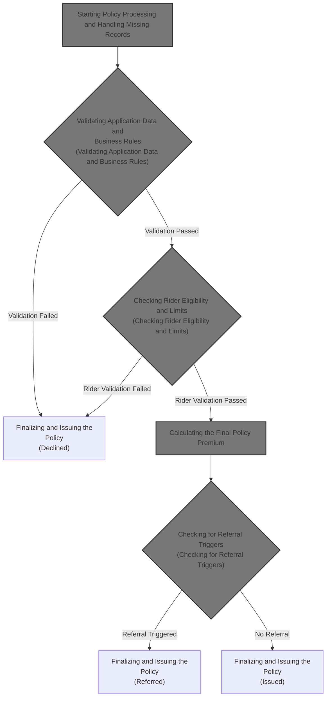

## Dependencies

### Program

- NBUWB (<SwmPath>[QCBLLESRC/NBUWB.cbl](QCBLLESRC/NBUWB.cbl)</SwmPath>)

### Copybook

- POLDATA (<SwmPath>[QCPYSRC/POLDATA.cpy](QCPYSRC/POLDATA.cpy)</SwmPath>)

## Input and Output Tables/Files used

### NBUWB (<SwmPath>[QCBLLESRC/NBUWB.cbl](QCBLLESRC/NBUWB.cbl)</SwmPath>)

| Table / File Name                                                                                                                           | Type | Description                                                | Usage Mode   | Key Fields / Layout Highlights |
| ------------------------------------------------------------------------------------------------------------------------------------------- | ---- | ---------------------------------------------------------- | ------------ | ------------------------------ |
| POLMST                                                                                                                                      | File | Indexed file for policy master records, keyed by policy ID | Input/Output | File resource                  |
| <SwmToken path="QCBLLESRC/NBUWB.cbl" pos="97:3:9" line-data="               REWRITE WS-POLICY-MASTER-REC">`WS-POLICY-MASTER-REC`</SwmToken> | File | In-memory structure for a single policy's master data      | Output       | File resource                  |

# Workflow

# Starting Policy Processing and Handling Missing Records

```mermaid
%%{init: {"flowchart": {"defaultRenderer": "elk"}} }%%
flowchart TD
    node1["Start: Receive policy application"] --> node2{"Policy record found?"}
    click node1 openCode "QCBLLESRC/NBUWB.cbl:81:82"
    node2 -->|"No"| node3["Decline: Policy not found"]
    click node2 openCode "QCBLLESRC/NBUWB.cbl:84:91"
    node3 --> node4["Set status to Declined and return error"]
    click node3 openCode "QCBLLESRC/NBUWB.cbl:86:90"
    node4 --> node12["End: Policy Declined"]
    click node4 openCode "QCBLLESRC/NBUWB.cbl:504:507"
    node2 -->|"Yes"| node5["Validating Application Data and Business Rules"]
    
    node5 --> node6{"Application valid?"}
    click node6 openCode "QCBLLESRC/NBUWB.cbl:95:100"
    node6 -->|"No"| node7["Decline: Application invalid"]
    click node7 openCode "QCBLLESRC/NBUWB.cbl:96:99"
    node7 --> node8["Set status to Declined and return error"]
    click node8 openCode "QCBLLESRC/NBUWB.cbl:504:507"
    node8 --> node12
    node6 -->|"Yes"| node9["Assigning Underwriting Class Based on Risk"]
    
    node9 --> node10["Assigning Rate Factors for Premium Calculation"]
    
    node10 --> node11["Checking Rider Eligibility and Limits"]
    
    node11 --> node13{"Rider validation successful?"}
    click node13 openCode "QCBLLESRC/NBUWB.cbl:104:109"
    node13 -->|"No"| node14["Decline: Rider validation failed"]
    click node14 openCode "QCBLLESRC/NBUWB.cbl:105:108"
    node14 --> node15["Set status to Declined and return error"]
    click node15 openCode "QCBLLESRC/NBUWB.cbl:504:507"
    node15 --> node12
    node13 -->|"Yes"| node16["Handling Rider Validation Results and Calculating Premiums"]
    
    node16 --> node17["Calculating Rider Premiums"]
    
    node17 --> node18["Calculating the Final Policy Premium"]
    
    node18 --> node19["Checking for Referral Triggers"]
    
    node19 --> node20{"Referral outcome?"}
    click node20 openCode "QCBLLESRC/NBUWB.cbl:113:114"
    node20 -->|"Declined"| node21["Set status to Declined and return error"]
    click node21 openCode "QCBLLESRC/NBUWB.cbl:504:507"
    node21 --> node12
    node20 -->|"Approved"| node22["Handling Rider Validation Results and Calculating Premiums"]
    
    node22 --> node23["Finalize and return"]
    click node23 openCode "QCBLLESRC/NBUWB.cbl:115:117"
    node23 --> node24["End: Policy Issued"]
    click node24 openCode "QCBLLESRC/NBUWB.cbl:117:117"
classDef HeadingStyle fill:#777777,stroke:#333,stroke-width:2px;
click node5 goToHeading "Validating Application Data and Business Rules"
node5:::HeadingStyle
click node9 goToHeading "Assigning Underwriting Class Based on Risk"
node9:::HeadingStyle
click node10 goToHeading "Assigning Rate Factors for Premium Calculation"
node10:::HeadingStyle
click node11 goToHeading "Checking Rider Eligibility and Limits"
node11:::HeadingStyle
click node16 goToHeading "Handling Rider Validation Results and Calculating Premiums"
node16:::HeadingStyle
click node17 goToHeading "Calculating Rider Premiums"
node17:::HeadingStyle
click node18 goToHeading "Calculating the Final Policy Premium"
node18:::HeadingStyle
click node19 goToHeading "Checking for Referral Triggers"
node19:::HeadingStyle
click node22 goToHeading "Handling Rider Validation Results and Calculating Premiums"
node22:::HeadingStyle

%% Swimm:
%% %%{init: {"flowchart": {"defaultRenderer": "elk"}} }%%
%% flowchart TD
%%     node1["Start: Receive policy application"] --> node2{"Policy record found?"}
%%     click node1 openCode "<SwmPath>[QCBLLESRC/NBUWB.cbl](QCBLLESRC/NBUWB.cbl)</SwmPath>:81:82"
%%     node2 -->|"No"| node3["Decline: Policy not found"]
%%     click node2 openCode "<SwmPath>[QCBLLESRC/NBUWB.cbl](QCBLLESRC/NBUWB.cbl)</SwmPath>:84:91"
%%     node3 --> node4["Set status to Declined and return error"]
%%     click node3 openCode "<SwmPath>[QCBLLESRC/NBUWB.cbl](QCBLLESRC/NBUWB.cbl)</SwmPath>:86:90"
%%     node4 --> node12["End: Policy Declined"]
%%     click node4 openCode "<SwmPath>[QCBLLESRC/NBUWB.cbl](QCBLLESRC/NBUWB.cbl)</SwmPath>:504:507"
%%     node2 -->|"Yes"| node5["Validating Application Data and Business Rules"]
%%     
%%     node5 --> node6{"Application valid?"}
%%     click node6 openCode "<SwmPath>[QCBLLESRC/NBUWB.cbl](QCBLLESRC/NBUWB.cbl)</SwmPath>:95:100"
%%     node6 -->|"No"| node7["Decline: Application invalid"]
%%     click node7 openCode "<SwmPath>[QCBLLESRC/NBUWB.cbl](QCBLLESRC/NBUWB.cbl)</SwmPath>:96:99"
%%     node7 --> node8["Set status to Declined and return error"]
%%     click node8 openCode "<SwmPath>[QCBLLESRC/NBUWB.cbl](QCBLLESRC/NBUWB.cbl)</SwmPath>:504:507"
%%     node8 --> node12
%%     node6 -->|"Yes"| node9["Assigning Underwriting Class Based on Risk"]
%%     
%%     node9 --> node10["Assigning Rate Factors for Premium Calculation"]
%%     
%%     node10 --> node11["Checking Rider Eligibility and Limits"]
%%     
%%     node11 --> node13{"Rider validation successful?"}
%%     click node13 openCode "<SwmPath>[QCBLLESRC/NBUWB.cbl](QCBLLESRC/NBUWB.cbl)</SwmPath>:104:109"
%%     node13 -->|"No"| node14["Decline: Rider validation failed"]
%%     click node14 openCode "<SwmPath>[QCBLLESRC/NBUWB.cbl](QCBLLESRC/NBUWB.cbl)</SwmPath>:105:108"
%%     node14 --> node15["Set status to Declined and return error"]
%%     click node15 openCode "<SwmPath>[QCBLLESRC/NBUWB.cbl](QCBLLESRC/NBUWB.cbl)</SwmPath>:504:507"
%%     node15 --> node12
%%     node13 -->|"Yes"| node16["Handling Rider Validation Results and Calculating Premiums"]
%%     
%%     node16 --> node17["Calculating Rider Premiums"]
%%     
%%     node17 --> node18["Calculating the Final Policy Premium"]
%%     
%%     node18 --> node19["Checking for Referral Triggers"]
%%     
%%     node19 --> node20{"Referral outcome?"}
%%     click node20 openCode "<SwmPath>[QCBLLESRC/NBUWB.cbl](QCBLLESRC/NBUWB.cbl)</SwmPath>:113:114"
%%     node20 -->|"Declined"| node21["Set status to Declined and return error"]
%%     click node21 openCode "<SwmPath>[QCBLLESRC/NBUWB.cbl](QCBLLESRC/NBUWB.cbl)</SwmPath>:504:507"
%%     node21 --> node12
%%     node20 -->|"Approved"| node22["Handling Rider Validation Results and Calculating Premiums"]
%%     
%%     node22 --> node23["Finalize and return"]
%%     click node23 openCode "<SwmPath>[QCBLLESRC/NBUWB.cbl](QCBLLESRC/NBUWB.cbl)</SwmPath>:115:117"
%%     node23 --> node24["End: Policy Issued"]
%%     click node24 openCode "<SwmPath>[QCBLLESRC/NBUWB.cbl](QCBLLESRC/NBUWB.cbl)</SwmPath>:117:117"
%% classDef HeadingStyle fill:#777777,stroke:#333,stroke-width:2px;
%% click node5 goToHeading "Validating Application Data and Business Rules"
%% node5:::HeadingStyle
%% click node9 goToHeading "Assigning Underwriting Class Based on Risk"
%% node9:::HeadingStyle
%% click node10 goToHeading "Assigning Rate Factors for Premium Calculation"
%% node10:::HeadingStyle
%% click node11 goToHeading "Checking Rider Eligibility and Limits"
%% node11:::HeadingStyle
%% click node16 goToHeading "Handling Rider Validation Results and Calculating Premiums"
%% node16:::HeadingStyle
%% click node17 goToHeading "Calculating Rider Premiums"
%% node17:::HeadingStyle
%% click node18 goToHeading "Calculating the Final Policy Premium"
%% node18:::HeadingStyle
%% click node19 goToHeading "Checking for Referral Triggers"
%% node19:::HeadingStyle
%% click node22 goToHeading "Handling Rider Validation Results and Calculating Premiums"
%% node22:::HeadingStyle
```

This section initiates policy processing by attempting to locate the policy record and handling missing records by setting error codes, messages, and contract status. It ensures that missing or invalid applications are declined and signaled to downstream systems.

| Rule ID | Category        | Rule Name                      | Description                                                                                                                                                                                                   | Implementation Details                                                                                                                                                                                  |
| ------- | --------------- | ------------------------------ | ------------------------------------------------------------------------------------------------------------------------------------------------------------------------------------------------------------- | ------------------------------------------------------------------------------------------------------------------------------------------------------------------------------------------------------- |
| BR-001  | Decision Making | Missing policy record decline  | When a policy record cannot be found for the provided policy identifier, the process sets the result code to 21, the result message to 'POLICY RECORD NOT FOUND', and the contract status to 'RJ' (declined). | Result code is set to 21 (number). Result message is set to 'POLICY RECORD NOT FOUND' (string, up to 100 characters). Contract status is set to 'RJ' (declined). Output fields are updated accordingly. |
| BR-002  | Decision Making | Policy record found processing | If the policy record is found, the process continues to initialize, load plan parameters, and validate the application data before further processing.                                                        | Processing continues with initialization, plan parameter loading, and application validation. No error code or message is set at this stage.                                                            |
| BR-003  | Writing Output  | Error output signaling         | When an error is detected (such as missing policy record), the process updates the output fields for return code, return message, and contract status to reflect the error state before ending processing.    | Return code is a number (2 digits). Return message is a string (up to 100 characters). Contract status is a string (2 characters), with 'RJ' indicating declined.                                       |

<SwmSnippet path="/QCBLLESRC/NBUWB.cbl" line="81">

---

<SwmToken path="QCBLLESRC/NBUWB.cbl" pos="81:1:3" line-data="       MAIN-PROCESS.">`MAIN-PROCESS`</SwmToken> tries to fetch the policy record. If it's missing, it sets an error code and message, then calls <SwmToken path="QCBLLESRC/NBUWB.cbl" pos="88:3:7" line-data="                   PERFORM 9000-RETURN-ERROR">`9000-RETURN-ERROR`</SwmToken> to update the output fields and status before stopping.

```cobol
       MAIN-PROCESS.
           MOVE LK-POLICY-ID TO PM-POLICY-ID
           OPEN I-O POLMST
           READ POLMST
               INVALID KEY
                   MOVE 21 TO WS-RESULT-CODE
                   MOVE 'POLICY RECORD NOT FOUND' TO WS-RESULT-MESSAGE
                   PERFORM 9000-RETURN-ERROR
```

---

</SwmSnippet>

<SwmSnippet path="/QCBLLESRC/NBUWB.cbl" line="504">

---

<SwmToken path="QCBLLESRC/NBUWB.cbl" pos="504:1:5" line-data="       9000-RETURN-ERROR.">`9000-RETURN-ERROR`</SwmToken> copies the current error code and message into the output fields and sets the contract status to 'RJ' (declined). It assumes those error fields are already set up by the caller. This is how the process signals a failed or rejected policy to the rest of the system.

```cobol
       9000-RETURN-ERROR.
           MOVE WS-RESULT-CODE TO PM-RETURN-CODE
           MOVE WS-RESULT-MESSAGE TO PM-RETURN-MESSAGE
           MOVE 'RJ' TO PM-CONTRACT-STATUS.
```

---

</SwmSnippet>

<SwmSnippet path="/QCBLLESRC/NBUWB.cbl" line="89">

---

After handling any missing record errors, <SwmToken path="QCBLLESRC/NBUWB.cbl" pos="81:1:3" line-data="       MAIN-PROCESS.">`MAIN-PROCESS`</SwmToken> sets up the policy and plan data, then calls <SwmToken path="QCBLLESRC/NBUWB.cbl" pos="94:3:7" line-data="           PERFORM 1200-VALIDATE-APPLICATION">`1200-VALIDATE-APPLICATION`</SwmToken> to check if the application data is valid before continuing.

```cobol
                   CLOSE POLMST
                   GOBACK
           END-READ
           PERFORM 1000-INITIALIZE
           PERFORM 1100-LOAD-PLAN-PARAMETERS
           PERFORM 1200-VALIDATE-APPLICATION
```

---

</SwmSnippet>

## Validating Application Data and Business Rules

```mermaid
%%{init: {"flowchart": {"defaultRenderer": "elk"}} }%%
flowchart TD
    node1["Start application validation"]
    click node1 openCode "QCBLLESRC/NBUWB.cbl:197:197"
    node1 --> node2{"Is policy ID provided?"}
    click node2 openCode "QCBLLESRC/NBUWB.cbl:199:203"
    node2 -->|"No"| nodeReject1["Reject: Policy ID required"]
    click nodeReject1 openCode "QCBLLESRC/NBUWB.cbl:200:202"
    node2 -->|"Yes"| node3{"Is insured name provided?"}
    click node3 openCode "QCBLLESRC/NBUWB.cbl:204:208"
    node3 -->|"No"| nodeReject2["Reject: Insured name required"]
    click nodeReject2 openCode "QCBLLESRC/NBUWB.cbl:205:207"
    node3 -->|"Yes"| node4{"Is gender M or F?"}
    click node4 openCode "QCBLLESRC/NBUWB.cbl:209:213"
    node4 -->|"No"| nodeReject3["Reject: Gender must be M or F"]
    click nodeReject3 openCode "QCBLLESRC/NBUWB.cbl:210:212"
    node4 -->|"Yes"| node5{"Is smoker status S or N?"}
    click node5 openCode "QCBLLESRC/NBUWB.cbl:214:220"
    node5 -->|"No"| nodeReject4["Reject: Smoker status must be S or N"]
    click nodeReject4 openCode "QCBLLESRC/NBUWB.cbl:216:219"
    node5 -->|"Yes"| node6{"Is billing mode A, S, Q, or M?"}
    click node6 openCode "QCBLLESRC/NBUWB.cbl:221:229"
    node6 -->|"No"| nodeReject5["Reject: Billing mode invalid"]
    click nodeReject5 openCode "QCBLLESRC/NBUWB.cbl:225:228"
    node6 -->|"Yes"| node7{"Is issue age within plan limits?"}
    click node7 openCode "QCBLLESRC/NBUWB.cbl:231:237"
    node7 -->|"No"| nodeReject6["Reject: Issue age outside plan limits"]
    click nodeReject6 openCode "QCBLLESRC/NBUWB.cbl:233:236"
    node7 -->|"Yes"| node8{"Is sum assured within plan limits?"}
    click node8 openCode "QCBLLESRC/NBUWB.cbl:239:245"
    node8 -->|"No"| nodeReject7["Reject: Sum assured outside plan limits"]
    click nodeReject7 openCode "QCBLLESRC/NBUWB.cbl:241:244"
    node8 -->|"Yes"| node9{"Does issue age + term exceed maturity
age?"}
    click node9 openCode "QCBLLESRC/NBUWB.cbl:247:252"
    node9 -->|"Yes"| nodeReject8["Reject: Issue age + term exceeds
maturity age"]
    click nodeReject8 openCode "QCBLLESRC/NBUWB.cbl:249:251"
    node9 -->|"No"| node10{"Is plan code T6501 and occupation class
3?"}
    click node10 openCode "QCBLLESRC/NBUWB.cbl:254:260"
    node10 -->|"Yes"| nodeReject9["Reject: Hazardous occupation not
permitted"]
    click nodeReject9 openCode "QCBLLESRC/NBUWB.cbl:256:259"
    node10 -->|"No"| node11{"Is occupation class 4?"}
    click node11 openCode "QCBLLESRC/NBUWB.cbl:262:268"
    node11 -->|"Yes"| nodeReject10["Reject: Severe occupation declined (UW
class set to DP)"]
    click nodeReject10 openCode "QCBLLESRC/NBUWB.cbl:264:267"
    node11 -->|"No"| node12["Application valid"]
    click node12 openCode "QCBLLESRC/NBUWB.cbl:197:268"
classDef HeadingStyle fill:#777777,stroke:#333,stroke-width:2px;

%% Swimm:
%% %%{init: {"flowchart": {"defaultRenderer": "elk"}} }%%
%% flowchart TD
%%     node1["Start application validation"]
%%     click node1 openCode "<SwmPath>[QCBLLESRC/NBUWB.cbl](QCBLLESRC/NBUWB.cbl)</SwmPath>:197:197"
%%     node1 --> node2{"Is policy ID provided?"}
%%     click node2 openCode "<SwmPath>[QCBLLESRC/NBUWB.cbl](QCBLLESRC/NBUWB.cbl)</SwmPath>:199:203"
%%     node2 -->|"No"| nodeReject1["Reject: Policy ID required"]
%%     click nodeReject1 openCode "<SwmPath>[QCBLLESRC/NBUWB.cbl](QCBLLESRC/NBUWB.cbl)</SwmPath>:200:202"
%%     node2 -->|"Yes"| node3{"Is insured name provided?"}
%%     click node3 openCode "<SwmPath>[QCBLLESRC/NBUWB.cbl](QCBLLESRC/NBUWB.cbl)</SwmPath>:204:208"
%%     node3 -->|"No"| nodeReject2["Reject: Insured name required"]
%%     click nodeReject2 openCode "<SwmPath>[QCBLLESRC/NBUWB.cbl](QCBLLESRC/NBUWB.cbl)</SwmPath>:205:207"
%%     node3 -->|"Yes"| node4{"Is gender M or F?"}
%%     click node4 openCode "<SwmPath>[QCBLLESRC/NBUWB.cbl](QCBLLESRC/NBUWB.cbl)</SwmPath>:209:213"
%%     node4 -->|"No"| nodeReject3["Reject: Gender must be M or F"]
%%     click nodeReject3 openCode "<SwmPath>[QCBLLESRC/NBUWB.cbl](QCBLLESRC/NBUWB.cbl)</SwmPath>:210:212"
%%     node4 -->|"Yes"| node5{"Is smoker status S or N?"}
%%     click node5 openCode "<SwmPath>[QCBLLESRC/NBUWB.cbl](QCBLLESRC/NBUWB.cbl)</SwmPath>:214:220"
%%     node5 -->|"No"| nodeReject4["Reject: Smoker status must be S or N"]
%%     click nodeReject4 openCode "<SwmPath>[QCBLLESRC/NBUWB.cbl](QCBLLESRC/NBUWB.cbl)</SwmPath>:216:219"
%%     node5 -->|"Yes"| node6{"Is billing mode A, S, Q, or M?"}
%%     click node6 openCode "<SwmPath>[QCBLLESRC/NBUWB.cbl](QCBLLESRC/NBUWB.cbl)</SwmPath>:221:229"
%%     node6 -->|"No"| nodeReject5["Reject: Billing mode invalid"]
%%     click nodeReject5 openCode "<SwmPath>[QCBLLESRC/NBUWB.cbl](QCBLLESRC/NBUWB.cbl)</SwmPath>:225:228"
%%     node6 -->|"Yes"| node7{"Is issue age within plan limits?"}
%%     click node7 openCode "<SwmPath>[QCBLLESRC/NBUWB.cbl](QCBLLESRC/NBUWB.cbl)</SwmPath>:231:237"
%%     node7 -->|"No"| nodeReject6["Reject: Issue age outside plan limits"]
%%     click nodeReject6 openCode "<SwmPath>[QCBLLESRC/NBUWB.cbl](QCBLLESRC/NBUWB.cbl)</SwmPath>:233:236"
%%     node7 -->|"Yes"| node8{"Is sum assured within plan limits?"}
%%     click node8 openCode "<SwmPath>[QCBLLESRC/NBUWB.cbl](QCBLLESRC/NBUWB.cbl)</SwmPath>:239:245"
%%     node8 -->|"No"| nodeReject7["Reject: Sum assured outside plan limits"]
%%     click nodeReject7 openCode "<SwmPath>[QCBLLESRC/NBUWB.cbl](QCBLLESRC/NBUWB.cbl)</SwmPath>:241:244"
%%     node8 -->|"Yes"| node9{"Does issue age + term exceed maturity
%% age?"}
%%     click node9 openCode "<SwmPath>[QCBLLESRC/NBUWB.cbl](QCBLLESRC/NBUWB.cbl)</SwmPath>:247:252"
%%     node9 -->|"Yes"| nodeReject8["Reject: Issue age + term exceeds
%% maturity age"]
%%     click nodeReject8 openCode "<SwmPath>[QCBLLESRC/NBUWB.cbl](QCBLLESRC/NBUWB.cbl)</SwmPath>:249:251"
%%     node9 -->|"No"| node10{"Is plan code <SwmToken path="QCBLLESRC/NBUWB.cbl" pos="254:12:12" line-data="           IF PM-PLAN-CODE = &#39;T6501&#39; AND">`T6501`</SwmToken> and occupation class
%% 3?"}
%%     click node10 openCode "<SwmPath>[QCBLLESRC/NBUWB.cbl](QCBLLESRC/NBUWB.cbl)</SwmPath>:254:260"
%%     node10 -->|"Yes"| nodeReject9["Reject: Hazardous occupation not
%% permitted"]
%%     click nodeReject9 openCode "<SwmPath>[QCBLLESRC/NBUWB.cbl](QCBLLESRC/NBUWB.cbl)</SwmPath>:256:259"
%%     node10 -->|"No"| node11{"Is occupation class 4?"}
%%     click node11 openCode "<SwmPath>[QCBLLESRC/NBUWB.cbl](QCBLLESRC/NBUWB.cbl)</SwmPath>:262:268"
%%     node11 -->|"Yes"| nodeReject10["Reject: Severe occupation declined (UW
%% class set to DP)"]
%%     click nodeReject10 openCode "<SwmPath>[QCBLLESRC/NBUWB.cbl](QCBLLESRC/NBUWB.cbl)</SwmPath>:264:267"
%%     node11 -->|"No"| node12["Application valid"]
%%     click node12 openCode "<SwmPath>[QCBLLESRC/NBUWB.cbl](QCBLLESRC/NBUWB.cbl)</SwmPath>:197:268"
%% classDef HeadingStyle fill:#777777,stroke:#333,stroke-width:2px;
```

This section enforces business rules for application data validation, ensuring all mandatory fields and plan-specific constraints are met before processing continues.

| Rule ID | Category        | Rule Name                                                                                                                                                                                | Description                                                                                                                                                                                                                                                                                                                                                                                                                                            | Implementation Details                                                                                                                                                                                                                                                                                                                                                                                                                                                                                                                                                                                                                       |
| ------- | --------------- | ---------------------------------------------------------------------------------------------------------------------------------------------------------------------------------------- | ------------------------------------------------------------------------------------------------------------------------------------------------------------------------------------------------------------------------------------------------------------------------------------------------------------------------------------------------------------------------------------------------------------------------------------------------------ | -------------------------------------------------------------------------------------------------------------------------------------------------------------------------------------------------------------------------------------------------------------------------------------------------------------------------------------------------------------------------------------------------------------------------------------------------------------------------------------------------------------------------------------------------------------------------------------------------------------------------------------------- |
| BR-001  | Data validation | Policy ID required                                                                                                                                                                       | If the policy ID is missing, the application is rejected with result code 11 and the message 'POLICY ID IS REQUIRED'.                                                                                                                                                                                                                                                                                                                                  | Result code: 11. Message: 'POLICY ID IS REQUIRED'. Output format: code (number), message (string, left-aligned, padded to 100 characters if required).                                                                                                                                                                                                                                                                                                                                                                                                                                                                                       |
| BR-002  | Data validation | Insured name required                                                                                                                                                                    | If the insured name is missing, the application is rejected with result code 11 and the message 'INSURED NAME IS REQUIRED'.                                                                                                                                                                                                                                                                                                                            | Result code: 11. Message: 'INSURED NAME IS REQUIRED'. Output format: code (number), message (string, left-aligned, padded to 100 characters if required).                                                                                                                                                                                                                                                                                                                                                                                                                                                                                    |
| BR-003  | Data validation | Gender validation                                                                                                                                                                        | If gender is not 'M' or 'F', the application is rejected with result code 11 and the message 'GENDER MUST BE M OR F'.                                                                                                                                                                                                                                                                                                                                  | Result code: 11. Message: 'GENDER MUST BE M OR F'. Output format: code (number), message (string, left-aligned, padded to 100 characters if required).                                                                                                                                                                                                                                                                                                                                                                                                                                                                                       |
| BR-004  | Data validation | Smoker status validation                                                                                                                                                                 | If smoker status is not 'S' or 'N', the application is rejected with result code 11 and the message 'SMOKER STATUS MUST BE S OR N'.                                                                                                                                                                                                                                                                                                                    | Result code: 11. Message: 'SMOKER STATUS MUST BE S OR N'. Output format: code (number), message (string, left-aligned, padded to 100 characters if required).                                                                                                                                                                                                                                                                                                                                                                                                                                                                                |
| BR-005  | Data validation | Billing mode validation                                                                                                                                                                  | If billing mode is not 'A', 'S', 'Q', or 'M', the application is rejected with result code 11 and the message 'BILLING MODE MUST BE A S Q OR M'.                                                                                                                                                                                                                                                                                                       | Result code: 11. Message: 'BILLING MODE MUST BE A S Q OR M'. Output format: code (number), message (string, left-aligned, padded to 100 characters if required).                                                                                                                                                                                                                                                                                                                                                                                                                                                                             |
| BR-006  | Data validation | Issue age plan limits                                                                                                                                                                    | If issue age is outside plan limits, the application is rejected with result code 12 and the message 'ISSUE AGE OUTSIDE PLAN LIMITS'.                                                                                                                                                                                                                                                                                                                  | Result code: 12. Message: 'ISSUE AGE OUTSIDE PLAN LIMITS'. Plan-specific minimum and maximum issue ages: <SwmToken path="QCBLLESRC/NBUWB.cbl" pos="146:4:4" line-data="               WHEN &#39;T1001&#39;">`T1001`</SwmToken> = 18-60, <SwmToken path="QCBLLESRC/NBUWB.cbl" pos="160:4:4" line-data="               WHEN &#39;T2001&#39;">`T2001`</SwmToken> = <SwmToken path="QCBLLESRC/NBUWB.cbl" pos="35:18:20" line-data="      *  25 - WOP RIDER: AGE NOT IN 18-55 RANGE                     *">`18-55`</SwmToken>, other = 18-50. Output format: code (number), message (string, left-aligned, padded to 100 characters if required). |
| BR-007  | Data validation | Sum assured plan limits                                                                                                                                                                  | If sum assured is outside plan limits, the application is rejected with result code 13 and the message 'SUM ASSURED OUTSIDE PLAN LIMITS'.                                                                                                                                                                                                                                                                                                              | Result code: 13. Message: 'SUM ASSURED OUTSIDE PLAN LIMITS'. Plan-specific minimum and maximum sum assured: <SwmToken path="QCBLLESRC/NBUWB.cbl" pos="146:4:4" line-data="               WHEN &#39;T1001&#39;">`T1001`</SwmToken> = 10,000,000,000,000-50,000,000,000,000; <SwmToken path="QCBLLESRC/NBUWB.cbl" pos="160:4:4" line-data="               WHEN &#39;T2001&#39;">`T2001`</SwmToken> = 10,000,000,000,000-90,000,000,000,000; other = 10,000,000,000,000-75,000,000,000,000. Output format: code (number), message (string, left-aligned, padded to 100 characters if required).                                                 |
| BR-008  | Data validation | Maturity age validation                                                                                                                                                                  | If issue age plus term years exceeds maturity age, the application is rejected with result code 14 and the message 'ISSUE AGE + TERM EXCEEDS MATURITY AGE'.                                                                                                                                                                                                                                                                                            | Result code: 14. Message: 'ISSUE AGE + TERM EXCEEDS MATURITY AGE'. Plan-specific maturity ages: <SwmToken path="QCBLLESRC/NBUWB.cbl" pos="146:4:4" line-data="               WHEN &#39;T1001&#39;">`T1001`</SwmToken> = 70, <SwmToken path="QCBLLESRC/NBUWB.cbl" pos="160:4:4" line-data="               WHEN &#39;T2001&#39;">`T2001`</SwmToken> = 75, other = 65. Output format: code (number), message (string, left-aligned, padded to 100 characters if required).                                                                                                                                                                      |
| BR-009  | Data validation | Hazardous occupation for <SwmToken path="QCBLLESRC/NBUWB.cbl" pos="257:4:4" line-data="               MOVE &#39;T65 PLAN: HAZARDOUS OCCUPATION NOT PERMITTED&#39;">`T65`</SwmToken> plan | If plan code is <SwmToken path="QCBLLESRC/NBUWB.cbl" pos="254:12:12" line-data="           IF PM-PLAN-CODE = &#39;T6501&#39; AND">`T6501`</SwmToken> and occupation class is 3, the application is rejected with result code 15 and the message '<SwmToken path="QCBLLESRC/NBUWB.cbl" pos="257:4:4" line-data="               MOVE &#39;T65 PLAN: HAZARDOUS OCCUPATION NOT PERMITTED&#39;">`T65`</SwmToken> PLAN: HAZARDOUS OCCUPATION NOT PERMITTED'. | Result code: 15. Message: '<SwmToken path="QCBLLESRC/NBUWB.cbl" pos="257:4:4" line-data="               MOVE &#39;T65 PLAN: HAZARDOUS OCCUPATION NOT PERMITTED&#39;">`T65`</SwmToken> PLAN: HAZARDOUS OCCUPATION NOT PERMITTED'. Output format: code (number), message (string, left-aligned, padded to 100 characters if required).                                                                                                                                                                                                                                                                                                         |
| BR-010  | Data validation | Severe occupation decline                                                                                                                                                                | If occupation class is 4, the application is declined with result code 16, the message 'SEVERE OCCUPATION: APPLICATION DECLINED', and the underwriting class is set to 'DP'.                                                                                                                                                                                                                                                                           | Result code: 16. Message: 'SEVERE OCCUPATION: APPLICATION DECLINED'. Underwriting class: 'DP'. Output format: code (number), message (string, left-aligned, padded to 100 characters if required), underwriting class (string, 2 characters).                                                                                                                                                                                                                                                                                                                                                                                                |

<SwmSnippet path="/QCBLLESRC/NBUWB.cbl" line="197">

---

In <SwmToken path="QCBLLESRC/NBUWB.cbl" pos="197:1:5" line-data="       1200-VALIDATE-APPLICATION.">`1200-VALIDATE-APPLICATION`</SwmToken>, the function starts by checking if the policy ID is missing. If so, it sets result code 11 and a message, then exits. This pattern repeats for each required field and rule, using specific codes and messages to indicate the first validation error found.

```cobol
       1200-VALIDATE-APPLICATION.
      * NB-201: MANDATORY FIELDS
           IF PM-POLICY-ID = SPACES
               MOVE 11 TO WS-RESULT-CODE
               MOVE 'POLICY ID IS REQUIRED' TO WS-RESULT-MESSAGE
               EXIT PARAGRAPH
           END-IF
```

---

</SwmSnippet>

<SwmSnippet path="/QCBLLESRC/NBUWB.cbl" line="204">

---

After checking the policy ID, the function checks if the insured name is missing. If so, it sets the same error code and message as before and exits. Only the first missing field is reported.

```cobol
           IF PM-INSURED-NAME = SPACES
               MOVE 11 TO WS-RESULT-CODE
               MOVE 'INSURED NAME IS REQUIRED' TO WS-RESULT-MESSAGE
               EXIT PARAGRAPH
           END-IF
```

---

</SwmSnippet>

<SwmSnippet path="/QCBLLESRC/NBUWB.cbl" line="209">

---

After checking the insured name, the function validates that gender is either 'M' or 'F'. If not, it sets the error and exits. The same code is used for missing/invalid mandatory fields.

```cobol
           IF PM-GENDER NOT = 'M' AND PM-GENDER NOT = 'F'
               MOVE 11 TO WS-RESULT-CODE
               MOVE 'GENDER MUST BE M OR F' TO WS-RESULT-MESSAGE
               EXIT PARAGRAPH
           END-IF
```

---

</SwmSnippet>

<SwmSnippet path="/QCBLLESRC/NBUWB.cbl" line="214">

---

After gender, the function checks smoker status for 'S' or 'N'. If it's anything else, it sets the error and exits. Same error code as other mandatory fields.

```cobol
           IF PM-SMOKER-STATUS NOT = 'S' AND
              PM-SMOKER-STATUS NOT = 'N'
               MOVE 11 TO WS-RESULT-CODE
               MOVE 'SMOKER STATUS MUST BE S OR N'
                   TO WS-RESULT-MESSAGE
               EXIT PARAGRAPH
           END-IF
```

---

</SwmSnippet>

<SwmSnippet path="/QCBLLESRC/NBUWB.cbl" line="221">

---

After smoker status, the function checks billing mode for allowed values ('A', 'S', 'Q', 'M'). If it's not one of these, it sets the error and exits.

```cobol
           IF PM-BILLING-MODE NOT = 'A' AND
              PM-BILLING-MODE NOT = 'S' AND
              PM-BILLING-MODE NOT = 'Q' AND
              PM-BILLING-MODE NOT = 'M'
               MOVE 11 TO WS-RESULT-CODE
               MOVE 'BILLING MODE MUST BE A S Q OR M'
                   TO WS-RESULT-MESSAGE
               EXIT PARAGRAPH
           END-IF
```

---

</SwmSnippet>

<SwmSnippet path="/QCBLLESRC/NBUWB.cbl" line="231">

---

After billing mode, the function checks if the issue age is within plan limits. If not, it sets code 12 and a message, then exits.

```cobol
           IF PM-ISSUE-AGE < PM-MIN-ISSUE-AGE OR
              PM-ISSUE-AGE > PM-MAX-ISSUE-AGE
               MOVE 12 TO WS-RESULT-CODE
               MOVE 'ISSUE AGE OUTSIDE PLAN LIMITS'
                   TO WS-RESULT-MESSAGE
               EXIT PARAGRAPH
           END-IF
```

---

</SwmSnippet>

<SwmSnippet path="/QCBLLESRC/NBUWB.cbl" line="239">

---

After age limits, the function checks if the sum assured is within plan limits. If not, it sets code 13 and a message, then exits.

```cobol
           IF PM-SUM-ASSURED < PM-MIN-SUM-ASSURED OR
              PM-SUM-ASSURED > PM-MAX-SUM-ASSURED
               MOVE 13 TO WS-RESULT-CODE
               MOVE 'SUM ASSURED OUTSIDE PLAN LIMITS'
                   TO WS-RESULT-MESSAGE
               EXIT PARAGRAPH
           END-IF
```

---

</SwmSnippet>

<SwmSnippet path="/QCBLLESRC/NBUWB.cbl" line="247">

---

After sum assured, the function checks that issue age plus term years doesn't exceed maturity age. If it does, it sets code 14 and a message, then exits.

```cobol
           IF PM-ISSUE-AGE + PM-TERM-YEARS > PM-MATURITY-AGE
               MOVE 14 TO WS-RESULT-CODE
               MOVE 'ISSUE AGE + TERM EXCEEDS MATURITY AGE'
                   TO WS-RESULT-MESSAGE
               EXIT PARAGRAPH
           END-IF
```

---

</SwmSnippet>

<SwmSnippet path="/QCBLLESRC/NBUWB.cbl" line="254">

---

After maturity age, the function checks if the plan is <SwmToken path="QCBLLESRC/NBUWB.cbl" pos="257:4:4" line-data="               MOVE &#39;T65 PLAN: HAZARDOUS OCCUPATION NOT PERMITTED&#39;">`T65`</SwmToken> and occupation class is hazardous. If so, it sets code 15 and a message, then exits.

```cobol
           IF PM-PLAN-CODE = 'T6501' AND
              PM-OCCUPATION-CLASS = 3
               MOVE 15 TO WS-RESULT-CODE
               MOVE 'T65 PLAN: HAZARDOUS OCCUPATION NOT PERMITTED'
                   TO WS-RESULT-MESSAGE
               EXIT PARAGRAPH
           END-IF
```

---

</SwmSnippet>

<SwmSnippet path="/QCBLLESRC/NBUWB.cbl" line="262">

---

At the end of validation, if occupation class is 'severe', the function sets code 16, a decline message, and marks the underwriting class as 'DP'. Only the first error is ever reported, and the function exits right away.

```cobol
           IF PM-OCCUPATION-CLASS = 4
               MOVE 16 TO WS-RESULT-CODE
               MOVE 'SEVERE OCCUPATION: APPLICATION DECLINED'
                   TO WS-RESULT-MESSAGE
               MOVE 'DP' TO PM-UW-CLASS
               EXIT PARAGRAPH
           END-IF.
```

---

</SwmSnippet>

## Handling Validation Results and Moving to Risk Assessment

```mermaid
%%{init: {"flowchart": {"defaultRenderer": "elk"}} }%%
flowchart TD
    node1{"Is WS-RESULT-CODE 0?"}
    click node1 openCode "QCBLLESRC/NBUWB.cbl:95:100"
    node1 -->|"No (Error)"| node2["Return error message (WS-RESULT-MESSAGE)"]
    click node2 openCode "QCBLLESRC/NBUWB.cbl:96:96"
    node2 --> node3["Update policy record (PM-POLICY-ID)"]
    click node3 openCode "QCBLLESRC/NBUWB.cbl:97:97"
    node3 --> node4["Close policy file and exit"]
    click node4 openCode "QCBLLESRC/NBUWB.cbl:98:99"
    node1 -->|"Yes"| node5["Determine underwriting class"]
    click node5 openCode "QCBLLESRC/NBUWB.cbl:101:101"
    node5 --> node6["Load rate factors"]
    click node6 openCode "QCBLLESRC/NBUWB.cbl:102:102"
    node6 --> node7["Validate riders"]
    click node7 openCode "QCBLLESRC/NBUWB.cbl:103:103"

classDef HeadingStyle fill:#777777,stroke:#333,stroke-width:2px;

%% Swimm:
%% %%{init: {"flowchart": {"defaultRenderer": "elk"}} }%%
%% flowchart TD
%%     node1{"Is <SwmToken path="QCBLLESRC/NBUWB.cbl" pos="86:7:11" line-data="                   MOVE 21 TO WS-RESULT-CODE">`WS-RESULT-CODE`</SwmToken> 0?"}
%%     click node1 openCode "<SwmPath>[QCBLLESRC/NBUWB.cbl](QCBLLESRC/NBUWB.cbl)</SwmPath>:95:100"
%%     node1 -->|"No (Error)"| node2["Return error message (<SwmToken path="QCBLLESRC/NBUWB.cbl" pos="87:15:19" line-data="                   MOVE &#39;POLICY RECORD NOT FOUND&#39; TO WS-RESULT-MESSAGE">`WS-RESULT-MESSAGE`</SwmToken>)"]
%%     click node2 openCode "<SwmPath>[QCBLLESRC/NBUWB.cbl](QCBLLESRC/NBUWB.cbl)</SwmPath>:96:96"
%%     node2 --> node3["Update policy record (<SwmToken path="QCBLLESRC/NBUWB.cbl" pos="82:11:15" line-data="           MOVE LK-POLICY-ID TO PM-POLICY-ID">`PM-POLICY-ID`</SwmToken>)"]
%%     click node3 openCode "<SwmPath>[QCBLLESRC/NBUWB.cbl](QCBLLESRC/NBUWB.cbl)</SwmPath>:97:97"
%%     node3 --> node4["Close policy file and exit"]
%%     click node4 openCode "<SwmPath>[QCBLLESRC/NBUWB.cbl](QCBLLESRC/NBUWB.cbl)</SwmPath>:98:99"
%%     node1 -->|"Yes"| node5["Determine underwriting class"]
%%     click node5 openCode "<SwmPath>[QCBLLESRC/NBUWB.cbl](QCBLLESRC/NBUWB.cbl)</SwmPath>:101:101"
%%     node5 --> node6["Load rate factors"]
%%     click node6 openCode "<SwmPath>[QCBLLESRC/NBUWB.cbl](QCBLLESRC/NBUWB.cbl)</SwmPath>:102:102"
%%     node6 --> node7["Validate riders"]
%%     click node7 openCode "<SwmPath>[QCBLLESRC/NBUWB.cbl](QCBLLESRC/NBUWB.cbl)</SwmPath>:103:103"
%% 
%% classDef HeadingStyle fill:#777777,stroke:#333,stroke-width:2px;
```

This section governs how validation results are handled and determines whether to proceed to risk assessment or return an error. It ensures that errors are communicated and recorded, and that only validated policies move forward in the underwriting process.

| Rule ID | Category        | Rule Name                        | Description                                                                                                                                       | Implementation Details                                                                                                                                                               |
| ------- | --------------- | -------------------------------- | ------------------------------------------------------------------------------------------------------------------------------------------------- | ------------------------------------------------------------------------------------------------------------------------------------------------------------------------------------ |
| BR-001  | Data validation | Error handling and policy update | If validation fails, an error message is returned and the policy record is updated with the error information before stopping further processing. | The error message is returned as a string. The policy record is updated with the policy ID and error message. The error code value triggering this rule is any value not equal to 0. |
| BR-002  | Decision Making | Underwriting class determination | If validation passes, the system proceeds to determine the underwriting class for the policy.                                                     | Underwriting class is determined before any rate calculations or rider eligibility checks. The process is initiated only when validation passes.                                     |
| BR-003  | Decision Making | Rate factor loading              | After underwriting class is determined, rate factors are loaded for the policy.                                                                   | Rate factors are loaded as part of the risk assessment process. This step follows underwriting class determination.                                                                  |
| BR-004  | Decision Making | Rider validation                 | After rate factors are loaded, riders attached to the policy are validated.                                                                       | Rider validation is performed after rate factors are loaded. This step ensures that all riders meet eligibility criteria.                                                            |

<SwmSnippet path="/QCBLLESRC/NBUWB.cbl" line="95">

---

After validation, if there's an error, <SwmToken path="QCBLLESRC/NBUWB.cbl" pos="81:1:3" line-data="       MAIN-PROCESS.">`MAIN-PROCESS`</SwmToken> records the error, updates the record, and stops.

```cobol
           IF WS-RESULT-CODE NOT = 0
               PERFORM 9000-RETURN-ERROR
               REWRITE WS-POLICY-MASTER-REC
               CLOSE POLMST
               GOBACK
           END-IF
```

---

</SwmSnippet>

<SwmSnippet path="/QCBLLESRC/NBUWB.cbl" line="101">

---

After passing validation, <SwmToken path="QCBLLESRC/NBUWB.cbl" pos="81:1:3" line-data="       MAIN-PROCESS.">`MAIN-PROCESS`</SwmToken> moves on to determine the underwriting class, load rate factors, and validate riders. Underwriting class is needed before calculating rates and checking rider eligibility.

```cobol
           PERFORM 1300-DETERMINE-UW-CLASS
           PERFORM 1400-LOAD-RATE-FACTORS
           PERFORM 1500-VALIDATE-RIDERS
```

---

</SwmSnippet>

## Assigning Underwriting Class Based on Risk

```mermaid
%%{init: {"flowchart": {"defaultRenderer": "elk"}} }%%
flowchart TD
    node1["Set underwriting class to Standard"]
    click node1 openCode "QCBLLESRC/NBUWB.cbl:273:275"
    node1 --> node2{"Non-smoker, Low-risk occupation, Age <=
45, No high-risk avocation?"}
    click node2 openCode "QCBLLESRC/NBUWB.cbl:276:280"
    node2 -->|"Yes"| node3["Set underwriting class to Preferred"]
    click node3 openCode "QCBLLESRC/NBUWB.cbl:280:281"
    node2 -->|"No"| node4{"Smoker, High-risk occupation, or
High-risk avocation?"}
    click node4 openCode "QCBLLESRC/NBUWB.cbl:283:286"
    node4 -->|"Yes"| node5["Set underwriting class to Tobacco"]
    click node5 openCode "QCBLLESRC/NBUWB.cbl:286:287"
    node4 -->|"No"| node10["No change"]
    click node10 openCode "QCBLLESRC/NBUWB.cbl:287:287"
    node3 --> node7{"Smoker, Age > 60, Sum assured > 25B?"}
    node5 --> node7
    node10 --> node7
    click node7 openCode "QCBLLESRC/NBUWB.cbl:289:295"
    node7 -->|"Yes"| node8["Set underwriting class to Declined, set
result code/message"]
    click node8 openCode "QCBLLESRC/NBUWB.cbl:292:295"
    node7 -->|"No"| node9["Underwriting class determined"]
    click node9 openCode "QCBLLESRC/NBUWB.cbl:296:296"
classDef HeadingStyle fill:#777777,stroke:#333,stroke-width:2px;

%% Swimm:
%% %%{init: {"flowchart": {"defaultRenderer": "elk"}} }%%
%% flowchart TD
%%     node1["Set underwriting class to Standard"]
%%     click node1 openCode "<SwmPath>[QCBLLESRC/NBUWB.cbl](QCBLLESRC/NBUWB.cbl)</SwmPath>:273:275"
%%     node1 --> node2{"Non-smoker, Low-risk occupation, Age <=
%% 45, No high-risk avocation?"}
%%     click node2 openCode "<SwmPath>[QCBLLESRC/NBUWB.cbl](QCBLLESRC/NBUWB.cbl)</SwmPath>:276:280"
%%     node2 -->|"Yes"| node3["Set underwriting class to Preferred"]
%%     click node3 openCode "<SwmPath>[QCBLLESRC/NBUWB.cbl](QCBLLESRC/NBUWB.cbl)</SwmPath>:280:281"
%%     node2 -->|"No"| node4{"Smoker, High-risk occupation, or
%% High-risk avocation?"}
%%     click node4 openCode "<SwmPath>[QCBLLESRC/NBUWB.cbl](QCBLLESRC/NBUWB.cbl)</SwmPath>:283:286"
%%     node4 -->|"Yes"| node5["Set underwriting class to Tobacco"]
%%     click node5 openCode "<SwmPath>[QCBLLESRC/NBUWB.cbl](QCBLLESRC/NBUWB.cbl)</SwmPath>:286:287"
%%     node4 -->|"No"| node10["No change"]
%%     click node10 openCode "<SwmPath>[QCBLLESRC/NBUWB.cbl](QCBLLESRC/NBUWB.cbl)</SwmPath>:287:287"
%%     node3 --> node7{"Smoker, Age > 60, Sum assured > <SwmToken path="QCBLLESRC/NBUWB.cbl" pos="293:14:14" line-data="               MOVE &#39;SMOKER OVER 60 SA EXCEEDS 25B: DECLINED&#39;">`25B`</SwmToken>?"}
%%     node5 --> node7
%%     node10 --> node7
%%     click node7 openCode "<SwmPath>[QCBLLESRC/NBUWB.cbl](QCBLLESRC/NBUWB.cbl)</SwmPath>:289:295"
%%     node7 -->|"Yes"| node8["Set underwriting class to Declined, set
%% result code/message"]
%%     click node8 openCode "<SwmPath>[QCBLLESRC/NBUWB.cbl](QCBLLESRC/NBUWB.cbl)</SwmPath>:292:295"
%%     node7 -->|"No"| node9["Underwriting class determined"]
%%     click node9 openCode "<SwmPath>[QCBLLESRC/NBUWB.cbl](QCBLLESRC/NBUWB.cbl)</SwmPath>:296:296"
%% classDef HeadingStyle fill:#777777,stroke:#333,stroke-width:2px;
```

This section determines the underwriting class for an applicant based on risk factors. It applies business rules to classify applicants as Standard, Preferred, Tobacco, or Declined, and sets result codes/messages for declined cases.

| Rule ID | Category        | Rule Name                                       | Description                                                                                                                                                                                                  | Implementation Details                                                                                                                                                                                                                                                                                                                                         |
| ------- | --------------- | ----------------------------------------------- | ------------------------------------------------------------------------------------------------------------------------------------------------------------------------------------------------------------ | -------------------------------------------------------------------------------------------------------------------------------------------------------------------------------------------------------------------------------------------------------------------------------------------------------------------------------------------------------------- |
| BR-001  | Decision Making | Default to Standard                             | Applicants are initially assigned the Standard underwriting class unless further criteria are met.                                                                                                           | The underwriting class is set to 'ST' (Standard) as a string value.                                                                                                                                                                                                                                                                                            |
| BR-002  | Decision Making | Preferred Class Assignment                      | Applicants who are non-smokers, have a low-risk occupation, are age 45 or younger, and have no high-risk avocation are assigned the Preferred underwriting class.                                            | Underwriting class is set to 'PR' (Preferred) as a string value. Occupation class 1 is low-risk. Age threshold is 45. High-risk avocation must be 'N'.                                                                                                                                                                                                         |
| BR-003  | Decision Making | Tobacco Class Assignment                        | Applicants who are smokers, have a high-risk occupation, or have a high-risk avocation are assigned the Tobacco underwriting class.                                                                          | Underwriting class is set to 'TB' (Tobacco) as a string value. Occupation class 3 is high-risk. High-risk avocation must be 'Y'.                                                                                                                                                                                                                               |
| BR-004  | Decision Making | Declined Class Assignment for High-Risk Smokers | Applicants who are smokers, over age 60, and have a sum assured greater than 25 billion are declined. The result code is set to 22, a decline message is set, and the underwriting class is set to Declined. | Underwriting class is set to 'DP' (Declined) as a string value. Result code is set to 22. Result message is set to 'SMOKER OVER 60 SA EXCEEDS <SwmToken path="QCBLLESRC/NBUWB.cbl" pos="293:14:14" line-data="               MOVE &#39;SMOKER OVER 60 SA EXCEEDS 25B: DECLINED&#39;">`25B`</SwmToken>: DECLINED'. Sum assured threshold is 25,000,000,000,000. |

<SwmSnippet path="/QCBLLESRC/NBUWB.cbl" line="273">

---

In <SwmToken path="QCBLLESRC/NBUWB.cbl" pos="273:1:7" line-data="       1300-DETERMINE-UW-CLASS.">`1300-DETERMINE-UW-CLASS`</SwmToken>, the function starts by defaulting to 'ST' (standard). If the applicant is a non-smoker, low-risk occupation, age <= 45, and no high-risk avocation, it sets 'PR' (preferred).

```cobol
       1300-DETERMINE-UW-CLASS.
      * NB-301: DEFAULT TO PREFERRED IF MEETS ALL CRITERIA
           MOVE 'ST' TO PM-UW-CLASS
           IF PM-NON-SMOKER AND
              PM-OCCUPATION-CLASS = 1 AND
              PM-ISSUE-AGE <= 45 AND
              PM-HIGH-RISK-AVOCATION = 'N'
               MOVE 'PR' TO PM-UW-CLASS
           END-IF
```

---

</SwmSnippet>

<SwmSnippet path="/QCBLLESRC/NBUWB.cbl" line="283">

---

After checking for preferred, the function checks if the applicant is a smoker, hazardous occupation, or high-risk avocation. If so, it sets 'TB' (table-b) as the underwriting class.

```cobol
           IF PM-SMOKER OR
              PM-OCCUPATION-CLASS = 3 OR
              PM-HIGH-RISK-AVOCATION = 'Y'
               MOVE 'TB' TO PM-UW-CLASS
           END-IF
```

---

</SwmSnippet>

<SwmSnippet path="/QCBLLESRC/NBUWB.cbl" line="289">

---

At the end of <SwmToken path="QCBLLESRC/NBUWB.cbl" pos="101:3:9" line-data="           PERFORM 1300-DETERMINE-UW-CLASS">`1300-DETERMINE-UW-CLASS`</SwmToken>, if the applicant is a smoker over 60 with a huge sum assured, the function sets code 22, a decline message, and marks the case as declined ('DP').

```cobol
           IF PM-SMOKER AND
              PM-ISSUE-AGE > 60 AND
              PM-SUM-ASSURED > 25000000000000
               MOVE 22 TO WS-RESULT-CODE
               MOVE 'SMOKER OVER 60 SA EXCEEDS 25B: DECLINED'
                   TO WS-RESULT-MESSAGE
               MOVE 'DP' TO PM-UW-CLASS
           END-IF.
```

---

</SwmSnippet>

## Assigning Rate Factors for Premium Calculation

```mermaid
%%{init: {"flowchart": {"defaultRenderer": "elk"}} }%%
flowchart TD
    node1["Start rate factor assignment"] --> node2{"What is the insured's age band?"}
    click node1 openCode "QCBLLESRC/NBUWB.cbl:301:302"
    node2 -->|"Age <= 30 (0.8500)"| node3["Assign base mortality rate"]
    node2 -->|"Age <= 40 (1.2000)"| node3
    node2 -->|"Age <= 50 (2.1500)"| node3
    node2 -->|"Age <= 60 (4.1000)"| node3
    node2 -->|"Age > 60 (7.2500)"| node3
    click node2 openCode "QCBLLESRC/NBUWB.cbl:303:314"
    click node3 openCode "QCBLLESRC/NBUWB.cbl:305:313"
    node3 --> node4{"Is the insured female?"}
    node4 -->|"Yes (0.9200)"| node5["Assign gender factor"]
    node4 -->|"No (1.0000)"| node5
    click node4 openCode "QCBLLESRC/NBUWB.cbl:316:320"
    click node5 openCode "QCBLLESRC/NBUWB.cbl:317:319"
    node5 --> node6{"Is the insured a smoker?"}
    node6 -->|"Yes (1.7500)"| node7["Assign smoker factor"]
    node6 -->|"No (1.0000)"| node7
    click node6 openCode "QCBLLESRC/NBUWB.cbl:322:326"
    click node7 openCode "QCBLLESRC/NBUWB.cbl:323:325"
    node7 --> node8{"What is the occupation class?"}
    node8 -->|"Class 1 (1.0000)"| node9["Assign occupation factor"]
    node8 -->|"Class 2 (1.1500)"| node9
    node8 -->|"Class 3 (1.4000)"| node9
    node8 -->|"Other (1.0000)"| node9
    click node8 openCode "QCBLLESRC/NBUWB.cbl:328:333"
    click node9 openCode "QCBLLESRC/NBUWB.cbl:329:332"
    node9 --> node10{"What is the underwriting class?"}
    node10 -->|"'PR' (0.9000)"| node11["Assign underwriting factor"]
    node10 -->|"'ST' (1.0000)"| node11
    node10 -->|"'TB' (1.2500)"| node11
    node10 -->|"Other (1.0000)"| node11
    click node10 openCode "QCBLLESRC/NBUWB.cbl:335:340"
    click node11 openCode "QCBLLESRC/NBUWB.cbl:336:339"
    node11 --> node12["All rate factors assigned"]
    click node12 openCode "QCBLLESRC/NBUWB.cbl:301:340"
classDef HeadingStyle fill:#777777,stroke:#333,stroke-width:2px;

%% Swimm:
%% %%{init: {"flowchart": {"defaultRenderer": "elk"}} }%%
%% flowchart TD
%%     node1["Start rate factor assignment"] --> node2{"What is the insured's age band?"}
%%     click node1 openCode "<SwmPath>[QCBLLESRC/NBUWB.cbl](QCBLLESRC/NBUWB.cbl)</SwmPath>:301:302"
%%     node2 -->|"Age <= 30 (<SwmToken path="QCBLLESRC/NBUWB.cbl" pos="305:3:5" line-data="                   MOVE 0.8500 TO PM-BASE-MORTALITY-RATE">`0.8500`</SwmToken>)"| node3["Assign base mortality rate"]
%%     node2 -->|"Age <= 40 (<SwmToken path="QCBLLESRC/NBUWB.cbl" pos="307:3:5" line-data="                   MOVE 1.2000 TO PM-BASE-MORTALITY-RATE">`1.2000`</SwmToken>)"| node3
%%     node2 -->|"Age <= 50 (<SwmToken path="QCBLLESRC/NBUWB.cbl" pos="309:3:5" line-data="                   MOVE 2.1500 TO PM-BASE-MORTALITY-RATE">`2.1500`</SwmToken>)"| node3
%%     node2 -->|"Age <= 60 (<SwmToken path="QCBLLESRC/NBUWB.cbl" pos="311:3:5" line-data="                   MOVE 4.1000 TO PM-BASE-MORTALITY-RATE">`4.1000`</SwmToken>)"| node3
%%     node2 -->|"Age > 60 (<SwmToken path="QCBLLESRC/NBUWB.cbl" pos="313:3:5" line-data="                   MOVE 7.2500 TO PM-BASE-MORTALITY-RATE">`7.2500`</SwmToken>)"| node3
%%     click node2 openCode "<SwmPath>[QCBLLESRC/NBUWB.cbl](QCBLLESRC/NBUWB.cbl)</SwmPath>:303:314"
%%     click node3 openCode "<SwmPath>[QCBLLESRC/NBUWB.cbl](QCBLLESRC/NBUWB.cbl)</SwmPath>:305:313"
%%     node3 --> node4{"Is the insured female?"}
%%     node4 -->|"Yes (<SwmToken path="QCBLLESRC/NBUWB.cbl" pos="317:3:5" line-data="               MOVE 0.9200 TO PM-GENDER-FACTOR">`0.9200`</SwmToken>)"| node5["Assign gender factor"]
%%     node4 -->|"No (<SwmToken path="QCBLLESRC/NBUWB.cbl" pos="319:3:5" line-data="               MOVE 1.0000 TO PM-GENDER-FACTOR">`1.0000`</SwmToken>)"| node5
%%     click node4 openCode "<SwmPath>[QCBLLESRC/NBUWB.cbl](QCBLLESRC/NBUWB.cbl)</SwmPath>:316:320"
%%     click node5 openCode "<SwmPath>[QCBLLESRC/NBUWB.cbl](QCBLLESRC/NBUWB.cbl)</SwmPath>:317:319"
%%     node5 --> node6{"Is the insured a smoker?"}
%%     node6 -->|"Yes (<SwmToken path="QCBLLESRC/NBUWB.cbl" pos="323:3:5" line-data="               MOVE 1.7500 TO PM-SMOKER-FACTOR">`1.7500`</SwmToken>)"| node7["Assign smoker factor"]
%%     node6 -->|"No (<SwmToken path="QCBLLESRC/NBUWB.cbl" pos="319:3:5" line-data="               MOVE 1.0000 TO PM-GENDER-FACTOR">`1.0000`</SwmToken>)"| node7
%%     click node6 openCode "<SwmPath>[QCBLLESRC/NBUWB.cbl](QCBLLESRC/NBUWB.cbl)</SwmPath>:322:326"
%%     click node7 openCode "<SwmPath>[QCBLLESRC/NBUWB.cbl](QCBLLESRC/NBUWB.cbl)</SwmPath>:323:325"
%%     node7 --> node8{"What is the occupation class?"}
%%     node8 -->|"Class 1 (<SwmToken path="QCBLLESRC/NBUWB.cbl" pos="319:3:5" line-data="               MOVE 1.0000 TO PM-GENDER-FACTOR">`1.0000`</SwmToken>)"| node9["Assign occupation factor"]
%%     node8 -->|"Class 2 (<SwmToken path="QCBLLESRC/NBUWB.cbl" pos="330:7:9" line-data="               WHEN 2 MOVE 1.1500 TO PM-OCCUPATION-FACTOR">`1.1500`</SwmToken>)"| node9
%%     node8 -->|"Class 3 (<SwmToken path="QCBLLESRC/NBUWB.cbl" pos="331:7:9" line-data="               WHEN 3 MOVE 1.4000 TO PM-OCCUPATION-FACTOR">`1.4000`</SwmToken>)"| node9
%%     node8 -->|"Other (<SwmToken path="QCBLLESRC/NBUWB.cbl" pos="319:3:5" line-data="               MOVE 1.0000 TO PM-GENDER-FACTOR">`1.0000`</SwmToken>)"| node9
%%     click node8 openCode "<SwmPath>[QCBLLESRC/NBUWB.cbl](QCBLLESRC/NBUWB.cbl)</SwmPath>:328:333"
%%     click node9 openCode "<SwmPath>[QCBLLESRC/NBUWB.cbl](QCBLLESRC/NBUWB.cbl)</SwmPath>:329:332"
%%     node9 --> node10{"What is the underwriting class?"}
%%     node10 -->|"'PR' (<SwmToken path="QCBLLESRC/NBUWB.cbl" pos="336:9:11" line-data="               WHEN &#39;PR&#39; MOVE 0.9000 TO PM-UW-FACTOR">`0.9000`</SwmToken>)"| node11["Assign underwriting factor"]
%%     node10 -->|"'ST' (<SwmToken path="QCBLLESRC/NBUWB.cbl" pos="319:3:5" line-data="               MOVE 1.0000 TO PM-GENDER-FACTOR">`1.0000`</SwmToken>)"| node11
%%     node10 -->|"'TB' (<SwmToken path="QCBLLESRC/NBUWB.cbl" pos="338:9:11" line-data="               WHEN &#39;TB&#39; MOVE 1.2500 TO PM-UW-FACTOR">`1.2500`</SwmToken>)"| node11
%%     node10 -->|"Other (<SwmToken path="QCBLLESRC/NBUWB.cbl" pos="319:3:5" line-data="               MOVE 1.0000 TO PM-GENDER-FACTOR">`1.0000`</SwmToken>)"| node11
%%     click node10 openCode "<SwmPath>[QCBLLESRC/NBUWB.cbl](QCBLLESRC/NBUWB.cbl)</SwmPath>:335:340"
%%     click node11 openCode "<SwmPath>[QCBLLESRC/NBUWB.cbl](QCBLLESRC/NBUWB.cbl)</SwmPath>:336:339"
%%     node11 --> node12["All rate factors assigned"]
%%     click node12 openCode "<SwmPath>[QCBLLESRC/NBUWB.cbl](QCBLLESRC/NBUWB.cbl)</SwmPath>:301:340"
%% classDef HeadingStyle fill:#777777,stroke:#333,stroke-width:2px;
```

This section assigns rate factors for premium calculation based on applicant attributes. Each factor is determined by a specific business rule and is used to calculate the final premium.

| Rule ID | Category    | Rule Name                            | Description                                                                                                                                                                                                                                                                                                                                                                                                                                                                                                                                                                                                                                                                                                                                                                                                                                                                                                 | Implementation Details                                                                                                                                                                                                                                                                                                                                                                                                                                                                                                                                                                                                                                                                                                                                                                                                                                    |
| ------- | ----------- | ------------------------------------ | ----------------------------------------------------------------------------------------------------------------------------------------------------------------------------------------------------------------------------------------------------------------------------------------------------------------------------------------------------------------------------------------------------------------------------------------------------------------------------------------------------------------------------------------------------------------------------------------------------------------------------------------------------------------------------------------------------------------------------------------------------------------------------------------------------------------------------------------------------------------------------------------------------------- | --------------------------------------------------------------------------------------------------------------------------------------------------------------------------------------------------------------------------------------------------------------------------------------------------------------------------------------------------------------------------------------------------------------------------------------------------------------------------------------------------------------------------------------------------------------------------------------------------------------------------------------------------------------------------------------------------------------------------------------------------------------------------------------------------------------------------------------------------------- |
| BR-001  | Calculation | Base mortality rate by age band      | Assign the base mortality rate according to the applicant's age band. The rate is <SwmToken path="QCBLLESRC/NBUWB.cbl" pos="305:3:5" line-data="                   MOVE 0.8500 TO PM-BASE-MORTALITY-RATE">`0.8500`</SwmToken> for age up to 30, <SwmToken path="QCBLLESRC/NBUWB.cbl" pos="307:3:5" line-data="                   MOVE 1.2000 TO PM-BASE-MORTALITY-RATE">`1.2000`</SwmToken> for age up to 40, <SwmToken path="QCBLLESRC/NBUWB.cbl" pos="309:3:5" line-data="                   MOVE 2.1500 TO PM-BASE-MORTALITY-RATE">`2.1500`</SwmToken> for age up to 50, <SwmToken path="QCBLLESRC/NBUWB.cbl" pos="311:3:5" line-data="                   MOVE 4.1000 TO PM-BASE-MORTALITY-RATE">`4.1000`</SwmToken> for age up to 60, and <SwmToken path="QCBLLESRC/NBUWB.cbl" pos="313:3:5" line-data="                   MOVE 7.2500 TO PM-BASE-MORTALITY-RATE">`7.2500`</SwmToken> for age above 60. | The base mortality rate is a number. The assigned values are: <SwmToken path="QCBLLESRC/NBUWB.cbl" pos="305:3:5" line-data="                   MOVE 0.8500 TO PM-BASE-MORTALITY-RATE">`0.8500`</SwmToken> (age <= 30), <SwmToken path="QCBLLESRC/NBUWB.cbl" pos="307:3:5" line-data="                   MOVE 1.2000 TO PM-BASE-MORTALITY-RATE">`1.2000`</SwmToken> (age <= 40), <SwmToken path="QCBLLESRC/NBUWB.cbl" pos="309:3:5" line-data="                   MOVE 2.1500 TO PM-BASE-MORTALITY-RATE">`2.1500`</SwmToken> (age <= 50), <SwmToken path="QCBLLESRC/NBUWB.cbl" pos="311:3:5" line-data="                   MOVE 4.1000 TO PM-BASE-MORTALITY-RATE">`4.1000`</SwmToken> (age <= 60), <SwmToken path="QCBLLESRC/NBUWB.cbl" pos="313:3:5" line-data="                   MOVE 7.2500 TO PM-BASE-MORTALITY-RATE">`7.2500`</SwmToken> (age > 60). |
| BR-002  | Calculation | Gender factor assignment             | Assign the gender factor. If the applicant is female, the factor is <SwmToken path="QCBLLESRC/NBUWB.cbl" pos="317:3:5" line-data="               MOVE 0.9200 TO PM-GENDER-FACTOR">`0.9200`</SwmToken>; otherwise, it is <SwmToken path="QCBLLESRC/NBUWB.cbl" pos="319:3:5" line-data="               MOVE 1.0000 TO PM-GENDER-FACTOR">`1.0000`</SwmToken>.                                                                                                                                                                                                                                                                                                                                                                                                                                                                                                                                                  | The gender factor is a number. The assigned values are: <SwmToken path="QCBLLESRC/NBUWB.cbl" pos="317:3:5" line-data="               MOVE 0.9200 TO PM-GENDER-FACTOR">`0.9200`</SwmToken> (female), <SwmToken path="QCBLLESRC/NBUWB.cbl" pos="319:3:5" line-data="               MOVE 1.0000 TO PM-GENDER-FACTOR">`1.0000`</SwmToken> (not female).                                                                                                                                                                                                                                                                                                                                                                                                                                                                                                       |
| BR-003  | Calculation | Smoker factor assignment             | Assign the smoker factor. If the applicant is a smoker, the factor is <SwmToken path="QCBLLESRC/NBUWB.cbl" pos="323:3:5" line-data="               MOVE 1.7500 TO PM-SMOKER-FACTOR">`1.7500`</SwmToken>; otherwise, it is <SwmToken path="QCBLLESRC/NBUWB.cbl" pos="319:3:5" line-data="               MOVE 1.0000 TO PM-GENDER-FACTOR">`1.0000`</SwmToken>.                                                                                                                                                                                                                                                                                                                                                                                                                                                                                                                                                | The smoker factor is a number. The assigned values are: <SwmToken path="QCBLLESRC/NBUWB.cbl" pos="323:3:5" line-data="               MOVE 1.7500 TO PM-SMOKER-FACTOR">`1.7500`</SwmToken> (smoker), <SwmToken path="QCBLLESRC/NBUWB.cbl" pos="319:3:5" line-data="               MOVE 1.0000 TO PM-GENDER-FACTOR">`1.0000`</SwmToken> (not smoker).                                                                                                                                                                                                                                                                                                                                                                                                                                                                                                       |
| BR-004  | Calculation | Occupation factor assignment         | Assign the occupation factor based on occupation class. The factor is <SwmToken path="QCBLLESRC/NBUWB.cbl" pos="319:3:5" line-data="               MOVE 1.0000 TO PM-GENDER-FACTOR">`1.0000`</SwmToken> for class 1, <SwmToken path="QCBLLESRC/NBUWB.cbl" pos="330:7:9" line-data="               WHEN 2 MOVE 1.1500 TO PM-OCCUPATION-FACTOR">`1.1500`</SwmToken> for class 2, <SwmToken path="QCBLLESRC/NBUWB.cbl" pos="331:7:9" line-data="               WHEN 3 MOVE 1.4000 TO PM-OCCUPATION-FACTOR">`1.4000`</SwmToken> for class 3, and <SwmToken path="QCBLLESRC/NBUWB.cbl" pos="319:3:5" line-data="               MOVE 1.0000 TO PM-GENDER-FACTOR">`1.0000`</SwmToken> for other classes.                                                                                                                                                                                                           | The occupation factor is a number. The assigned values are: <SwmToken path="QCBLLESRC/NBUWB.cbl" pos="319:3:5" line-data="               MOVE 1.0000 TO PM-GENDER-FACTOR">`1.0000`</SwmToken> (class 1), <SwmToken path="QCBLLESRC/NBUWB.cbl" pos="330:7:9" line-data="               WHEN 2 MOVE 1.1500 TO PM-OCCUPATION-FACTOR">`1.1500`</SwmToken> (class 2), <SwmToken path="QCBLLESRC/NBUWB.cbl" pos="331:7:9" line-data="               WHEN 3 MOVE 1.4000 TO PM-OCCUPATION-FACTOR">`1.4000`</SwmToken> (class 3), <SwmToken path="QCBLLESRC/NBUWB.cbl" pos="319:3:5" line-data="               MOVE 1.0000 TO PM-GENDER-FACTOR">`1.0000`</SwmToken> (other).                                                                                                                                                                                       |
| BR-005  | Calculation | Underwriting class factor assignment | Assign the underwriting class factor. The factor is <SwmToken path="QCBLLESRC/NBUWB.cbl" pos="336:9:11" line-data="               WHEN &#39;PR&#39; MOVE 0.9000 TO PM-UW-FACTOR">`0.9000`</SwmToken> for 'PR' (preferred), <SwmToken path="QCBLLESRC/NBUWB.cbl" pos="319:3:5" line-data="               MOVE 1.0000 TO PM-GENDER-FACTOR">`1.0000`</SwmToken> for 'ST' (standard), <SwmToken path="QCBLLESRC/NBUWB.cbl" pos="338:9:11" line-data="               WHEN &#39;TB&#39; MOVE 1.2500 TO PM-UW-FACTOR">`1.2500`</SwmToken> for 'TB' (table-b), and <SwmToken path="QCBLLESRC/NBUWB.cbl" pos="319:3:5" line-data="               MOVE 1.0000 TO PM-GENDER-FACTOR">`1.0000`</SwmToken> for other classes.                                                                                                                                                                                             | The underwriting class factor is a number. The assigned values are: <SwmToken path="QCBLLESRC/NBUWB.cbl" pos="336:9:11" line-data="               WHEN &#39;PR&#39; MOVE 0.9000 TO PM-UW-FACTOR">`0.9000`</SwmToken> ('PR'), <SwmToken path="QCBLLESRC/NBUWB.cbl" pos="319:3:5" line-data="               MOVE 1.0000 TO PM-GENDER-FACTOR">`1.0000`</SwmToken> ('ST'), <SwmToken path="QCBLLESRC/NBUWB.cbl" pos="338:9:11" line-data="               WHEN &#39;TB&#39; MOVE 1.2500 TO PM-UW-FACTOR">`1.2500`</SwmToken> ('TB'), <SwmToken path="QCBLLESRC/NBUWB.cbl" pos="319:3:5" line-data="               MOVE 1.0000 TO PM-GENDER-FACTOR">`1.0000`</SwmToken> (other).                                                                                                                                                                                |

<SwmSnippet path="/QCBLLESRC/NBUWB.cbl" line="301">

---

In <SwmToken path="QCBLLESRC/NBUWB.cbl" pos="301:1:7" line-data="       1400-LOAD-RATE-FACTORS.">`1400-LOAD-RATE-FACTORS`</SwmToken>, the function assigns the base mortality rate based on the applicant's age band. The rates are hardcoded and used for premium calculations.

```cobol
       1400-LOAD-RATE-FACTORS.
      * NB-401: BASE MORTALITY RATE BY AGE BAND
           EVALUATE TRUE
               WHEN PM-ISSUE-AGE <= 30
                   MOVE 0.8500 TO PM-BASE-MORTALITY-RATE
               WHEN PM-ISSUE-AGE <= 40
                   MOVE 1.2000 TO PM-BASE-MORTALITY-RATE
               WHEN PM-ISSUE-AGE <= 50
                   MOVE 2.1500 TO PM-BASE-MORTALITY-RATE
               WHEN PM-ISSUE-AGE <= 60
                   MOVE 4.1000 TO PM-BASE-MORTALITY-RATE
               WHEN OTHER
                   MOVE 7.2500 TO PM-BASE-MORTALITY-RATE
           END-EVALUATE
```

---

</SwmSnippet>

<SwmSnippet path="/QCBLLESRC/NBUWB.cbl" line="316">

---

After setting the base mortality rate, the function adjusts the gender factor. Females get a lower factor (0.92), which lowers their premium.

```cobol
           IF PM-FEMALE
               MOVE 0.9200 TO PM-GENDER-FACTOR
           ELSE
               MOVE 1.0000 TO PM-GENDER-FACTOR
           END-IF
```

---

</SwmSnippet>

<SwmSnippet path="/QCBLLESRC/NBUWB.cbl" line="322">

---

After gender, the function sets the smoker factor. Smokers get a higher factor (1.75), which increases their premium.

```cobol
           IF PM-SMOKER
               MOVE 1.7500 TO PM-SMOKER-FACTOR
           ELSE
               MOVE 1.0000 TO PM-SMOKER-FACTOR
           END-IF
```

---

</SwmSnippet>

<SwmSnippet path="/QCBLLESRC/NBUWB.cbl" line="328">

---

After smoker factor, the function sets the occupation factor. Higher occupation classes get higher factors, which increase the premium.

```cobol
           EVALUATE PM-OCCUPATION-CLASS
               WHEN 1 MOVE 1.0000 TO PM-OCCUPATION-FACTOR
               WHEN 2 MOVE 1.1500 TO PM-OCCUPATION-FACTOR
               WHEN 3 MOVE 1.4000 TO PM-OCCUPATION-FACTOR
               WHEN OTHER MOVE 1.0000 TO PM-OCCUPATION-FACTOR
           END-EVALUATE
```

---

</SwmSnippet>

<SwmSnippet path="/QCBLLESRC/NBUWB.cbl" line="335">

---

At the end of <SwmToken path="QCBLLESRC/NBUWB.cbl" pos="102:3:9" line-data="           PERFORM 1400-LOAD-RATE-FACTORS">`1400-LOAD-RATE-FACTORS`</SwmToken>, the function sets the underwriting class factor. Preferred gets a discount, table-b gets a surcharge, and standard is neutral.

```cobol
           EVALUATE PM-UW-CLASS
               WHEN 'PR' MOVE 0.9000 TO PM-UW-FACTOR
               WHEN 'ST' MOVE 1.0000 TO PM-UW-FACTOR
               WHEN 'TB' MOVE 1.2500 TO PM-UW-FACTOR
               WHEN OTHER MOVE 1.0000 TO PM-UW-FACTOR
           END-EVALUATE.
```

---

</SwmSnippet>

## Validating Riders Before Premium Calculation

This section ensures that only eligible riders are included in the policy before premium calculation. It enforces plan and applicant-specific rules for rider eligibility.

| Rule ID | Category        | Rule Name                    | Description                                                                                                                                                                                   | Implementation Details                                                                                                                                          |
| ------- | --------------- | ---------------------------- | --------------------------------------------------------------------------------------------------------------------------------------------------------------------------------------------- | --------------------------------------------------------------------------------------------------------------------------------------------------------------- |
| BR-001  | Data validation | Rider eligibility validation | Each attached rider is validated to ensure it is allowed for the applicant's plan and data before premium calculation proceeds. If a rider is not allowed, an error code and message are set. | Error codes are numeric and messages are alphanumeric strings. The validation result is reflected in the policy master record's result code and message fields. |

<SwmSnippet path="/QCBLLESRC/NBUWB.cbl" line="101">

---

After returning from <SwmToken path="QCBLLESRC/NBUWB.cbl" pos="102:3:9" line-data="           PERFORM 1400-LOAD-RATE-FACTORS">`1400-LOAD-RATE-FACTORS`</SwmToken>, <SwmToken path="QCBLLESRC/NBUWB.cbl" pos="81:1:3" line-data="       MAIN-PROCESS.">`MAIN-PROCESS`</SwmToken> validates the attached riders. This step checks if each rider is allowed based on the applicant's data and plan rules before moving on to premium calculation.

```cobol
           PERFORM 1300-DETERMINE-UW-CLASS
           PERFORM 1400-LOAD-RATE-FACTORS
           PERFORM 1500-VALIDATE-RIDERS
```

---

</SwmSnippet>

## Checking Rider Eligibility and Limits

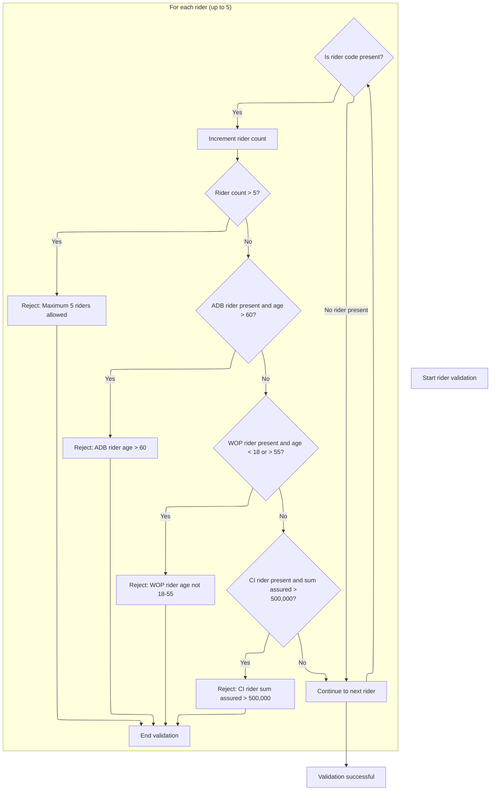

This section validates rider eligibility and limits for a policy, ensuring compliance with business constraints for rider count, age, and sum assured.

| Rule ID | Category        | Rule Name                  | Description                                                                                           | Implementation Details                                                                                                                                                                                                                                                                                  |
| ------- | --------------- | -------------------------- | ----------------------------------------------------------------------------------------------------- | ------------------------------------------------------------------------------------------------------------------------------------------------------------------------------------------------------------------------------------------------------------------------------------------------------- |
| BR-001  | Data validation | Maximum rider count        | Reject the policy if more than 5 riders are present.                                                  | The maximum allowed rider count is 5. If exceeded, the result code is 23 and the message is 'MAXIMUM 5 RIDERS ALLOWED'. The output format is: result code (number), result message (string, left-aligned, padded with spaces if shorter than field size).                                               |
| BR-002  | Data validation | ADB rider age limit        | Reject the policy if an ADB rider is present and the insured's age is over 60.                        | The maximum allowed age for ADB rider is 60. If exceeded, the result code is 24 and the message is 'ADB RIDER: INSURED MUST BE AGE 60 OR UNDER'. The output format is: result code (number), result message (string, left-aligned, padded with spaces if shorter than field size).                      |
| BR-003  | Data validation | WOP rider age range        | Reject the policy if a WOP rider is present and the insured's age is not between 18 and 55 inclusive. | The allowed age range for WOP rider is 18 to 55 inclusive. If outside this range, the result code is 25 and the message is 'WOP RIDER: INSURED MUST BE AGE 18 TO 55'. The output format is: result code (number), result message (string, left-aligned, padded with spaces if shorter than field size). |
| BR-004  | Data validation | CI rider sum assured limit | Reject the policy if a CI rider is present and the sum assured for that rider exceeds 500,000.        | The maximum allowed sum assured for CI rider is 500,000. If exceeded, the result code is 26 and the message is 'CI RIDER: SUM ASSURED EXCEEDS 500,000'. The output format is: result code (number), result message (string, left-aligned, padded with spaces if shorter than field size).               |

<SwmSnippet path="/QCBLLESRC/NBUWB.cbl" line="345">

---

In <SwmToken path="QCBLLESRC/NBUWB.cbl" pos="345:1:5" line-data="       1500-VALIDATE-RIDERS.">`1500-VALIDATE-RIDERS`</SwmToken>, the function loops through up to 5 rider slots, counting non-empty entries. If more than 5 are found, it sets an error and exits. No bounds checking is done, so the arrays must be sized correctly.

```cobol
       1500-VALIDATE-RIDERS.
           MOVE 0 TO WS-RIDER-IDX
           PERFORM VARYING PM-RIDER-IDX FROM 1 BY 1
               UNTIL PM-RIDER-IDX > 5
               IF PM-RIDER-CODE(PM-RIDER-IDX) NOT = SPACES
                   ADD 1 TO WS-RIDER-IDX
      * NB-501: MAX 5 RIDERS
                   IF WS-RIDER-IDX > 5
                       MOVE 23 TO WS-RESULT-CODE
                       MOVE 'MAXIMUM 5 RIDERS ALLOWED'
                           TO WS-RESULT-MESSAGE
                       EXIT PARAGRAPH
                   END-IF
```

---

</SwmSnippet>

<SwmSnippet path="/QCBLLESRC/NBUWB.cbl" line="359">

---

After checking the rider count, the function checks if <SwmToken path="QCBLLESRC/NBUWB.cbl" pos="359:19:19" line-data="                   IF PM-RIDER-CODE(PM-RIDER-IDX) = &#39;ADB01&#39; AND">`ADB01`</SwmToken> is present and the insured is over 60. If so, it sets code 24 and a message, then exits. Similar checks follow for other rider codes.

```cobol
                   IF PM-RIDER-CODE(PM-RIDER-IDX) = 'ADB01' AND
                      PM-ISSUE-AGE > 60
                       MOVE 24 TO WS-RESULT-CODE
                       MOVE 'ADB RIDER: INSURED MUST BE AGE 60 OR UNDER'
                           TO WS-RESULT-MESSAGE
                       EXIT PARAGRAPH
                   END-IF
```

---

</SwmSnippet>

<SwmSnippet path="/QCBLLESRC/NBUWB.cbl" line="367">

---

After <SwmToken path="QCBLLESRC/NBUWB.cbl" pos="359:19:19" line-data="                   IF PM-RIDER-CODE(PM-RIDER-IDX) = &#39;ADB01&#39; AND">`ADB01`</SwmToken>, the function checks if <SwmToken path="QCBLLESRC/NBUWB.cbl" pos="367:19:19" line-data="                   IF PM-RIDER-CODE(PM-RIDER-IDX) = &#39;WOP01&#39; AND">`WOP01`</SwmToken> is present and the insured's age is outside <SwmToken path="QCBLLESRC/NBUWB.cbl" pos="35:18:20" line-data="      *  25 - WOP RIDER: AGE NOT IN 18-55 RANGE                     *">`18-55`</SwmToken>. If so, it sets code 25 and a message, then exits.

```cobol
                   IF PM-RIDER-CODE(PM-RIDER-IDX) = 'WOP01' AND
                      (PM-ISSUE-AGE < 18 OR PM-ISSUE-AGE > 55)
                       MOVE 25 TO WS-RESULT-CODE
                       MOVE 'WOP RIDER: INSURED MUST BE AGE 18 TO 55'
                           TO WS-RESULT-MESSAGE
                       EXIT PARAGRAPH
                   END-IF
```

---

</SwmSnippet>

<SwmSnippet path="/QCBLLESRC/NBUWB.cbl" line="375">

---

At the end of rider validation, if <SwmToken path="QCBLLESRC/NBUWB.cbl" pos="375:19:19" line-data="                   IF PM-RIDER-CODE(PM-RIDER-IDX) = &#39;CI001&#39; AND">`CI001`</SwmToken> is present and sum assured is over 500,000, the function sets code 26 and a message, then exits. All checks are done for each rider slot.

```cobol
                   IF PM-RIDER-CODE(PM-RIDER-IDX) = 'CI001' AND
                      PM-RIDER-SUM-ASSURED(PM-RIDER-IDX) > 500000
                       MOVE 26 TO WS-RESULT-CODE
                       MOVE 'CI RIDER: SUM ASSURED EXCEEDS 500,000'
                           TO WS-RESULT-MESSAGE
                       EXIT PARAGRAPH
                   END-IF
               END-IF
           END-PERFORM.
```

---

</SwmSnippet>

## Handling Rider Validation Results and Calculating Premiums

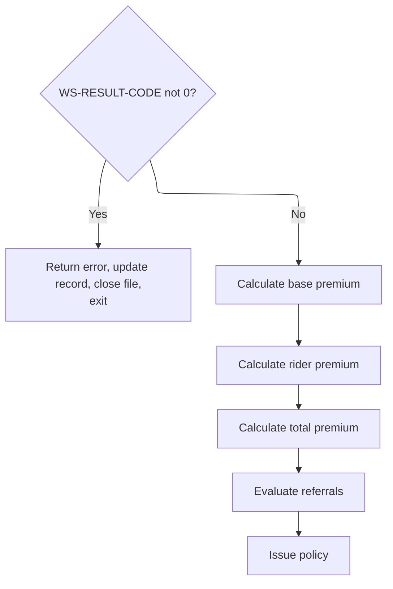

This section governs the business flow after rider validation, determining whether to return an error or proceed with premium calculations and policy issuance. It ensures that premiums are only calculated if validation passes, and that errors are handled before any further processing.

| Rule ID | Category        | Rule Name                               | Description                                                                                                                                                                                                        | Implementation Details                                                                                                                                                                         |
| ------- | --------------- | --------------------------------------- | ------------------------------------------------------------------------------------------------------------------------------------------------------------------------------------------------------------------ | ---------------------------------------------------------------------------------------------------------------------------------------------------------------------------------------------- |
| BR-001  | Calculation     | Premium calculation sequence            | If rider validation passes (result code is zero), the base premium is calculated first, followed by rider premium, then total premium. Each calculation depends on the previous step being completed successfully. | Premiums are calculated in the following order: base premium, rider premium, total premium. Each premium is a number. Calculations are sequential and dependent.                               |
| BR-002  | Decision Making | Rider validation error handling         | If rider validation returns a non-zero result code, an error is recorded, the policy record is updated, the file is closed, and processing exits. No premium calculation occurs in this context.                   | The result code is a number. The error message is a string. The policy master record is updated with the error information. No premium fields are calculated or updated if this rule triggers. |
| BR-003  | Decision Making | Referral evaluation and policy issuance | After all premium calculations, referrals are evaluated and the policy is issued. These steps only occur if all previous calculations and validations succeed.                                                     | Referral evaluation and policy issuance are performed in sequence after premium calculations. The policy master record is updated to reflect issuance.                                         |

<SwmSnippet path="/QCBLLESRC/NBUWB.cbl" line="104">

---

After returning from <SwmToken path="QCBLLESRC/NBUWB.cbl" pos="103:3:7" line-data="           PERFORM 1500-VALIDATE-RIDERS">`1500-VALIDATE-RIDERS`</SwmToken>, <SwmToken path="QCBLLESRC/NBUWB.cbl" pos="81:1:3" line-data="       MAIN-PROCESS.">`MAIN-PROCESS`</SwmToken> checks for errors. If any, it records the error, updates the policy record, closes the file, and exits. No premium calculation happens if there's a rider error.

```cobol
           IF WS-RESULT-CODE NOT = 0
               PERFORM 9000-RETURN-ERROR
               REWRITE WS-POLICY-MASTER-REC
               CLOSE POLMST
               GOBACK
           END-IF
```

---

</SwmSnippet>

<SwmSnippet path="/QCBLLESRC/NBUWB.cbl" line="110">

---

After all validations pass, <SwmToken path="QCBLLESRC/NBUWB.cbl" pos="81:1:3" line-data="       MAIN-PROCESS.">`MAIN-PROCESS`</SwmToken> calculates the base premium, then the rider premiums, then the total premium, and finally checks for referrals and issues the policy. Each step depends on the previous calculations.

```cobol
           PERFORM 1600-CALCULATE-BASE-PREMIUM
           PERFORM 1700-CALCULATE-RIDER-PREMIUM
           PERFORM 1800-CALCULATE-TOTAL-PREMIUM
           PERFORM 1900-EVALUATE-REFERRALS
           PERFORM 2000-ISSUE-POLICY
```

---

</SwmSnippet>

## Calculating Rider Premiums

```mermaid
%%{init: {"flowchart": {"defaultRenderer": "elk"}} }%%
flowchart TD
    node1["Set total rider premium to zero"]
    click node1 openCode "QCBLLESRC/NBUWB.cbl:406:406"
    subgraph loop1["For each rider slot (1 to 5)"]
        node2{"Is there a rider code?"}
        click node2 openCode "QCBLLESRC/NBUWB.cbl:409:409"
        node2 -->|"No"| node11["Next slot"]
        node2 -->|"Yes"| node3["Set rider status to Active"]
        click node3 openCode "QCBLLESRC/NBUWB.cbl:410:410"
        node3 --> node4{"Rider type?"}
        click node4 openCode "QCBLLESRC/NBUWB.cbl:412:423"
        node4 -->|ADB01| node5["Calculate: (Sum Assured / 1000) x 0.1800"]
        click node5 openCode "QCBLLESRC/NBUWB.cbl:413:415"
        node4 -->|WOP01| node6["Calculate: Base Premium x 6%"]
        click node6 openCode "QCBLLESRC/NBUWB.cbl:419:420"
        node4 -->|CI001| node7["Calculate: (Sum Assured / 1000) x 1.2500"]
        click node7 openCode "QCBLLESRC/NBUWB.cbl:424:426"
        node4 -->|"Other"| node8["No calculation"]
        click node8 openCode "QCBLLESRC/NBUWB.cbl:428:429"
        node5 --> node9["Add to total premium"]
        click node9 openCode "QCBLLESRC/NBUWB.cbl:428:429"
        node6 --> node9
        node7 --> node9
        node8 --> node9
        node9 --> node11
        node11 --> node2
    end
    node2 -->|"All slots processed"| node10["Return total rider premium"]
    click node10 openCode "QCBLLESRC/NBUWB.cbl:431:431"
classDef HeadingStyle fill:#777777,stroke:#333,stroke-width:2px;

%% Swimm:
%% %%{init: {"flowchart": {"defaultRenderer": "elk"}} }%%
%% flowchart TD
%%     node1["Set total rider premium to zero"]
%%     click node1 openCode "<SwmPath>[QCBLLESRC/NBUWB.cbl](QCBLLESRC/NBUWB.cbl)</SwmPath>:406:406"
%%     subgraph loop1["For each rider slot (1 to 5)"]
%%         node2{"Is there a rider code?"}
%%         click node2 openCode "<SwmPath>[QCBLLESRC/NBUWB.cbl](QCBLLESRC/NBUWB.cbl)</SwmPath>:409:409"
%%         node2 -->|"No"| node11["Next slot"]
%%         node2 -->|"Yes"| node3["Set rider status to Active"]
%%         click node3 openCode "<SwmPath>[QCBLLESRC/NBUWB.cbl](QCBLLESRC/NBUWB.cbl)</SwmPath>:410:410"
%%         node3 --> node4{"Rider type?"}
%%         click node4 openCode "<SwmPath>[QCBLLESRC/NBUWB.cbl](QCBLLESRC/NBUWB.cbl)</SwmPath>:412:423"
%%         node4 -->|<SwmToken path="QCBLLESRC/NBUWB.cbl" pos="359:19:19" line-data="                   IF PM-RIDER-CODE(PM-RIDER-IDX) = &#39;ADB01&#39; AND">`ADB01`</SwmToken>| node5["Calculate: (Sum Assured / 1000) x <SwmToken path="QCBLLESRC/NBUWB.cbl" pos="411:12:14" line-data="      * NB-701: ADB01 - 0.1800 PER THOUSAND">`0.1800`</SwmToken>"]
%%         click node5 openCode "<SwmPath>[QCBLLESRC/NBUWB.cbl](QCBLLESRC/NBUWB.cbl)</SwmPath>:413:415"
%%         node4 -->|<SwmToken path="QCBLLESRC/NBUWB.cbl" pos="367:19:19" line-data="                   IF PM-RIDER-CODE(PM-RIDER-IDX) = &#39;WOP01&#39; AND">`WOP01`</SwmToken>| node6["Calculate: Base Premium x 6%"]
%%         click node6 openCode "<SwmPath>[QCBLLESRC/NBUWB.cbl](QCBLLESRC/NBUWB.cbl)</SwmPath>:419:420"
%%         node4 -->|<SwmToken path="QCBLLESRC/NBUWB.cbl" pos="375:19:19" line-data="                   IF PM-RIDER-CODE(PM-RIDER-IDX) = &#39;CI001&#39; AND">`CI001`</SwmToken>| node7["Calculate: (Sum Assured / 1000) x <SwmToken path="QCBLLESRC/NBUWB.cbl" pos="338:9:11" line-data="               WHEN &#39;TB&#39; MOVE 1.2500 TO PM-UW-FACTOR">`1.2500`</SwmToken>"]
%%         click node7 openCode "<SwmPath>[QCBLLESRC/NBUWB.cbl](QCBLLESRC/NBUWB.cbl)</SwmPath>:424:426"
%%         node4 -->|"Other"| node8["No calculation"]
%%         click node8 openCode "<SwmPath>[QCBLLESRC/NBUWB.cbl](QCBLLESRC/NBUWB.cbl)</SwmPath>:428:429"
%%         node5 --> node9["Add to total premium"]
%%         click node9 openCode "<SwmPath>[QCBLLESRC/NBUWB.cbl](QCBLLESRC/NBUWB.cbl)</SwmPath>:428:429"
%%         node6 --> node9
%%         node7 --> node9
%%         node8 --> node9
%%         node9 --> node11
%%         node11 --> node2
%%     end
%%     node2 -->|"All slots processed"| node10["Return total rider premium"]
%%     click node10 openCode "<SwmPath>[QCBLLESRC/NBUWB.cbl](QCBLLESRC/NBUWB.cbl)</SwmPath>:431:431"
%% classDef HeadingStyle fill:#777777,stroke:#333,stroke-width:2px;
```

This section calculates the total annual premium for all riders on a policy by applying rider-specific formulas and summing the results.

| Rule ID | Category        | Rule Name                                                                                                                                                                       | Description                                                                                                                                                                                                                                                                                                                                                                                                                                                                                                                                                                    | Implementation Details                                                                                                                                                                                                                                                      |
| ------- | --------------- | ------------------------------------------------------------------------------------------------------------------------------------------------------------------------------- | ------------------------------------------------------------------------------------------------------------------------------------------------------------------------------------------------------------------------------------------------------------------------------------------------------------------------------------------------------------------------------------------------------------------------------------------------------------------------------------------------------------------------------------------------------------------------------ | --------------------------------------------------------------------------------------------------------------------------------------------------------------------------------------------------------------------------------------------------------------------------- |
| BR-001  | Calculation     | <SwmToken path="QCBLLESRC/NBUWB.cbl" pos="359:19:19" line-data="                   IF PM-RIDER-CODE(PM-RIDER-IDX) = &#39;ADB01&#39; AND">`ADB01`</SwmToken> premium calculation | If the rider code is <SwmToken path="QCBLLESRC/NBUWB.cbl" pos="359:19:19" line-data="                   IF PM-RIDER-CODE(PM-RIDER-IDX) = &#39;ADB01&#39; AND">`ADB01`</SwmToken>, the annual premium for that rider is calculated as (Sum Assured / 1000) multiplied by <SwmToken path="QCBLLESRC/NBUWB.cbl" pos="411:12:14" line-data="      * NB-701: ADB01 - 0.1800 PER THOUSAND">`0.1800`</SwmToken>.                                                                                                                                                                      | The formula is: (Sum Assured / 1000) x <SwmToken path="QCBLLESRC/NBUWB.cbl" pos="411:12:14" line-data="      * NB-701: ADB01 - 0.1800 PER THOUSAND">`0.1800`</SwmToken>. The result is a numeric value representing the annual premium for this rider slot.                 |
| BR-002  | Calculation     | <SwmToken path="QCBLLESRC/NBUWB.cbl" pos="367:19:19" line-data="                   IF PM-RIDER-CODE(PM-RIDER-IDX) = &#39;WOP01&#39; AND">`WOP01`</SwmToken> premium calculation | If the rider code is <SwmToken path="QCBLLESRC/NBUWB.cbl" pos="367:19:19" line-data="                   IF PM-RIDER-CODE(PM-RIDER-IDX) = &#39;WOP01&#39; AND">`WOP01`</SwmToken>, the annual premium for that rider is calculated as 6% of the base annual premium.                                                                                                                                                                                                                                                                                                            | The formula is: Base Annual Premium x <SwmToken path="QCBLLESRC/NBUWB.cbl" pos="420:11:13" line-data="                           PM-BASE-ANNUAL-PREMIUM * 0.06">`0.06`</SwmToken>. The result is a numeric value representing the annual premium for this rider slot.       |
| BR-003  | Calculation     | <SwmToken path="QCBLLESRC/NBUWB.cbl" pos="375:19:19" line-data="                   IF PM-RIDER-CODE(PM-RIDER-IDX) = &#39;CI001&#39; AND">`CI001`</SwmToken> premium calculation | If the rider code is <SwmToken path="QCBLLESRC/NBUWB.cbl" pos="375:19:19" line-data="                   IF PM-RIDER-CODE(PM-RIDER-IDX) = &#39;CI001&#39; AND">`CI001`</SwmToken>, the annual premium for that rider is calculated as (Sum Assured / 1000) multiplied by <SwmToken path="QCBLLESRC/NBUWB.cbl" pos="338:9:11" line-data="               WHEN &#39;TB&#39; MOVE 1.2500 TO PM-UW-FACTOR">`1.2500`</SwmToken>.                                                                                                                                                      | The formula is: (Sum Assured / 1000) x <SwmToken path="QCBLLESRC/NBUWB.cbl" pos="338:9:11" line-data="               WHEN &#39;TB&#39; MOVE 1.2500 TO PM-UW-FACTOR">`1.2500`</SwmToken>. The result is a numeric value representing the annual premium for this rider slot. |
| BR-004  | Calculation     | Total rider premium accumulation                                                                                                                                                | The annual premium for each processed rider slot is added to the total annual rider premium, which is returned after all slots are processed.                                                                                                                                                                                                                                                                                                                                                                                                                                  | The total is a numeric value representing the sum of all calculated rider premiums across up to five slots.                                                                                                                                                                 |
| BR-005  | Decision Making | Rider slot activation                                                                                                                                                           | If a rider slot contains a non-empty rider code, the system sets the rider status to Active and processes the premium calculation for that slot.                                                                                                                                                                                                                                                                                                                                                                                                                               | Rider status is set to 'A' (Active) for each processed slot. Only non-empty codes are processed; empty slots are skipped.                                                                                                                                                   |
| BR-006  | Decision Making | Other rider code handling                                                                                                                                                       | If the rider code is not recognized as <SwmToken path="QCBLLESRC/NBUWB.cbl" pos="359:19:19" line-data="                   IF PM-RIDER-CODE(PM-RIDER-IDX) = &#39;ADB01&#39; AND">`ADB01`</SwmToken>, <SwmToken path="QCBLLESRC/NBUWB.cbl" pos="367:19:19" line-data="                   IF PM-RIDER-CODE(PM-RIDER-IDX) = &#39;WOP01&#39; AND">`WOP01`</SwmToken>, or <SwmToken path="QCBLLESRC/NBUWB.cbl" pos="375:19:19" line-data="                   IF PM-RIDER-CODE(PM-RIDER-IDX) = &#39;CI001&#39; AND">`CI001`</SwmToken>, no premium is calculated for that rider slot. | No calculation is performed for unrecognized rider codes. The annual premium for this slot remains unchanged (typically zero).                                                                                                                                              |

<SwmSnippet path="/QCBLLESRC/NBUWB.cbl" line="405">

---

In <SwmToken path="QCBLLESRC/NBUWB.cbl" pos="405:1:7" line-data="       1700-CALCULATE-RIDER-PREMIUM.">`1700-CALCULATE-RIDER-PREMIUM`</SwmToken>, the function loops through up to 5 rider slots. For each non-empty rider code, it calculates the premium using a formula specific to the rider type and adds it to the total.

```cobol
       1700-CALCULATE-RIDER-PREMIUM.
           MOVE ZEROS TO PM-RIDER-ANNUAL-TOTAL
           PERFORM VARYING PM-RIDER-IDX FROM 1 BY 1
               UNTIL PM-RIDER-IDX > 5
               IF PM-RIDER-CODE(PM-RIDER-IDX) NOT = SPACES
                   MOVE 'A' TO PM-RIDER-STATUS(PM-RIDER-IDX)
      * NB-701: ADB01 - 0.1800 PER THOUSAND
                   IF PM-RIDER-CODE(PM-RIDER-IDX) = 'ADB01'
                       COMPUTE PM-RIDER-ANNUAL-PREM(PM-RIDER-IDX) =
                           (PM-RIDER-SUM-ASSURED(PM-RIDER-IDX)
                           / 1000) * 0.1800
                   END-IF
```

---

</SwmSnippet>

<SwmSnippet path="/QCBLLESRC/NBUWB.cbl" line="418">

---

Here, the function checks if the rider code is <SwmToken path="QCBLLESRC/NBUWB.cbl" pos="418:19:19" line-data="                   IF PM-RIDER-CODE(PM-RIDER-IDX) = &#39;WOP01&#39;">`WOP01`</SwmToken> and calculates its premium as 6% of the base annual premium. This follows the previous logic for other rider codes and leads into the next snippet, which handles <SwmToken path="QCBLLESRC/NBUWB.cbl" pos="375:19:19" line-data="                   IF PM-RIDER-CODE(PM-RIDER-IDX) = &#39;CI001&#39; AND">`CI001`</SwmToken>. Each rider code uses its own formula, and the results are accumulated for the total rider premium.

```cobol
                   IF PM-RIDER-CODE(PM-RIDER-IDX) = 'WOP01'
                       COMPUTE PM-RIDER-ANNUAL-PREM(PM-RIDER-IDX) =
                           PM-BASE-ANNUAL-PREMIUM * 0.06
                   END-IF
```

---

</SwmSnippet>

<SwmSnippet path="/QCBLLESRC/NBUWB.cbl" line="423">

---

Next, the function checks for the <SwmToken path="QCBLLESRC/NBUWB.cbl" pos="423:19:19" line-data="                   IF PM-RIDER-CODE(PM-RIDER-IDX) = &#39;CI001&#39;">`CI001`</SwmToken> rider and calculates its premium using a formula based on the sum assured and a fixed multiplier (<SwmToken path="QCBLLESRC/NBUWB.cbl" pos="426:8:10" line-data="                           / 1000) * 1.2500">`1.2500`</SwmToken>). This continues the pattern of domain-specific formulas for each rider code, and wraps up the rider-specific premium calculations before totaling them.

```cobol
                   IF PM-RIDER-CODE(PM-RIDER-IDX) = 'CI001'
                       COMPUTE PM-RIDER-ANNUAL-PREM(PM-RIDER-IDX) =
                           (PM-RIDER-SUM-ASSURED(PM-RIDER-IDX)
                           / 1000) * 1.2500
                   END-IF
```

---

</SwmSnippet>

<SwmSnippet path="/QCBLLESRC/NBUWB.cbl" line="428">

---

Finally, the function adds each calculated rider premium to the total annual rider premium, looping through up to 5 rider slots. Only non-empty rider codes are processed, and the total is returned for use in the next premium calculation step.

```cobol
                   ADD PM-RIDER-ANNUAL-PREM(PM-RIDER-IDX)
                       TO PM-RIDER-ANNUAL-TOTAL
               END-IF
           END-PERFORM.
```

---

</SwmSnippet>

## Calculating the Final Policy Premium

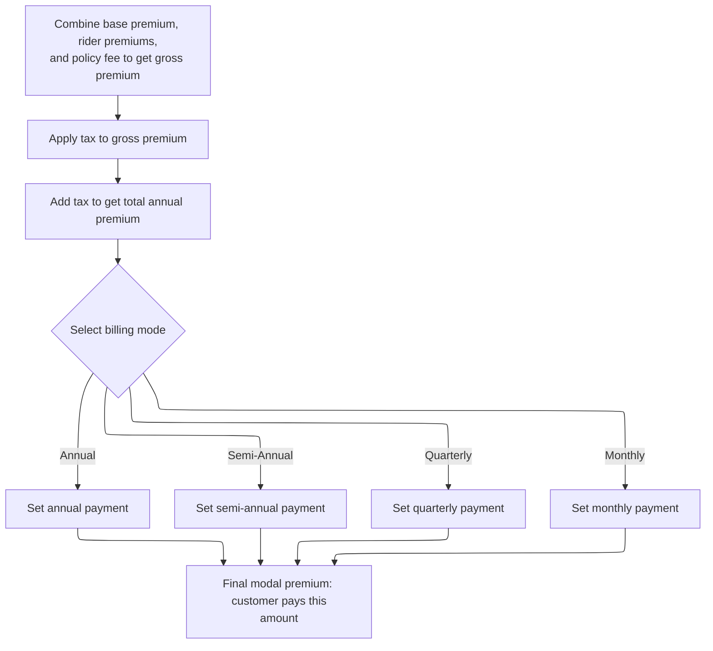

This section calculates the final policy premium, including all fees and taxes, and determines the installment amount based on the selected billing mode.

| Rule ID | Category        | Rule Name                        | Description                                                                                                                                                                                                                                                                                                                                                                                                                                                                                                                                                                                                                                                                                                   | Implementation Details                                                                                                                                                                                                                                                                                                                                                                                                                                                                                                                                                                                                          |
| ------- | --------------- | -------------------------------- | ------------------------------------------------------------------------------------------------------------------------------------------------------------------------------------------------------------------------------------------------------------------------------------------------------------------------------------------------------------------------------------------------------------------------------------------------------------------------------------------------------------------------------------------------------------------------------------------------------------------------------------------------------------------------------------------------------------- | ------------------------------------------------------------------------------------------------------------------------------------------------------------------------------------------------------------------------------------------------------------------------------------------------------------------------------------------------------------------------------------------------------------------------------------------------------------------------------------------------------------------------------------------------------------------------------------------------------------------------------- |
| BR-001  | Calculation     | Gross annual premium calculation | Sum the base premium, all rider premiums, and the policy fee to determine the gross annual premium.                                                                                                                                                                                                                                                                                                                                                                                                                                                                                                                                                                                                           | The gross annual premium is a number. All components are summed without rounding or truncation at this step.                                                                                                                                                                                                                                                                                                                                                                                                                                                                                                                    |
| BR-002  | Calculation     | Tax calculation                  | Apply the tax rate to the gross annual premium to determine the tax amount.                                                                                                                                                                                                                                                                                                                                                                                                                                                                                                                                                                                                                                   | The tax amount is a number. The tax rate is a decimal (e.g., <SwmToken path="QCBLLESRC/NBUWB.cbl" pos="159:3:5" line-data="                   MOVE 0.0200 TO PM-TAX-RATE">`0.0200`</SwmToken>).                                                                                                                                                                                                                                                                                                                                                                                                                                 |
| BR-003  | Calculation     | Total annual premium calculation | Add the tax amount to the gross annual premium to determine the total annual premium.                                                                                                                                                                                                                                                                                                                                                                                                                                                                                                                                                                                                                         | The total annual premium is a number. It is the sum of the gross annual premium and the tax amount.                                                                                                                                                                                                                                                                                                                                                                                                                                                                                                                             |
| BR-004  | Calculation     | Final modal premium calculation  | Calculate the final modal premium by dividing the total annual premium by the modal divisor and multiplying by the modal factor. This is the installment amount the customer pays.                                                                                                                                                                                                                                                                                                                                                                                                                                                                                                                            | The final modal premium is a number. It is calculated as (total annual premium / modal divisor) \* modal factor. No rounding or truncation is specified in the code.                                                                                                                                                                                                                                                                                                                                                                                                                                                            |
| BR-005  | Decision Making | Billing mode modal constants     | Set the modal divisor and modal factor based on the selected billing mode: 1 and <SwmToken path="QCBLLESRC/NBUWB.cbl" pos="319:3:5" line-data="               MOVE 1.0000 TO PM-GENDER-FACTOR">`1.0000`</SwmToken> for annual, 2 and <SwmToken path="QCBLLESRC/NBUWB.cbl" pos="454:3:5" line-data="                   MOVE 1.0150 TO WS-MODAL-FACTOR">`1.0150`</SwmToken> for semi-annual, 4 and <SwmToken path="QCBLLESRC/NBUWB.cbl" pos="457:3:5" line-data="                   MOVE 1.0300 TO WS-MODAL-FACTOR">`1.0300`</SwmToken> for quarterly, 12 and <SwmToken path="QCBLLESRC/NBUWB.cbl" pos="460:3:5" line-data="                   MOVE 1.0800 TO WS-MODAL-FACTOR">`1.0800`</SwmToken> for monthly. | Modal divisor is a number (1, 2, 4, or 12). Modal factor is a decimal (<SwmToken path="QCBLLESRC/NBUWB.cbl" pos="319:3:5" line-data="               MOVE 1.0000 TO PM-GENDER-FACTOR">`1.0000`</SwmToken>, <SwmToken path="QCBLLESRC/NBUWB.cbl" pos="454:3:5" line-data="                   MOVE 1.0150 TO WS-MODAL-FACTOR">`1.0150`</SwmToken>, <SwmToken path="QCBLLESRC/NBUWB.cbl" pos="457:3:5" line-data="                   MOVE 1.0300 TO WS-MODAL-FACTOR">`1.0300`</SwmToken>, or <SwmToken path="QCBLLESRC/NBUWB.cbl" pos="460:3:5" line-data="                   MOVE 1.0800 TO WS-MODAL-FACTOR">`1.0800`</SwmToken>). |

<SwmSnippet path="/QCBLLESRC/NBUWB.cbl" line="436">

---

In <SwmToken path="QCBLLESRC/NBUWB.cbl" pos="436:1:7" line-data="       1800-CALCULATE-TOTAL-PREMIUM.">`1800-CALCULATE-TOTAL-PREMIUM`</SwmToken>, the function starts by summing the base premium, rider premiums, and policy fee to get the gross annual premium. It then calculates the tax and adds it to get the total annual premium, setting up for modal premium calculation based on billing mode.

```cobol
       1800-CALCULATE-TOTAL-PREMIUM.
      * NB-801: GROSS = BASE + RIDERS + POLICY FEE
           COMPUTE PM-GROSS-ANNUAL-PREMIUM =
               PM-BASE-ANNUAL-PREMIUM +
               PM-RIDER-ANNUAL-TOTAL +
               PM-ANNUAL-POLICY-FEE
      * TAX
           COMPUTE PM-TAX-AMOUNT =
               PM-GROSS-ANNUAL-PREMIUM * PM-TAX-RATE
           COMPUTE PM-TOTAL-ANNUAL-PREMIUM =
               PM-GROSS-ANNUAL-PREMIUM + PM-TAX-AMOUNT
```

---

</SwmSnippet>

<SwmSnippet path="/QCBLLESRC/NBUWB.cbl" line="448">

---

Next, the function sets modal divisor and factor constants based on billing mode using an EVALUATE statement. These values are hardcoded for each mode and directly affect how the total premium is split into installments. The calculation depends on these constants being set correctly.

```cobol
           EVALUATE PM-BILLING-MODE
               WHEN 'A'
                   MOVE 1 TO WS-MODAL-DIVISOR
                   MOVE 1.0000 TO WS-MODAL-FACTOR
               WHEN 'S'
                   MOVE 2 TO WS-MODAL-DIVISOR
                   MOVE 1.0150 TO WS-MODAL-FACTOR
               WHEN 'Q'
                   MOVE 4 TO WS-MODAL-DIVISOR
                   MOVE 1.0300 TO WS-MODAL-FACTOR
               WHEN 'M'
                   MOVE 12 TO WS-MODAL-DIVISOR
                   MOVE 1.0800 TO WS-MODAL-FACTOR
           END-EVALUATE
```

---

</SwmSnippet>

<SwmSnippet path="/QCBLLESRC/NBUWB.cbl" line="462">

---

Finally, the function calculates the modal premium by dividing the total annual premium by the modal divisor and multiplying by the modal factor. This gives the installment amount for the selected billing mode, wrapping up the premium calculation.

```cobol
           COMPUTE PM-MODAL-PREMIUM =
               (PM-TOTAL-ANNUAL-PREMIUM / WS-MODAL-DIVISOR)
               * WS-MODAL-FACTOR.
```

---

</SwmSnippet>

## Checking for Referral Triggers

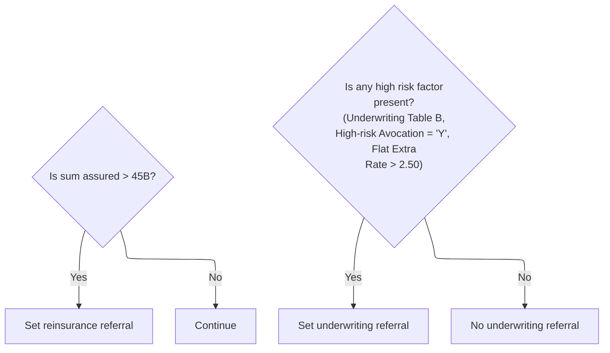

This section determines if a policy should be flagged for reinsurance or underwriting referral based on sum assured and high-risk factors. It applies business rules to identify policies that require further review.

| Rule ID | Category        | Rule Name                                          | Description                                                                                                                                                                                                                                                                                                        | Implementation Details                                                                                                                                                                                                                                                                                                                                                                                                                                                                                                   |
| ------- | --------------- | -------------------------------------------------- | ------------------------------------------------------------------------------------------------------------------------------------------------------------------------------------------------------------------------------------------------------------------------------------------------------------------ | ------------------------------------------------------------------------------------------------------------------------------------------------------------------------------------------------------------------------------------------------------------------------------------------------------------------------------------------------------------------------------------------------------------------------------------------------------------------------------------------------------------------------ |
| BR-001  | Decision Making | Reinsurance referral threshold                     | If the sum assured for a policy exceeds 45,000,000,000,000, the policy is flagged for reinsurance referral.                                                                                                                                                                                                        | The threshold for triggering reinsurance referral is 45,000,000,000,000. The output is a referral flag set to 'Y' (yes) when the condition is met. The flag is a single-character string.                                                                                                                                                                                                                                                                                                                                |
| BR-002  | Decision Making | Underwriting referral high-risk factors            | If any high-risk factor is present (underwriting class is Table B, high-risk avocation is 'Y', or flat extra rate is greater than <SwmToken path="QCBLLESRC/NBUWB.cbl" pos="477:11:13" line-data="              PM-FLAT-EXTRA-RATE &gt; 2.50">`2.50`</SwmToken>), the policy is flagged for underwriting referral. | High-risk factors include: underwriting class Table B (<SwmToken path="QCBLLESRC/NBUWB.cbl" pos="266:9:13" line-data="               MOVE &#39;DP&#39; TO PM-UW-CLASS">`PM-UW-CLASS`</SwmToken> = 'TB'), high-risk avocation indicator 'Y', flat extra rate greater than <SwmToken path="QCBLLESRC/NBUWB.cbl" pos="477:11:13" line-data="              PM-FLAT-EXTRA-RATE &gt; 2.50">`2.50`</SwmToken>. The output is a referral flag set to 'Y' (yes) when any condition is met. The flag is a single-character string. |
| BR-003  | Decision Making | No underwriting referral when no high-risk factors | If none of the high-risk factors are present, the policy is not flagged for underwriting referral.                                                                                                                                                                                                                 | If all high-risk conditions are false, the underwriting referral flag remains unset ('N'). The flag is a single-character string.                                                                                                                                                                                                                                                                                                                                                                                        |

<SwmSnippet path="/QCBLLESRC/NBUWB.cbl" line="469">

---

In <SwmToken path="QCBLLESRC/NBUWB.cbl" pos="469:1:5" line-data="       1900-EVALUATE-REFERRALS.">`1900-EVALUATE-REFERRALS`</SwmToken>, the function checks if the sum assured exceeds 45 billion. If so, it flags the policy for reinsurance referral. This is a hardcoded threshold and is used to trigger additional review for high-value policies.

```cobol
       1900-EVALUATE-REFERRALS.
      * NB-901: REINSURANCE - SA OVER 45B
           IF PM-SUM-ASSURED > 45000000000000
               MOVE 'Y' TO WS-REINSURANCE-REFERRAL
           END-IF
```

---

</SwmSnippet>

<SwmSnippet path="/QCBLLESRC/NBUWB.cbl" line="475">

---

This snippet flags policies for manual underwriting referral if any risk triggers are present.

```cobol
           IF PM-UW-TABLE-B OR
              PM-HIGH-RISK-AVOCATION = 'Y' OR
              PM-FLAT-EXTRA-RATE > 2.50
               MOVE 'Y' TO WS-UW-REFERRAL
           END-IF.
```

---

</SwmSnippet>

## Finalizing and Issuing the Policy

<SwmSnippet path="/QCBLLESRC/NBUWB.cbl" line="115">

---

After checking for referrals, <SwmToken path="QCBLLESRC/NBUWB.cbl" pos="81:1:3" line-data="       MAIN-PROCESS.">`MAIN-PROCESS`</SwmToken> updates the policy record, closes the file, and exits. Referral flags decide if the policy is issued or sent for review.

```cobol
           REWRITE WS-POLICY-MASTER-REC
           CLOSE POLMST
           GOBACK.
```

---

</SwmSnippet>

&nbsp;

*This is an auto-generated document by Swimm 🌊 and has not yet been verified by a human*

<SwmMeta version="3.0.0" repo-id="Z2l0aHViJTNBJTNBTElGRTQwMCUzQSUzQW11ZGFzaW4x" repo-name="LIFE400"><sup>Powered by [Swimm](https://app.swimm.io/)</sup></SwmMeta>
