# Overview

This document explains the flow for maintaining and issuing new life insurance policies. Users interactively enter policy and applicant information, review benefit and rider details, and trigger policy issuance. The flow ensures all business rules, eligibility checks, and premium calculations are completed before the policy record is saved or updated.

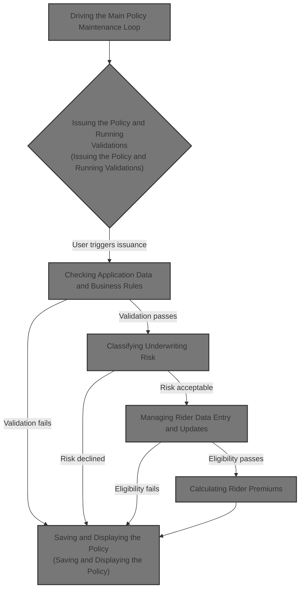

## Dependencies

### Program

- NBUWMNT (<SwmPath>[QCBLLESRC/NBUWMNT.cbl](QCBLLESRC/NBUWMNT.cbl)</SwmPath>)

### Copybook

- POLDATA (<SwmPath>[QCPYSRC/POLDATA.cpy](QCPYSRC/POLDATA.cpy)</SwmPath>)

# Where is this program used?

This program is used once, as represented in the following diagram:

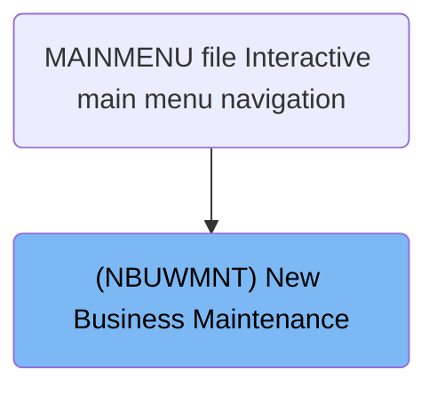

## Input and Output Tables/Files used

### NBUWMNT (<SwmPath>[QCBLLESRC/NBUWMNT.cbl](QCBLLESRC/NBUWMNT.cbl)</SwmPath>)

| Table / File Name                                                                                                                                       | Type | Description                                                | Usage Mode   | Key Fields / Layout Highlights |
| ------------------------------------------------------------------------------------------------------------------------------------------------------- | ---- | ---------------------------------------------------------- | ------------ | ------------------------------ |
| <SwmToken path="QCBLLESRC/NBUWMNT.cbl" pos="142:3:7" line-data="           WRITE NB-DSP-RECORD FORMAT IS &#39;NBRIDERS&#39;">`NB-DSP-RECORD`</SwmToken> | File | 80-char screen buffer for new business maintenance screens | Output       | File resource                  |
| NBUWDSPF                                                                                                                                                | File | Workstation screen flow records for new business entry     | Input/Output | File resource                  |
| POLMST                                                                                                                                                  | File | Indexed master file of life insurance policy records       | Input/Output | File resource                  |
| <SwmToken path="QCBLLESRC/NBUWMNT.cbl" pos="200:3:9" line-data="                   WRITE WS-POLICY-MASTER-REC">`WS-POLICY-MASTER-REC`</SwmToken>        | File | In-memory policy master record for updates and writes      | Output       | File resource                  |

# Workflow

# Driving the Main Policy Maintenance Loop

```mermaid
%%{init: {"flowchart": {"defaultRenderer": "elk"}} }%%
flowchart TD
    node1["Open policy files"]
    click node1 openCode "QCBLLESRC/NBUWMNT.cbl:67:68"
    node1 --> loop1start
    subgraph loop1["Repeat until user chooses to exit"]
        loop1start --> node3["Display policy header"]
        click node3 openCode "QCBLLESRC/NBUWMNT.cbl:70:70"
        node3 --> node4{"Exit? (*IN03 or *IN12 = '1')"}
        click node4 openCode "QCBLLESRC/NBUWMNT.cbl:71:72"
        node4 -->|"Yes"| node10["Close files and end"]
        node4 -->|"No"| node5["Display insured details"]
        click node5 openCode "QCBLLESRC/NBUWMNT.cbl:74:74"
        node5 --> node6{"Exit? (*IN03 or *IN12 = '1')"}
        click node6 openCode "QCBLLESRC/NBUWMNT.cbl:75:76"
        node6 -->|"Yes"| node10
        node6 -->|"No"| node7["Display benefit details"]
        click node7 openCode "QCBLLESRC/NBUWMNT.cbl:78:78"
        node7 --> node8{"Exit? (*IN03 or *IN12 = '1')"}
        click node8 openCode "QCBLLESRC/NBUWMNT.cbl:79:80"
        node8 -->|"Yes"| node10
        node8 -->|"No"| node9["Display riders"]
        click node9 openCode "QCBLLESRC/NBUWMNT.cbl:82:82"
        node9 --> node11{"Issue policy? (*IN06 = '1')"}
        click node11 openCode "QCBLLESRC/NBUWMNT.cbl:83:84"
        node11 -->|"Yes"| node12["Issue policy"]
        click node12 openCode "QCBLLESRC/NBUWMNT.cbl:84:84"
        node11 -->|"No"| loop1start
        node12 --> loop1start
    end
    node10["Close files and end"]
    click node10 openCode "QCBLLESRC/NBUWMNT.cbl:90:91"
classDef HeadingStyle fill:#777777,stroke:#333,stroke-width:2px;

%% Swimm:
%% %%{init: {"flowchart": {"defaultRenderer": "elk"}} }%%
%% flowchart TD
%%     node1["Open policy files"]
%%     click node1 openCode "<SwmPath>[QCBLLESRC/NBUWMNT.cbl](QCBLLESRC/NBUWMNT.cbl)</SwmPath>:67:68"
%%     node1 --> loop1start
%%     subgraph loop1["Repeat until user chooses to exit"]
%%         loop1start --> node3["Display policy header"]
%%         click node3 openCode "<SwmPath>[QCBLLESRC/NBUWMNT.cbl](QCBLLESRC/NBUWMNT.cbl)</SwmPath>:70:70"
%%         node3 --> node4{"Exit? (*<SwmToken path="QCBLLESRC/NBUWMNT.cbl" pos="71:4:4" line-data="               IF *IN03 = &#39;1&#39; OR *IN12 = &#39;1&#39;">`IN03`</SwmToken> or *<SwmToken path="QCBLLESRC/NBUWMNT.cbl" pos="71:15:15" line-data="               IF *IN03 = &#39;1&#39; OR *IN12 = &#39;1&#39;">`IN12`</SwmToken> = '1')"}
%%         click node4 openCode "<SwmPath>[QCBLLESRC/NBUWMNT.cbl](QCBLLESRC/NBUWMNT.cbl)</SwmPath>:71:72"
%%         node4 -->|"Yes"| node10["Close files and end"]
%%         node4 -->|"No"| node5["Display insured details"]
%%         click node5 openCode "<SwmPath>[QCBLLESRC/NBUWMNT.cbl](QCBLLESRC/NBUWMNT.cbl)</SwmPath>:74:74"
%%         node5 --> node6{"Exit? (*<SwmToken path="QCBLLESRC/NBUWMNT.cbl" pos="71:4:4" line-data="               IF *IN03 = &#39;1&#39; OR *IN12 = &#39;1&#39;">`IN03`</SwmToken> or *<SwmToken path="QCBLLESRC/NBUWMNT.cbl" pos="71:15:15" line-data="               IF *IN03 = &#39;1&#39; OR *IN12 = &#39;1&#39;">`IN12`</SwmToken> = '1')"}
%%         click node6 openCode "<SwmPath>[QCBLLESRC/NBUWMNT.cbl](QCBLLESRC/NBUWMNT.cbl)</SwmPath>:75:76"
%%         node6 -->|"Yes"| node10
%%         node6 -->|"No"| node7["Display benefit details"]
%%         click node7 openCode "<SwmPath>[QCBLLESRC/NBUWMNT.cbl](QCBLLESRC/NBUWMNT.cbl)</SwmPath>:78:78"
%%         node7 --> node8{"Exit? (*<SwmToken path="QCBLLESRC/NBUWMNT.cbl" pos="71:4:4" line-data="               IF *IN03 = &#39;1&#39; OR *IN12 = &#39;1&#39;">`IN03`</SwmToken> or *<SwmToken path="QCBLLESRC/NBUWMNT.cbl" pos="71:15:15" line-data="               IF *IN03 = &#39;1&#39; OR *IN12 = &#39;1&#39;">`IN12`</SwmToken> = '1')"}
%%         click node8 openCode "<SwmPath>[QCBLLESRC/NBUWMNT.cbl](QCBLLESRC/NBUWMNT.cbl)</SwmPath>:79:80"
%%         node8 -->|"Yes"| node10
%%         node8 -->|"No"| node9["Display riders"]
%%         click node9 openCode "<SwmPath>[QCBLLESRC/NBUWMNT.cbl](QCBLLESRC/NBUWMNT.cbl)</SwmPath>:82:82"
%%         node9 --> node11{"Issue policy? (*<SwmToken path="QCBLLESRC/NBUWMNT.cbl" pos="83:4:4" line-data="                           IF *IN06 = &#39;1&#39;">`IN06`</SwmToken> = '1')"}
%%         click node11 openCode "<SwmPath>[QCBLLESRC/NBUWMNT.cbl](QCBLLESRC/NBUWMNT.cbl)</SwmPath>:83:84"
%%         node11 -->|"Yes"| node12["Issue policy"]
%%         click node12 openCode "<SwmPath>[QCBLLESRC/NBUWMNT.cbl](QCBLLESRC/NBUWMNT.cbl)</SwmPath>:84:84"
%%         node11 -->|"No"| loop1start
%%         node12 --> loop1start
%%     end
%%     node10["Close files and end"]
%%     click node10 openCode "<SwmPath>[QCBLLESRC/NBUWMNT.cbl](QCBLLESRC/NBUWMNT.cbl)</SwmPath>:90:91"
%% classDef HeadingStyle fill:#777777,stroke:#333,stroke-width:2px;
```

This section manages the main policy maintenance loop, presenting policy information and responding to user actions to update, issue, or exit policy records.

| Rule ID | Category        | Rule Name                 | Description                                                                                                                                                                                                                                                                                                                                                                                                                                    | Implementation Details                                                                                                                                                                                                                             |
| ------- | --------------- | ------------------------- | ---------------------------------------------------------------------------------------------------------------------------------------------------------------------------------------------------------------------------------------------------------------------------------------------------------------------------------------------------------------------------------------------------------------------------------------------- | -------------------------------------------------------------------------------------------------------------------------------------------------------------------------------------------------------------------------------------------------- |
| BR-001  | Reading Input   | Policy file access        | Policy files are opened for input/output at the start of the session and closed when the loop ends.                                                                                                                                                                                                                                                                                                                                            | Files NBUWDSPF and POLMST are opened for input/output at session start and closed at session end. No explicit output format is defined for file access.                                                                                            |
| BR-002  | Decision Making | User-driven exit          | The policy maintenance loop continues to display and update policy information until the user signals an exit by setting either \*<SwmToken path="QCBLLESRC/NBUWMNT.cbl" pos="71:4:4" line-data="               IF *IN03 = &#39;1&#39; OR *IN12 = &#39;1&#39;">`IN03`</SwmToken> or \*<SwmToken path="QCBLLESRC/NBUWMNT.cbl" pos="71:15:15" line-data="               IF *IN03 = &#39;1&#39; OR *IN12 = &#39;1&#39;">`IN12`</SwmToken> to '1'. | Exit is triggered when either indicator is set to '1'. No specific output format is defined for exit; the loop simply terminates and files are closed.                                                                                             |
| BR-003  | Decision Making | Sequential policy display | Policy information is displayed in a sequence: header, insured details, benefit details, and riders, unless the user exits at any step.                                                                                                                                                                                                                                                                                                        | Information is presented in the order: header, insured, benefit, riders. No explicit output format is defined in this section.                                                                                                                     |
| BR-004  | Decision Making | Policy issuance trigger   | Policy issuance is triggered when the user sets \*<SwmToken path="QCBLLESRC/NBUWMNT.cbl" pos="83:4:4" line-data="                           IF *IN06 = &#39;1&#39;">`IN06`</SwmToken> to '1' after reviewing riders.                                                                                                                                                                                                                           | Issuance is triggered by indicator \*<SwmToken path="QCBLLESRC/NBUWMNT.cbl" pos="83:4:4" line-data="                           IF *IN06 = &#39;1&#39;">`IN06`</SwmToken> = '1'. No explicit output format for issuance is defined in this section. |

<SwmSnippet path="/QCBLLESRC/NBUWMNT.cbl" line="66">

---

In <SwmToken path="QCBLLESRC/NBUWMNT.cbl" pos="66:1:3" line-data="       MAIN-PROCESS.">`MAIN-PROCESS`</SwmToken>, we open the display/session file (NBUWDSPF) and the policy master file (POLMST) for input/output. This sets up access to both the user session data and the main policy records, which are needed for the rest of the flow.

```cobol
       MAIN-PROCESS.
           OPEN I-O NBUWDSPF
           OPEN I-O POLMST
```

---

</SwmSnippet>

<SwmSnippet path="/QCBLLESRC/NBUWMNT.cbl" line="69">

---

After opening the files, we enter a loop that keeps running until <SwmToken path="QCBLLESRC/NBUWMNT.cbl" pos="69:5:7" line-data="           PERFORM UNTIL WS-CONTINUE = &#39;N&#39;">`WS-CONTINUE`</SwmToken> is set to 'N'. Each iteration starts by calling <SwmToken path="QCBLLESRC/NBUWMNT.cbl" pos="70:3:7" line-data="               PERFORM 1000-DISPLAY-HEADER">`1000-DISPLAY-HEADER`</SwmToken> to show the main policy header and collect user input.

```cobol
           PERFORM UNTIL WS-CONTINUE = 'N'
               PERFORM 1000-DISPLAY-HEADER
```

---

</SwmSnippet>

<SwmSnippet path="/QCBLLESRC/NBUWMNT.cbl" line="71">

---

After displaying the header, we check if the user triggered an exit (via \*<SwmToken path="QCBLLESRC/NBUWMNT.cbl" pos="71:4:4" line-data="               IF *IN03 = &#39;1&#39; OR *IN12 = &#39;1&#39;">`IN03`</SwmToken> or \*<SwmToken path="QCBLLESRC/NBUWMNT.cbl" pos="71:15:15" line-data="               IF *IN03 = &#39;1&#39; OR *IN12 = &#39;1&#39;">`IN12`</SwmToken>). If so, we set <SwmToken path="QCBLLESRC/NBUWMNT.cbl" pos="72:9:11" line-data="                   MOVE &#39;N&#39; TO WS-CONTINUE">`WS-CONTINUE`</SwmToken> to 'N' to break out of the loop.

```cobol
               IF *IN03 = '1' OR *IN12 = '1'
                   MOVE 'N' TO WS-CONTINUE
```

---

</SwmSnippet>

<SwmSnippet path="/QCBLLESRC/NBUWMNT.cbl" line="73">

---

If the user doesn't exit after the header, we call <SwmToken path="QCBLLESRC/NBUWMNT.cbl" pos="74:3:7" line-data="                   PERFORM 2000-DISPLAY-INSURED">`2000-DISPLAY-INSURED`</SwmToken> to update the insured's details in the policy record.

```cobol
               ELSE
                   PERFORM 2000-DISPLAY-INSURED
```

---

</SwmSnippet>

<SwmSnippet path="/QCBLLESRC/NBUWMNT.cbl" line="75">

---

After updating the insured info, we check again if the user wants to exit (via \*<SwmToken path="QCBLLESRC/NBUWMNT.cbl" pos="75:4:4" line-data="                   IF *IN03 = &#39;1&#39; OR *IN12 = &#39;1&#39;">`IN03`</SwmToken> or \*<SwmToken path="QCBLLESRC/NBUWMNT.cbl" pos="75:15:15" line-data="                   IF *IN03 = &#39;1&#39; OR *IN12 = &#39;1&#39;">`IN12`</SwmToken>). If so, we set <SwmToken path="QCBLLESRC/NBUWMNT.cbl" pos="76:9:11" line-data="                       MOVE &#39;N&#39; TO WS-CONTINUE">`WS-CONTINUE`</SwmToken> to 'N' and break the loop.

```cobol
                   IF *IN03 = '1' OR *IN12 = '1'
                       MOVE 'N' TO WS-CONTINUE
```

---

</SwmSnippet>

<SwmSnippet path="/QCBLLESRC/NBUWMNT.cbl" line="77">

---

After handling benefits, we call <SwmToken path="QCBLLESRC/NBUWMNT.cbl" pos="82:3:7" line-data="                           PERFORM 4000-DISPLAY-RIDERS">`4000-DISPLAY-RIDERS`</SwmToken> to let the user add or update insurance riders. If the user triggers \*<SwmToken path="QCBLLESRC/NBUWMNT.cbl" pos="83:4:4" line-data="                           IF *IN06 = &#39;1&#39;">`IN06`</SwmToken>, we move on to issuing the policy. The flow ends by closing the files and returning.

```cobol
                   ELSE
                       PERFORM 3000-DISPLAY-BENEFIT
                       IF *IN03 = '1' OR *IN12 = '1'
                           MOVE 'N' TO WS-CONTINUE
                       ELSE
                           PERFORM 4000-DISPLAY-RIDERS
                           IF *IN06 = '1'
                               PERFORM 5000-ISSUE-POLICY
                           END-IF
                       END-IF
                   END-IF
               END-IF
           END-PERFORM
           CLOSE NBUWDSPF POLMST
           GOBACK.
```

---

</SwmSnippet>

# Managing Rider Data Entry and Updates

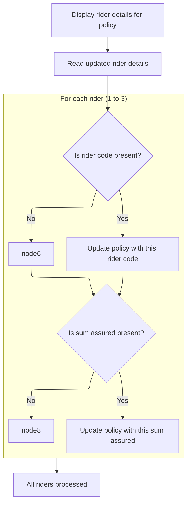

This section allows users to view and update rider details for a policy. It processes user input for up to three riders and updates the policy master record accordingly.

| Rule ID | Category        | Rule Name                | Description                                                                                                         | Implementation Details                                                                                              |
| ------- | --------------- | ------------------------ | ------------------------------------------------------------------------------------------------------------------- | ------------------------------------------------------------------------------------------------------------------- |
| BR-001  | Reading Input   | Display rider codes      | Display the current rider codes for all three rider slots to the user before accepting updates.                     | There are three rider slots. Rider codes are displayed as strings. The display/session record format is 'NBRIDERS'. |
| BR-002  | Decision Making | Update rider code        | Update the policy master record with a new rider code if the user enters a non-blank value for a rider slot.        | There are three rider slots. Rider codes are strings. 'SPACES' indicates a blank value.                             |
| BR-003  | Decision Making | Update rider sum assured | Update the policy master record with a new sum assured value if the user enters a non-blank value for a rider slot. | There are three rider slots. Sum assured values are numbers. 'SPACES' indicates a blank value.                      |

<SwmSnippet path="/QCBLLESRC/NBUWMNT.cbl" line="138">

---

In <SwmToken path="QCBLLESRC/NBUWMNT.cbl" pos="138:1:5" line-data="       4000-DISPLAY-RIDERS.">`4000-DISPLAY-RIDERS`</SwmToken>, we copy the current rider codes to temporary fields, write them to the display/session record, read back user updates, and then update the main policy arrays if the user entered new values.

```cobol
       4000-DISPLAY-RIDERS.
           MOVE PM-RIDER-CODE(1) TO NBRID1CD
           MOVE PM-RIDER-CODE(2) TO NBRID2CD
           MOVE PM-RIDER-CODE(3) TO NBRID3CD
           WRITE NB-DSP-RECORD FORMAT IS 'NBRIDERS'
           READ NBUWDSPF FORMAT IS 'NBRIDERS'
           IF NBRID1CD NOT = SPACES
               MOVE NBRID1CD TO PM-RIDER-CODE(1)
               IF NBRID1SA NOT = SPACES
                   MOVE NBRID1SA TO PM-RIDER-SUM-ASSURED(1)
               END-IF
           END-IF
```

---

</SwmSnippet>

<SwmSnippet path="/QCBLLESRC/NBUWMNT.cbl" line="150">

---

For each rider slot, we check if the user entered a code or sum assured. If so, we update the corresponding entry in the policy arrays. This lets the user update any or all riders.

```cobol
           IF NBRID2CD NOT = SPACES
               MOVE NBRID2CD TO PM-RIDER-CODE(2)
               IF NBRID2SA NOT = SPACES
                   MOVE NBRID2SA TO PM-RIDER-SUM-ASSURED(2)
               END-IF
           END-IF
```

---

</SwmSnippet>

<SwmSnippet path="/QCBLLESRC/NBUWMNT.cbl" line="156">

---

We finish updating rider data and return to the main flow.

```cobol
           IF NBRID3CD NOT = SPACES
               MOVE NBRID3CD TO PM-RIDER-CODE(3)
               IF NBRID3SA NOT = SPACES
                   MOVE NBRID3SA TO PM-RIDER-SUM-ASSURED(3)
               END-IF
           END-IF.
```

---

</SwmSnippet>

# Issuing the Policy and Running Validations

```mermaid
%%{init: {"flowchart": {"defaultRenderer": "elk"}} }%%
flowchart TD
  node1["Load plan parameters"] --> node2{"Plan parameters loaded?"}
  click node1 openCode "QCBLLESRC/NBUWMNT.cbl:166:172"
  node2 -->|"No"| node12["Display result and exit"]
  click node2 openCode "QCBLLESRC/NBUWMNT.cbl:169:172"
  node2 -->|"Yes"| node3["Checking Application Data and Business Rules"]
  
  node3 --> node4{"Application valid?"}
  click node4 openCode "QCBLLESRC/NBUWMNT.cbl:175:178"
  node4 -->|"No"| node12
  node4 -->|"Yes"| node5["Classifying Underwriting Risk"]
  
  node5 --> node6{"Underwriting class assigned?"}
  click node6 openCode "QCBLLESRC/NBUWMNT.cbl:181:184"
  node6 -->|"No"| node12
  node6 -->|"Yes"| node7["Setting Mortality and Risk Factors"]
  
  node7 --> node8["Enforcing Rider Limits and Rules"]
  
  node8 --> node9{"Riders valid?"}
  click node9 openCode "QCBLLESRC/NBUWMNT.cbl:187:190"
  node9 -->|"No"| node12
  node9 -->|"Yes"| node10["Calculate base premium"]
  click node10 openCode "QCBLLESRC/NBUWMNT.cbl:428:450"
  node10 --> node13["Calculating Rider Premiums"]
  
  node13 --> node14["Calculating the Total and Modal Premium"]
  
  node14 --> node15["Evaluate referrals"]
  click node15 openCode "QCBLLESRC/NBUWMNT.cbl:451:195"
  node15 --> node16{"Policy exists?"}
  click node16 openCode "QCBLLESRC/NBUWMNT.cbl:198:203"
  node16 -->|"No"| node17["Create policy record"]
  click node17 openCode "QCBLLESRC/NBUWMNT.cbl:200:201"
  node16 -->|"Yes"| node18["Update policy record"]
  click node18 openCode "QCBLLESRC/NBUWMNT.cbl:202:202"
  node17 --> node12
  node18 --> node12
  node12["Display result"]
  click node12 openCode "QCBLLESRC/NBUWMNT.cbl:204:204"
classDef HeadingStyle fill:#777777,stroke:#333,stroke-width:2px;
click node3 goToHeading "Checking Application Data and Business Rules"
node3:::HeadingStyle
click node5 goToHeading "Classifying Underwriting Risk"
node5:::HeadingStyle
click node7 goToHeading "Setting Mortality and Risk Factors"
node7:::HeadingStyle
click node8 goToHeading "Enforcing Rider Limits and Rules"
node8:::HeadingStyle
click node13 goToHeading "Calculating Rider Premiums"
node13:::HeadingStyle
click node14 goToHeading "Calculating the Total and Modal Premium"
node14:::HeadingStyle

%% Swimm:
%% %%{init: {"flowchart": {"defaultRenderer": "elk"}} }%%
%% flowchart TD
%%   node1["Load plan parameters"] --> node2{"Plan parameters loaded?"}
%%   click node1 openCode "<SwmPath>[QCBLLESRC/NBUWMNT.cbl](QCBLLESRC/NBUWMNT.cbl)</SwmPath>:166:172"
%%   node2 -->|"No"| node12["Display result and exit"]
%%   click node2 openCode "<SwmPath>[QCBLLESRC/NBUWMNT.cbl](QCBLLESRC/NBUWMNT.cbl)</SwmPath>:169:172"
%%   node2 -->|"Yes"| node3["Checking Application Data and Business Rules"]
%%   
%%   node3 --> node4{"Application valid?"}
%%   click node4 openCode "<SwmPath>[QCBLLESRC/NBUWMNT.cbl](QCBLLESRC/NBUWMNT.cbl)</SwmPath>:175:178"
%%   node4 -->|"No"| node12
%%   node4 -->|"Yes"| node5["Classifying Underwriting Risk"]
%%   
%%   node5 --> node6{"Underwriting class assigned?"}
%%   click node6 openCode "<SwmPath>[QCBLLESRC/NBUWMNT.cbl](QCBLLESRC/NBUWMNT.cbl)</SwmPath>:181:184"
%%   node6 -->|"No"| node12
%%   node6 -->|"Yes"| node7["Setting Mortality and Risk Factors"]
%%   
%%   node7 --> node8["Enforcing Rider Limits and Rules"]
%%   
%%   node8 --> node9{"Riders valid?"}
%%   click node9 openCode "<SwmPath>[QCBLLESRC/NBUWMNT.cbl](QCBLLESRC/NBUWMNT.cbl)</SwmPath>:187:190"
%%   node9 -->|"No"| node12
%%   node9 -->|"Yes"| node10["Calculate base premium"]
%%   click node10 openCode "<SwmPath>[QCBLLESRC/NBUWMNT.cbl](QCBLLESRC/NBUWMNT.cbl)</SwmPath>:428:450"
%%   node10 --> node13["Calculating Rider Premiums"]
%%   
%%   node13 --> node14["Calculating the Total and Modal Premium"]
%%   
%%   node14 --> node15["Evaluate referrals"]
%%   click node15 openCode "<SwmPath>[QCBLLESRC/NBUWMNT.cbl](QCBLLESRC/NBUWMNT.cbl)</SwmPath>:451:195"
%%   node15 --> node16{"Policy exists?"}
%%   click node16 openCode "<SwmPath>[QCBLLESRC/NBUWMNT.cbl](QCBLLESRC/NBUWMNT.cbl)</SwmPath>:198:203"
%%   node16 -->|"No"| node17["Create policy record"]
%%   click node17 openCode "<SwmPath>[QCBLLESRC/NBUWMNT.cbl](QCBLLESRC/NBUWMNT.cbl)</SwmPath>:200:201"
%%   node16 -->|"Yes"| node18["Update policy record"]
%%   click node18 openCode "<SwmPath>[QCBLLESRC/NBUWMNT.cbl](QCBLLESRC/NBUWMNT.cbl)</SwmPath>:202:202"
%%   node17 --> node12
%%   node18 --> node12
%%   node12["Display result"]
%%   click node12 openCode "<SwmPath>[QCBLLESRC/NBUWMNT.cbl](QCBLLESRC/NBUWMNT.cbl)</SwmPath>:204:204"
%% classDef HeadingStyle fill:#777777,stroke:#333,stroke-width:2px;
%% click node3 goToHeading "Checking Application Data and Business Rules"
%% node3:::HeadingStyle
%% click node5 goToHeading "Classifying Underwriting Risk"
%% node5:::HeadingStyle
%% click node7 goToHeading "Setting Mortality and Risk Factors"
%% node7:::HeadingStyle
%% click node8 goToHeading "Enforcing Rider Limits and Rules"
%% node8:::HeadingStyle
%% click node13 goToHeading "Calculating Rider Premiums"
%% node13:::HeadingStyle
%% click node14 goToHeading "Calculating the Total and Modal Premium"
%% node14:::HeadingStyle
```

This section governs the business process for issuing a new insurance policy, ensuring all validations, risk classifications, and premium calculations are completed before creating or updating the policy record.

| Rule ID | Category        | Rule Name                           | Description                                                                                                                                                         | Implementation Details                                                                                                                                                                       |
| ------- | --------------- | ----------------------------------- | ------------------------------------------------------------------------------------------------------------------------------------------------------------------- | -------------------------------------------------------------------------------------------------------------------------------------------------------------------------------------------- |
| BR-001  | Data validation | Plan parameter validation           | If plan parameters are not loaded successfully, the result is displayed and the process exits without issuing the policy.                                           | The result code is a numeric value. If not zero, the output is an error message and no policy is issued.                                                                                     |
| BR-002  | Data validation | Application data validation         | Application data is validated for required fields and business rules before proceeding. If validation fails, the result is displayed and the process exits.         | Validation includes checks for missing or invalid fields, age and sum assured limits, billing mode, and occupation eligibility. Output is a result code and message.                         |
| BR-003  | Data validation | Rider eligibility validation        | Rider limits and eligibility rules are enforced. If rider validation fails, the result is displayed and the process exits.                                          | Validation includes maximum of five riders, age limits for ADB and WOP riders, and sum assured limits for CI rider. Output is a result code and message.                                     |
| BR-004  | Calculation     | Base premium calculation            | Base premium is calculated for the policy based on plan parameters and applicant risk factors.                                                                      | Calculation uses age, gender, smoker status, occupation class, and underwriting class. Output is a numeric premium value.                                                                    |
| BR-005  | Calculation     | Rider premium calculation           | Rider premiums are calculated by summing the premium amounts for each eligible rider.                                                                               | Calculation uses rider codes, sum assured for each rider, and base annual premium. Output is total annual rider premium and individual rider premiums.                                       |
| BR-006  | Calculation     | Total and modal premium calculation | Total and modal premium are calculated, including base, rider, fees, and tax, and payment amount is determined based on billing frequency.                          | Calculation includes base premium, rider premiums, fees, and tax. Modal premium is determined by billing frequency (annual, semiannual, quarterly, monthly). Output is modal premium amount. |
| BR-007  | Decision Making | Underwriting risk classification    | Underwriting risk is classified based on applicant profile and policy details. If no underwriting class is assigned, the result is displayed and the process exits. | Classification considers smoking status, occupation risk, age, and sum assured. Output is underwriting class or decline reason.                                                              |
| BR-008  | Decision Making | Policy record creation or update    | If the policy does not exist, a new policy record is created; otherwise, the existing policy record is updated.                                                     | Policy existence is determined by checking the policy ID. Output is either a new policy record or an updated record.                                                                         |

<SwmSnippet path="/QCBLLESRC/NBUWMNT.cbl" line="166">

---

In <SwmToken path="QCBLLESRC/NBUWMNT.cbl" pos="166:1:5" line-data="       5000-ISSUE-POLICY.">`5000-ISSUE-POLICY`</SwmToken>, we start by loading all plan parameters for the selected plan code. If anything's wrong with the plan, we bail out early with an error message.

```cobol
       5000-ISSUE-POLICY.
      * LOAD PLAN PARAMETERS
           PERFORM 1100-LOAD-PLAN-PARAMETERS
```

---

</SwmSnippet>

<SwmSnippet path="/QCBLLESRC/NBUWMNT.cbl" line="169">

---

Right after loading plan parameters, we check for errors. If there's a problem, we display the result and exit this part of the flow.

```cobol
           IF WS-RESULT-CODE NOT = 0
               PERFORM 8000-DISPLAY-RESULT
               EXIT PARAGRAPH
           END-IF
```

---

</SwmSnippet>

<SwmSnippet path="/QCBLLESRC/NBUWMNT.cbl" line="174">

---

After loading plan parameters, we validate the application data to catch any missing or invalid fields before continuing.

```cobol
           PERFORM 1200-VALIDATE-APPLICATION
```

---

</SwmSnippet>

## Checking Application Data and Business Rules

```mermaid
%%{init: {"flowchart": {"defaultRenderer": "elk"}} }%%
flowchart TD
    node1{"Policy ID provided?"}
    node1 -->|"No"| node2["Reject: Policy ID required"]
    click node1 openCode "QCBLLESRC/NBUWMNT.cbl:275:279"
    click node2 openCode "QCBLLESRC/NBUWMNT.cbl:275:279"
    node1 -->|"Yes"| node3{"Insured name provided?"}
    node3 -->|"No"| node4["Reject: Insured name required"]
    click node3 openCode "QCBLLESRC/NBUWMNT.cbl:280:284"
    click node4 openCode "QCBLLESRC/NBUWMNT.cbl:280:284"
    node3 -->|"Yes"| node5{"Gender is M or F?"}
    node5 -->|"No"| node6["Reject: Gender must be M or F"]
    click node5 openCode "QCBLLESRC/NBUWMNT.cbl:285:289"
    click node6 openCode "QCBLLESRC/NBUWMNT.cbl:285:289"
    node5 -->|"Yes"| node7{"Smoker status is S or N?"}
    node7 -->|"No"| node8["Reject: Smoker status must be S or N"]
    click node7 openCode "QCBLLESRC/NBUWMNT.cbl:290:296"
    click node8 openCode "QCBLLESRC/NBUWMNT.cbl:290:296"
    node7 -->|"Yes"| node9{"Billing mode is A, S, Q, or M?"}
    node9 -->|"No"| node10["Reject: Billing mode must be A S Q or
M"]
    click node9 openCode "QCBLLESRC/NBUWMNT.cbl:297:305"
    click node10 openCode "QCBLLESRC/NBUWMNT.cbl:297:305"
    node9 -->|"Yes"| node11{"Issue age within plan limits?"}
    node11 -->|"No"| node12["Reject: Issue age outside plan limits"]
    click node11 openCode "QCBLLESRC/NBUWMNT.cbl:306:312"
    click node12 openCode "QCBLLESRC/NBUWMNT.cbl:306:312"
    node11 -->|"Yes"| node13{"Sum assured within plan limits?"}
    node13 -->|"No"| node14["Reject: Sum assured outside plan
limits"]
    click node13 openCode "QCBLLESRC/NBUWMNT.cbl:313:319"
    click node14 openCode "QCBLLESRC/NBUWMNT.cbl:313:319"
    node13 -->|"Yes"| node15{"Issue age + term exceeds maturity age?"}
    node15 -->|"Yes"| node16["Reject: Issue age + term exceeds
maturity age"]
    click node15 openCode "QCBLLESRC/NBUWMNT.cbl:320:325"
    click node16 openCode "QCBLLESRC/NBUWMNT.cbl:320:325"
    node15 -->|"No"| node17{"Plan T65 and occupation class 3?"}
    node17 -->|"Yes"| node18["Reject: T65 plan hazardous occupation
not permitted"]
    click node17 openCode "QCBLLESRC/NBUWMNT.cbl:326:332"
    click node18 openCode "QCBLLESRC/NBUWMNT.cbl:326:332"
    node17 -->|"No"| node19{"Occupation class 4?"}
    node19 -->|"Yes"| node20["Decline: Severe occupation (class 4),
set special code"]
    click node19 openCode "QCBLLESRC/NBUWMNT.cbl:333:338"
    click node20 openCode "QCBLLESRC/NBUWMNT.cbl:333:338"
    node19 -->|"No"| node21["Accept application (all validations
passed)"]
    click node21 openCode "QCBLLESRC/NBUWMNT.cbl:274:338"
classDef HeadingStyle fill:#777777,stroke:#333,stroke-width:2px;

%% Swimm:
%% %%{init: {"flowchart": {"defaultRenderer": "elk"}} }%%
%% flowchart TD
%%     node1{"Policy ID provided?"}
%%     node1 -->|"No"| node2["Reject: Policy ID required"]
%%     click node1 openCode "<SwmPath>[QCBLLESRC/NBUWMNT.cbl](QCBLLESRC/NBUWMNT.cbl)</SwmPath>:275:279"
%%     click node2 openCode "<SwmPath>[QCBLLESRC/NBUWMNT.cbl](QCBLLESRC/NBUWMNT.cbl)</SwmPath>:275:279"
%%     node1 -->|"Yes"| node3{"Insured name provided?"}
%%     node3 -->|"No"| node4["Reject: Insured name required"]
%%     click node3 openCode "<SwmPath>[QCBLLESRC/NBUWMNT.cbl](QCBLLESRC/NBUWMNT.cbl)</SwmPath>:280:284"
%%     click node4 openCode "<SwmPath>[QCBLLESRC/NBUWMNT.cbl](QCBLLESRC/NBUWMNT.cbl)</SwmPath>:280:284"
%%     node3 -->|"Yes"| node5{"Gender is M or F?"}
%%     node5 -->|"No"| node6["Reject: Gender must be M or F"]
%%     click node5 openCode "<SwmPath>[QCBLLESRC/NBUWMNT.cbl](QCBLLESRC/NBUWMNT.cbl)</SwmPath>:285:289"
%%     click node6 openCode "<SwmPath>[QCBLLESRC/NBUWMNT.cbl](QCBLLESRC/NBUWMNT.cbl)</SwmPath>:285:289"
%%     node5 -->|"Yes"| node7{"Smoker status is S or N?"}
%%     node7 -->|"No"| node8["Reject: Smoker status must be S or N"]
%%     click node7 openCode "<SwmPath>[QCBLLESRC/NBUWMNT.cbl](QCBLLESRC/NBUWMNT.cbl)</SwmPath>:290:296"
%%     click node8 openCode "<SwmPath>[QCBLLESRC/NBUWMNT.cbl](QCBLLESRC/NBUWMNT.cbl)</SwmPath>:290:296"
%%     node7 -->|"Yes"| node9{"Billing mode is A, S, Q, or M?"}
%%     node9 -->|"No"| node10["Reject: Billing mode must be A S Q or
%% M"]
%%     click node9 openCode "<SwmPath>[QCBLLESRC/NBUWMNT.cbl](QCBLLESRC/NBUWMNT.cbl)</SwmPath>:297:305"
%%     click node10 openCode "<SwmPath>[QCBLLESRC/NBUWMNT.cbl](QCBLLESRC/NBUWMNT.cbl)</SwmPath>:297:305"
%%     node9 -->|"Yes"| node11{"Issue age within plan limits?"}
%%     node11 -->|"No"| node12["Reject: Issue age outside plan limits"]
%%     click node11 openCode "<SwmPath>[QCBLLESRC/NBUWMNT.cbl](QCBLLESRC/NBUWMNT.cbl)</SwmPath>:306:312"
%%     click node12 openCode "<SwmPath>[QCBLLESRC/NBUWMNT.cbl](QCBLLESRC/NBUWMNT.cbl)</SwmPath>:306:312"
%%     node11 -->|"Yes"| node13{"Sum assured within plan limits?"}
%%     node13 -->|"No"| node14["Reject: Sum assured outside plan
%% limits"]
%%     click node13 openCode "<SwmPath>[QCBLLESRC/NBUWMNT.cbl](QCBLLESRC/NBUWMNT.cbl)</SwmPath>:313:319"
%%     click node14 openCode "<SwmPath>[QCBLLESRC/NBUWMNT.cbl](QCBLLESRC/NBUWMNT.cbl)</SwmPath>:313:319"
%%     node13 -->|"Yes"| node15{"Issue age + term exceeds maturity age?"}
%%     node15 -->|"Yes"| node16["Reject: Issue age + term exceeds
%% maturity age"]
%%     click node15 openCode "<SwmPath>[QCBLLESRC/NBUWMNT.cbl](QCBLLESRC/NBUWMNT.cbl)</SwmPath>:320:325"
%%     click node16 openCode "<SwmPath>[QCBLLESRC/NBUWMNT.cbl](QCBLLESRC/NBUWMNT.cbl)</SwmPath>:320:325"
%%     node15 -->|"No"| node17{"Plan <SwmToken path="QCBLLESRC/NBUWMNT.cbl" pos="329:4:4" line-data="               MOVE &#39;T65 PLAN: HAZARDOUS OCCUPATION NOT PERMITTED&#39;">`T65`</SwmToken> and occupation class 3?"}
%%     node17 -->|"Yes"| node18["Reject: <SwmToken path="QCBLLESRC/NBUWMNT.cbl" pos="329:4:4" line-data="               MOVE &#39;T65 PLAN: HAZARDOUS OCCUPATION NOT PERMITTED&#39;">`T65`</SwmToken> plan hazardous occupation
%% not permitted"]
%%     click node17 openCode "<SwmPath>[QCBLLESRC/NBUWMNT.cbl](QCBLLESRC/NBUWMNT.cbl)</SwmPath>:326:332"
%%     click node18 openCode "<SwmPath>[QCBLLESRC/NBUWMNT.cbl](QCBLLESRC/NBUWMNT.cbl)</SwmPath>:326:332"
%%     node17 -->|"No"| node19{"Occupation class 4?"}
%%     node19 -->|"Yes"| node20["Decline: Severe occupation (class 4),
%% set special code"]
%%     click node19 openCode "<SwmPath>[QCBLLESRC/NBUWMNT.cbl](QCBLLESRC/NBUWMNT.cbl)</SwmPath>:333:338"
%%     click node20 openCode "<SwmPath>[QCBLLESRC/NBUWMNT.cbl](QCBLLESRC/NBUWMNT.cbl)</SwmPath>:333:338"
%%     node19 -->|"No"| node21["Accept application (all validations
%% passed)"]
%%     click node21 openCode "<SwmPath>[QCBLLESRC/NBUWMNT.cbl](QCBLLESRC/NBUWMNT.cbl)</SwmPath>:274:338"
%% classDef HeadingStyle fill:#777777,stroke:#333,stroke-width:2px;
```

This section validates life insurance application data against business rules and plan limits, ensuring only eligible applications proceed.

| Rule ID | Category        | Rule Name                                                                                                                                                                                         | Description                                                                                                                                                                                                                                                                                                                                                                                                                                            | Implementation Details                                                                                                                                                                                                                                                                                                                                                                                                                                                                                                                         |
| ------- | --------------- | ------------------------------------------------------------------------------------------------------------------------------------------------------------------------------------------------- | ------------------------------------------------------------------------------------------------------------------------------------------------------------------------------------------------------------------------------------------------------------------------------------------------------------------------------------------------------------------------------------------------------------------------------------------------------ | ---------------------------------------------------------------------------------------------------------------------------------------------------------------------------------------------------------------------------------------------------------------------------------------------------------------------------------------------------------------------------------------------------------------------------------------------------------------------------------------------------------------------------------------------- |
| BR-001  | Data validation | Policy ID required                                                                                                                                                                                | If the policy ID is not provided, the application is rejected with result code 11 and message 'POLICY ID IS REQUIRED'.                                                                                                                                                                                                                                                                                                                                 | Result code is 11. Result message is 'POLICY ID IS REQUIRED'. Output format: result code (number), result message (string, up to 100 characters).                                                                                                                                                                                                                                                                                                                                                                                              |
| BR-002  | Data validation | Insured name required                                                                                                                                                                             | If the insured name is not provided, the application is rejected with result code 11 and message 'INSURED NAME IS REQUIRED'.                                                                                                                                                                                                                                                                                                                           | Result code is 11. Result message is 'INSURED NAME IS REQUIRED'. Output format: result code (number), result message (string, up to 100 characters).                                                                                                                                                                                                                                                                                                                                                                                           |
| BR-003  | Data validation | Gender validation                                                                                                                                                                                 | If gender is not 'M' or 'F', the application is rejected with result code 11 and message 'GENDER MUST BE M OR F'.                                                                                                                                                                                                                                                                                                                                      | Result code is 11. Result message is 'GENDER MUST BE M OR F'. Output format: result code (number), result message (string, up to 100 characters).                                                                                                                                                                                                                                                                                                                                                                                              |
| BR-004  | Data validation | Smoker status validation                                                                                                                                                                          | If smoker status is not 'S' or 'N', the application is rejected with result code 11 and message 'SMOKER STATUS MUST BE S OR N'.                                                                                                                                                                                                                                                                                                                        | Result code is 11. Result message is 'SMOKER STATUS MUST BE S OR N'. Output format: result code (number), result message (string, up to 100 characters).                                                                                                                                                                                                                                                                                                                                                                                       |
| BR-005  | Data validation | Billing mode validation                                                                                                                                                                           | If billing mode is not 'A', 'S', 'Q', or 'M', the application is rejected with result code 11 and message 'BILLING MODE MUST BE A S Q OR M'.                                                                                                                                                                                                                                                                                                           | Result code is 11. Result message is 'BILLING MODE MUST BE A S Q OR M'. Output format: result code (number), result message (string, up to 100 characters).                                                                                                                                                                                                                                                                                                                                                                                    |
| BR-006  | Data validation | Issue age plan limits                                                                                                                                                                             | If issue age is outside the plan's minimum or maximum limits, the application is rejected with result code 12 and message 'ISSUE AGE OUTSIDE PLAN LIMITS'.                                                                                                                                                                                                                                                                                             | Result code is 12. Result message is 'ISSUE AGE OUTSIDE PLAN LIMITS'. Plan minimum and maximum issue ages are determined by plan code: 18 (min) for all plans; max is 60 for <SwmToken path="QCBLLESRC/NBUWMNT.cbl" pos="226:4:4" line-data="               WHEN &#39;T1001&#39;">`T1001`</SwmToken>, 55 for <SwmToken path="QCBLLESRC/NBUWMNT.cbl" pos="240:4:4" line-data="               WHEN &#39;T2001&#39;">`T2001`</SwmToken>, 50 otherwise. Output format: result code (number), result message (string, up to 100 characters).        |
| BR-007  | Data validation | Sum assured plan limits                                                                                                                                                                           | If sum assured is outside the plan's minimum or maximum limits, the application is rejected with result code 13 and message 'SUM ASSURED OUTSIDE PLAN LIMITS'.                                                                                                                                                                                                                                                                                         | Result code is 13. Result message is 'SUM ASSURED OUTSIDE PLAN LIMITS'. Plan minimum sum assured is 10000000000000 for all plans; max is 50000000000000 for <SwmToken path="QCBLLESRC/NBUWMNT.cbl" pos="226:4:4" line-data="               WHEN &#39;T1001&#39;">`T1001`</SwmToken>, 90000000000000 for <SwmToken path="QCBLLESRC/NBUWMNT.cbl" pos="240:4:4" line-data="               WHEN &#39;T2001&#39;">`T2001`</SwmToken>, 75000000000000 otherwise. Output format: result code (number), result message (string, up to 100 characters). |
| BR-008  | Data validation | Maturity age limit                                                                                                                                                                                | If issue age plus term exceeds maturity age, the application is rejected with result code 14 and message 'ISSUE AGE + TERM EXCEEDS MATURITY AGE'.                                                                                                                                                                                                                                                                                                      | Result code is 14. Result message is 'ISSUE AGE + TERM EXCEEDS MATURITY AGE'. Maturity age is 70 for <SwmToken path="QCBLLESRC/NBUWMNT.cbl" pos="226:4:4" line-data="               WHEN &#39;T1001&#39;">`T1001`</SwmToken>, 75 for <SwmToken path="QCBLLESRC/NBUWMNT.cbl" pos="240:4:4" line-data="               WHEN &#39;T2001&#39;">`T2001`</SwmToken>, 65 otherwise. Output format: result code (number), result message (string, up to 100 characters).                                                                                |
| BR-009  | Data validation | Hazardous occupation restriction for <SwmToken path="QCBLLESRC/NBUWMNT.cbl" pos="329:4:4" line-data="               MOVE &#39;T65 PLAN: HAZARDOUS OCCUPATION NOT PERMITTED&#39;">`T65`</SwmToken> | If plan code is <SwmToken path="QCBLLESRC/NBUWMNT.cbl" pos="326:12:12" line-data="           IF PM-PLAN-CODE = &#39;T6501&#39; AND">`T6501`</SwmToken> and occupation class is 3, the application is rejected with result code 15 and message '<SwmToken path="QCBLLESRC/NBUWMNT.cbl" pos="329:4:4" line-data="               MOVE &#39;T65 PLAN: HAZARDOUS OCCUPATION NOT PERMITTED&#39;">`T65`</SwmToken> PLAN: HAZARDOUS OCCUPATION NOT PERMITTED'. | Result code is 15. Result message is '<SwmToken path="QCBLLESRC/NBUWMNT.cbl" pos="329:4:4" line-data="               MOVE &#39;T65 PLAN: HAZARDOUS OCCUPATION NOT PERMITTED&#39;">`T65`</SwmToken> PLAN: HAZARDOUS OCCUPATION NOT PERMITTED'. Output format: result code (number), result message (string, up to 100 characters).                                                                                                                                                                                                              |
| BR-010  | Decision Making | Severe occupation decline                                                                                                                                                                         | If occupation class is 4, the application is declined with result code 16, message 'SEVERE OCCUPATION: APPLICATION DECLINED', and underwriting class is set to 'DP'.                                                                                                                                                                                                                                                                                   | Result code is 16. Result message is 'SEVERE OCCUPATION: APPLICATION DECLINED'. Underwriting class is set to 'DP'. Output format: result code (number), result message (string, up to 100 characters), underwriting class (string, 2 characters).                                                                                                                                                                                                                                                                                              |
| BR-011  | Decision Making | Application acceptance                                                                                                                                                                            | If all validations pass, the application is accepted and result code/message indicate success.                                                                                                                                                                                                                                                                                                                                                         | Result code is 0. Result message is blank or indicates success. Output format: result code (number), result message (string, up to 100 characters).                                                                                                                                                                                                                                                                                                                                                                                            |

<SwmSnippet path="/QCBLLESRC/NBUWMNT.cbl" line="274">

---

In <SwmToken path="QCBLLESRC/NBUWMNT.cbl" pos="274:1:5" line-data="       1200-VALIDATE-APPLICATION.">`1200-VALIDATE-APPLICATION`</SwmToken>, we start by checking if the policy ID is present. If not, we set an error and exit validation immediately.

```cobol
       1200-VALIDATE-APPLICATION.
           IF PM-POLICY-ID = SPACES
               MOVE 11 TO WS-RESULT-CODE
               MOVE 'POLICY ID IS REQUIRED' TO WS-RESULT-MESSAGE
               EXIT PARAGRAPH
           END-IF
```

---

</SwmSnippet>

<SwmSnippet path="/QCBLLESRC/NBUWMNT.cbl" line="280">

---

Next we check if the insured name is present. If not, we set an error and exit validation.

```cobol
           IF PM-INSURED-NAME = SPACES
               MOVE 11 TO WS-RESULT-CODE
               MOVE 'INSURED NAME IS REQUIRED' TO WS-RESULT-MESSAGE
               EXIT PARAGRAPH
           END-IF
```

---

</SwmSnippet>

<SwmSnippet path="/QCBLLESRC/NBUWMNT.cbl" line="285">

---

Then we check if gender is either 'M' or 'F'. Anything else triggers an error and exits validation.

```cobol
           IF PM-GENDER NOT = 'M' AND PM-GENDER NOT = 'F'
               MOVE 11 TO WS-RESULT-CODE
               MOVE 'GENDER MUST BE M OR F' TO WS-RESULT-MESSAGE
               EXIT PARAGRAPH
           END-IF
```

---

</SwmSnippet>

<SwmSnippet path="/QCBLLESRC/NBUWMNT.cbl" line="290">

---

After gender, we check if smoker status is 'S' or 'N'. If not, we set an error and exit validation.

```cobol
           IF PM-SMOKER-STATUS NOT = 'S' AND
              PM-SMOKER-STATUS NOT = 'N'
               MOVE 11 TO WS-RESULT-CODE
               MOVE 'SMOKER STATUS MUST BE S OR N'
                   TO WS-RESULT-MESSAGE
               EXIT PARAGRAPH
           END-IF
```

---

</SwmSnippet>

<SwmSnippet path="/QCBLLESRC/NBUWMNT.cbl" line="297">

---

Next we check if billing mode is one of the allowed values. If not, we set an error and exit validation.

```cobol
           IF PM-BILLING-MODE NOT = 'A' AND
              PM-BILLING-MODE NOT = 'S' AND
              PM-BILLING-MODE NOT = 'Q' AND
              PM-BILLING-MODE NOT = 'M'
               MOVE 11 TO WS-RESULT-CODE
               MOVE 'BILLING MODE MUST BE A S Q OR M'
                   TO WS-RESULT-MESSAGE
               EXIT PARAGRAPH
           END-IF
```

---

</SwmSnippet>

<SwmSnippet path="/QCBLLESRC/NBUWMNT.cbl" line="306">

---

Now we check if the issue age is within the plan's allowed range. If not, we set an error and exit validation.

```cobol
           IF PM-ISSUE-AGE < PM-MIN-ISSUE-AGE OR
              PM-ISSUE-AGE > PM-MAX-ISSUE-AGE
               MOVE 12 TO WS-RESULT-CODE
               MOVE 'ISSUE AGE OUTSIDE PLAN LIMITS'
                   TO WS-RESULT-MESSAGE
               EXIT PARAGRAPH
           END-IF
```

---

</SwmSnippet>

<SwmSnippet path="/QCBLLESRC/NBUWMNT.cbl" line="313">

---

Then we check if the sum assured is within the plan's allowed range. If not, we set an error and exit validation.

```cobol
           IF PM-SUM-ASSURED < PM-MIN-SUM-ASSURED OR
              PM-SUM-ASSURED > PM-MAX-SUM-ASSURED
               MOVE 13 TO WS-RESULT-CODE
               MOVE 'SUM ASSURED OUTSIDE PLAN LIMITS'
                   TO WS-RESULT-MESSAGE
               EXIT PARAGRAPH
           END-IF
```

---

</SwmSnippet>

<SwmSnippet path="/QCBLLESRC/NBUWMNT.cbl" line="320">

---

Now we check if issue age plus term exceeds the maturity age. If it does, we set an error and exit validation.

```cobol
           IF PM-ISSUE-AGE + PM-TERM-YEARS > PM-MATURITY-AGE
               MOVE 14 TO WS-RESULT-CODE
               MOVE 'ISSUE AGE + TERM EXCEEDS MATURITY AGE'
                   TO WS-RESULT-MESSAGE
               EXIT PARAGRAPH
           END-IF
```

---

</SwmSnippet>

<SwmSnippet path="/QCBLLESRC/NBUWMNT.cbl" line="326">

---

Here we check for a special case: plan <SwmToken path="QCBLLESRC/NBUWMNT.cbl" pos="326:12:12" line-data="           IF PM-PLAN-CODE = &#39;T6501&#39; AND">`T6501`</SwmToken> doesn't allow hazardous occupation class 3. If that's the case, we set an error and exit validation.

```cobol
           IF PM-PLAN-CODE = 'T6501' AND
              PM-OCCUPATION-CLASS = 3
               MOVE 15 TO WS-RESULT-CODE
               MOVE 'T65 PLAN: HAZARDOUS OCCUPATION NOT PERMITTED'
                   TO WS-RESULT-MESSAGE
               EXIT PARAGRAPH
           END-IF
```

---

</SwmSnippet>

<SwmSnippet path="/QCBLLESRC/NBUWMNT.cbl" line="333">

---

At the end of validation, we return a result code and message. If occupation class is 4, we also set the underwriting class to 'DP' to mark the application as declined.

```cobol
           IF PM-OCCUPATION-CLASS = 4
               MOVE 16 TO WS-RESULT-CODE
               MOVE 'SEVERE OCCUPATION: APPLICATION DECLINED'
                   TO WS-RESULT-MESSAGE
               MOVE 'DP' TO PM-UW-CLASS
           END-IF.
```

---

</SwmSnippet>

## Handling Validation Results and Underwriting

This section governs the transition from validation to underwriting in the policy issuance process. It ensures that only validated applications proceed to risk assessment.

| Rule ID | Category        | Rule Name                           | Description                                                                                                                                           | Implementation Details                                                                                                                                          |
| ------- | --------------- | ----------------------------------- | ----------------------------------------------------------------------------------------------------------------------------------------------------- | --------------------------------------------------------------------------------------------------------------------------------------------------------------- |
| BR-001  | Decision Making | Validation failure halts processing | If the validation result code is not zero, display the result and exit the process. No further processing occurs in this context if validation fails. | The result code is a number. Displayed output is triggered only on validation failure. No further output or processing occurs after this point in this context. |
| BR-002  | Decision Making | Underwriting after validation       | Underwriting class determination is performed only if validation passes (i.e., the validation result code is zero).                                   | Underwriting class determination is a process step that follows successful validation. No output format or constants are specified in this section.             |

<SwmSnippet path="/QCBLLESRC/NBUWMNT.cbl" line="175">

---

Back in <SwmToken path="QCBLLESRC/NBUWMNT.cbl" pos="84:3:7" line-data="                               PERFORM 5000-ISSUE-POLICY">`5000-ISSUE-POLICY`</SwmToken>, we check the result from validation. If there was an error, we show the result and exit. Nothing else runs if validation failed.

```cobol
           IF WS-RESULT-CODE NOT = 0
               PERFORM 8000-DISPLAY-RESULT
               EXIT PARAGRAPH
           END-IF
```

---

</SwmSnippet>

<SwmSnippet path="/QCBLLESRC/NBUWMNT.cbl" line="180">

---

After passing validation, we determine the underwriting class for the applicant. This sets up the risk profile and can trigger a decline if the applicant doesn't qualify.

```cobol
           PERFORM 1300-DETERMINE-UW-CLASS
```

---

</SwmSnippet>

## Classifying Underwriting Risk

```mermaid
%%{init: {"flowchart": {"defaultRenderer": "elk"}} }%%
flowchart TD
    node1["Default: Assign Standard underwriting
class"]
    click node1 openCode "QCBLLESRC/NBUWMNT.cbl:341:341"
    node1 --> node2{"Non-smoker, occupation class 1, age <=
45, no high-risk avocation?"}
    click node2 openCode "QCBLLESRC/NBUWMNT.cbl:342:343"
    node2 -->|"Yes"| node3["Assign Preferred class"]
    click node3 openCode "QCBLLESRC/NBUWMNT.cbl:344:344"
    node2 -->|"No"| node4{"Smoker, occupation class 3, or
high-risk avocation?"}
    click node4 openCode "QCBLLESRC/NBUWMNT.cbl:346:347"
    node4 -->|"Yes"| node5["Assign Tobacco class"]
    click node5 openCode "QCBLLESRC/NBUWMNT.cbl:348:348"
    node4 -->|"No"| node6{"Smoker, age > 60, sum assured > 25B?"}
    click node6 openCode "QCBLLESRC/NBUWMNT.cbl:350:351"
    node6 -->|"Yes"| node7["Decline policy and set result
code/message"]
    click node7 openCode "QCBLLESRC/NBUWMNT.cbl:352:355"
    node6 -->|"No"| node8["Underwriting class remains Standard"]
    click node8 openCode "QCBLLESRC/NBUWMNT.cbl:341:341"

classDef HeadingStyle fill:#777777,stroke:#333,stroke-width:2px;

%% Swimm:
%% %%{init: {"flowchart": {"defaultRenderer": "elk"}} }%%
%% flowchart TD
%%     node1["Default: Assign Standard underwriting
%% class"]
%%     click node1 openCode "<SwmPath>[QCBLLESRC/NBUWMNT.cbl](QCBLLESRC/NBUWMNT.cbl)</SwmPath>:341:341"
%%     node1 --> node2{"Non-smoker, occupation class 1, age <=
%% 45, no high-risk avocation?"}
%%     click node2 openCode "<SwmPath>[QCBLLESRC/NBUWMNT.cbl](QCBLLESRC/NBUWMNT.cbl)</SwmPath>:342:343"
%%     node2 -->|"Yes"| node3["Assign Preferred class"]
%%     click node3 openCode "<SwmPath>[QCBLLESRC/NBUWMNT.cbl](QCBLLESRC/NBUWMNT.cbl)</SwmPath>:344:344"
%%     node2 -->|"No"| node4{"Smoker, occupation class 3, or
%% high-risk avocation?"}
%%     click node4 openCode "<SwmPath>[QCBLLESRC/NBUWMNT.cbl](QCBLLESRC/NBUWMNT.cbl)</SwmPath>:346:347"
%%     node4 -->|"Yes"| node5["Assign Tobacco class"]
%%     click node5 openCode "<SwmPath>[QCBLLESRC/NBUWMNT.cbl](QCBLLESRC/NBUWMNT.cbl)</SwmPath>:348:348"
%%     node4 -->|"No"| node6{"Smoker, age > 60, sum assured > <SwmToken path="QCBLLESRC/NBUWMNT.cbl" pos="353:14:14" line-data="               MOVE &#39;SMOKER OVER 60 SA EXCEEDS 25B: DECLINED&#39;">`25B`</SwmToken>?"}
%%     click node6 openCode "<SwmPath>[QCBLLESRC/NBUWMNT.cbl](QCBLLESRC/NBUWMNT.cbl)</SwmPath>:350:351"
%%     node6 -->|"Yes"| node7["Decline policy and set result
%% code/message"]
%%     click node7 openCode "<SwmPath>[QCBLLESRC/NBUWMNT.cbl](QCBLLESRC/NBUWMNT.cbl)</SwmPath>:352:355"
%%     node6 -->|"No"| node8["Underwriting class remains Standard"]
%%     click node8 openCode "<SwmPath>[QCBLLESRC/NBUWMNT.cbl](QCBLLESRC/NBUWMNT.cbl)</SwmPath>:341:341"
%% 
%% classDef HeadingStyle fill:#777777,stroke:#333,stroke-width:2px;
```

This section determines the underwriting risk class for a life insurance application based on applicant risk factors. It ensures that applicants are classified appropriately for pricing and eligibility.

| Rule ID | Category        | Rule Name                                   | Description                                                                                                                                                                                     | Implementation Details                                                                                                                                                                                                                                                                                                                                                                                       |
| ------- | --------------- | ------------------------------------------- | ----------------------------------------------------------------------------------------------------------------------------------------------------------------------------------------------- | ------------------------------------------------------------------------------------------------------------------------------------------------------------------------------------------------------------------------------------------------------------------------------------------------------------------------------------------------------------------------------------------------------------ |
| BR-001  | Decision Making | Preferred class assignment                  | Applicants who are non-smokers, have occupation class 1, are aged 45 or younger, and have no high-risk avocation are classified as 'Preferred'.                                                 | Non-smoker is defined as smoking status 'N'. Occupation class 1 is the lowest risk. High-risk avocation indicator is 'N'. Age threshold is 45. Output is the underwriting class set to 'Preferred'.                                                                                                                                                                                                          |
| BR-002  | Decision Making | Tobacco class assignment                    | Applicants who are smokers, have occupation class 3, or have a high-risk avocation are classified as 'Tobacco', regardless of previous class assignments.                                       | Smoker is defined as smoking status 'S'. Occupation class 3 is high risk. High-risk avocation indicator is 'Y'. Output is the underwriting class set to 'Tobacco'. This rule can override previous class assignments.                                                                                                                                                                                        |
| BR-003  | Decision Making | Decline for high sum assured smoker over 60 | Applicants who are smokers, over age 60, and have a sum assured greater than 25,000,000,000,000 are declined. The result code is set to 22 and the result message indicates the decline reason. | Smoker is defined as smoking status 'S'. Age threshold is 60. Sum assured threshold is 25,000,000,000,000. Output is underwriting class set to 'Declined', result code set to 22, and result message set to 'SMOKER OVER 60 SA EXCEEDS <SwmToken path="QCBLLESRC/NBUWMNT.cbl" pos="353:14:14" line-data="               MOVE &#39;SMOKER OVER 60 SA EXCEEDS 25B: DECLINED&#39;">`25B`</SwmToken>: DECLINED'. |
| BR-004  | Decision Making | Standard class default                      | Applicants who do not meet any of the above criteria are classified as 'Standard'.                                                                                                              | Output is underwriting class set to 'Standard'. This is the default assignment.                                                                                                                                                                                                                                                                                                                              |

<SwmSnippet path="/QCBLLESRC/NBUWMNT.cbl" line="340">

---

In <SwmToken path="QCBLLESRC/NBUWMNT.cbl" pos="340:1:7" line-data="       1300-DETERMINE-UW-CLASS.">`1300-DETERMINE-UW-CLASS`</SwmToken>, we start by setting the underwriting class to 'ST'. If the applicant is a non-smoker, low-risk occupation, young enough, and no risky hobbies, we upgrade to 'PR'.

```cobol
       1300-DETERMINE-UW-CLASS.
           MOVE 'ST' TO PM-UW-CLASS
           IF PM-NON-SMOKER AND PM-OCCUPATION-CLASS = 1 AND
              PM-ISSUE-AGE <= 45 AND PM-HIGH-RISK-AVOCATION = 'N'
               MOVE 'PR' TO PM-UW-CLASS
           END-IF
```

---

</SwmSnippet>

<SwmSnippet path="/QCBLLESRC/NBUWMNT.cbl" line="346">

---

If the applicant is a smoker, has a hazardous occupation, or a high-risk avocation, we set the underwriting class to 'TB'. This overrides preferred or standard.

```cobol
           IF PM-SMOKER OR PM-OCCUPATION-CLASS = 3 OR
              PM-HIGH-RISK-AVOCATION = 'Y'
               MOVE 'TB' TO PM-UW-CLASS
           END-IF
```

---

</SwmSnippet>

<SwmSnippet path="/QCBLLESRC/NBUWMNT.cbl" line="350">

---

If the applicant is a smoker over 60 with a huge sum assured, we set a decline code, message, and mark the underwriting class as 'DP'. Otherwise, we just set the risk class as needed.

```cobol
           IF PM-SMOKER AND PM-ISSUE-AGE > 60 AND
              PM-SUM-ASSURED > 25000000000000
               MOVE 22 TO WS-RESULT-CODE
               MOVE 'SMOKER OVER 60 SA EXCEEDS 25B: DECLINED'
                   TO WS-RESULT-MESSAGE
               MOVE 'DP' TO PM-UW-CLASS
           END-IF.
```

---

</SwmSnippet>

## Loading Rate Factors and Rider Validation

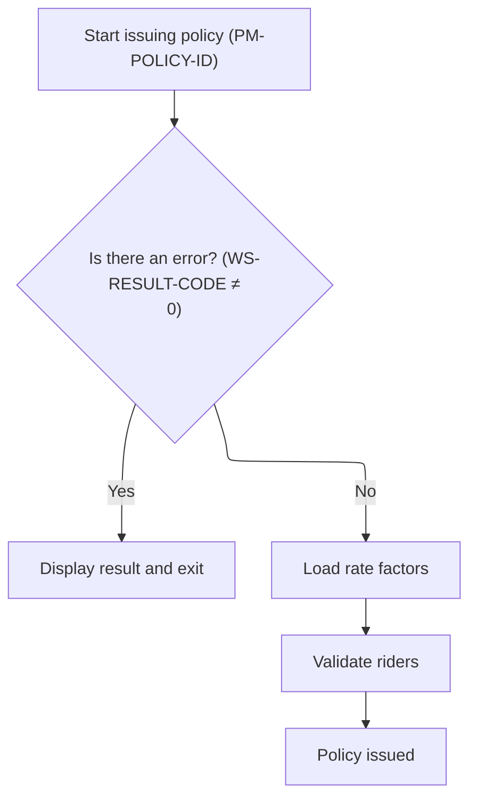

This section governs the transition from underwriting to policy issuance, ensuring only eligible policies proceed to rate factor loading and rider validation.

| Rule ID | Category                        | Rule Name                 | Description                                                                                   | Implementation Details                                                                                                                                                           |
| ------- | ------------------------------- | ------------------------- | --------------------------------------------------------------------------------------------- | -------------------------------------------------------------------------------------------------------------------------------------------------------------------------------- |
| BR-001  | Decision Making                 | Underwriting failure stop | If underwriting does not pass, the process stops and the result is displayed to the user.     | The result is displayed using a dedicated display routine. The output format is not specified in this section, but the action is to show the result and exit.                    |
| BR-002  | Invoking a Service or a Process | Load rate factors         | If underwriting passes, rate factors required for premium calculation are loaded.             | Rate factors include age, gender, smoker status, occupation, and others needed for premium calculation. The specific factors and their formats are not detailed in this section. |
| BR-003  | Invoking a Service or a Process | Rider validation          | After rate factors are loaded, the selected riders are validated before the policy is issued. | Rider validation ensures that only eligible riders are attached to the policy. The specific validation criteria and output formats are not detailed in this section.             |

<SwmSnippet path="/QCBLLESRC/NBUWMNT.cbl" line="181">

---

We stop and show the decline if underwriting didn't pass.

```cobol
           IF WS-RESULT-CODE NOT = 0
               PERFORM 8000-DISPLAY-RESULT
               EXIT PARAGRAPH
           END-IF
```

---

</SwmSnippet>

<SwmSnippet path="/QCBLLESRC/NBUWMNT.cbl" line="185">

---

After underwriting, we load all the rate factors (age, gender, smoker, occupation, etc.) needed for premium calculations. We also validate the selected riders next.

```cobol
           PERFORM 1400-LOAD-RATE-FACTORS
           PERFORM 1500-VALIDATE-RIDERS
```

---

</SwmSnippet>

## Setting Mortality and Risk Factors

```mermaid
%%{init: {"flowchart": {"defaultRenderer": "elk"}} }%%
flowchart TD
    node2{"Customer age?"}
    click node2 openCode "QCBLLESRC/NBUWMNT.cbl:359:365"
    node2 -->|"#lt;= 30"| node3["Set base mortality rate: 0.8500"]
    click node3 openCode "QCBLLESRC/NBUWMNT.cbl:360:360"
    node2 -->|"#lt;= 40"| node4["Set base mortality rate: 1.2000"]
    click node4 openCode "QCBLLESRC/NBUWMNT.cbl:361:361"
    node2 -->|"#lt;= 50"| node5["Set base mortality rate: 2.1500"]
    click node5 openCode "QCBLLESRC/NBUWMNT.cbl:362:362"
    node2 -->|"#lt;= 60"| node6["Set base mortality rate: 4.1000"]
    click node6 openCode "QCBLLESRC/NBUWMNT.cbl:363:363"
    node2 -->|"#gt; 60"| node7["Set base mortality rate: 7.2500"]
    click node7 openCode "QCBLLESRC/NBUWMNT.cbl:364:364"
    node3 --> node8{"Is customer female?"}
    node4 --> node8
    node5 --> node8
    node6 --> node8
    node7 --> node8
    click node8 openCode "QCBLLESRC/NBUWMNT.cbl:366:367"
    node8 -->|"Yes"| node9["Set gender factor: 0.9200"]
    click node9 openCode "QCBLLESRC/NBUWMNT.cbl:366:366"
    node8 -->|"No"| node10["Set gender factor: 1.0000"]
    click node10 openCode "QCBLLESRC/NBUWMNT.cbl:367:367"
    node9 --> node11{"Is customer a smoker?"}
    node10 --> node11
    click node11 openCode "QCBLLESRC/NBUWMNT.cbl:368:369"
    node11 -->|"Yes"| node12["Set smoker factor: 1.7500"]
    click node12 openCode "QCBLLESRC/NBUWMNT.cbl:368:368"
    node11 -->|"No"| node13["Set smoker factor: 1.0000"]
    click node13 openCode "QCBLLESRC/NBUWMNT.cbl:369:369"
    node12 --> node14{"Occupation class?"}
    node13 --> node14
    click node14 openCode "QCBLLESRC/NBUWMNT.cbl:370:375"
    node14 -->|"1"| node15["Set occupation factor: 1.0000"]
    click node15 openCode "QCBLLESRC/NBUWMNT.cbl:371:371"
    node14 -->|"2"| node16["Set occupation factor: 1.1500"]
    click node16 openCode "QCBLLESRC/NBUWMNT.cbl:372:372"
    node14 -->|"3"| node17["Set occupation factor: 1.4000"]
    click node17 openCode "QCBLLESRC/NBUWMNT.cbl:373:373"
    node14 -->|"Other"| node18["Set occupation factor: 1.0000"]
    click node18 openCode "QCBLLESRC/NBUWMNT.cbl:374:374"
    node15 --> node19{"Underwriting class?"}
    node16 --> node19
    node17 --> node19
    node18 --> node19
    click node19 openCode "QCBLLESRC/NBUWMNT.cbl:376:381"
    node19 -->|"'PR'"| node20["Set underwriting factor: 0.9000"]
    click node20 openCode "QCBLLESRC/NBUWMNT.cbl:377:377"
    node19 -->|"'ST'"| node21["Set underwriting factor: 1.0000"]
    click node21 openCode "QCBLLESRC/NBUWMNT.cbl:378:378"
    node19 -->|"'TB'"| node22["Set underwriting factor: 1.2500"]
    click node22 openCode "QCBLLESRC/NBUWMNT.cbl:379:379"
    node19 -->|"Other"| node23["Set underwriting factor: 1.0000"]
    click node23 openCode "QCBLLESRC/NBUWMNT.cbl:380:380"
    node20 --> node24["All rate factors set for policy"]
    node21 --> node24
    node22 --> node24
    node23 --> node24
    click node24 openCode "QCBLLESRC/NBUWMNT.cbl:358:381"
classDef HeadingStyle fill:#777777,stroke:#333,stroke-width:2px;

%% Swimm:
%% %%{init: {"flowchart": {"defaultRenderer": "elk"}} }%%
%% flowchart TD
%%     node2{"Customer age?"}
%%     click node2 openCode "<SwmPath>[QCBLLESRC/NBUWMNT.cbl](QCBLLESRC/NBUWMNT.cbl)</SwmPath>:359:365"
%%     node2 -->|"#lt;= 30"| node3["Set base mortality rate: <SwmToken path="QCBLLESRC/NBUWMNT.cbl" pos="360:15:17" line-data="               WHEN PM-ISSUE-AGE &lt;= 30 MOVE 0.8500 TO PM-BASE-MORTALITY-RATE">`0.8500`</SwmToken>"]
%%     click node3 openCode "<SwmPath>[QCBLLESRC/NBUWMNT.cbl](QCBLLESRC/NBUWMNT.cbl)</SwmPath>:360:360"
%%     node2 -->|"#lt;= 40"| node4["Set base mortality rate: <SwmToken path="QCBLLESRC/NBUWMNT.cbl" pos="361:15:17" line-data="               WHEN PM-ISSUE-AGE &lt;= 40 MOVE 1.2000 TO PM-BASE-MORTALITY-RATE">`1.2000`</SwmToken>"]
%%     click node4 openCode "<SwmPath>[QCBLLESRC/NBUWMNT.cbl](QCBLLESRC/NBUWMNT.cbl)</SwmPath>:361:361"
%%     node2 -->|"#lt;= 50"| node5["Set base mortality rate: <SwmToken path="QCBLLESRC/NBUWMNT.cbl" pos="362:15:17" line-data="               WHEN PM-ISSUE-AGE &lt;= 50 MOVE 2.1500 TO PM-BASE-MORTALITY-RATE">`2.1500`</SwmToken>"]
%%     click node5 openCode "<SwmPath>[QCBLLESRC/NBUWMNT.cbl](QCBLLESRC/NBUWMNT.cbl)</SwmPath>:362:362"
%%     node2 -->|"#lt;= 60"| node6["Set base mortality rate: <SwmToken path="QCBLLESRC/NBUWMNT.cbl" pos="363:15:17" line-data="               WHEN PM-ISSUE-AGE &lt;= 60 MOVE 4.1000 TO PM-BASE-MORTALITY-RATE">`4.1000`</SwmToken>"]
%%     click node6 openCode "<SwmPath>[QCBLLESRC/NBUWMNT.cbl](QCBLLESRC/NBUWMNT.cbl)</SwmPath>:363:363"
%%     node2 -->|"#gt; 60"| node7["Set base mortality rate: <SwmToken path="QCBLLESRC/NBUWMNT.cbl" pos="364:7:9" line-data="               WHEN OTHER              MOVE 7.2500 TO PM-BASE-MORTALITY-RATE">`7.2500`</SwmToken>"]
%%     click node7 openCode "<SwmPath>[QCBLLESRC/NBUWMNT.cbl](QCBLLESRC/NBUWMNT.cbl)</SwmPath>:364:364"
%%     node3 --> node8{"Is customer female?"}
%%     node4 --> node8
%%     node5 --> node8
%%     node6 --> node8
%%     node7 --> node8
%%     click node8 openCode "<SwmPath>[QCBLLESRC/NBUWMNT.cbl](QCBLLESRC/NBUWMNT.cbl)</SwmPath>:366:367"
%%     node8 -->|"Yes"| node9["Set gender factor: <SwmToken path="QCBLLESRC/NBUWMNT.cbl" pos="366:9:11" line-data="           IF PM-FEMALE MOVE 0.9200 TO PM-GENDER-FACTOR">`0.9200`</SwmToken>"]
%%     click node9 openCode "<SwmPath>[QCBLLESRC/NBUWMNT.cbl](QCBLLESRC/NBUWMNT.cbl)</SwmPath>:366:366"
%%     node8 -->|"No"| node10["Set gender factor: <SwmToken path="QCBLLESRC/NBUWMNT.cbl" pos="367:5:7" line-data="           ELSE MOVE 1.0000 TO PM-GENDER-FACTOR END-IF">`1.0000`</SwmToken>"]
%%     click node10 openCode "<SwmPath>[QCBLLESRC/NBUWMNT.cbl](QCBLLESRC/NBUWMNT.cbl)</SwmPath>:367:367"
%%     node9 --> node11{"Is customer a smoker?"}
%%     node10 --> node11
%%     click node11 openCode "<SwmPath>[QCBLLESRC/NBUWMNT.cbl](QCBLLESRC/NBUWMNT.cbl)</SwmPath>:368:369"
%%     node11 -->|"Yes"| node12["Set smoker factor: <SwmToken path="QCBLLESRC/NBUWMNT.cbl" pos="368:9:11" line-data="           IF PM-SMOKER MOVE 1.7500 TO PM-SMOKER-FACTOR">`1.7500`</SwmToken>"]
%%     click node12 openCode "<SwmPath>[QCBLLESRC/NBUWMNT.cbl](QCBLLESRC/NBUWMNT.cbl)</SwmPath>:368:368"
%%     node11 -->|"No"| node13["Set smoker factor: <SwmToken path="QCBLLESRC/NBUWMNT.cbl" pos="367:5:7" line-data="           ELSE MOVE 1.0000 TO PM-GENDER-FACTOR END-IF">`1.0000`</SwmToken>"]
%%     click node13 openCode "<SwmPath>[QCBLLESRC/NBUWMNT.cbl](QCBLLESRC/NBUWMNT.cbl)</SwmPath>:369:369"
%%     node12 --> node14{"Occupation class?"}
%%     node13 --> node14
%%     click node14 openCode "<SwmPath>[QCBLLESRC/NBUWMNT.cbl](QCBLLESRC/NBUWMNT.cbl)</SwmPath>:370:375"
%%     node14 -->|"1"| node15["Set occupation factor: <SwmToken path="QCBLLESRC/NBUWMNT.cbl" pos="367:5:7" line-data="           ELSE MOVE 1.0000 TO PM-GENDER-FACTOR END-IF">`1.0000`</SwmToken>"]
%%     click node15 openCode "<SwmPath>[QCBLLESRC/NBUWMNT.cbl](QCBLLESRC/NBUWMNT.cbl)</SwmPath>:371:371"
%%     node14 -->|"2"| node16["Set occupation factor: <SwmToken path="QCBLLESRC/NBUWMNT.cbl" pos="372:7:9" line-data="               WHEN 2 MOVE 1.1500 TO PM-OCCUPATION-FACTOR">`1.1500`</SwmToken>"]
%%     click node16 openCode "<SwmPath>[QCBLLESRC/NBUWMNT.cbl](QCBLLESRC/NBUWMNT.cbl)</SwmPath>:372:372"
%%     node14 -->|"3"| node17["Set occupation factor: <SwmToken path="QCBLLESRC/NBUWMNT.cbl" pos="373:7:9" line-data="               WHEN 3 MOVE 1.4000 TO PM-OCCUPATION-FACTOR">`1.4000`</SwmToken>"]
%%     click node17 openCode "<SwmPath>[QCBLLESRC/NBUWMNT.cbl](QCBLLESRC/NBUWMNT.cbl)</SwmPath>:373:373"
%%     node14 -->|"Other"| node18["Set occupation factor: <SwmToken path="QCBLLESRC/NBUWMNT.cbl" pos="367:5:7" line-data="           ELSE MOVE 1.0000 TO PM-GENDER-FACTOR END-IF">`1.0000`</SwmToken>"]
%%     click node18 openCode "<SwmPath>[QCBLLESRC/NBUWMNT.cbl](QCBLLESRC/NBUWMNT.cbl)</SwmPath>:374:374"
%%     node15 --> node19{"Underwriting class?"}
%%     node16 --> node19
%%     node17 --> node19
%%     node18 --> node19
%%     click node19 openCode "<SwmPath>[QCBLLESRC/NBUWMNT.cbl](QCBLLESRC/NBUWMNT.cbl)</SwmPath>:376:381"
%%     node19 -->|"'PR'"| node20["Set underwriting factor: <SwmToken path="QCBLLESRC/NBUWMNT.cbl" pos="377:9:11" line-data="               WHEN &#39;PR&#39; MOVE 0.9000 TO PM-UW-FACTOR">`0.9000`</SwmToken>"]
%%     click node20 openCode "<SwmPath>[QCBLLESRC/NBUWMNT.cbl](QCBLLESRC/NBUWMNT.cbl)</SwmPath>:377:377"
%%     node19 -->|"'ST'"| node21["Set underwriting factor: <SwmToken path="QCBLLESRC/NBUWMNT.cbl" pos="367:5:7" line-data="           ELSE MOVE 1.0000 TO PM-GENDER-FACTOR END-IF">`1.0000`</SwmToken>"]
%%     click node21 openCode "<SwmPath>[QCBLLESRC/NBUWMNT.cbl](QCBLLESRC/NBUWMNT.cbl)</SwmPath>:378:378"
%%     node19 -->|"'TB'"| node22["Set underwriting factor: <SwmToken path="QCBLLESRC/NBUWMNT.cbl" pos="379:9:11" line-data="               WHEN &#39;TB&#39; MOVE 1.2500 TO PM-UW-FACTOR">`1.2500`</SwmToken>"]
%%     click node22 openCode "<SwmPath>[QCBLLESRC/NBUWMNT.cbl](QCBLLESRC/NBUWMNT.cbl)</SwmPath>:379:379"
%%     node19 -->|"Other"| node23["Set underwriting factor: <SwmToken path="QCBLLESRC/NBUWMNT.cbl" pos="367:5:7" line-data="           ELSE MOVE 1.0000 TO PM-GENDER-FACTOR END-IF">`1.0000`</SwmToken>"]
%%     click node23 openCode "<SwmPath>[QCBLLESRC/NBUWMNT.cbl](QCBLLESRC/NBUWMNT.cbl)</SwmPath>:380:380"
%%     node20 --> node24["All rate factors set for policy"]
%%     node21 --> node24
%%     node22 --> node24
%%     node23 --> node24
%%     click node24 openCode "<SwmPath>[QCBLLESRC/NBUWMNT.cbl](QCBLLESRC/NBUWMNT.cbl)</SwmPath>:358:381"
%% classDef HeadingStyle fill:#777777,stroke:#333,stroke-width:2px;
```

This section standardizes the assignment of mortality and risk factors for life insurance policies, ensuring consistent premium calculations based on customer attributes.

| Rule ID | Category    | Rule Name                  | Description                                                                                                                                                                                                                                                                                                                                                                                                                                                                                                                                                                                                                                                                                                                                                                                                                                                                                                                                                                                                                                  | Implementation Details                                                                                                                                                                                                                                                                                                                                                                                                                                                                                                                                                                                                                                                                                                                                                                                                                                                                                                                           |
| ------- | ----------- | -------------------------- | -------------------------------------------------------------------------------------------------------------------------------------------------------------------------------------------------------------------------------------------------------------------------------------------------------------------------------------------------------------------------------------------------------------------------------------------------------------------------------------------------------------------------------------------------------------------------------------------------------------------------------------------------------------------------------------------------------------------------------------------------------------------------------------------------------------------------------------------------------------------------------------------------------------------------------------------------------------------------------------------------------------------------------------------- | ------------------------------------------------------------------------------------------------------------------------------------------------------------------------------------------------------------------------------------------------------------------------------------------------------------------------------------------------------------------------------------------------------------------------------------------------------------------------------------------------------------------------------------------------------------------------------------------------------------------------------------------------------------------------------------------------------------------------------------------------------------------------------------------------------------------------------------------------------------------------------------------------------------------------------------------------ |
| BR-001  | Calculation | Base mortality rate by age | Assign the base mortality rate according to the applicant's age bracket. The rate is <SwmToken path="QCBLLESRC/NBUWMNT.cbl" pos="360:15:17" line-data="               WHEN PM-ISSUE-AGE &lt;= 30 MOVE 0.8500 TO PM-BASE-MORTALITY-RATE">`0.8500`</SwmToken> for ages up to 30, <SwmToken path="QCBLLESRC/NBUWMNT.cbl" pos="361:15:17" line-data="               WHEN PM-ISSUE-AGE &lt;= 40 MOVE 1.2000 TO PM-BASE-MORTALITY-RATE">`1.2000`</SwmToken> for ages 31-40, <SwmToken path="QCBLLESRC/NBUWMNT.cbl" pos="362:15:17" line-data="               WHEN PM-ISSUE-AGE &lt;= 50 MOVE 2.1500 TO PM-BASE-MORTALITY-RATE">`2.1500`</SwmToken> for ages 41-50, <SwmToken path="QCBLLESRC/NBUWMNT.cbl" pos="363:15:17" line-data="               WHEN PM-ISSUE-AGE &lt;= 60 MOVE 4.1000 TO PM-BASE-MORTALITY-RATE">`4.1000`</SwmToken> for ages 51-60, and <SwmToken path="QCBLLESRC/NBUWMNT.cbl" pos="364:7:9" line-data="               WHEN OTHER              MOVE 7.2500 TO PM-BASE-MORTALITY-RATE">`7.2500`</SwmToken> for ages above 60. | Base mortality rate values: <SwmToken path="QCBLLESRC/NBUWMNT.cbl" pos="360:15:17" line-data="               WHEN PM-ISSUE-AGE &lt;= 30 MOVE 0.8500 TO PM-BASE-MORTALITY-RATE">`0.8500`</SwmToken>, <SwmToken path="QCBLLESRC/NBUWMNT.cbl" pos="361:15:17" line-data="               WHEN PM-ISSUE-AGE &lt;= 40 MOVE 1.2000 TO PM-BASE-MORTALITY-RATE">`1.2000`</SwmToken>, <SwmToken path="QCBLLESRC/NBUWMNT.cbl" pos="362:15:17" line-data="               WHEN PM-ISSUE-AGE &lt;= 50 MOVE 2.1500 TO PM-BASE-MORTALITY-RATE">`2.1500`</SwmToken>, <SwmToken path="QCBLLESRC/NBUWMNT.cbl" pos="363:15:17" line-data="               WHEN PM-ISSUE-AGE &lt;= 60 MOVE 4.1000 TO PM-BASE-MORTALITY-RATE">`4.1000`</SwmToken>, <SwmToken path="QCBLLESRC/NBUWMNT.cbl" pos="364:7:9" line-data="               WHEN OTHER              MOVE 7.2500 TO PM-BASE-MORTALITY-RATE">`7.2500`</SwmToken>. Output is a decimal number representing the rate. |
| BR-002  | Calculation | Gender risk factor         | Assign the gender factor as <SwmToken path="QCBLLESRC/NBUWMNT.cbl" pos="366:9:11" line-data="           IF PM-FEMALE MOVE 0.9200 TO PM-GENDER-FACTOR">`0.9200`</SwmToken> for females and <SwmToken path="QCBLLESRC/NBUWMNT.cbl" pos="367:5:7" line-data="           ELSE MOVE 1.0000 TO PM-GENDER-FACTOR END-IF">`1.0000`</SwmToken> for all others.                                                                                                                                                                                                                                                                                                                                                                                                                                                                                                                                                                                                                                                                                        | Gender factor values: <SwmToken path="QCBLLESRC/NBUWMNT.cbl" pos="366:9:11" line-data="           IF PM-FEMALE MOVE 0.9200 TO PM-GENDER-FACTOR">`0.9200`</SwmToken> (female), <SwmToken path="QCBLLESRC/NBUWMNT.cbl" pos="367:5:7" line-data="           ELSE MOVE 1.0000 TO PM-GENDER-FACTOR END-IF">`1.0000`</SwmToken> (not female). Output is a decimal number representing the factor.                                                                                                                                                                                                                                                                                                                                                                                                                                                                                                                                                      |
| BR-003  | Calculation | Smoker risk factor         | Assign the smoker factor as <SwmToken path="QCBLLESRC/NBUWMNT.cbl" pos="368:9:11" line-data="           IF PM-SMOKER MOVE 1.7500 TO PM-SMOKER-FACTOR">`1.7500`</SwmToken> for smokers and <SwmToken path="QCBLLESRC/NBUWMNT.cbl" pos="367:5:7" line-data="           ELSE MOVE 1.0000 TO PM-GENDER-FACTOR END-IF">`1.0000`</SwmToken> for non-smokers.                                                                                                                                                                                                                                                                                                                                                                                                                                                                                                                                                                                                                                                                                       | Smoker factor values: <SwmToken path="QCBLLESRC/NBUWMNT.cbl" pos="368:9:11" line-data="           IF PM-SMOKER MOVE 1.7500 TO PM-SMOKER-FACTOR">`1.7500`</SwmToken> (smoker), <SwmToken path="QCBLLESRC/NBUWMNT.cbl" pos="367:5:7" line-data="           ELSE MOVE 1.0000 TO PM-GENDER-FACTOR END-IF">`1.0000`</SwmToken> (non-smoker). Output is a decimal number representing the factor.                                                                                                                                                                                                                                                                                                                                                                                                                                                                                                                                                      |
| BR-004  | Calculation | Occupation risk factor     | Assign the occupation factor as <SwmToken path="QCBLLESRC/NBUWMNT.cbl" pos="367:5:7" line-data="           ELSE MOVE 1.0000 TO PM-GENDER-FACTOR END-IF">`1.0000`</SwmToken> for occupation class 1, <SwmToken path="QCBLLESRC/NBUWMNT.cbl" pos="372:7:9" line-data="               WHEN 2 MOVE 1.1500 TO PM-OCCUPATION-FACTOR">`1.1500`</SwmToken> for class 2, <SwmToken path="QCBLLESRC/NBUWMNT.cbl" pos="373:7:9" line-data="               WHEN 3 MOVE 1.4000 TO PM-OCCUPATION-FACTOR">`1.4000`</SwmToken> for class 3, and <SwmToken path="QCBLLESRC/NBUWMNT.cbl" pos="367:5:7" line-data="           ELSE MOVE 1.0000 TO PM-GENDER-FACTOR END-IF">`1.0000`</SwmToken> for any other class.                                                                                                                                                                                                                                                                                                                                             | Occupation factor values: <SwmToken path="QCBLLESRC/NBUWMNT.cbl" pos="367:5:7" line-data="           ELSE MOVE 1.0000 TO PM-GENDER-FACTOR END-IF">`1.0000`</SwmToken> (class 1 or other), <SwmToken path="QCBLLESRC/NBUWMNT.cbl" pos="372:7:9" line-data="               WHEN 2 MOVE 1.1500 TO PM-OCCUPATION-FACTOR">`1.1500`</SwmToken> (class 2), <SwmToken path="QCBLLESRC/NBUWMNT.cbl" pos="373:7:9" line-data="               WHEN 3 MOVE 1.4000 TO PM-OCCUPATION-FACTOR">`1.4000`</SwmToken> (class 3). Output is a decimal number representing the factor.                                                                                                                                                                                                                                                                                                                                                                                |
| BR-005  | Calculation | Underwriting risk factor   | Assign the underwriting factor as <SwmToken path="QCBLLESRC/NBUWMNT.cbl" pos="377:9:11" line-data="               WHEN &#39;PR&#39; MOVE 0.9000 TO PM-UW-FACTOR">`0.9000`</SwmToken> for class 'PR', <SwmToken path="QCBLLESRC/NBUWMNT.cbl" pos="367:5:7" line-data="           ELSE MOVE 1.0000 TO PM-GENDER-FACTOR END-IF">`1.0000`</SwmToken> for class 'ST', <SwmToken path="QCBLLESRC/NBUWMNT.cbl" pos="379:9:11" line-data="               WHEN &#39;TB&#39; MOVE 1.2500 TO PM-UW-FACTOR">`1.2500`</SwmToken> for class 'TB', and <SwmToken path="QCBLLESRC/NBUWMNT.cbl" pos="367:5:7" line-data="           ELSE MOVE 1.0000 TO PM-GENDER-FACTOR END-IF">`1.0000`</SwmToken> for any other class.                                                                                                                                                                                                                                                                                                                                     | Underwriting factor values: <SwmToken path="QCBLLESRC/NBUWMNT.cbl" pos="377:9:11" line-data="               WHEN &#39;PR&#39; MOVE 0.9000 TO PM-UW-FACTOR">`0.9000`</SwmToken> ('PR'), <SwmToken path="QCBLLESRC/NBUWMNT.cbl" pos="367:5:7" line-data="           ELSE MOVE 1.0000 TO PM-GENDER-FACTOR END-IF">`1.0000`</SwmToken> ('ST' or other), <SwmToken path="QCBLLESRC/NBUWMNT.cbl" pos="379:9:11" line-data="               WHEN &#39;TB&#39; MOVE 1.2500 TO PM-UW-FACTOR">`1.2500`</SwmToken> ('TB'). Output is a decimal number representing the factor.                                                                                                                                                                                                                                                                                                                                                                               |

<SwmSnippet path="/QCBLLESRC/NBUWMNT.cbl" line="358">

---

In <SwmToken path="QCBLLESRC/NBUWMNT.cbl" pos="358:1:7" line-data="       1400-LOAD-RATE-FACTORS.">`1400-LOAD-RATE-FACTORS`</SwmToken>, we set the base mortality rate based on the applicant's age bracket. These rates are hardcoded and used for premium calculations.

```cobol
       1400-LOAD-RATE-FACTORS.
           EVALUATE TRUE
               WHEN PM-ISSUE-AGE <= 30 MOVE 0.8500 TO PM-BASE-MORTALITY-RATE
               WHEN PM-ISSUE-AGE <= 40 MOVE 1.2000 TO PM-BASE-MORTALITY-RATE
               WHEN PM-ISSUE-AGE <= 50 MOVE 2.1500 TO PM-BASE-MORTALITY-RATE
               WHEN PM-ISSUE-AGE <= 60 MOVE 4.1000 TO PM-BASE-MORTALITY-RATE
               WHEN OTHER              MOVE 7.2500 TO PM-BASE-MORTALITY-RATE
           END-EVALUATE
```

---

</SwmSnippet>

<SwmSnippet path="/QCBLLESRC/NBUWMNT.cbl" line="366">

---

Next we set the gender factor: 0.92 for females, 1.0 for everyone else. This adjusts the risk calculation.

```cobol
           IF PM-FEMALE MOVE 0.9200 TO PM-GENDER-FACTOR
           ELSE MOVE 1.0000 TO PM-GENDER-FACTOR END-IF
```

---

</SwmSnippet>

<SwmSnippet path="/QCBLLESRC/NBUWMNT.cbl" line="368">

---

Then we set the smoker factor: 1.75 for smokers, 1.0 for non-smokers. This bumps up the premium for smokers.

```cobol
           IF PM-SMOKER MOVE 1.7500 TO PM-SMOKER-FACTOR
           ELSE MOVE 1.0000 TO PM-SMOKER-FACTOR END-IF
```

---

</SwmSnippet>

<SwmSnippet path="/QCBLLESRC/NBUWMNT.cbl" line="370">

---

This part sets the occupation factor based on the occupation class, adjusting the risk for premium calculation before moving on to underwriting class.

```cobol
           EVALUATE PM-OCCUPATION-CLASS
               WHEN 1 MOVE 1.0000 TO PM-OCCUPATION-FACTOR
               WHEN 2 MOVE 1.1500 TO PM-OCCUPATION-FACTOR
               WHEN 3 MOVE 1.4000 TO PM-OCCUPATION-FACTOR
               WHEN OTHER MOVE 1.0000 TO PM-OCCUPATION-FACTOR
           END-EVALUATE
```

---

</SwmSnippet>

<SwmSnippet path="/QCBLLESRC/NBUWMNT.cbl" line="376">

---

This is where the underwriting factor gets set based on the applicant's risk class. 'PR' (preferred) gets a discount, 'ST' (standard) is neutral, and 'TB' (tobacco) gets a surcharge. Any other value defaults to standard. This wraps up the rate factor assignments before returning to the main flow.

```cobol
           EVALUATE PM-UW-CLASS
               WHEN 'PR' MOVE 0.9000 TO PM-UW-FACTOR
               WHEN 'ST' MOVE 1.0000 TO PM-UW-FACTOR
               WHEN 'TB' MOVE 1.2500 TO PM-UW-FACTOR
               WHEN OTHER MOVE 1.0000 TO PM-UW-FACTOR
           END-EVALUATE.
```

---

</SwmSnippet>

## Validating Rider Eligibility

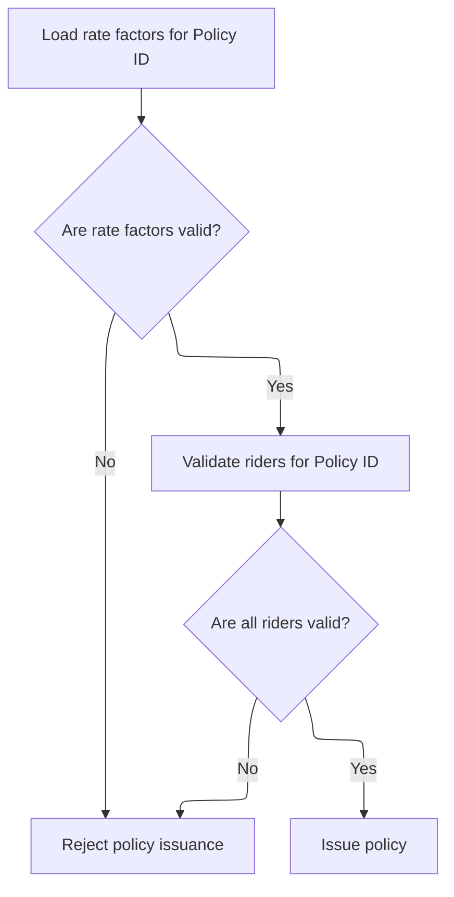

This section governs the eligibility validation for riders during policy issuance. It ensures that only policies with valid rate factors and eligible riders are allowed to proceed.

| Rule ID | Category        | Rule Name                                        | Description                                                                                           | Implementation Details                                                                                 |
| ------- | --------------- | ------------------------------------------------ | ----------------------------------------------------------------------------------------------------- | ------------------------------------------------------------------------------------------------------ |
| BR-001  | Reading Input   | Load rate factors prerequisite                   | Rate factors must be loaded for the given policy ID before any rider validation occurs.               | The policy ID is a string of up to 12 characters. No other constants are referenced in this rule.      |
| BR-002  | Data validation | Reject on invalid rate factors                   | If rate factors are not valid for the policy, the policy issuance process is rejected.                | No specific constants are referenced. The rejection is a business outcome, not a technical error.      |
| BR-003  | Data validation | Validate rider eligibility                       | All selected riders for the policy must be validated for eligibility before the policy can be issued. | No specific constants are referenced. Rider eligibility is a business requirement for policy issuance. |
| BR-004  | Decision Making | Issue or reject policy based on rider validation | If all riders are valid, the policy issuance process proceeds; otherwise, the policy is rejected.     | No specific constants are referenced. The outcome is either policy issuance or rejection.              |

<SwmSnippet path="/QCBLLESRC/NBUWMNT.cbl" line="185">

---

Back in <SwmToken path="QCBLLESRC/NBUWMNT.cbl" pos="84:3:7" line-data="                               PERFORM 5000-ISSUE-POLICY">`5000-ISSUE-POLICY`</SwmToken>, right after loading all the rate factors, we call <SwmToken path="QCBLLESRC/NBUWMNT.cbl" pos="186:3:7" line-data="           PERFORM 1500-VALIDATE-RIDERS">`1500-VALIDATE-RIDERS`</SwmToken>. This step checks that the selected riders are allowed for this policy and applicant, catching any issues before we start calculating premiums. If a rider isn't valid, we bail out early.

```cobol
           PERFORM 1400-LOAD-RATE-FACTORS
           PERFORM 1500-VALIDATE-RIDERS
```

---

</SwmSnippet>

## Enforcing Rider Limits and Rules

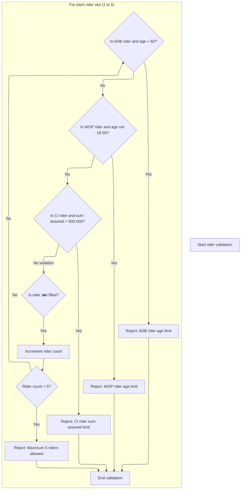

This section validates that the selected insurance riders on a policy comply with product rules regarding maximum count, age eligibility, and sum assured limits. It ensures that only valid rider configurations proceed further in the policy issuance process.

| Rule ID | Category        | Rule Name                  | Description                                                                                                                                                                                 | Implementation Details                                                                                                                                                     |
| ------- | --------------- | -------------------------- | ------------------------------------------------------------------------------------------------------------------------------------------------------------------------------------------- | -------------------------------------------------------------------------------------------------------------------------------------------------------------------------- |
| BR-001  | Data validation | Maximum rider count        | No more than five riders can be selected for a single policy. If more than five riders are present, validation fails with an error code and message.                                        | The maximum allowed riders per policy is 5. If exceeded, the result code is set to 23 and the message is set to 'MAXIMUM 5 RIDERS ALLOWED'.                                |
| BR-002  | Data validation | ADB rider age limit        | Applicants over age 60 cannot select the Accidental Death Benefit (ADB) rider. If this rule is violated, validation fails with a specific error code and message.                           | The maximum age for ADB rider eligibility is 60. If violated, the result code is set to 24 and the message is set to 'ADB RIDER: INSURED MUST BE AGE 60 OR UNDER'.         |
| BR-003  | Data validation | WOP rider age range        | Applicants must be between ages 18 and 55 to select the Waiver of Premium (WOP) rider. If the applicant is outside this age range, validation fails with a specific error code and message. | The eligible age range for WOP rider is 18 to 55 inclusive. If violated, the result code is set to 25 and the message is set to 'WOP RIDER: INSURED MUST BE AGE 18 TO 55'. |
| BR-004  | Data validation | CI rider sum assured limit | The Critical Illness (CI) rider cannot be selected if the sum assured for that rider exceeds 500,000. If this limit is exceeded, validation fails with a specific error code and message.   | The maximum sum assured for CI rider is 500,000. If violated, the result code is set to 26 and the message is set to 'CI RIDER: SUM ASSURED EXCEEDS 500,000'.              |

<SwmSnippet path="/QCBLLESRC/NBUWMNT.cbl" line="383">

---

In <SwmToken path="QCBLLESRC/NBUWMNT.cbl" pos="383:1:5" line-data="       1500-VALIDATE-RIDERS.">`1500-VALIDATE-RIDERS`</SwmToken>, we start by counting how many riders are selected. If there are more than 5, we set an error and exit right away. This enforces the business rule that only up to 5 riders are allowed per policy.

```cobol
       1500-VALIDATE-RIDERS.
           MOVE 0 TO WS-RIDER-IDX
           PERFORM VARYING PM-RIDER-IDX FROM 1 BY 1
               UNTIL PM-RIDER-IDX > 5
               IF PM-RIDER-CODE(PM-RIDER-IDX) NOT = SPACES
                   ADD 1 TO WS-RIDER-IDX
                   IF WS-RIDER-IDX > 5
                       MOVE 23 TO WS-RESULT-CODE
                       MOVE 'MAXIMUM 5 RIDERS ALLOWED' TO WS-RESULT-MESSAGE
                       EXIT PARAGRAPH
                   END-IF
```

---

</SwmSnippet>

<SwmSnippet path="/QCBLLESRC/NBUWMNT.cbl" line="394">

---

Here, if the rider code is <SwmToken path="QCBLLESRC/NBUWMNT.cbl" pos="394:19:19" line-data="                   IF PM-RIDER-CODE(PM-RIDER-IDX) = &#39;ADB01&#39; AND">`ADB01`</SwmToken> and the applicant is over 60, we set an error and exit. This enforces the age limit for the accidental death benefit rider before checking the next rider rules.

```cobol
                   IF PM-RIDER-CODE(PM-RIDER-IDX) = 'ADB01' AND
                      PM-ISSUE-AGE > 60
                       MOVE 24 TO WS-RESULT-CODE
                       MOVE 'ADB RIDER: INSURED MUST BE AGE 60 OR UNDER'
                           TO WS-RESULT-MESSAGE
                       EXIT PARAGRAPH
                   END-IF
```

---

</SwmSnippet>

<SwmSnippet path="/QCBLLESRC/NBUWMNT.cbl" line="401">

---

This part checks if the rider is <SwmToken path="QCBLLESRC/NBUWMNT.cbl" pos="401:19:19" line-data="                   IF PM-RIDER-CODE(PM-RIDER-IDX) = &#39;WOP01&#39; AND">`WOP01`</SwmToken> and the applicant's age is outside 18 to 55. If so, it sets an error and exits. This comes right before the check for the CI rider's sum assured limit.

```cobol
                   IF PM-RIDER-CODE(PM-RIDER-IDX) = 'WOP01' AND
                      (PM-ISSUE-AGE < 18 OR PM-ISSUE-AGE > 55)
                       MOVE 25 TO WS-RESULT-CODE
                       MOVE 'WOP RIDER: INSURED MUST BE AGE 18 TO 55'
                           TO WS-RESULT-MESSAGE
                       EXIT PARAGRAPH
                   END-IF
```

---

</SwmSnippet>

<SwmSnippet path="/QCBLLESRC/NBUWMNT.cbl" line="408">

---

This block checks if the rider is <SwmToken path="QCBLLESRC/NBUWMNT.cbl" pos="408:19:19" line-data="                   IF PM-RIDER-CODE(PM-RIDER-IDX) = &#39;CI001&#39; AND">`CI001`</SwmToken> and the sum assured is over 500,000. If so, it sets an error and exits. Otherwise, the loop continues until all riders are checked. This wraps up the rider validation and returns control to the main flow.

```cobol
                   IF PM-RIDER-CODE(PM-RIDER-IDX) = 'CI001' AND
                      PM-RIDER-SUM-ASSURED(PM-RIDER-IDX) > 500000
                       MOVE 26 TO WS-RESULT-CODE
                       MOVE 'CI RIDER: SUM ASSURED EXCEEDS 500,000'
                           TO WS-RESULT-MESSAGE
                       EXIT PARAGRAPH
                   END-IF
               END-IF
           END-PERFORM.
```

---

</SwmSnippet>

## Handling Rider Validation Results

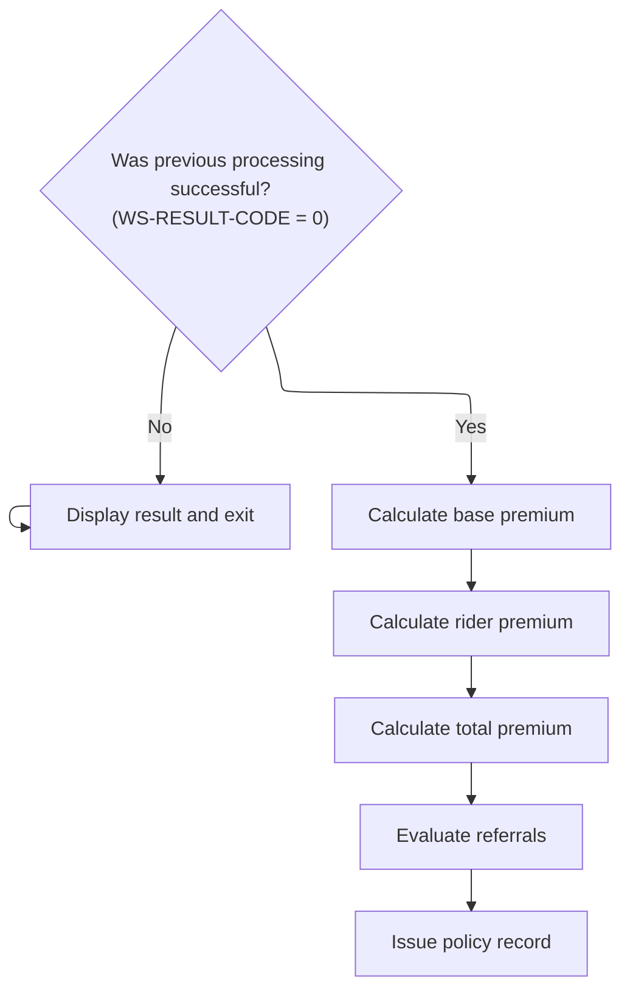

This section governs the flow after rider validation, determining whether to proceed with premium calculations and policy issuance or to exit early due to validation errors. It ensures that no further processing occurs if validation fails, maintaining data integrity and correct business process sequencing.

| Rule ID | Category        | Rule Name                                        | Description                                                                                                                                                                    | Implementation Details                                                                                                                                                                                                        |
| ------- | --------------- | ------------------------------------------------ | ------------------------------------------------------------------------------------------------------------------------------------------------------------------------------ | ----------------------------------------------------------------------------------------------------------------------------------------------------------------------------------------------------------------------------- |
| BR-001  | Decision Making | Early exit on validation error                   | If the rider validation result code is not zero, display the result and exit the process without calculating premiums or issuing the policy record.                            | The result code value of zero indicates success; any non-zero value triggers the error handling flow. The output in this case is an error display, but the format of the display is not specified in this section.            |
| BR-002  | Decision Making | Premium calculation and policy issuance sequence | If the rider validation result code is zero, proceed to calculate the base premium, rider premium, total premium, evaluate referrals, and issue the policy record in sequence. | The calculations and evaluations are performed in a specific sequence: base premium, rider premium, total premium, referrals, and finally policy issuance. The details of each calculation are not specified in this section. |

<SwmSnippet path="/QCBLLESRC/NBUWMNT.cbl" line="187">

---

Back in <SwmToken path="QCBLLESRC/NBUWMNT.cbl" pos="84:3:7" line-data="                               PERFORM 5000-ISSUE-POLICY">`5000-ISSUE-POLICY`</SwmToken>, right after validating riders, we check if there was an error. If so, we display the result and exit early—no premium calculations or policy updates happen until the error is resolved.

```cobol
           IF WS-RESULT-CODE NOT = 0
               PERFORM 8000-DISPLAY-RESULT
               EXIT PARAGRAPH
           END-IF
```

---

</SwmSnippet>

<SwmSnippet path="/QCBLLESRC/NBUWMNT.cbl" line="192">

---

After rider validation, we calculate the base premium, then call <SwmToken path="QCBLLESRC/NBUWMNT.cbl" pos="193:3:9" line-data="           PERFORM 1700-CALCULATE-RIDER-PREMIUM">`1700-CALCULATE-RIDER-PREMIUM`</SwmToken> to add up the cost for all riders.

```cobol
           PERFORM 1600-CALCULATE-BASE-PREMIUM
           PERFORM 1700-CALCULATE-RIDER-PREMIUM
           PERFORM 1800-CALCULATE-TOTAL-PREMIUM
           PERFORM 1900-EVALUATE-REFERRALS
           PERFORM 2000-ISSUE-POLICY-RECORD
```

---

</SwmSnippet>

## Calculating Rider Premiums

```mermaid
%%{init: {"flowchart": {"defaultRenderer": "elk"}} }%%
flowchart TD
    node1["Start rider premium calculation"]
    click node1 openCode "QCBLLESRC/NBUWMNT.cbl:428:429"
    node1 --> node2["Set total rider premium to zero"]
    click node2 openCode "QCBLLESRC/NBUWMNT.cbl:429:429"
    node2 --> node3["Process each rider slot"]
    click node3 openCode "QCBLLESRC/NBUWMNT.cbl:430:431"
    subgraph loop1["For each rider slot (1 to 5)"]
        node3 --> node4{"Is rider code present?"}
        click node4 openCode "QCBLLESRC/NBUWMNT.cbl:432:432"
        node4 -->|"Yes"| node5["Mark rider as active"]
        click node5 openCode "QCBLLESRC/NBUWMNT.cbl:433:433"
        node5 --> node6{"Rider code type?"}
        click node6 openCode "QCBLLESRC/NBUWMNT.cbl:434:434"
        node6 -->|ADB01| node7["Calculate premium: (sum assured / 1000)
* 0.1"]
        click node7 openCode "QCBLLESRC/NBUWMNT.cbl:435:437"
        node6 -->|WOP01| node8["Calculate premium: base premium * 0.06"]
        click node8 openCode "QCBLLESRC/NBUWMNT.cbl:438:441"
        node6 -->|CI001| node9["Calculate premium: (sum assured / 1000)
* 1.2"]
        click node9 openCode "QCBLLESRC/NBUWMNT.cbl:442:445"
        node7 --> node10["Add rider premium to total"]
        node8 --> node10
        node9 --> node10
        click node10 openCode "QCBLLESRC/NBUWMNT.cbl:446:447"
        node10 --> node3
        node4 -->|"No"| node3
    end
    node3 --> node11["Total rider premium ready for policy"]
    click node11 openCode "QCBLLESRC/NBUWMNT.cbl:448:449"
classDef HeadingStyle fill:#777777,stroke:#333,stroke-width:2px;

%% Swimm:
%% %%{init: {"flowchart": {"defaultRenderer": "elk"}} }%%
%% flowchart TD
%%     node1["Start rider premium calculation"]
%%     click node1 openCode "<SwmPath>[QCBLLESRC/NBUWMNT.cbl](QCBLLESRC/NBUWMNT.cbl)</SwmPath>:428:429"
%%     node1 --> node2["Set total rider premium to zero"]
%%     click node2 openCode "<SwmPath>[QCBLLESRC/NBUWMNT.cbl](QCBLLESRC/NBUWMNT.cbl)</SwmPath>:429:429"
%%     node2 --> node3["Process each rider slot"]
%%     click node3 openCode "<SwmPath>[QCBLLESRC/NBUWMNT.cbl](QCBLLESRC/NBUWMNT.cbl)</SwmPath>:430:431"
%%     subgraph loop1["For each rider slot (1 to 5)"]
%%         node3 --> node4{"Is rider code present?"}
%%         click node4 openCode "<SwmPath>[QCBLLESRC/NBUWMNT.cbl](QCBLLESRC/NBUWMNT.cbl)</SwmPath>:432:432"
%%         node4 -->|"Yes"| node5["Mark rider as active"]
%%         click node5 openCode "<SwmPath>[QCBLLESRC/NBUWMNT.cbl](QCBLLESRC/NBUWMNT.cbl)</SwmPath>:433:433"
%%         node5 --> node6{"Rider code type?"}
%%         click node6 openCode "<SwmPath>[QCBLLESRC/NBUWMNT.cbl](QCBLLESRC/NBUWMNT.cbl)</SwmPath>:434:434"
%%         node6 -->|<SwmToken path="QCBLLESRC/NBUWMNT.cbl" pos="394:19:19" line-data="                   IF PM-RIDER-CODE(PM-RIDER-IDX) = &#39;ADB01&#39; AND">`ADB01`</SwmToken>| node7["Calculate premium: (sum assured / 1000)
%% * 0.1"]
%%         click node7 openCode "<SwmPath>[QCBLLESRC/NBUWMNT.cbl](QCBLLESRC/NBUWMNT.cbl)</SwmPath>:435:437"
%%         node6 -->|<SwmToken path="QCBLLESRC/NBUWMNT.cbl" pos="401:19:19" line-data="                   IF PM-RIDER-CODE(PM-RIDER-IDX) = &#39;WOP01&#39; AND">`WOP01`</SwmToken>| node8["Calculate premium: base premium * <SwmToken path="QCBLLESRC/NBUWMNT.cbl" pos="440:11:13" line-data="                           PM-BASE-ANNUAL-PREMIUM * 0.06">`0.06`</SwmToken>"]
%%         click node8 openCode "<SwmPath>[QCBLLESRC/NBUWMNT.cbl](QCBLLESRC/NBUWMNT.cbl)</SwmPath>:438:441"
%%         node6 -->|<SwmToken path="QCBLLESRC/NBUWMNT.cbl" pos="408:19:19" line-data="                   IF PM-RIDER-CODE(PM-RIDER-IDX) = &#39;CI001&#39; AND">`CI001`</SwmToken>| node9["Calculate premium: (sum assured / 1000)
%% * 1.2"]
%%         click node9 openCode "<SwmPath>[QCBLLESRC/NBUWMNT.cbl](QCBLLESRC/NBUWMNT.cbl)</SwmPath>:442:445"
%%         node7 --> node10["Add rider premium to total"]
%%         node8 --> node10
%%         node9 --> node10
%%         click node10 openCode "<SwmPath>[QCBLLESRC/NBUWMNT.cbl](QCBLLESRC/NBUWMNT.cbl)</SwmPath>:446:447"
%%         node10 --> node3
%%         node4 -->|"No"| node3
%%     end
%%     node3 --> node11["Total rider premium ready for policy"]
%%     click node11 openCode "<SwmPath>[QCBLLESRC/NBUWMNT.cbl](QCBLLESRC/NBUWMNT.cbl)</SwmPath>:448:449"
%% classDef HeadingStyle fill:#777777,stroke:#333,stroke-width:2px;
```

This section determines the annual premium for each rider attached to a policy and aggregates them to produce the total rider premium for the policy.

| Rule ID | Category        | Rule Name                      | Description                                                                                                                                                                                                                                              | Implementation Details                                                                                                                                                                                                                                |
| ------- | --------------- | ------------------------------ | -------------------------------------------------------------------------------------------------------------------------------------------------------------------------------------------------------------------------------------------------------- | ----------------------------------------------------------------------------------------------------------------------------------------------------------------------------------------------------------------------------------------------------- |
| BR-001  | Calculation     | Initialize rider premium total | The total annual rider premium is initialized to zero before any calculations are performed.                                                                                                                                                             | The total premium is a number, initialized to zero. Precision is not specified but is implied to match the premium calculation outputs.                                                                                                               |
| BR-002  | Calculation     | ADB rider premium formula      | If the rider code is <SwmToken path="QCBLLESRC/NBUWMNT.cbl" pos="394:19:19" line-data="                   IF PM-RIDER-CODE(PM-RIDER-IDX) = &#39;ADB01&#39; AND">`ADB01`</SwmToken>, the premium is calculated as (sum assured / 1000) multiplied by 0.1. | Premium is a number calculated as (sum assured / 1000) \* 0.1. Sum assured is a number. Premium precision matches calculation output.                                                                                                                 |
| BR-003  | Calculation     | WOP rider premium formula      | If the rider code is <SwmToken path="QCBLLESRC/NBUWMNT.cbl" pos="401:19:19" line-data="                   IF PM-RIDER-CODE(PM-RIDER-IDX) = &#39;WOP01&#39; AND">`WOP01`</SwmToken>, the premium is calculated as 6% of the base annual premium.          | Premium is a number calculated as base annual premium \* <SwmToken path="QCBLLESRC/NBUWMNT.cbl" pos="440:11:13" line-data="                           PM-BASE-ANNUAL-PREMIUM * 0.06">`0.06`</SwmToken>. Premium precision matches calculation output. |
| BR-004  | Calculation     | CI rider premium formula       | If the rider code is <SwmToken path="QCBLLESRC/NBUWMNT.cbl" pos="408:19:19" line-data="                   IF PM-RIDER-CODE(PM-RIDER-IDX) = &#39;CI001&#39; AND">`CI001`</SwmToken>, the premium is calculated as (sum assured / 1000) multiplied by 1.2. | Premium is a number calculated as (sum assured / 1000) \* 1.2. Sum assured is a number. Premium precision matches calculation output.                                                                                                                 |
| BR-005  | Calculation     | Aggregate rider premiums       | Each calculated rider premium is added to the total annual rider premium.                                                                                                                                                                                | Total premium is a number, sum of all calculated rider premiums. Precision matches calculation output.                                                                                                                                                |
| BR-006  | Decision Making | Activate rider if code present | A rider is marked as active if its rider code is present (not empty).                                                                                                                                                                                    | Rider status is set to 'A' (active) when a code is present. Status is an alphanumeric field.                                                                                                                                                          |

<SwmSnippet path="/QCBLLESRC/NBUWMNT.cbl" line="428">

---

In <SwmToken path="QCBLLESRC/NBUWMNT.cbl" pos="428:1:7" line-data="       1700-CALCULATE-RIDER-PREMIUM.">`1700-CALCULATE-RIDER-PREMIUM`</SwmToken>, we loop through all 5 possible rider slots. For each non-empty slot, we set the status to 'A' and calculate the premium based on the rider type. This is where the rider-specific pricing logic kicks in.

```cobol
       1700-CALCULATE-RIDER-PREMIUM.
           MOVE ZEROS TO PM-RIDER-ANNUAL-TOTAL
           PERFORM VARYING PM-RIDER-IDX FROM 1 BY 1
               UNTIL PM-RIDER-IDX > 5
               IF PM-RIDER-CODE(PM-RIDER-IDX) NOT = SPACES
                   MOVE 'A' TO PM-RIDER-STATUS(PM-RIDER-IDX)
                   IF PM-RIDER-CODE(PM-RIDER-IDX) = 'ADB01'
                       COMPUTE PM-RIDER-ANNUAL-PREM(PM-RIDER-IDX) =
                           (PM-RIDER-SUM-ASSURED(PM-RIDER-IDX)/1000)*0.1800
                   END-IF
```

---

</SwmSnippet>

<SwmSnippet path="/QCBLLESRC/NBUWMNT.cbl" line="438">

---

Here, if the rider is <SwmToken path="QCBLLESRC/NBUWMNT.cbl" pos="438:19:19" line-data="                   IF PM-RIDER-CODE(PM-RIDER-IDX) = &#39;WOP01&#39;">`WOP01`</SwmToken>, we calculate its premium as 6% of the base annual premium. This comes right after the ADB calculation and before the CI rider calculation.

```cobol
                   IF PM-RIDER-CODE(PM-RIDER-IDX) = 'WOP01'
                       COMPUTE PM-RIDER-ANNUAL-PREM(PM-RIDER-IDX) =
                           PM-BASE-ANNUAL-PREMIUM * 0.06
                   END-IF
```

---

</SwmSnippet>

<SwmSnippet path="/QCBLLESRC/NBUWMNT.cbl" line="442">

---

This block handles the CI rider (<SwmToken path="QCBLLESRC/NBUWMNT.cbl" pos="442:19:19" line-data="                   IF PM-RIDER-CODE(PM-RIDER-IDX) = &#39;CI001&#39;">`CI001`</SwmToken>). If present, its premium is calculated as (sum assured / 1000) \* 1.200. This comes after the WOP calculation and before adding up the totals.

```cobol
                   IF PM-RIDER-CODE(PM-RIDER-IDX) = 'CI001'
                       COMPUTE PM-RIDER-ANNUAL-PREM(PM-RIDER-IDX) =
                           (PM-RIDER-SUM-ASSURED(PM-RIDER-IDX)/1000)*1.2500
                   END-IF
```

---

</SwmSnippet>

<SwmSnippet path="/QCBLLESRC/NBUWMNT.cbl" line="446">

---

After calculating each rider's premium, we add it to <SwmToken path="QCBLLESRC/NBUWMNT.cbl" pos="447:3:9" line-data="                       TO PM-RIDER-ANNUAL-TOTAL">`PM-RIDER-ANNUAL-TOTAL`</SwmToken>. This gives us the total annual premium for all riders, which is used in the next premium calculation steps.

```cobol
                   ADD PM-RIDER-ANNUAL-PREM(PM-RIDER-IDX)
                       TO PM-RIDER-ANNUAL-TOTAL
               END-IF
           END-PERFORM.
```

---

</SwmSnippet>

## Calculating the Total and Modal Premium

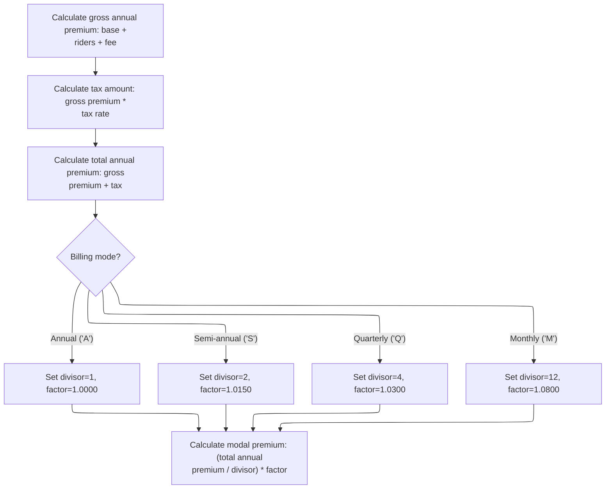

This section determines the total premium a customer owes for their life insurance policy, including adjustments for payment frequency. It ensures the modal premium reflects all components and billing mode factors.

| Rule ID | Category        | Rule Name                        | Description                                                                                                                                                                                                                                                                                                                                                                                                                                                                                                                                                                                                                                                                                                                                                                                   | Implementation Details                                                                                                                                                                                                                                                                             |
| ------- | --------------- | -------------------------------- | --------------------------------------------------------------------------------------------------------------------------------------------------------------------------------------------------------------------------------------------------------------------------------------------------------------------------------------------------------------------------------------------------------------------------------------------------------------------------------------------------------------------------------------------------------------------------------------------------------------------------------------------------------------------------------------------------------------------------------------------------------------------------------------------- | -------------------------------------------------------------------------------------------------------------------------------------------------------------------------------------------------------------------------------------------------------------------------------------------------- |
| BR-001  | Calculation     | Gross annual premium calculation | The gross annual premium is calculated as the sum of the base annual premium, rider annual total, and annual policy fee.                                                                                                                                                                                                                                                                                                                                                                                                                                                                                                                                                                                                                                                                      | The gross annual premium is a number representing the sum of base premium, rider premium, and policy fee. No specific output format is enforced in this section.                                                                                                                                   |
| BR-002  | Calculation     | Tax calculation                  | The tax amount is calculated as the gross annual premium multiplied by the tax rate.                                                                                                                                                                                                                                                                                                                                                                                                                                                                                                                                                                                                                                                                                                          | The tax rate is <SwmToken path="QCBLLESRC/NBUWMNT.cbl" pos="239:3:5" line-data="                   MOVE 0.0200 TO PM-TAX-RATE">`0.0200`</SwmToken> for all plan codes as per the provided variable information. The tax amount is a number representing the product of gross premium and tax rate. |
| BR-003  | Calculation     | Total annual premium calculation | The total annual premium is calculated as the sum of the gross annual premium and the tax amount.                                                                                                                                                                                                                                                                                                                                                                                                                                                                                                                                                                                                                                                                                             | The total annual premium is a number representing the sum of gross premium and tax amount.                                                                                                                                                                                                         |
| BR-004  | Calculation     | Modal premium calculation        | The modal premium is calculated as (total annual premium divided by divisor) multiplied by factor, reflecting the amount due per billing period.                                                                                                                                                                                                                                                                                                                                                                                                                                                                                                                                                                                                                                              | Modal premium formula: (total annual premium / divisor) \* factor. The modal premium is a number representing the amount due per billing period, adjusted for billing mode.                                                                                                                        |
| BR-005  | Decision Making | Billing mode adjustment          | The divisor and factor for modal premium calculation are set based on billing mode: Annual (divisor=1, factor=<SwmToken path="QCBLLESRC/NBUWMNT.cbl" pos="367:5:7" line-data="           ELSE MOVE 1.0000 TO PM-GENDER-FACTOR END-IF">`1.0000`</SwmToken>), Semi-annual (divisor=2, factor=<SwmToken path="QCBLLESRC/NBUWMNT.cbl" pos="463:3:5" line-data="                        MOVE 1.0150 TO WS-MODAL-FACTOR">`1.0150`</SwmToken>), Quarterly (divisor=4, factor=<SwmToken path="QCBLLESRC/NBUWMNT.cbl" pos="465:3:5" line-data="                        MOVE 1.0300 TO WS-MODAL-FACTOR">`1.0300`</SwmToken>), Monthly (divisor=12, factor=<SwmToken path="QCBLLESRC/NBUWMNT.cbl" pos="467:3:5" line-data="                        MOVE 1.0800 TO WS-MODAL-FACTOR">`1.0800`</SwmToken>). | Divisor and factor values:                                                                                                                                                                                                                                                                         |

- Annual: divisor=1, factor=<SwmToken path="QCBLLESRC/NBUWMNT.cbl" pos="367:5:7" line-data="           ELSE MOVE 1.0000 TO PM-GENDER-FACTOR END-IF">`1.0000`</SwmToken>
- Semi-annual: divisor=2, factor=<SwmToken path="QCBLLESRC/NBUWMNT.cbl" pos="463:3:5" line-data="                        MOVE 1.0150 TO WS-MODAL-FACTOR">`1.0150`</SwmToken>
- Quarterly: divisor=4, factor=<SwmToken path="QCBLLESRC/NBUWMNT.cbl" pos="465:3:5" line-data="                        MOVE 1.0300 TO WS-MODAL-FACTOR">`1.0300`</SwmToken>
- Monthly: divisor=12, factor=<SwmToken path="QCBLLESRC/NBUWMNT.cbl" pos="467:3:5" line-data="                        MOVE 1.0800 TO WS-MODAL-FACTOR">`1.0800`</SwmToken> These constants are used to adjust the modal premium calculation. |

<SwmSnippet path="/QCBLLESRC/NBUWMNT.cbl" line="451">

---

In <SwmToken path="QCBLLESRC/NBUWMNT.cbl" pos="451:1:7" line-data="       1800-CALCULATE-TOTAL-PREMIUM.">`1800-CALCULATE-TOTAL-PREMIUM`</SwmToken>, we add up the base, rider, and policy fee to get the gross annual premium, then calculate tax, and finally the total annual premium. We set the divisor and factor based on billing mode, so the modal premium reflects the user's payment frequency.

```cobol
       1800-CALCULATE-TOTAL-PREMIUM.
           COMPUTE PM-GROSS-ANNUAL-PREMIUM =
               PM-BASE-ANNUAL-PREMIUM + PM-RIDER-ANNUAL-TOTAL
               + PM-ANNUAL-POLICY-FEE
           COMPUTE PM-TAX-AMOUNT =
               PM-GROSS-ANNUAL-PREMIUM * PM-TAX-RATE
           COMPUTE PM-TOTAL-ANNUAL-PREMIUM =
               PM-GROSS-ANNUAL-PREMIUM + PM-TAX-AMOUNT
           EVALUATE PM-BILLING-MODE
               WHEN 'A' MOVE 1 TO WS-MODAL-DIVISOR
                        MOVE 1.0000 TO WS-MODAL-FACTOR
               WHEN 'S' MOVE 2 TO WS-MODAL-DIVISOR
                        MOVE 1.0150 TO WS-MODAL-FACTOR
               WHEN 'Q' MOVE 4 TO WS-MODAL-DIVISOR
                        MOVE 1.0300 TO WS-MODAL-FACTOR
               WHEN 'M' MOVE 12 TO WS-MODAL-DIVISOR
                        MOVE 1.0800 TO WS-MODAL-FACTOR
           END-EVALUATE
```

---

</SwmSnippet>

<SwmSnippet path="/QCBLLESRC/NBUWMNT.cbl" line="469">

---

After all the calculations, we get <SwmToken path="QCBLLESRC/NBUWMNT.cbl" pos="469:3:7" line-data="           COMPUTE PM-MODAL-PREMIUM =">`PM-MODAL-PREMIUM`</SwmToken>, which is the actual amount due per billing period. This value includes base, riders, fees, tax, and the billing mode adjustment.

```cobol
           COMPUTE PM-MODAL-PREMIUM =
               (PM-TOTAL-ANNUAL-PREMIUM / WS-MODAL-DIVISOR)
               * WS-MODAL-FACTOR.
```

---

</SwmSnippet>

## Saving and Displaying the Policy

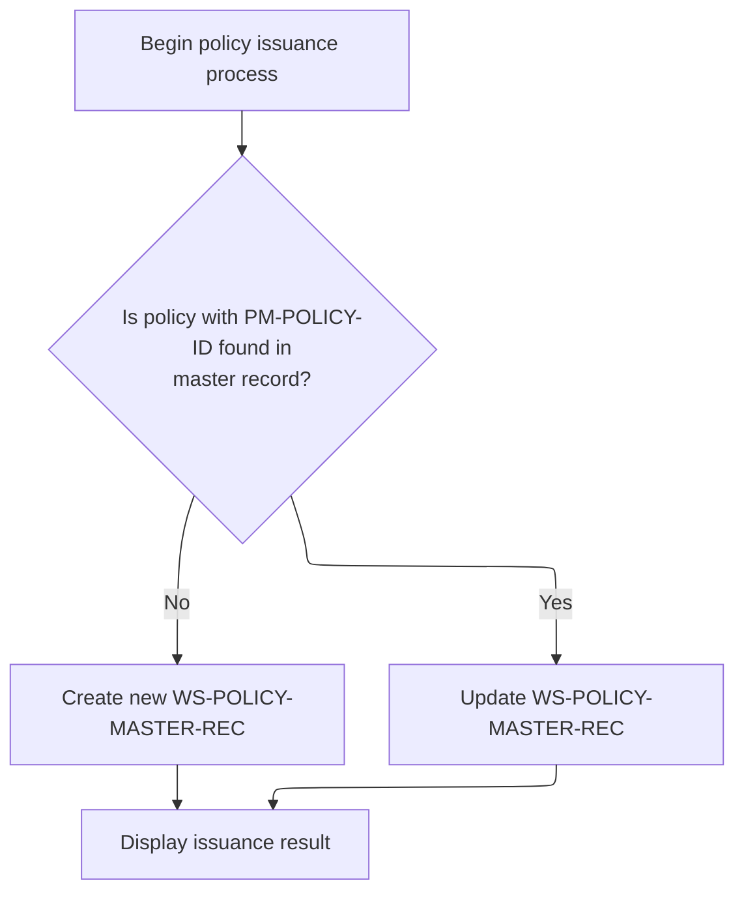

This section governs the final step of the policy issuance process, determining whether to create a new policy record or update an existing one, and then displaying the result.

| Rule ID | Category        | Rule Name                     | Description                                                                                                        | Implementation Details                                                                                                                          |
| ------- | --------------- | ----------------------------- | ------------------------------------------------------------------------------------------------------------------ | ----------------------------------------------------------------------------------------------------------------------------------------------- |
| BR-001  | Decision Making | Create new policy record      | If no policy exists with the provided policy ID in the master record, a new policy master record is created.       | The policy ID is a 12-character alphanumeric string. The new record is created using the current policy master record structure.                |
| BR-002  | Decision Making | Update existing policy record | If a policy exists with the provided policy ID in the master record, the existing policy master record is updated. | The policy ID is a 12-character alphanumeric string. The update is performed on the current policy master record structure.                     |
| BR-003  | Writing Output  | Display issuance result       | After saving or updating the policy master record, the result of the issuance process is displayed to the user.    | The result is displayed after the save or update operation. The format and content of the display are determined by the display result routine. |

<SwmSnippet path="/QCBLLESRC/NBUWMNT.cbl" line="198">

---

Back in <SwmToken path="QCBLLESRC/NBUWMNT.cbl" pos="84:3:7" line-data="                               PERFORM 5000-ISSUE-POLICY">`5000-ISSUE-POLICY`</SwmToken>, after finishing all premium calculations, we either write a new policy record or update the existing one, then display the result to the user. This is the last step in issuing the policy.

```cobol
           READ POLMST KEY IS PM-POLICY-ID
               INVALID KEY
                   WRITE WS-POLICY-MASTER-REC
               NOT INVALID KEY
                   REWRITE WS-POLICY-MASTER-REC
           END-READ
           PERFORM 8000-DISPLAY-RESULT.
```

---

</SwmSnippet>

&nbsp;

*This is an auto-generated document by Swimm 🌊 and has not yet been verified by a human*

<SwmMeta version="3.0.0" repo-id="Z2l0aHViJTNBJTNBTElGRTQwMCUzQSUzQW11ZGFzaW4x" repo-name="LIFE400"><sup>Powered by [Swimm](https://app.swimm.io/)</sup></SwmMeta>
