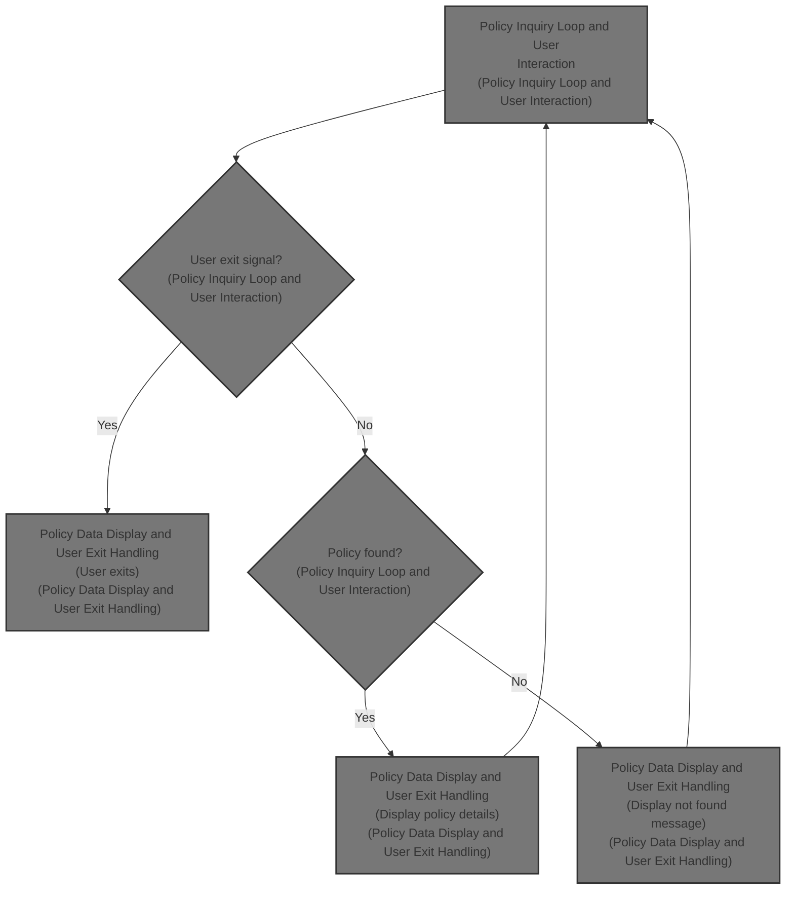
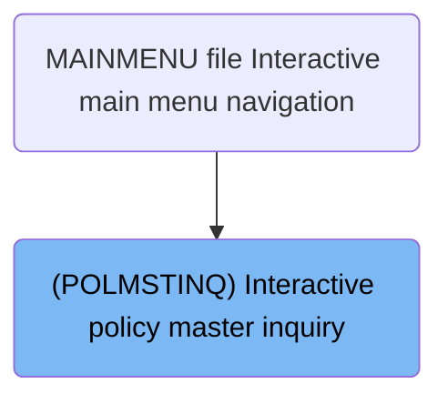

# Overview

This document describes the interactive flow for policy master inquiries. Users enter a policy ID and process date through the main menu interface, and the system responds by displaying policy details if found, or a not found message otherwise.



## Dependencies

### Program

- POLMSTINQ (<SwmPath>[QCBLLESRC/POLMSTINQ.cbl](QCBLLESRC/POLMSTINQ.cbl)</SwmPath>)

### Copybook

- POLDATA (<SwmPath>[QCPYSRC/POLDATA.cpy](QCPYSRC/POLDATA.cpy)</SwmPath>)

# Where is this program used?

This program is used once, as represented in the following diagram:



## Input and Output Tables/Files used

### POLMSTINQ (<SwmPath>[QCBLLESRC/POLMSTINQ.cbl](QCBLLESRC/POLMSTINQ.cbl)</SwmPath>)

| Table / File Name                                                                                                                                                       | Type | Description                                                  | Usage Mode   | Key Fields / Layout Highlights |
| ----------------------------------------------------------------------------------------------------------------------------------------------------------------------- | ---- | ------------------------------------------------------------ | ------------ | ------------------------------ |
| <SwmToken path="QCBLLESRC/POLMSTINQ.cbl" pos="75:3:7" line-data="                       WRITE INQ-DSP-RECORD FORMAT IS &#39;SVCRESULT&#39;">`INQ-DSP-RECORD`</SwmToken> | File | 80-char display buffer for screen output records             | Output       | File resource                  |
| \`POLMST                                                                                                                                                                | File | Indexed master file for life insurance policy records        | Input        | File resource                  |
| SVCDSPF                                                                                                                                                                 | File | Workstation file for user screen input/output and navigation | Input/Output | File resource                  |

# Workflow

# Policy Inquiry Loop and User Interaction

```mermaid
%%{init: {"flowchart": {"defaultRenderer": "elk"}} }%%
flowchart TD
    node1["Open files for inquiry"]
    click node1 openCode "QCBLLESRC/POLMSTINQ.cbl:62:63"
    node1 --> loop1
    subgraph loop1["Policy Inquiry Loop"]
        node2["Prompt for policy ID"]
        click node2 openCode "QCBLLESRC/POLMSTINQ.cbl:65:66"
        node2 --> node3{"User exit signal? (*IN03='1' or
*IN12='1')"}
        click node3 openCode "QCBLLESRC/POLMSTINQ.cbl:67:68"
        node3 -->|"Yes (WS-CONTINUE='N')"| node9["Exit loop"]
        node3 -->|"No (WS-CONTINUE='Y')"| node4["Lookup policy"]
        click node4 openCode "QCBLLESRC/POLMSTINQ.cbl:70:71"
        node4 --> node5{"Policy found? (WS-POLMST-STATUS='00')"}
        click node5 openCode "QCBLLESRC/POLMSTINQ.cbl:71:73"
        node5 -->|"Yes"| node7["Display policy details"]
        click node7 openCode "QCBLLESRC/POLMSTINQ.cbl:72"
        node5 -->|"No"| node8["Show not found message: 'POLICY NOT
FOUND - PLEASE TRY AGAIN'"]
        click node8 openCode "QCBLLESRC/POLMSTINQ.cbl:74:77"
        node7 --> node2
        node8 --> node2
    end
    loop1 --> node10["Close files and finish"]
    click node10 openCode "QCBLLESRC/POLMSTINQ.cbl:81:82"
classDef HeadingStyle fill:#777777,stroke:#333,stroke-width:2px;

%% Swimm:
%% %%{init: {"flowchart": {"defaultRenderer": "elk"}} }%%
%% flowchart TD
%%     node1["Open files for inquiry"]
%%     click node1 openCode "<SwmPath>[QCBLLESRC/POLMSTINQ.cbl](QCBLLESRC/POLMSTINQ.cbl)</SwmPath>:62:63"
%%     node1 --> loop1
%%     subgraph loop1["Policy Inquiry Loop"]
%%         node2["Prompt for policy ID"]
%%         click node2 openCode "<SwmPath>[QCBLLESRC/POLMSTINQ.cbl](QCBLLESRC/POLMSTINQ.cbl)</SwmPath>:65:66"
%%         node2 --> node3{"User exit signal? (*<SwmToken path="QCBLLESRC/POLMSTINQ.cbl" pos="67:4:4" line-data="               IF *IN03 = &#39;1&#39; OR *IN12 = &#39;1&#39;">`IN03`</SwmToken>='1' or
%% *<SwmToken path="QCBLLESRC/POLMSTINQ.cbl" pos="67:15:15" line-data="               IF *IN03 = &#39;1&#39; OR *IN12 = &#39;1&#39;">`IN12`</SwmToken>='1')"}
%%         click node3 openCode "<SwmPath>[QCBLLESRC/POLMSTINQ.cbl](QCBLLESRC/POLMSTINQ.cbl)</SwmPath>:67:68"
%%         node3 -->|"Yes (<SwmToken path="QCBLLESRC/POLMSTINQ.cbl" pos="65:5:7" line-data="           PERFORM UNTIL WS-CONTINUE = &#39;N&#39;">`WS-CONTINUE`</SwmToken>='N')"| node9["Exit loop"]
%%         node3 -->|"No (<SwmToken path="QCBLLESRC/POLMSTINQ.cbl" pos="65:5:7" line-data="           PERFORM UNTIL WS-CONTINUE = &#39;N&#39;">`WS-CONTINUE`</SwmToken>='Y')"| node4["Lookup policy"]
%%         click node4 openCode "<SwmPath>[QCBLLESRC/POLMSTINQ.cbl](QCBLLESRC/POLMSTINQ.cbl)</SwmPath>:70:71"
%%         node4 --> node5{"Policy found? (<SwmToken path="QCBLLESRC/POLMSTINQ.cbl" pos="71:3:7" line-data="                   IF WS-POLMST-STATUS = &#39;00&#39;">`WS-POLMST-STATUS`</SwmToken>='00')"}
%%         click node5 openCode "<SwmPath>[QCBLLESRC/POLMSTINQ.cbl](QCBLLESRC/POLMSTINQ.cbl)</SwmPath>:71:73"
%%         node5 -->|"Yes"| node7["Display policy details"]
%%         click node7 openCode "<SwmPath>[QCBLLESRC/POLMSTINQ.cbl](QCBLLESRC/POLMSTINQ.cbl)</SwmPath>:72"
%%         node5 -->|"No"| node8["Show not found message: 'POLICY NOT
%% FOUND - PLEASE TRY AGAIN'"]
%%         click node8 openCode "<SwmPath>[QCBLLESRC/POLMSTINQ.cbl](QCBLLESRC/POLMSTINQ.cbl)</SwmPath>:74:77"
%%         node7 --> node2
%%         node8 --> node2
%%     end
%%     loop1 --> node10["Close files and finish"]
%%     click node10 openCode "<SwmPath>[QCBLLESRC/POLMSTINQ.cbl](QCBLLESRC/POLMSTINQ.cbl)</SwmPath>:81:82"
%% classDef HeadingStyle fill:#777777,stroke:#333,stroke-width:2px;
```



This section manages the user-driven policy inquiry process, handling repeated user prompts, policy lookups, and displaying results or exit based on user actions.

| Rule ID | Category        | Rule Name                         | Description                                                                                                                                                                                                                                                                                                                                                                                                          | Implementation Details                                                                                                                                                                                                                                                                                                                                                                                                                                                                                                                                                                                                                                                                                               |
| ------- | --------------- | --------------------------------- | -------------------------------------------------------------------------------------------------------------------------------------------------------------------------------------------------------------------------------------------------------------------------------------------------------------------------------------------------------------------------------------------------------------------- | -------------------------------------------------------------------------------------------------------------------------------------------------------------------------------------------------------------------------------------------------------------------------------------------------------------------------------------------------------------------------------------------------------------------------------------------------------------------------------------------------------------------------------------------------------------------------------------------------------------------------------------------------------------------------------------------------------------------- |
| BR-001  | Reading Input   | User Prompt for Policy ID         | Prompt the user for a policy ID and process date at the start of each inquiry loop iteration.                                                                                                                                                                                                                                                                                                                        | The policy ID is a string up to 12 characters. The process date is in YYYYMMDD format (8 digits).                                                                                                                                                                                                                                                                                                                                                                                                                                                                                                                                                                                                                    |
| BR-002  | Decision Making | User Exit Signal                  | If the user signals exit (by pressing <SwmToken path="QCBLLESRC/POLMSTINQ.cbl" pos="12:5:5" line-data="      *   -&gt; F3=EXIT OR F12=BACK                                      *">`F3`</SwmToken> or <SwmToken path="QCBLLESRC/POLMSTINQ.cbl" pos="12:11:11" line-data="      *   -&gt; F3=EXIT OR F12=BACK                                      *">`F12`</SwmToken>), the inquiry loop ends and the process exits. | <SwmToken path="QCBLLESRC/POLMSTINQ.cbl" pos="12:5:5" line-data="      *   -&gt; F3=EXIT OR F12=BACK                                      *">`F3`</SwmToken> and <SwmToken path="QCBLLESRC/POLMSTINQ.cbl" pos="12:11:11" line-data="      *   -&gt; F3=EXIT OR F12=BACK                                      *">`F12`</SwmToken> are mapped to \*<SwmToken path="QCBLLESRC/POLMSTINQ.cbl" pos="67:4:4" line-data="               IF *IN03 = &#39;1&#39; OR *IN12 = &#39;1&#39;">`IN03`</SwmToken>='1' and \*<SwmToken path="QCBLLESRC/POLMSTINQ.cbl" pos="67:15:15" line-data="               IF *IN03 = &#39;1&#39; OR *IN12 = &#39;1&#39;">`IN12`</SwmToken>='1'. The loop control variable is set to 'N' to exit. |
| BR-003  | Decision Making | Display Policy Details on Success | If the policy is found in the master file, display the policy details to the user.                                                                                                                                                                                                                                                                                                                                   | Policy details are displayed using the display screen. The lookup status '00' indicates success.                                                                                                                                                                                                                                                                                                                                                                                                                                                                                                                                                                                                                     |
| BR-004  | Decision Making | Inquiry Loop Continuation         | The inquiry loop continues to prompt for new policy IDs and process dates until the user signals exit.                                                                                                                                                                                                                                                                                                               | The loop control variable is initialized to 'Y' and set to 'N' on user exit.                                                                                                                                                                                                                                                                                                                                                                                                                                                                                                                                                                                                                                         |
| BR-005  | Writing Output  | Policy Not Found Message          | If the policy is not found, display the message 'POLICY NOT FOUND - PLEASE TRY AGAIN' to the user.                                                                                                                                                                                                                                                                                                                   | The not found message is: 'POLICY NOT FOUND - PLEASE TRY AGAIN'. This message is displayed on the result screen.                                                                                                                                                                                                                                                                                                                                                                                                                                                                                                                                                                                                     |

<SwmSnippet path="/QCBLLESRC/POLMSTINQ.cbl" line="61">

---

<SwmToken path="QCBLLESRC/POLMSTINQ.cbl" pos="61:1:3" line-data="       MAIN-PROCESS.">`MAIN-PROCESS`</SwmToken> sets up the main user interaction loop for policy inquiries. It opens the display and policy master files, then loops until the user signals to exit. Each iteration, it calls <SwmToken path="QCBLLESRC/POLMSTINQ.cbl" pos="66:3:9" line-data="               PERFORM 1000-GET-POLICY-ID">`1000-GET-POLICY-ID`</SwmToken> to get the latest policy ID and date from the user, so every lookup is based on new input. If the user hits <SwmToken path="QCBLLESRC/POLMSTINQ.cbl" pos="12:5:5" line-data="      *   -&gt; F3=EXIT OR F12=BACK                                      *">`F3`</SwmToken> or <SwmToken path="QCBLLESRC/POLMSTINQ.cbl" pos="12:11:11" line-data="      *   -&gt; F3=EXIT OR F12=BACK                                      *">`F12`</SwmToken>, it exits. Otherwise, it calls <SwmToken path="QCBLLESRC/POLMSTINQ.cbl" pos="70:3:7" line-data="                   PERFORM 2000-LOOKUP-POLICY">`2000-LOOKUP-POLICY`</SwmToken> to search for the policy. If found, it calls <SwmToken path="QCBLLESRC/POLMSTINQ.cbl" pos="72:3:7" line-data="                       PERFORM 3000-DISPLAY-POLICY">`3000-DISPLAY-POLICY`</SwmToken> to show the details; if not, it displays a not found message and waits for the next input. After the loop, it closes the files and returns control.

```cobol
       MAIN-PROCESS.
           OPEN I-O SVCDSPF
           OPEN INPUT POLMST

           PERFORM UNTIL WS-CONTINUE = 'N'
               PERFORM 1000-GET-POLICY-ID
               IF *IN03 = '1' OR *IN12 = '1'
                   MOVE 'N' TO WS-CONTINUE
               ELSE
                   PERFORM 2000-LOOKUP-POLICY
                   IF WS-POLMST-STATUS = '00'
                       PERFORM 3000-DISPLAY-POLICY
                   ELSE
                       MOVE WS-NOT-FOUND-MSG TO SVCMSG
                       WRITE INQ-DSP-RECORD FORMAT IS 'SVCRESULT'
                       READ SVCDSPF FORMAT IS 'SVCRESULT'
                   END-IF
               END-IF
           END-PERFORM

           CLOSE SVCDSPF POLMST
           GOBACK.
```

---

</SwmSnippet>

<SwmSnippet path="/QCBLLESRC/POLMSTINQ.cbl" line="87">

---

<SwmToken path="QCBLLESRC/POLMSTINQ.cbl" pos="87:1:7" line-data="       1000-GET-POLICY-ID.">`1000-GET-POLICY-ID`</SwmToken> resets the policy ID, grabs the process date in YYYYMMDD format, sets the screen to inquiry mode (so no edits allowed), writes and reads the display record for the header, and finally moves the captured values into the working storage fields for the next steps.

```cobol
       1000-GET-POLICY-ID.
           MOVE SPACES TO SVCPOLID
      *Y2K-REVIEWED 1998-11-14
           ACCEPT SVCPRCDT FROM DATE YYYYMMDD
      * SET INDICATOR 90 = INQUIRY MODE (HIDES AMENDMENT FIELDS)
           MOVE '1' TO *IN90
           WRITE INQ-DSP-RECORD FORMAT IS 'SVCHDR'
           READ SVCDSPF FORMAT IS 'SVCHDR'
           MOVE SVCPOLID TO PM-POLICY-ID
           MOVE SVCPRCDT TO PM-PROCESS-DATE.
```

---

</SwmSnippet>

<SwmSnippet path="/QCBLLESRC/POLMSTINQ.cbl" line="101">

---

<SwmToken path="QCBLLESRC/POLMSTINQ.cbl" pos="101:1:5" line-data="       2000-LOOKUP-POLICY.">`2000-LOOKUP-POLICY`</SwmToken> tries to read the policy record from POLMST using the policy ID. It doesn't handle errors here—just attempts the read and lets the main process check the result and decide what to do next.

```cobol
       2000-LOOKUP-POLICY.
           READ POLMST KEY IS PM-POLICY-ID
               INVALID KEY
                   CONTINUE
               NOT INVALID KEY
                   CONTINUE
           END-READ.
```

---

</SwmSnippet>

# Policy Data Display and User Exit Handling

This section is responsible for displaying policy data to the user in a formatted manner and handling user exit requests via function keys.

| Rule ID | Category        | Rule Name                 | Description                                                                                                                                                                                                                                                                                                                                                                                                                                                                         | Implementation Details                                                                                                                                                                                                                                                                                                                                                                                                                                                                                                                                                                                                                                                                                                       |
| ------- | --------------- | ------------------------- | ----------------------------------------------------------------------------------------------------------------------------------------------------------------------------------------------------------------------------------------------------------------------------------------------------------------------------------------------------------------------------------------------------------------------------------------------------------------------------------- | ---------------------------------------------------------------------------------------------------------------------------------------------------------------------------------------------------------------------------------------------------------------------------------------------------------------------------------------------------------------------------------------------------------------------------------------------------------------------------------------------------------------------------------------------------------------------------------------------------------------------------------------------------------------------------------------------------------------------------- |
| BR-001  | Reading Input   | Policy data mapping       | Policy data from the master record is mapped to display fields so that the displayed information accurately reflects the current policy details.                                                                                                                                                                                                                                                                                                                                    | The mapping includes plan code, contract status, billing mode, sum assured, modal premium, insured name, issue age, attained age, issue date, expiry date, and paid-to date. All fields are mapped as-is without transformation.                                                                                                                                                                                                                                                                                                                                                                                                                                                                                             |
| BR-002  | Decision Making | User exit on function key | If the user presses <SwmToken path="QCBLLESRC/POLMSTINQ.cbl" pos="12:5:5" line-data="      *   -&gt; F3=EXIT OR F12=BACK                                      *">`F3`</SwmToken> or <SwmToken path="QCBLLESRC/POLMSTINQ.cbl" pos="12:11:11" line-data="      *   -&gt; F3=EXIT OR F12=BACK                                      *">`F12`</SwmToken>, the system sets the continue flag to 'N', indicating that the main loop should exit and the user is returned from the display. | <SwmToken path="QCBLLESRC/POLMSTINQ.cbl" pos="12:5:5" line-data="      *   -&gt; F3=EXIT OR F12=BACK                                      *">`F3`</SwmToken> and <SwmToken path="QCBLLESRC/POLMSTINQ.cbl" pos="12:11:11" line-data="      *   -&gt; F3=EXIT OR F12=BACK                                      *">`F12`</SwmToken> are represented by \*<SwmToken path="QCBLLESRC/POLMSTINQ.cbl" pos="67:4:4" line-data="               IF *IN03 = &#39;1&#39; OR *IN12 = &#39;1&#39;">`IN03`</SwmToken> and \*<SwmToken path="QCBLLESRC/POLMSTINQ.cbl" pos="67:15:15" line-data="               IF *IN03 = &#39;1&#39; OR *IN12 = &#39;1&#39;">`IN12`</SwmToken> being '1'. The continue flag is set to 'N' to indicate exit. |
| BR-003  | Writing Output  | Display record formatting | Policy display records are written in both 'SVCPOL' and 'SVCFKEYS' formats to ensure the information is available in both required display formats.                                                                                                                                                                                                                                                                                                                                 | The formats used are 'SVCPOL' and 'SVCFKEYS'. The output is written as display records in these formats.                                                                                                                                                                                                                                                                                                                                                                                                                                                                                                                                                                                                                     |

<SwmSnippet path="/QCBLLESRC/POLMSTINQ.cbl" line="112">

---

In <SwmToken path="QCBLLESRC/POLMSTINQ.cbl" pos="112:1:5" line-data="       3000-DISPLAY-POLICY.">`3000-DISPLAY-POLICY`</SwmToken>, the policy data is moved from the master record fields to the display fields, then the display records are written in both 'SVCPOL' and 'SVCFKEYS' formats. The display file is read to show the policy info and wait for user action.

```cobol
       3000-DISPLAY-POLICY.
           MOVE PM-PLAN-CODE TO SVCPLANC
           MOVE PM-CONTRACT-STATUS TO SVCCNTRST
           MOVE PM-BILLING-MODE TO SVCBILMD
           MOVE PM-SUM-ASSURED TO SVCSUMASR
           MOVE PM-MODAL-PREMIUM TO SVCMODPRM
           MOVE PM-INSURED-NAME TO SVCINSNAM
           MOVE PM-ISSUE-AGE TO SVCISSAGE
           MOVE PM-ATTAINED-AGE TO SVCATTNAG
           MOVE PM-ISSUE-DATE TO SVCISSDT
           MOVE PM-EXPIRY-DATE TO SVCEXPDT
           MOVE PM-PAID-TO-DATE TO SVCPAIDTO
           MOVE SPACES TO SVCMSG
           WRITE INQ-DSP-RECORD FORMAT IS 'SVCPOL'
           WRITE INQ-DSP-RECORD FORMAT IS 'SVCFKEYS'
           READ SVCDSPF FORMAT IS 'SVCPOL'
```

---

</SwmSnippet>

<SwmSnippet path="/QCBLLESRC/POLMSTINQ.cbl" line="129">

---

After displaying the policy, the function checks if the user pressed <SwmToken path="QCBLLESRC/POLMSTINQ.cbl" pos="12:5:5" line-data="      *   -&gt; F3=EXIT OR F12=BACK                                      *">`F3`</SwmToken> or <SwmToken path="QCBLLESRC/POLMSTINQ.cbl" pos="12:11:11" line-data="      *   -&gt; F3=EXIT OR F12=BACK                                      *">`F12`</SwmToken>. If so, it sets <SwmToken path="QCBLLESRC/POLMSTINQ.cbl" pos="130:9:11" line-data="               MOVE &#39;N&#39; TO WS-CONTINUE">`WS-CONTINUE`</SwmToken> to 'N' to exit the main loop; otherwise, it keeps going.

```cobol
           IF *IN03 = '1' OR *IN12 = '1'
               MOVE 'N' TO WS-CONTINUE
           END-IF.
```

---

</SwmSnippet>

&nbsp;

*This is an auto-generated document by Swimm 🌊 and has not yet been verified by a human*

<SwmMeta version="3.0.0" repo-id="Z2l0aHViJTNBJTNBTElGRTQwMCUzQSUzQW11ZGFzaW4x" repo-name="LIFE400"><sup>Powered by [Swimm](https://app.swimm.io/)</sup></SwmMeta>
