# Overview

This document explains the flow of batch servicing amendments for term life insurance policies. The process receives amendment requests, validates eligibility, applies business rules for various amendments, and recalculates premiums and fees. The outcome is an updated policy record reflecting the applied amendments and result codes/messages.

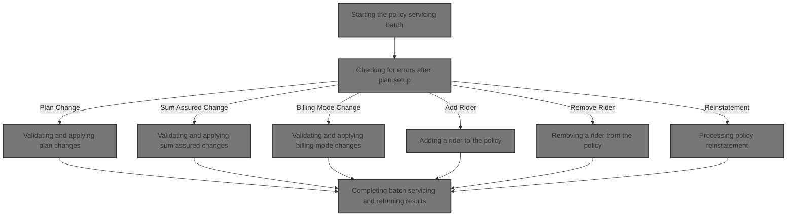

## Dependencies

### Program

- SVCBILB (<SwmPath>[QCBLLESRC/SVCBILB.cbl](QCBLLESRC/SVCBILB.cbl)</SwmPath>)

### Copybook

- POLDATA (<SwmPath>[QCPYSRC/POLDATA.cpy](QCPYSRC/POLDATA.cpy)</SwmPath>)

## Input and Output Tables/Files used

### SVCBILB (<SwmPath>[QCBLLESRC/SVCBILB.cbl](QCBLLESRC/SVCBILB.cbl)</SwmPath>)

| Table / File Name                                                                                                                              | Type | Description                                              | Usage Mode   | Key Fields / Layout Highlights |
| ---------------------------------------------------------------------------------------------------------------------------------------------- | ---- | -------------------------------------------------------- | ------------ | ------------------------------ |
| POLMST                                                                                                                                         | File | Policy master data for term life insurance policies      | Input/Output | File resource                  |
| SVCPF                                                                                                                                          | File | Servicing and amendment transaction records for policies | Input/Output | File resource                  |
| <SwmToken path="QCBLLESRC/SVCBILB.cbl" pos="109:3:9" line-data="               REWRITE WS-POLICY-MASTER-REC">`WS-POLICY-MASTER-REC`</SwmToken> | File | In-memory working copy of a policy master record         | Output       | File resource                  |

# Workflow

# Starting the policy servicing batch

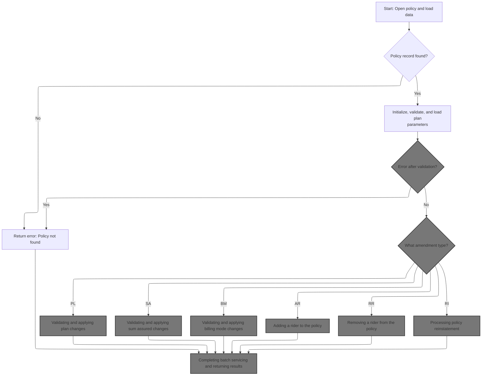

This section ensures that policy servicing only proceeds for valid, existing policies. It initializes the amendment state and result fields, and guarantees that a valid process date is set before any amendments or calculations are performed.

| Rule ID | Category        | Rule Name                      | Description                                                                                                                                                                                 | Implementation Details                                                                                                                                                                              |
| ------- | --------------- | ------------------------------ | ------------------------------------------------------------------------------------------------------------------------------------------------------------------------------------------- | --------------------------------------------------------------------------------------------------------------------------------------------------------------------------------------------------- |
| BR-001  | Data validation | Policy existence required      | If the policy record matching the provided policy identifier is not found, set the result code to 11 and the result message to 'POLICY RECORD NOT FOUND', then terminate the batch process. | The result code is set to 11 (number). The result message is set to the string 'POLICY RECORD NOT FOUND' (up to 100 characters, left-aligned, space-padded if shorter).                             |
| BR-002  | Data validation | Process date required          | If the process date is not already set in the policy record, obtain the current date and set it as the process date before proceeding with servicing.                                       | The process date is set as an 8-digit number in YYYYMMDD format.                                                                                                                                    |
| BR-003  | Calculation     | Amendment state initialization | Before any servicing logic is performed, the amendment state is reset, the action is stamped, and the result code and message are cleared to ensure a clean processing context.             | The amendment status is set to 'PE' (pending). The result code is set to 0 (number). The result message is set to spaces (up to 100 characters). The last action user is set to 'SVCBILB' (string). |

<SwmSnippet path="/QCBLLESRC/SVCBILB.cbl" line="90">

---

In <SwmToken path="QCBLLESRC/SVCBILB.cbl" pos="90:1:3" line-data="       MAIN-PROCESS.">`MAIN-PROCESS`</SwmToken>, we open the policy master and servicing files, set up the policy ID, and try to read the policy record. If the record isn't found, we bail out early with an error code and message, closing everything before returning.

```cobol
       MAIN-PROCESS.
           OPEN I-O POLMST
           OPEN I-O SVCPF
           MOVE LK-POLICY-ID TO PM-POLICY-ID
           READ POLMST
               INVALID KEY
                   MOVE 11 TO WS-RESULT-CODE
                   MOVE 'POLICY RECORD NOT FOUND' TO WS-RESULT-MESSAGE
                   CLOSE POLMST SVCPF
                   GOBACK
           END-READ
```

---

</SwmSnippet>

<SwmSnippet path="/QCBLLESRC/SVCBILB.cbl" line="101">

---

After confirming the policy exists, we call <SwmToken path="QCBLLESRC/SVCBILB.cbl" pos="101:3:5" line-data="           PERFORM 1000-INITIALIZE">`1000-INITIALIZE`</SwmToken> to prep the amendment state, clear any old results, and set up the process date. This makes sure all subsequent steps work off a fresh baseline.

```cobol
           PERFORM 1000-INITIALIZE
           PERFORM 1100-LOAD-PLAN-PARAMETERS
           PERFORM 1200-CALCULATE-ATTAINED-AGE
           PERFORM 1300-EVALUATE-PAYMENT-STATUS
           PERFORM 1400-VALIDATE-SERVICING-REQUEST
```

---

</SwmSnippet>

<SwmSnippet path="/QCBLLESRC/SVCBILB.cbl" line="130">

---

<SwmToken path="QCBLLESRC/SVCBILB.cbl" pos="130:1:3" line-data="       1000-INITIALIZE.">`1000-INITIALIZE`</SwmToken> resets amendment state, stamps the action, and ensures the process date is valid.

```cobol
       1000-INITIALIZE.
           MOVE PM-TOTAL-ANNUAL-PREMIUM TO WS-OLD-TOTAL-PREMIUM
           MOVE ZEROS TO PM-PREMIUM-DELTA
           MOVE 'PE' TO PM-AMENDMENT-STATUS
           MOVE ZEROS TO WS-RESULT-CODE
           MOVE SPACES TO WS-RESULT-MESSAGE
      *Y2K-REVIEWED 1998-11-14
           IF PM-PROCESS-DATE = 0
               ACCEPT PM-PROCESS-DATE FROM DATE YYYYMMDD
           END-IF
           MOVE 'SVCBILB' TO PM-LAST-ACTION-USER
           MOVE PM-PROCESS-DATE TO PM-LAST-ACTION-DATE.
```

---

</SwmSnippet>

## Setting plan parameters based on plan code

```mermaid
%%{init: {"flowchart": {"defaultRenderer": "elk"}} }%%
flowchart TD
    node1["Load plan parameters"] --> node2{"Plan code?"}
    click node1 openCode "QCBLLESRC/SVCBILB.cbl:146:147"
    click node2 openCode "QCBLLESRC/SVCBILB.cbl:147:182"
    node2 -->|T1001| node3["Set T1001 parameters:
- Term: 10
yrs
- Maturity age: 70
- Issue age:
18-60
- Sum assured: 10T-50T
- Fee:
4500
- Tax: 2%"]
    click node3 openCode "QCBLLESRC/SVCBILB.cbl:148:158"
    node2 -->|T2001| node4["Set T2001 parameters:
- Term: 20
yrs
- Maturity age: 75
- Issue age:
18-55
- Sum assured: 10T-90T
- Fee:
5500
- Tax: 2%"]
    click node4 openCode "QCBLLESRC/SVCBILB.cbl:159:169"
    node2 -->|T6501| node5["Set T6501 parameters:
- Maturity age:
65
- Issue age: 18-50
- Sum assured:
10T-75T
- Fee: 6000
- Tax: 2%
- Term
= maturity age - issue age"]
    click node5 openCode "QCBLLESRC/SVCBILB.cbl:170:182"
classDef HeadingStyle fill:#777777,stroke:#333,stroke-width:2px;

%% Swimm:
%% %%{init: {"flowchart": {"defaultRenderer": "elk"}} }%%
%% flowchart TD
%%     node1["Load plan parameters"] --> node2{"Plan code?"}
%%     click node1 openCode "<SwmPath>[QCBLLESRC/SVCBILB.cbl](QCBLLESRC/SVCBILB.cbl)</SwmPath>:146:147"
%%     click node2 openCode "<SwmPath>[QCBLLESRC/SVCBILB.cbl](QCBLLESRC/SVCBILB.cbl)</SwmPath>:147:182"
%%     node2 -->|<SwmToken path="QCBLLESRC/SVCBILB.cbl" pos="148:4:4" line-data="               WHEN &#39;T1001&#39;">`T1001`</SwmToken>| node3["Set <SwmToken path="QCBLLESRC/SVCBILB.cbl" pos="148:4:4" line-data="               WHEN &#39;T1001&#39;">`T1001`</SwmToken> parameters:
%% - Term: 10
%% yrs
%% - Maturity age: 70
%% - Issue age:
%% 18-60
%% - Sum assured: 10T-50T
%% - Fee:
%% 4500
%% - Tax: 2%"]
%%     click node3 openCode "<SwmPath>[QCBLLESRC/SVCBILB.cbl](QCBLLESRC/SVCBILB.cbl)</SwmPath>:148:158"
%%     node2 -->|<SwmToken path="QCBLLESRC/SVCBILB.cbl" pos="159:4:4" line-data="               WHEN &#39;T2001&#39;">`T2001`</SwmToken>| node4["Set <SwmToken path="QCBLLESRC/SVCBILB.cbl" pos="159:4:4" line-data="               WHEN &#39;T2001&#39;">`T2001`</SwmToken> parameters:
%% - Term: 20
%% yrs
%% - Maturity age: 75
%% - Issue age:
%% 18-55
%% - Sum assured: 10T-90T
%% - Fee:
%% 5500
%% - Tax: 2%"]
%%     click node4 openCode "<SwmPath>[QCBLLESRC/SVCBILB.cbl](QCBLLESRC/SVCBILB.cbl)</SwmPath>:159:169"
%%     node2 -->|<SwmToken path="QCBLLESRC/SVCBILB.cbl" pos="170:4:4" line-data="               WHEN &#39;T6501&#39;">`T6501`</SwmToken>| node5["Set <SwmToken path="QCBLLESRC/SVCBILB.cbl" pos="170:4:4" line-data="               WHEN &#39;T6501&#39;">`T6501`</SwmToken> parameters:
%% - Maturity age:
%% 65
%% - Issue age: 18-50
%% - Sum assured:
%% 10T-75T
%% - Fee: 6000
%% - Tax: 2%
%% - Term
%% = maturity age - issue age"]
%%     click node5 openCode "<SwmPath>[QCBLLESRC/SVCBILB.cbl](QCBLLESRC/SVCBILB.cbl)</SwmPath>:170:182"
%% classDef HeadingStyle fill:#777777,stroke:#333,stroke-width:2px;
```

This section assigns all plan-specific constants to the policy master record based on the plan code. It ensures that each supported plan type has the correct business parameters for downstream processing.

| Rule ID | Category        | Rule Name                                                                                                                                                    | Description                                                                                                                                                                                                                                                                                                                                                                                                                                                                                                    | Implementation Details                                                                                                                                                                                                                                                                                                                                                                               |
| ------- | --------------- | ------------------------------------------------------------------------------------------------------------------------------------------------------------ | -------------------------------------------------------------------------------------------------------------------------------------------------------------------------------------------------------------------------------------------------------------------------------------------------------------------------------------------------------------------------------------------------------------------------------------------------------------------------------------------------------------- | ---------------------------------------------------------------------------------------------------------------------------------------------------------------------------------------------------------------------------------------------------------------------------------------------------------------------------------------------------------------------------------------------------- |
| BR-001  | Decision Making | <SwmToken path="QCBLLESRC/SVCBILB.cbl" pos="148:4:4" line-data="               WHEN &#39;T1001&#39;">`T1001`</SwmToken> plan parameters                      | When the plan code is <SwmToken path="QCBLLESRC/SVCBILB.cbl" pos="148:4:4" line-data="               WHEN &#39;T1001&#39;">`T1001`</SwmToken>, set the plan parameters as follows: term years to 10, maturity age to 70, minimum issue age to 18, maximum issue age to 60, minimum sum assured to 10,000,000,000,000, maximum sum assured to 50,000,000,000,000, grace days to 30, reinstatement window to 730, annual policy fee to 4,500, and tax rate to 2%.                                                | All values are numeric. Term years: 10; Maturity age: 70; Issue age: 18-60; Sum assured: 10,000,000,000,000 to 50,000,000,000,000; Grace days: 30; Reinstatement window: 730; Annual policy fee: 4,500; Tax rate: <SwmToken path="QCBLLESRC/SVCBILB.cbl" pos="158:3:5" line-data="                   MOVE 0.0200 TO PM-TAX-RATE">`0.0200`</SwmToken> (2%).                                           |
| BR-002  | Decision Making | <SwmToken path="QCBLLESRC/SVCBILB.cbl" pos="159:4:4" line-data="               WHEN &#39;T2001&#39;">`T2001`</SwmToken> plan parameters                      | When the plan code is <SwmToken path="QCBLLESRC/SVCBILB.cbl" pos="159:4:4" line-data="               WHEN &#39;T2001&#39;">`T2001`</SwmToken>, set the plan parameters as follows: term years to 20, maturity age to 75, minimum issue age to 18, maximum issue age to 55, minimum sum assured to 10,000,000,000,000, maximum sum assured to 90,000,000,000,000, grace days to 30, reinstatement window to 730, annual policy fee to 5,500, and tax rate to 2%.                                                | All values are numeric. Term years: 20; Maturity age: 75; Issue age: 18-55; Sum assured: 10,000,000,000,000 to 90,000,000,000,000; Grace days: 30; Reinstatement window: 730; Annual policy fee: 5,500; Tax rate: <SwmToken path="QCBLLESRC/SVCBILB.cbl" pos="158:3:5" line-data="                   MOVE 0.0200 TO PM-TAX-RATE">`0.0200`</SwmToken> (2%).                                           |
| BR-003  | Decision Making | <SwmToken path="QCBLLESRC/SVCBILB.cbl" pos="170:4:4" line-data="               WHEN &#39;T6501&#39;">`T6501`</SwmToken> plan parameters with calculated term | When the plan code is <SwmToken path="QCBLLESRC/SVCBILB.cbl" pos="170:4:4" line-data="               WHEN &#39;T6501&#39;">`T6501`</SwmToken>, set the plan parameters as follows: maturity age to 65, minimum issue age to 18, maximum issue age to 50, minimum sum assured to 10,000,000,000,000, maximum sum assured to 75,000,000,000,000, grace days to 30, reinstatement window to 730, annual policy fee to 6,000, tax rate to 2%, and term years as the difference between maturity age and issue age. | All values are numeric. Maturity age: 65; Issue age: 18-50; Sum assured: 10,000,000,000,000 to 75,000,000,000,000; Grace days: 30; Reinstatement window: 730; Annual policy fee: 6,000; Tax rate: <SwmToken path="QCBLLESRC/SVCBILB.cbl" pos="158:3:5" line-data="                   MOVE 0.0200 TO PM-TAX-RATE">`0.0200`</SwmToken> (2%). Term years is calculated as maturity age minus issue age. |
| BR-004  | Decision Making | No handling for unknown plan codes                                                                                                                           | If the plan code does not match <SwmToken path="QCBLLESRC/SVCBILB.cbl" pos="148:4:4" line-data="               WHEN &#39;T1001&#39;">`T1001`</SwmToken>, <SwmToken path="QCBLLESRC/SVCBILB.cbl" pos="159:4:4" line-data="               WHEN &#39;T2001&#39;">`T2001`</SwmToken>, or <SwmToken path="QCBLLESRC/SVCBILB.cbl" pos="170:4:4" line-data="               WHEN &#39;T6501&#39;">`T6501`</SwmToken>, no plan parameters are set and no error or message is generated.                                 | No output or error is produced for unknown plan codes. Plan parameters remain unset in this context.                                                                                                                                                                                                                                                                                                 |

<SwmSnippet path="/QCBLLESRC/SVCBILB.cbl" line="146">

---

In <SwmToken path="QCBLLESRC/SVCBILB.cbl" pos="146:1:7" line-data="       1100-LOAD-PLAN-PARAMETERS.">`1100-LOAD-PLAN-PARAMETERS`</SwmToken>, we use a switch on <SwmToken path="QCBLLESRC/SVCBILB.cbl" pos="147:3:7" line-data="           EVALUATE PM-PLAN-CODE">`PM-PLAN-CODE`</SwmToken> to set all the plan constants. If the code matches <SwmToken path="QCBLLESRC/SVCBILB.cbl" pos="148:4:4" line-data="               WHEN &#39;T1001&#39;">`T1001`</SwmToken>, <SwmToken path="QCBLLESRC/SVCBILB.cbl" pos="159:4:4" line-data="               WHEN &#39;T2001&#39;">`T2001`</SwmToken>, or <SwmToken path="QCBLLESRC/SVCBILB.cbl" pos="170:4:4" line-data="               WHEN &#39;T6501&#39;">`T6501`</SwmToken>, we assign the relevant values. There's no handling for unknown codes.

```cobol
       1100-LOAD-PLAN-PARAMETERS.
           EVALUATE PM-PLAN-CODE
               WHEN 'T1001'
                   MOVE 10 TO PM-TERM-YEARS
                   MOVE 70 TO PM-MATURITY-AGE
                   MOVE 18 TO PM-MIN-ISSUE-AGE
                   MOVE 60 TO PM-MAX-ISSUE-AGE
                   MOVE  10000000000000 TO PM-MIN-SUM-ASSURED
                   MOVE  50000000000000 TO PM-MAX-SUM-ASSURED
                   MOVE 30 TO PM-GRACE-DAYS
                   MOVE 730 TO PM-REINSTATE-WINDOW
                   MOVE 4500 TO PM-ANNUAL-POLICY-FEE
                   MOVE 0.0200 TO PM-TAX-RATE
```

---

</SwmSnippet>

<SwmSnippet path="/QCBLLESRC/SVCBILB.cbl" line="159">

---

This section handles the <SwmToken path="QCBLLESRC/SVCBILB.cbl" pos="159:4:4" line-data="               WHEN &#39;T2001&#39;">`T2001`</SwmToken> plan code, assigning its specific constants for term, maturity, issue ages, sum assured limits, grace days, reinstatement window, policy fee, and tax rate. It's just another branch in the plan code switch.

```cobol
               WHEN 'T2001'
                   MOVE 20 TO PM-TERM-YEARS
                   MOVE 75 TO PM-MATURITY-AGE
                   MOVE 18 TO PM-MIN-ISSUE-AGE
                   MOVE 55 TO PM-MAX-ISSUE-AGE
                   MOVE  10000000000000 TO PM-MIN-SUM-ASSURED
                   MOVE  90000000000000 TO PM-MAX-SUM-ASSURED
                   MOVE 30 TO PM-GRACE-DAYS
                   MOVE 730 TO PM-REINSTATE-WINDOW
                   MOVE 5500 TO PM-ANNUAL-POLICY-FEE
                   MOVE 0.0200 TO PM-TAX-RATE
```

---

</SwmSnippet>

<SwmSnippet path="/QCBLLESRC/SVCBILB.cbl" line="170">

---

This section covers the <SwmToken path="QCBLLESRC/SVCBILB.cbl" pos="170:4:4" line-data="               WHEN &#39;T6501&#39;">`T6501`</SwmToken> plan code, assigning its constants and computing term years as maturity age minus issue age. After this, all plan parameters are set for the policy, unless the plan code was unknown.

```cobol
               WHEN 'T6501'
                   MOVE 65 TO PM-MATURITY-AGE
                   MOVE 18 TO PM-MIN-ISSUE-AGE
                   MOVE 50 TO PM-MAX-ISSUE-AGE
                   MOVE  10000000000000 TO PM-MIN-SUM-ASSURED
                   MOVE  75000000000000 TO PM-MAX-SUM-ASSURED
                   MOVE 30 TO PM-GRACE-DAYS
                   MOVE 730 TO PM-REINSTATE-WINDOW
                   MOVE 6000 TO PM-ANNUAL-POLICY-FEE
                   MOVE 0.0200 TO PM-TAX-RATE
                   COMPUTE PM-TERM-YEARS =
                       PM-MATURITY-AGE - PM-ISSUE-AGE
           END-EVALUATE.
```

---

</SwmSnippet>

## Checking for errors after plan setup

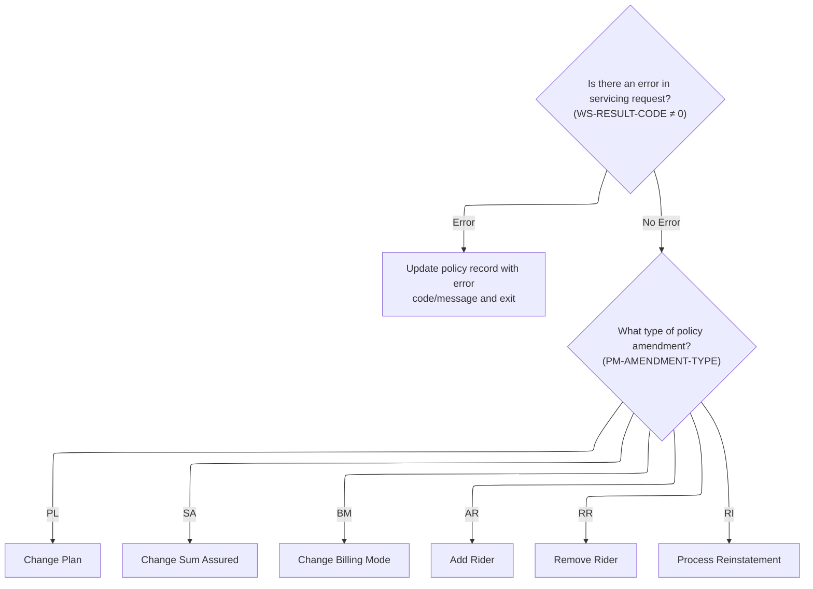

This section governs the transition from plan setup to amendment processing, ensuring errors are handled before any policy changes are made. It routes requests to the correct amendment handler based on the type of policy change requested.

| Rule ID | Category        | Rule Name                         | Description                                                                                                                                                                                                                                                                                         | Implementation Details                                                                                                                                                                                                     |
| ------- | --------------- | --------------------------------- | --------------------------------------------------------------------------------------------------------------------------------------------------------------------------------------------------------------------------------------------------------------------------------------------------- | -------------------------------------------------------------------------------------------------------------------------------------------------------------------------------------------------------------------------- |
| BR-001  | Decision Making | Error handling after plan setup   | If an error code is present after plan setup, update the policy record with the error code and message, then exit the process without performing any further amendments.                                                                                                                            | The error code is a 2-digit number, and the error message is a 100-character string. Both are stored in the policy master record. No further processing occurs if an error is detected at this stage.                      |
| BR-002  | Decision Making | Amendment type dispatch           | If no error is present after plan setup, determine the requested amendment type and dispatch processing to the corresponding handler based on the amendment type code.                                                                                                                              | Amendment type codes are: 'PL' (Plan Change), 'SA' (Sum Assured Change), 'BM' (Billing Mode Change), 'AR' (Add Rider), 'RR' (Remove Rider), 'RI' (Reinstatement). Each code triggers a specific amendment handler routine. |
| BR-003  | Decision Making | Amendment type to handler mapping | Each amendment type code corresponds to a specific business process: 'PL' for plan change, 'SA' for sum assured change, 'BM' for billing mode change, 'AR' for adding a rider, 'RR' for removing a rider, and 'RI' for reinstatement. Only the handler for the requested amendment type is invoked. | Amendment type codes are 2-character strings. Each code is mapped to a unique handler routine. No other amendment types are processed in this section.                                                                     |

<SwmSnippet path="/QCBLLESRC/SVCBILB.cbl" line="106">

---

Back in <SwmToken path="QCBLLESRC/SVCBILB.cbl" pos="90:1:3" line-data="       MAIN-PROCESS.">`MAIN-PROCESS`</SwmToken>, right after loading plan parameters, we check if any error code was set. If so, we update the policy record with the error and exit, skipping all further steps.

```cobol
           IF WS-RESULT-CODE NOT = 0
               MOVE WS-RESULT-CODE TO PM-RETURN-CODE
               MOVE WS-RESULT-MESSAGE TO PM-RETURN-MESSAGE
               REWRITE WS-POLICY-MASTER-REC
               CLOSE POLMST SVCPF
               GOBACK
           END-IF
```

---

</SwmSnippet>

<SwmSnippet path="/QCBLLESRC/SVCBILB.cbl" line="113">

---

Here we branch based on the amendment type. If it's a plan change ('PL'), we call <SwmToken path="QCBLLESRC/SVCBILB.cbl" pos="114:9:13" line-data="               WHEN &#39;PL&#39; PERFORM 2100-CHANGE-PLAN">`2100-CHANGE-PLAN`</SwmToken> to handle updating the plan and related parameters. Other types trigger their own handlers.

```cobol
           EVALUATE PM-AMENDMENT-TYPE
               WHEN 'PL' PERFORM 2100-CHANGE-PLAN
               WHEN 'SA' PERFORM 2200-CHANGE-SUM-ASSURED
               WHEN 'BM' PERFORM 2300-CHANGE-BILLING-MODE
               WHEN 'AR' PERFORM 2400-ADD-RIDER
               WHEN 'RR' PERFORM 2500-REMOVE-RIDER
               WHEN 'RI' PERFORM 2600-PROCESS-REINSTATEMENT
           END-EVALUATE
```

---

</SwmSnippet>

## Validating and applying plan changes

```mermaid
%%{init: {"flowchart": {"defaultRenderer": "elk"}} }%%
flowchart TD
  node1{"Is policy active or in grace?"}
  click node1 openCode "QCBLLESRC/SVCBILB.cbl:238:243"
  node2["Update plan code and load new plan
parameters"]
  click node2 openCode "QCBLLESRC/SVCBILB.cbl:244:246"
  node3{"If new plan is T6501, is remaining term
> 0?"}
  click node3 openCode "QCBLLESRC/SVCBILB.cbl:247:257"
  node4{"Is attained age within new plan's age
limits?"}
  click node4 openCode "QCBLLESRC/SVCBILB.cbl:258:265"
  node5["Adjusting premium for billing mode"]
  
  node1 -->|"Yes"| node2
  node1 -->|"No: Not eligible"| node5
  node2 --> node3
  node3 -->|"Yes"| node4
  node3 -->|"No: Term zero"| node5
  node4 -->|"Yes"| node5
  node4 -->|"No: Age out of bounds"| node5
classDef HeadingStyle fill:#777777,stroke:#333,stroke-width:2px;
click node5 goToHeading "Finalizing plan change and updating status"
node5:::HeadingStyle
click node5 goToHeading "Recalculating premiums after changes"
node5:::HeadingStyle
click node5 goToHeading "Calculating rider premiums"
node5:::HeadingStyle
click node5 goToHeading "Adjusting premium for billing mode"
node5:::HeadingStyle

%% Swimm:
%% %%{init: {"flowchart": {"defaultRenderer": "elk"}} }%%
%% flowchart TD
%%   node1{"Is policy active or in grace?"}
%%   click node1 openCode "<SwmPath>[QCBLLESRC/SVCBILB.cbl](QCBLLESRC/SVCBILB.cbl)</SwmPath>:238:243"
%%   node2["Update plan code and load new plan
%% parameters"]
%%   click node2 openCode "<SwmPath>[QCBLLESRC/SVCBILB.cbl](QCBLLESRC/SVCBILB.cbl)</SwmPath>:244:246"
%%   node3{"If new plan is <SwmToken path="QCBLLESRC/SVCBILB.cbl" pos="170:4:4" line-data="               WHEN &#39;T6501&#39;">`T6501`</SwmToken>, is remaining term
%% > 0?"}
%%   click node3 openCode "<SwmPath>[QCBLLESRC/SVCBILB.cbl](QCBLLESRC/SVCBILB.cbl)</SwmPath>:247:257"
%%   node4{"Is attained age within new plan's age
%% limits?"}
%%   click node4 openCode "<SwmPath>[QCBLLESRC/SVCBILB.cbl](QCBLLESRC/SVCBILB.cbl)</SwmPath>:258:265"
%%   node5["Adjusting premium for billing mode"]
%%   
%%   node1 -->|"Yes"| node2
%%   node1 -->|"No: Not eligible"| node5
%%   node2 --> node3
%%   node3 -->|"Yes"| node4
%%   node3 -->|"No: Term zero"| node5
%%   node4 -->|"Yes"| node5
%%   node4 -->|"No: Age out of bounds"| node5
%% classDef HeadingStyle fill:#777777,stroke:#333,stroke-width:2px;
%% click node5 goToHeading "Finalizing plan change and updating status"
%% node5:::HeadingStyle
%% click node5 goToHeading "Recalculating premiums after changes"
%% node5:::HeadingStyle
%% click node5 goToHeading "Calculating rider premiums"
%% node5:::HeadingStyle
%% click node5 goToHeading "Adjusting premium for billing mode"
%% node5:::HeadingStyle
```

This section validates eligibility for plan changes, applies the new plan code and parameters, and ensures all business constraints are met before recalculating the premium. It blocks changes for ineligible statuses or invalid plan/age combinations.

| Rule ID | Category                        | Rule Name                                                                                                                                    | Description                                                                                                                                                                                                                                                                 | Implementation Details                                                                                                                                                                                                                                                                                                                                                                                                                                                                                                                         |
| ------- | ------------------------------- | -------------------------------------------------------------------------------------------------------------------------------------------- | --------------------------------------------------------------------------------------------------------------------------------------------------------------------------------------------------------------------------------------------------------------------------- | ---------------------------------------------------------------------------------------------------------------------------------------------------------------------------------------------------------------------------------------------------------------------------------------------------------------------------------------------------------------------------------------------------------------------------------------------------------------------------------------------------------------------------------------------- |
| BR-001  | Data validation                 | Eligibility status check                                                                                                                     | A plan change is only allowed if the policy status is either active or in grace. If the status is not eligible, the plan change is blocked and an error code and message are set.                                                                                           | Error code is set to 13. Error message is set to 'PLAN CHANGE: POLICY MUST BE ACTIVE OR IN GRACE'. Output format is a numeric code and a string message.                                                                                                                                                                                                                                                                                                                                                                                       |
| BR-002  | Data validation                 | <SwmToken path="QCBLLESRC/SVCBILB.cbl" pos="170:4:4" line-data="               WHEN &#39;T6501&#39;">`T6501`</SwmToken> remaining term check | For plan code <SwmToken path="QCBLLESRC/SVCBILB.cbl" pos="170:4:4" line-data="               WHEN &#39;T6501&#39;">`T6501`</SwmToken>, if the remaining term is zero or less, the plan change is blocked, an error code and message are set, and the plan code is reverted. | Error code is set to 33. Error message is set to '<SwmToken path="QCBLLESRC/SVCBILB.cbl" pos="252:4:4" line-data="                   MOVE &#39;T65 PLAN CHANGE: REMAINING TERM IS ZERO&#39;">`T65`</SwmToken> PLAN CHANGE: REMAINING TERM IS ZERO'. Plan code is reverted to previous value. Output format is a numeric code and a string message.                                                                                                                                                                                             |
| BR-003  | Data validation                 | Attained age limit check                                                                                                                     | A plan change is blocked if the attained age is outside the new plan's minimum or maximum issue age limits. An error code and message are set, and the plan code is reverted.                                                                                               | Error code is set to 14. Error message is set to 'PLAN CHANGE: ATTAINED AGE OUTSIDE NEW PLAN LIMITS'. Plan code is reverted to previous value. Output format is a numeric code and a string message. Minimum issue age is 18 for all plans. Maximum issue age is 60 for <SwmToken path="QCBLLESRC/SVCBILB.cbl" pos="148:4:4" line-data="               WHEN &#39;T1001&#39;">`T1001`</SwmToken>, 55 for <SwmToken path="QCBLLESRC/SVCBILB.cbl" pos="159:4:4" line-data="               WHEN &#39;T2001&#39;">`T2001`</SwmToken>, 50 otherwise. |
| BR-004  | Decision Making                 | Plan code swap and parameter reload                                                                                                          | When a plan change is requested, the plan code is swapped and plan parameters are reloaded to ensure all constants reflect the new plan's requirements.                                                                                                                     | Plan code is updated to the new value. Plan parameters are reloaded to match the new plan code. No error code or message is set in this step.                                                                                                                                                                                                                                                                                                                                                                                                  |
| BR-005  | Invoking a Service or a Process | Premium recalculation after plan change                                                                                                      | After all eligibility and plan checks, the premium is recalculated using the new plan parameters to ensure the updated premium reflects the new plan's requirements.                                                                                                        | Premium recalculation is triggered by invoking the premium reprice process. The recalculated premium is based on the new plan parameters and billing mode.                                                                                                                                                                                                                                                                                                                                                                                     |

<SwmSnippet path="/QCBLLESRC/SVCBILB.cbl" line="237">

---

In <SwmToken path="QCBLLESRC/SVCBILB.cbl" pos="237:1:5" line-data="       2100-CHANGE-PLAN.">`2100-CHANGE-PLAN`</SwmToken>, we check if the policy is active or in grace. If not, we set an error and exit, blocking plan changes for ineligible statuses.

```cobol
       2100-CHANGE-PLAN.
           IF NOT PM-STATUS-ACTIVE AND NOT PM-STATUS-GRACE
               MOVE 13 TO WS-RESULT-CODE
               MOVE 'PLAN CHANGE: POLICY MUST BE ACTIVE OR IN GRACE'
                   TO WS-RESULT-MESSAGE
               EXIT PARAGRAPH
           END-IF
```

---

</SwmSnippet>

<SwmSnippet path="/QCBLLESRC/SVCBILB.cbl" line="244">

---

After swapping the plan code, we reload plan parameters to update all the constants for the new plan. This keeps everything in sync with the new plan's requirements.

```cobol
           MOVE PM-PLAN-CODE TO PM-OLD-PLAN-CODE
           MOVE PM-NEW-PLAN-CODE TO PM-PLAN-CODE
           PERFORM 1100-LOAD-PLAN-PARAMETERS
```

---

</SwmSnippet>

<SwmSnippet path="/QCBLLESRC/SVCBILB.cbl" line="247">

---

Back in <SwmToken path="QCBLLESRC/SVCBILB.cbl" pos="114:9:13" line-data="               WHEN &#39;PL&#39; PERFORM 2100-CHANGE-PLAN">`2100-CHANGE-PLAN`</SwmToken>, after loading parameters, we check for <SwmToken path="QCBLLESRC/SVCBILB.cbl" pos="247:12:12" line-data="           IF PM-PLAN-CODE = &#39;T6501&#39;">`T6501`</SwmToken>. If the remaining term is zero or less, we set an error, revert the plan code, and exit. This is a special rule for that plan.

```cobol
           IF PM-PLAN-CODE = 'T6501'
               COMPUTE PM-TERM-YEARS =
                   PM-MATURITY-AGE - PM-ATTAINED-AGE
               IF PM-TERM-YEARS <= 0
                   MOVE 33 TO WS-RESULT-CODE
                   MOVE 'T65 PLAN CHANGE: REMAINING TERM IS ZERO'
                       TO WS-RESULT-MESSAGE
                   MOVE PM-OLD-PLAN-CODE TO PM-PLAN-CODE
                   EXIT PARAGRAPH
               END-IF
           END-IF
```

---

</SwmSnippet>

<SwmSnippet path="/QCBLLESRC/SVCBILB.cbl" line="258">

---

Here we validate that the attained age fits within the new plan's limits. If not, we set an error, revert the plan code, and exit. This keeps plan changes within valid age ranges.

```cobol
           IF PM-ATTAINED-AGE < PM-MIN-ISSUE-AGE OR
              PM-ATTAINED-AGE > PM-MAX-ISSUE-AGE
               MOVE 14 TO WS-RESULT-CODE
               MOVE 'PLAN CHANGE: ATTAINED AGE OUTSIDE NEW PLAN LIMITS'
                   TO WS-RESULT-MESSAGE
               MOVE PM-OLD-PLAN-CODE TO PM-PLAN-CODE
               EXIT PARAGRAPH
           END-IF
```

---

</SwmSnippet>

<SwmSnippet path="/QCBLLESRC/SVCBILB.cbl" line="266">

---

After all the plan and eligibility checks, we call <SwmToken path="QCBLLESRC/SVCBILB.cbl" pos="266:3:7" line-data="           PERFORM 3100-REPRICE-POLICY">`3100-REPRICE-POLICY`</SwmToken> to recalculate the premium using the new plan parameters.

```cobol
           PERFORM 3100-REPRICE-POLICY
```

---

</SwmSnippet>

### Recalculating premiums after changes

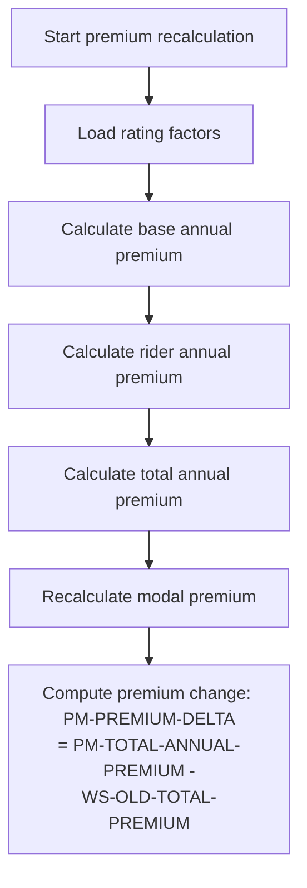

This section recalculates all relevant premium values for a policy after any change, ensuring that the new premium reflects the latest policy data and rating factors.

| Rule ID | Category        | Rule Name                        | Description                                                                                                                                                 | Implementation Details                                                                                                                                                    |
| ------- | --------------- | -------------------------------- | ----------------------------------------------------------------------------------------------------------------------------------------------------------- | ------------------------------------------------------------------------------------------------------------------------------------------------------------------------- |
| BR-001  | Calculation     | Base annual premium calculation  | The base annual premium is calculated using the sum assured, base mortality rate, gender factor, smoker factor, occupation factor, and underwriting factor. | The formula is: (sum assured / 1000) \* base mortality rate \* gender factor \* smoker factor \* occupation factor \* underwriting factor.                                |
| BR-002  | Calculation     | Include rider premiums           | All rider annual premiums are calculated and included in the total premium calculation.                                                                     | Rider premiums are summed and added to the base annual premium.                                                                                                           |
| BR-003  | Calculation     | Total annual premium composition | The total annual premium includes the base annual premium, all rider premiums, the annual policy fee, and the applicable tax.                               | Formula: (base annual premium + total rider premiums + annual policy fee) + ((base annual premium + total rider premiums + annual policy fee) \* tax rate).               |
| BR-004  | Calculation     | Recalculate modal premium        | The modal premium is recalculated based on the new total annual premium.                                                                                    | Modal premium is derived from the total annual premium using modal factors and divisors (not detailed in this section).                                                   |
| BR-005  | Calculation     | Premium delta calculation        | The premium change (delta) is calculated as the difference between the new total annual premium and the previous total premium.                             | Formula: premium delta = new total annual premium - old total premium. Both values are calculated using the same formula and include all relevant factors, fees, and tax. |
| BR-006  | Decision Making | Load rating factors first        | The recalculation process loads all rating factors before any premium calculation is performed.                                                             | Rating factors include base mortality rate, gender factor, smoker factor, occupation factor, and underwriting factor. These are required for subsequent calculations.     |

<SwmSnippet path="/QCBLLESRC/SVCBILB.cbl" line="422">

---

<SwmToken path="QCBLLESRC/SVCBILB.cbl" pos="422:1:5" line-data="       3100-REPRICE-POLICY.">`3100-REPRICE-POLICY`</SwmToken> runs through loading rating factors, calculating base premium, then calls <SwmToken path="QCBLLESRC/SVCBILB.cbl" pos="425:3:9" line-data="           PERFORM 3130-CALCULATE-RIDER-ANNUAL">`3130-CALCULATE-RIDER-ANNUAL`</SwmToken> to add up rider premiums before summing everything for the total.

```cobol
       3100-REPRICE-POLICY.
           PERFORM 3110-LOAD-RATING-FACTORS
           PERFORM 3120-CALCULATE-BASE-ANNUAL
           PERFORM 3130-CALCULATE-RIDER-ANNUAL
           PERFORM 3140-CALCULATE-TOTAL-ANNUAL
           PERFORM 3200-RECALCULATE-MODAL-PREMIUM
           COMPUTE PM-PREMIUM-DELTA =
               PM-TOTAL-ANNUAL-PREMIUM - WS-OLD-TOTAL-PREMIUM.
```

---

</SwmSnippet>

### Calculating rider premiums

```mermaid
%%{init: {"flowchart": {"defaultRenderer": "elk"}} }%%
flowchart TD
    node1["Start annual rider premium calculation"]
    click node1 openCode "QCBLLESRC/SVCBILB.cbl:485:486"
    node1 --> node2["Initialize total premium to zero"]
    click node2 openCode "QCBLLESRC/SVCBILB.cbl:486:486"
    node2 --> node3["Process riders"]
    click node3 openCode "QCBLLESRC/SVCBILB.cbl:487:508"
    subgraph loop1["For each rider (up to 5)"]
        node3 --> node4{"Is rider code present and active?"}
        click node4 openCode "QCBLLESRC/SVCBILB.cbl:489:491"
        node4 -->|"Yes"| node5{"Rider type?"}
        click node5 openCode "QCBLLESRC/SVCBILB.cbl:491:500"
        node5 -->|ADB01| node6["Calculate premium: (Sum Assured / 1000)
x 0.1800"]
        click node6 openCode "QCBLLESRC/SVCBILB.cbl:492:495"
        node5 -->|WOP01| node7["Calculate premium: Base Annual Premium x
0.06"]
        click node7 openCode "QCBLLESRC/SVCBILB.cbl:497:499"
        node5 -->|CI001| node8["Calculate premium: (Sum Assured / 1000)
x 1.2500"]
        click node8 openCode "QCBLLESRC/SVCBILB.cbl:501:504"
        node6 --> node9["Add premium to total"]
        node7 --> node9
        node8 --> node9
        click node9 openCode "QCBLLESRC/SVCBILB.cbl:505:506"
        node9 --> node3
        node4 -->|"No"| node3
    end
    node3 --> node10["Return total annual rider premium"]
    click node10 openCode "QCBLLESRC/SVCBILB.cbl:507:508"
classDef HeadingStyle fill:#777777,stroke:#333,stroke-width:2px;

%% Swimm:
%% %%{init: {"flowchart": {"defaultRenderer": "elk"}} }%%
%% flowchart TD
%%     node1["Start annual rider premium calculation"]
%%     click node1 openCode "<SwmPath>[QCBLLESRC/SVCBILB.cbl](QCBLLESRC/SVCBILB.cbl)</SwmPath>:485:486"
%%     node1 --> node2["Initialize total premium to zero"]
%%     click node2 openCode "<SwmPath>[QCBLLESRC/SVCBILB.cbl](QCBLLESRC/SVCBILB.cbl)</SwmPath>:486:486"
%%     node2 --> node3["Process riders"]
%%     click node3 openCode "<SwmPath>[QCBLLESRC/SVCBILB.cbl](QCBLLESRC/SVCBILB.cbl)</SwmPath>:487:508"
%%     subgraph loop1["For each rider (up to 5)"]
%%         node3 --> node4{"Is rider code present and active?"}
%%         click node4 openCode "<SwmPath>[QCBLLESRC/SVCBILB.cbl](QCBLLESRC/SVCBILB.cbl)</SwmPath>:489:491"
%%         node4 -->|"Yes"| node5{"Rider type?"}
%%         click node5 openCode "<SwmPath>[QCBLLESRC/SVCBILB.cbl](QCBLLESRC/SVCBILB.cbl)</SwmPath>:491:500"
%%         node5 -->|<SwmToken path="QCBLLESRC/SVCBILB.cbl" pos="355:4:4" line-data="                   MOVE &#39;ADB01&#39; TO PM-RIDER-CODE(WS-RIDER-IDX)">`ADB01`</SwmToken>| node6["Calculate premium: (Sum Assured / 1000)
%% x <SwmToken path="QCBLLESRC/SVCBILB.cbl" pos="494:8:10" line-data="                           / 1000) * 0.1800">`0.1800`</SwmToken>"]
%%         click node6 openCode "<SwmPath>[QCBLLESRC/SVCBILB.cbl](QCBLLESRC/SVCBILB.cbl)</SwmPath>:492:495"
%%         node5 -->|<SwmToken path="QCBLLESRC/SVCBILB.cbl" pos="496:19:19" line-data="                   IF PM-RIDER-CODE(PM-RIDER-IDX) = &#39;WOP01&#39;">`WOP01`</SwmToken>| node7["Calculate premium: Base Annual Premium x
%% <SwmToken path="QCBLLESRC/SVCBILB.cbl" pos="498:11:13" line-data="                           PM-BASE-ANNUAL-PREMIUM * 0.06">`0.06`</SwmToken>"]
%%         click node7 openCode "<SwmPath>[QCBLLESRC/SVCBILB.cbl](QCBLLESRC/SVCBILB.cbl)</SwmPath>:497:499"
%%         node5 -->|<SwmToken path="QCBLLESRC/SVCBILB.cbl" pos="500:19:19" line-data="                   IF PM-RIDER-CODE(PM-RIDER-IDX) = &#39;CI001&#39;">`CI001`</SwmToken>| node8["Calculate premium: (Sum Assured / 1000)
%% x <SwmToken path="QCBLLESRC/SVCBILB.cbl" pos="503:8:10" line-data="                           / 1000) * 1.2500">`1.2500`</SwmToken>"]
%%         click node8 openCode "<SwmPath>[QCBLLESRC/SVCBILB.cbl](QCBLLESRC/SVCBILB.cbl)</SwmPath>:501:504"
%%         node6 --> node9["Add premium to total"]
%%         node7 --> node9
%%         node8 --> node9
%%         click node9 openCode "<SwmPath>[QCBLLESRC/SVCBILB.cbl](QCBLLESRC/SVCBILB.cbl)</SwmPath>:505:506"
%%         node9 --> node3
%%         node4 -->|"No"| node3
%%     end
%%     node3 --> node10["Return total annual rider premium"]
%%     click node10 openCode "<SwmPath>[QCBLLESRC/SVCBILB.cbl](QCBLLESRC/SVCBILB.cbl)</SwmPath>:507:508"
%% classDef HeadingStyle fill:#777777,stroke:#333,stroke-width:2px;
```

This section determines the total annual premium for insurance riders by applying specific formulas to each active rider of a supported type.

| Rule ID | Category        | Rule Name                                                                                                                                                                      | Description                                                                                                                                                                                                                                                                                                                                                                | Implementation Details                                                                                                                                                                                          |
| ------- | --------------- | ------------------------------------------------------------------------------------------------------------------------------------------------------------------------------ | -------------------------------------------------------------------------------------------------------------------------------------------------------------------------------------------------------------------------------------------------------------------------------------------------------------------------------------------------------------------------- | --------------------------------------------------------------------------------------------------------------------------------------------------------------------------------------------------------------- |
| BR-001  | Calculation     | <SwmToken path="QCBLLESRC/SVCBILB.cbl" pos="355:4:4" line-data="                   MOVE &#39;ADB01&#39; TO PM-RIDER-CODE(WS-RIDER-IDX)">`ADB01`</SwmToken> premium calculation | The premium for an <SwmToken path="QCBLLESRC/SVCBILB.cbl" pos="355:4:4" line-data="                   MOVE &#39;ADB01&#39; TO PM-RIDER-CODE(WS-RIDER-IDX)">`ADB01`</SwmToken> rider is calculated as (Sum Assured / 1000) multiplied by <SwmToken path="QCBLLESRC/SVCBILB.cbl" pos="494:8:10" line-data="                           / 1000) * 0.1800">`0.1800`</SwmToken>. | Multiplier constant is <SwmToken path="QCBLLESRC/SVCBILB.cbl" pos="494:8:10" line-data="                           / 1000) * 0.1800">`0.1800`</SwmToken>. Sum Assured is divided by 1000 before multiplication. |
| BR-002  | Calculation     | <SwmToken path="QCBLLESRC/SVCBILB.cbl" pos="496:19:19" line-data="                   IF PM-RIDER-CODE(PM-RIDER-IDX) = &#39;WOP01&#39;">`WOP01`</SwmToken> premium calculation  | The premium for a <SwmToken path="QCBLLESRC/SVCBILB.cbl" pos="496:19:19" line-data="                   IF PM-RIDER-CODE(PM-RIDER-IDX) = &#39;WOP01&#39;">`WOP01`</SwmToken> rider is calculated as 6% of the base annual premium.                                                                                                                                          | Multiplier constant is <SwmToken path="QCBLLESRC/SVCBILB.cbl" pos="498:11:13" line-data="                           PM-BASE-ANNUAL-PREMIUM * 0.06">`0.06`</SwmToken>. The base annual premium is used as input. |
| BR-003  | Calculation     | <SwmToken path="QCBLLESRC/SVCBILB.cbl" pos="500:19:19" line-data="                   IF PM-RIDER-CODE(PM-RIDER-IDX) = &#39;CI001&#39;">`CI001`</SwmToken> premium calculation  | The premium for a <SwmToken path="QCBLLESRC/SVCBILB.cbl" pos="500:19:19" line-data="                   IF PM-RIDER-CODE(PM-RIDER-IDX) = &#39;CI001&#39;">`CI001`</SwmToken> rider is calculated as (Sum Assured / 1000) multiplied by <SwmToken path="QCBLLESRC/SVCBILB.cbl" pos="503:8:10" line-data="                           / 1000) * 1.2500">`1.2500`</SwmToken>.   | Multiplier constant is <SwmToken path="QCBLLESRC/SVCBILB.cbl" pos="503:8:10" line-data="                           / 1000) * 1.2500">`1.2500`</SwmToken>. Sum Assured is divided by 1000 before multiplication. |
| BR-004  | Calculation     | Total rider premium summing                                                                                                                                                    | The total annual rider premium is calculated as the sum of individual premiums for all processed riders.                                                                                                                                                                                                                                                                   | The total is a numeric value representing the sum of all individual rider premiums.                                                                                                                             |
| BR-005  | Decision Making | Active rider eligibility                                                                                                                                                       | Only riders that are both present and marked as active are considered for premium calculation.                                                                                                                                                                                                                                                                             | A rider is considered active if its status is 'A'. Only non-empty codes are processed.                                                                                                                          |
| BR-006  | Decision Making | Rider slot limit                                                                                                                                                               | A maximum of five rider slots are processed for premium calculation.                                                                                                                                                                                                                                                                                                       | The maximum number of rider slots processed is five.                                                                                                                                                            |

<SwmSnippet path="/QCBLLESRC/SVCBILB.cbl" line="485">

---

In <SwmToken path="QCBLLESRC/SVCBILB.cbl" pos="485:1:7" line-data="       3130-CALCULATE-RIDER-ANNUAL.">`3130-CALCULATE-RIDER-ANNUAL`</SwmToken>, we loop over 5 rider slots, check for active riders, and calculate their premiums based on hardcoded codes and multipliers. Only three rider types are supported, and the total is summed up.

```cobol
       3130-CALCULATE-RIDER-ANNUAL.
           MOVE ZEROS TO PM-RIDER-ANNUAL-TOTAL
           PERFORM VARYING PM-RIDER-IDX FROM 1 BY 1
               UNTIL PM-RIDER-IDX > 5
               IF PM-RIDER-CODE(PM-RIDER-IDX) NOT = SPACES AND
                  PM-RIDER-ACTIVE(PM-RIDER-IDX)
                   IF PM-RIDER-CODE(PM-RIDER-IDX) = 'ADB01'
                       COMPUTE PM-RIDER-ANNUAL-PREM(PM-RIDER-IDX) =
                           (PM-RIDER-SUM-ASSURED(PM-RIDER-IDX)
                           / 1000) * 0.1800
                   END-IF
```

---

</SwmSnippet>

<SwmSnippet path="/QCBLLESRC/SVCBILB.cbl" line="496">

---

This snippet handles the <SwmToken path="QCBLLESRC/SVCBILB.cbl" pos="496:19:19" line-data="                   IF PM-RIDER-CODE(PM-RIDER-IDX) = &#39;WOP01&#39;">`WOP01`</SwmToken> rider, calculating its premium as 6% of the base annual premium. It's just another branch in the rider premium calculation loop.

```cobol
                   IF PM-RIDER-CODE(PM-RIDER-IDX) = 'WOP01'
                       COMPUTE PM-RIDER-ANNUAL-PREM(PM-RIDER-IDX) =
                           PM-BASE-ANNUAL-PREMIUM * 0.06
                   END-IF
```

---

</SwmSnippet>

<SwmSnippet path="/QCBLLESRC/SVCBILB.cbl" line="500">

---

This snippet handles the <SwmToken path="QCBLLESRC/SVCBILB.cbl" pos="500:19:19" line-data="                   IF PM-RIDER-CODE(PM-RIDER-IDX) = &#39;CI001&#39;">`CI001`</SwmToken> rider, calculating its premium with a <SwmToken path="QCBLLESRC/SVCBILB.cbl" pos="287:22:24" line-data="               IF PM-NEW-SUM-ASSURED &gt; (PM-SUM-ASSURED * 1.25) OR">`1.25`</SwmToken> multiplier on the sum assured. It's another branch in the rider premium calculation loop.

```cobol
                   IF PM-RIDER-CODE(PM-RIDER-IDX) = 'CI001'
                       COMPUTE PM-RIDER-ANNUAL-PREM(PM-RIDER-IDX) =
                           (PM-RIDER-SUM-ASSURED(PM-RIDER-IDX)
                           / 1000) * 1.2500
                   END-IF
```

---

</SwmSnippet>

<SwmSnippet path="/QCBLLESRC/SVCBILB.cbl" line="505">

---

After looping through all rider slots and calculating premiums, we sum them into <SwmToken path="QCBLLESRC/SVCBILB.cbl" pos="506:3:9" line-data="                       TO PM-RIDER-ANNUAL-TOTAL">`PM-RIDER-ANNUAL-TOTAL`</SwmToken>. That's the main output of <SwmToken path="QCBLLESRC/SVCBILB.cbl" pos="425:3:9" line-data="           PERFORM 3130-CALCULATE-RIDER-ANNUAL">`3130-CALCULATE-RIDER-ANNUAL`</SwmToken>.

```cobol
                   ADD PM-RIDER-ANNUAL-PREM(PM-RIDER-IDX)
                       TO PM-RIDER-ANNUAL-TOTAL
               END-IF
           END-PERFORM.
```

---

</SwmSnippet>

### Adjusting premium for billing mode

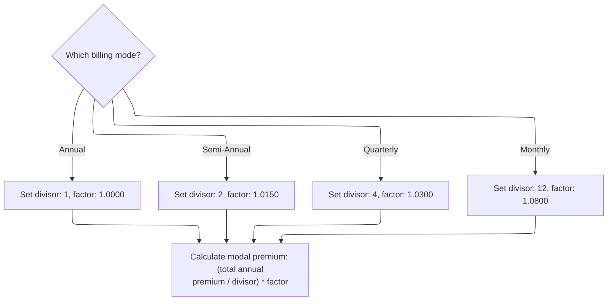

This section determines how the annual premium is split and adjusted for different billing modes, ensuring the correct modal premium is calculated for each payment frequency.

| Rule ID | Category        | Rule Name                      | Description                                                                                                                                                                                                                    | Implementation Details                                                                                                                                                                                                                                                                                                                                                                                                    |
| ------- | --------------- | ------------------------------ | ------------------------------------------------------------------------------------------------------------------------------------------------------------------------------------------------------------------------------ | ------------------------------------------------------------------------------------------------------------------------------------------------------------------------------------------------------------------------------------------------------------------------------------------------------------------------------------------------------------------------------------------------------------------------- |
| BR-001  | Calculation     | Modal premium calculation      | The modal premium is calculated by dividing the annual premium by the divisor and multiplying by the factor determined by the billing mode.                                                                                    | The modal premium is calculated as: (annual premium / divisor) \* factor. The output is a number reflecting the adjusted premium for the selected billing mode.                                                                                                                                                                                                                                                           |
| BR-002  | Decision Making | Annual billing adjustment      | When the billing mode is Annual, the divisor is set to 1 and the factor is set to <SwmToken path="QCBLLESRC/SVCBILB.cbl" pos="530:3:5" line-data="                   MOVE 1.0000 TO WS-MODAL-FACTOR">`1.0000`</SwmToken>.      | Divisor: 1; Factor: <SwmToken path="QCBLLESRC/SVCBILB.cbl" pos="530:3:5" line-data="                   MOVE 1.0000 TO WS-MODAL-FACTOR">`1.0000`</SwmToken>. These constants are used to calculate the modal premium. The modal premium is calculated as (annual premium / 1) \* <SwmToken path="QCBLLESRC/SVCBILB.cbl" pos="530:3:5" line-data="                   MOVE 1.0000 TO WS-MODAL-FACTOR">`1.0000`</SwmToken>.   |
| BR-003  | Decision Making | Semi-Annual billing adjustment | When the billing mode is Semi-Annual, the divisor is set to 2 and the factor is set to <SwmToken path="QCBLLESRC/SVCBILB.cbl" pos="533:3:5" line-data="                   MOVE 1.0150 TO WS-MODAL-FACTOR">`1.0150`</SwmToken>. | Divisor: 2; Factor: <SwmToken path="QCBLLESRC/SVCBILB.cbl" pos="533:3:5" line-data="                   MOVE 1.0150 TO WS-MODAL-FACTOR">`1.0150`</SwmToken>. These constants are used to calculate the modal premium. The modal premium is calculated as (annual premium / 2) \* <SwmToken path="QCBLLESRC/SVCBILB.cbl" pos="533:3:5" line-data="                   MOVE 1.0150 TO WS-MODAL-FACTOR">`1.0150`</SwmToken>.   |
| BR-004  | Decision Making | Quarterly billing adjustment   | When the billing mode is Quarterly, the divisor is set to 4 and the factor is set to <SwmToken path="QCBLLESRC/SVCBILB.cbl" pos="536:3:5" line-data="                   MOVE 1.0300 TO WS-MODAL-FACTOR">`1.0300`</SwmToken>.   | Divisor: 4; Factor: <SwmToken path="QCBLLESRC/SVCBILB.cbl" pos="536:3:5" line-data="                   MOVE 1.0300 TO WS-MODAL-FACTOR">`1.0300`</SwmToken>. These constants are used to calculate the modal premium. The modal premium is calculated as (annual premium / 4) \* <SwmToken path="QCBLLESRC/SVCBILB.cbl" pos="536:3:5" line-data="                   MOVE 1.0300 TO WS-MODAL-FACTOR">`1.0300`</SwmToken>.   |
| BR-005  | Decision Making | Monthly billing adjustment     | When the billing mode is Monthly, the divisor is set to 12 and the factor is set to <SwmToken path="QCBLLESRC/SVCBILB.cbl" pos="539:3:5" line-data="                   MOVE 1.0800 TO WS-MODAL-FACTOR">`1.0800`</SwmToken>.    | Divisor: 12; Factor: <SwmToken path="QCBLLESRC/SVCBILB.cbl" pos="539:3:5" line-data="                   MOVE 1.0800 TO WS-MODAL-FACTOR">`1.0800`</SwmToken>. These constants are used to calculate the modal premium. The modal premium is calculated as (annual premium / 12) \* <SwmToken path="QCBLLESRC/SVCBILB.cbl" pos="539:3:5" line-data="                   MOVE 1.0800 TO WS-MODAL-FACTOR">`1.0800`</SwmToken>. |

<SwmSnippet path="/QCBLLESRC/SVCBILB.cbl" line="526">

---

In <SwmToken path="QCBLLESRC/SVCBILB.cbl" pos="526:1:7" line-data="       3200-RECALCULATE-MODAL-PREMIUM.">`3200-RECALCULATE-MODAL-PREMIUM`</SwmToken>, we map billing modes to divisors and factors, adjusting how the annual premium is split for each payment frequency. Only four modes are supported, and there's no fallback for invalid values.

```cobol
       3200-RECALCULATE-MODAL-PREMIUM.
           EVALUATE PM-BILLING-MODE
               WHEN 'A'
                   MOVE 1 TO WS-MODAL-DIVISOR
                   MOVE 1.0000 TO WS-MODAL-FACTOR
               WHEN 'S'
                   MOVE 2 TO WS-MODAL-DIVISOR
                   MOVE 1.0150 TO WS-MODAL-FACTOR
               WHEN 'Q'
                   MOVE 4 TO WS-MODAL-DIVISOR
                   MOVE 1.0300 TO WS-MODAL-FACTOR
               WHEN 'M'
                   MOVE 12 TO WS-MODAL-DIVISOR
                   MOVE 1.0800 TO WS-MODAL-FACTOR
           END-EVALUATE
```

---

</SwmSnippet>

<SwmSnippet path="/QCBLLESRC/SVCBILB.cbl" line="541">

---

After setting divisor and factor, we compute <SwmToken path="QCBLLESRC/SVCBILB.cbl" pos="541:3:7" line-data="           COMPUTE PM-MODAL-PREMIUM =">`PM-MODAL-PREMIUM`</SwmToken> by dividing the annual premium and multiplying by the factor. That's the output for the billing mode adjustment.

```cobol
           COMPUTE PM-MODAL-PREMIUM =
               (PM-TOTAL-ANNUAL-PREMIUM / WS-MODAL-DIVISOR)
               * WS-MODAL-FACTOR.
```

---

</SwmSnippet>

### Finalizing plan change and updating status

<SwmSnippet path="/QCBLLESRC/SVCBILB.cbl" line="267">

---

After repricing in <SwmToken path="QCBLLESRC/SVCBILB.cbl" pos="114:9:13" line-data="               WHEN &#39;PL&#39; PERFORM 2100-CHANGE-PLAN">`2100-CHANGE-PLAN`</SwmToken>, we add the service fee, mark the amendment as applied, reset the result code, and set the success message. This wraps up the plan change.

```cobol
           ADD PM-SERVICE-FEE TO PM-SERVICE-FEE-CHARGED
           MOVE 'AP' TO PM-AMENDMENT-STATUS
           MOVE 0 TO WS-RESULT-CODE
           MOVE 'PLAN CHANGE APPLIED' TO WS-RESULT-MESSAGE.
```

---

</SwmSnippet>

## Validating and applying sum assured changes

```mermaid
%%{init: {"flowchart": {"defaultRenderer": "elk"}} }%%
flowchart TD
    node1["Start sum assured change"]
    click node1 openCode "QCBLLESRC/SVCBILB.cbl:275:276"
    node1 --> node2{"Is new sum assured missing or outside
plan limits? (0, < min, > max)"}
    click node2 openCode "QCBLLESRC/SVCBILB.cbl:276:283"
    node2 -->|"Yes"| node3["Reject change: Set code 15, message 'NEW
SUM ASSURED MISSING OR OUT OF PLAN
LIMITS'"]
    click node3 openCode "QCBLLESRC/SVCBILB.cbl:279:282"
    node2 -->|"No"| node4{"Is new sum assured greater than
current?"}
    click node4 openCode "QCBLLESRC/SVCBILB.cbl:285:286"
    node4 -->|"Yes"| node5{"Increase > 25% or > 25T?"}
    click node5 openCode "QCBLLESRC/SVCBILB.cbl:287:295"
    node5 -->|"Yes"| node6["Trigger underwriting review: Set code
31, message 'SA INCREASE REQUIRES
UNDERWRITING REVIEW', status 'PE'"]
    click node6 openCode "QCBLLESRC/SVCBILB.cbl:289:293"
    node5 -->|"No"| node7["Update PM-OLD-SUM-ASSURED and
PM-SUM-ASSURED"]
    click node7 openCode "QCBLLESRC/SVCBILB.cbl:297:298"
    node4 -->|"No"| node7
    node6 --> node11["Business outcome: Underwriting review
required"]
    click node11 openCode "QCBLLESRC/SVCBILB.cbl:293:294"
    node7 --> node8["Reprice policy"]
    click node8 openCode "QCBLLESRC/SVCBILB.cbl:299:299"
    node8 --> node9["Update fee, status 'AP', code 0, message
'SUM ASSURED CHANGE APPLIED'"]
    click node9 openCode "QCBLLESRC/SVCBILB.cbl:300:303"
    node9 --> node10["Business outcome: Sum assured change
applied"]
    click node10 openCode "QCBLLESRC/SVCBILB.cbl:303:303"
classDef HeadingStyle fill:#777777,stroke:#333,stroke-width:2px;

%% Swimm:
%% %%{init: {"flowchart": {"defaultRenderer": "elk"}} }%%
%% flowchart TD
%%     node1["Start sum assured change"]
%%     click node1 openCode "<SwmPath>[QCBLLESRC/SVCBILB.cbl](QCBLLESRC/SVCBILB.cbl)</SwmPath>:275:276"
%%     node1 --> node2{"Is new sum assured missing or outside
%% plan limits? (0, < min, > max)"}
%%     click node2 openCode "<SwmPath>[QCBLLESRC/SVCBILB.cbl](QCBLLESRC/SVCBILB.cbl)</SwmPath>:276:283"
%%     node2 -->|"Yes"| node3["Reject change: Set code 15, message 'NEW
%% SUM ASSURED MISSING OR OUT OF PLAN
%% LIMITS'"]
%%     click node3 openCode "<SwmPath>[QCBLLESRC/SVCBILB.cbl](QCBLLESRC/SVCBILB.cbl)</SwmPath>:279:282"
%%     node2 -->|"No"| node4{"Is new sum assured greater than
%% current?"}
%%     click node4 openCode "<SwmPath>[QCBLLESRC/SVCBILB.cbl](QCBLLESRC/SVCBILB.cbl)</SwmPath>:285:286"
%%     node4 -->|"Yes"| node5{"Increase > 25% or > 25T?"}
%%     click node5 openCode "<SwmPath>[QCBLLESRC/SVCBILB.cbl](QCBLLESRC/SVCBILB.cbl)</SwmPath>:287:295"
%%     node5 -->|"Yes"| node6["Trigger underwriting review: Set code
%% 31, message 'SA INCREASE REQUIRES
%% UNDERWRITING REVIEW', status 'PE'"]
%%     click node6 openCode "<SwmPath>[QCBLLESRC/SVCBILB.cbl](QCBLLESRC/SVCBILB.cbl)</SwmPath>:289:293"
%%     node5 -->|"No"| node7["Update <SwmToken path="QCBLLESRC/SVCBILB.cbl" pos="297:11:17" line-data="           MOVE PM-SUM-ASSURED TO PM-OLD-SUM-ASSURED">`PM-OLD-SUM-ASSURED`</SwmToken> and
%% <SwmToken path="QCBLLESRC/SVCBILB.cbl" pos="285:13:17" line-data="           IF PM-NEW-SUM-ASSURED &gt; PM-SUM-ASSURED">`PM-SUM-ASSURED`</SwmToken>"]
%%     click node7 openCode "<SwmPath>[QCBLLESRC/SVCBILB.cbl](QCBLLESRC/SVCBILB.cbl)</SwmPath>:297:298"
%%     node4 -->|"No"| node7
%%     node6 --> node11["Business outcome: Underwriting review
%% required"]
%%     click node11 openCode "<SwmPath>[QCBLLESRC/SVCBILB.cbl](QCBLLESRC/SVCBILB.cbl)</SwmPath>:293:294"
%%     node7 --> node8["Reprice policy"]
%%     click node8 openCode "<SwmPath>[QCBLLESRC/SVCBILB.cbl](QCBLLESRC/SVCBILB.cbl)</SwmPath>:299:299"
%%     node8 --> node9["Update fee, status 'AP', code 0, message
%% 'SUM ASSURED CHANGE APPLIED'"]
%%     click node9 openCode "<SwmPath>[QCBLLESRC/SVCBILB.cbl](QCBLLESRC/SVCBILB.cbl)</SwmPath>:300:303"
%%     node9 --> node10["Business outcome: Sum assured change
%% applied"]
%%     click node10 openCode "<SwmPath>[QCBLLESRC/SVCBILB.cbl](QCBLLESRC/SVCBILB.cbl)</SwmPath>:303:303"
%% classDef HeadingStyle fill:#777777,stroke:#333,stroke-width:2px;
```

This section governs the validation and application of sum assured changes for life insurance policies, ensuring compliance with plan limits and business thresholds for underwriting review.

| Rule ID | Category        | Rule Name                   | Description                                                                                                                                                                                                                                                           | Implementation Details                                                                                                                                                                                                                                                                                                                                                                                                                                                                                                                                                                              |
| ------- | --------------- | --------------------------- | --------------------------------------------------------------------------------------------------------------------------------------------------------------------------------------------------------------------------------------------------------------------- | --------------------------------------------------------------------------------------------------------------------------------------------------------------------------------------------------------------------------------------------------------------------------------------------------------------------------------------------------------------------------------------------------------------------------------------------------------------------------------------------------------------------------------------------------------------------------------------------------- |
| BR-001  | Data validation | Plan limit enforcement      | Reject the sum assured change if the new sum assured is missing (zero) or outside the plan's minimum or maximum limits. Set result code 15 and message 'NEW SUM ASSURED MISSING OR OUT OF PLAN LIMITS'.                                                               | Plan minimum and maximum values depend on plan code: For <SwmToken path="QCBLLESRC/SVCBILB.cbl" pos="148:4:4" line-data="               WHEN &#39;T1001&#39;">`T1001`</SwmToken>, min = 10,000,000,000,000 and max = 50,000,000,000,000; for <SwmToken path="QCBLLESRC/SVCBILB.cbl" pos="159:4:4" line-data="               WHEN &#39;T2001&#39;">`T2001`</SwmToken>, min = 10,000,000,000,000 and max = 90,000,000,000,000; otherwise, min = 10,000,000,000,000 and max = 75,000,000,000,000. Result code is a number (15), message is a string ('NEW SUM ASSURED MISSING OR OUT OF PLAN LIMITS'). |
| BR-002  | Decision Making | Underwriting review trigger | If the new sum assured is greater than the current sum assured and the increase exceeds 25% or 25 trillion, trigger an underwriting review. Set result code 31, message 'SA INCREASE REQUIRES UNDERWRITING REVIEW', and amendment status 'PE'.                        | Thresholds: 25% increase or 25,000,000,000,000. Result code is a number (31), message is a string ('SA INCREASE REQUIRES UNDERWRITING REVIEW'), amendment status is 'PE' (pending).                                                                                                                                                                                                                                                                                                                                                                                                                 |
| BR-003  | Writing Output  | Apply sum assured change    | If the new sum assured is valid and does not trigger underwriting review, update the old and current sum assured values, reprice the policy, add the service fee, set amendment status to 'AP', reset result code to 0, and set message 'SUM ASSURED CHANGE APPLIED'. | Result code is a number (0), message is a string ('SUM ASSURED CHANGE APPLIED'), amendment status is 'AP' (applied). Service fee is added to the charged fee. Policy values are updated to reflect the new sum assured.                                                                                                                                                                                                                                                                                                                                                                             |

<SwmSnippet path="/QCBLLESRC/SVCBILB.cbl" line="275">

---

In <SwmToken path="QCBLLESRC/SVCBILB.cbl" pos="275:1:7" line-data="       2200-CHANGE-SUM-ASSURED.">`2200-CHANGE-SUM-ASSURED`</SwmToken>, we validate the new sum assured against plan limits. If it's missing or out of bounds, we set an error and exit.

```cobol
       2200-CHANGE-SUM-ASSURED.
           IF PM-NEW-SUM-ASSURED = 0 OR
              PM-NEW-SUM-ASSURED < PM-MIN-SUM-ASSURED OR
              PM-NEW-SUM-ASSURED > PM-MAX-SUM-ASSURED
               MOVE 15 TO WS-RESULT-CODE
               MOVE 'NEW SUM ASSURED MISSING OR OUT OF PLAN LIMITS'
                   TO WS-RESULT-MESSAGE
               EXIT PARAGRAPH
           END-IF
```

---

</SwmSnippet>

<SwmSnippet path="/QCBLLESRC/SVCBILB.cbl" line="285">

---

Here we check if the new sum assured is a big jump over the old. If it's over 25% or 25 trillion, we flag for underwriting, set pending status, and exit.

```cobol
           IF PM-NEW-SUM-ASSURED > PM-SUM-ASSURED
               COMPUTE WS-RESULT-CODE = 0
               IF PM-NEW-SUM-ASSURED > (PM-SUM-ASSURED * 1.25) OR
                  PM-NEW-SUM-ASSURED > 25000000000000
                   MOVE 'Y' TO PM-UW-REQUIRED
                   MOVE 31 TO WS-RESULT-CODE
                   MOVE 'SA INCREASE REQUIRES UNDERWRITING REVIEW'
                       TO WS-RESULT-MESSAGE
                   MOVE 'PE' TO PM-AMENDMENT-STATUS
                   EXIT PARAGRAPH
               END-IF
           END-IF
```

---

</SwmSnippet>

<SwmSnippet path="/QCBLLESRC/SVCBILB.cbl" line="297">

---

After updating sum assured, we call <SwmToken path="QCBLLESRC/SVCBILB.cbl" pos="299:3:7" line-data="           PERFORM 3100-REPRICE-POLICY">`3100-REPRICE-POLICY`</SwmToken> to recalculate the premium based on the new value.

```cobol
           MOVE PM-SUM-ASSURED TO PM-OLD-SUM-ASSURED
           MOVE PM-NEW-SUM-ASSURED TO PM-SUM-ASSURED
           PERFORM 3100-REPRICE-POLICY
```

---

</SwmSnippet>

<SwmSnippet path="/QCBLLESRC/SVCBILB.cbl" line="300">

---

After repricing in <SwmToken path="QCBLLESRC/SVCBILB.cbl" pos="115:9:15" line-data="               WHEN &#39;SA&#39; PERFORM 2200-CHANGE-SUM-ASSURED">`2200-CHANGE-SUM-ASSURED`</SwmToken>, we add the service fee, mark the amendment as applied, reset the result code, and set the success message. This wraps up the sum assured change.

```cobol
           ADD PM-SERVICE-FEE TO PM-SERVICE-FEE-CHARGED
           MOVE 'AP' TO PM-AMENDMENT-STATUS
           MOVE 0 TO WS-RESULT-CODE
           MOVE 'SUM ASSURED CHANGE APPLIED' TO WS-RESULT-MESSAGE.
```

---

</SwmSnippet>

## Validating and applying billing mode changes

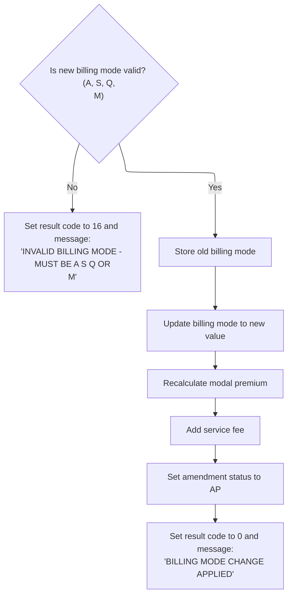

This section validates a requested billing mode change and, if valid, applies the change to the policy record, recalculates premium, and updates related fields. It ensures only allowed billing modes are accepted and communicates the outcome via result codes and messages.

| Rule ID | Category                        | Rule Name                              | Description                                                                                                                                                    | Implementation Details                                                                                                                                                          |
| ------- | ------------------------------- | -------------------------------------- | -------------------------------------------------------------------------------------------------------------------------------------------------------------- | ------------------------------------------------------------------------------------------------------------------------------------------------------------------------------- |
| BR-001  | Data validation                 | Allowed billing modes                  | The new billing mode is accepted only if it is one of the following values: 'A', 'S', 'Q', or 'M'. Any other value is rejected with an error code and message. | Allowed values: 'A', 'S', 'Q', 'M'. If the value is not in this set, the result code is set to 16 and the result message is set to 'INVALID BILLING MODE - MUST BE A S Q OR M'. |
| BR-002  | Calculation                     | Service fee for billing mode change    | A service fee of 1000 units is added when a billing mode change is successfully applied.                                                                       | The service fee is an integer value of 1000 units, added to the service fee charged field in the policy master record.                                                          |
| BR-003  | Decision Making                 | Store previous billing mode            | When a valid billing mode change is processed, the previous billing mode is stored before updating to the new value.                                           | The previous billing mode is saved in the policy master record before updating to the new value. Both fields are alphanumeric strings.                                          |
| BR-004  | Decision Making                 | Set amendment status to applied        | When a billing mode change is successfully applied, the amendment status is set to 'AP'.                                                                       | The amendment status is set to the string 'AP' in the policy master record.                                                                                                     |
| BR-005  | Writing Output                  | Success result for billing mode change | When a billing mode change is successfully applied, the result code is set to 0 and the result message is set to 'BILLING MODE CHANGE APPLIED'.                | Result code: 0. Result message: 'BILLING MODE CHANGE APPLIED'. Both are updated in the service record.                                                                          |
| BR-006  | Invoking a Service or a Process | Recalculate modal premium              | After a valid billing mode change, the modal premium is recalculated to reflect the new billing frequency.                                                     | The recalculation is performed by invoking a dedicated process after the billing mode is updated. The recalculated premium is stored in the policy master record.               |

<SwmSnippet path="/QCBLLESRC/SVCBILB.cbl" line="308">

---

In <SwmToken path="QCBLLESRC/SVCBILB.cbl" pos="308:1:7" line-data="       2300-CHANGE-BILLING-MODE.">`2300-CHANGE-BILLING-MODE`</SwmToken>, we validate the new billing mode against allowed values. If it's not valid, we set an error and exit.

```cobol
       2300-CHANGE-BILLING-MODE.
           IF PM-NEW-BILLING-MODE NOT = 'A' AND
              PM-NEW-BILLING-MODE NOT = 'S' AND
              PM-NEW-BILLING-MODE NOT = 'Q' AND
              PM-NEW-BILLING-MODE NOT = 'M'
               MOVE 16 TO WS-RESULT-CODE
               MOVE 'INVALID BILLING MODE - MUST BE A S Q OR M'
                   TO WS-RESULT-MESSAGE
               EXIT PARAGRAPH
           END-IF
```

---

</SwmSnippet>

<SwmSnippet path="/QCBLLESRC/SVCBILB.cbl" line="318">

---

After updating billing mode, we call <SwmToken path="QCBLLESRC/SVCBILB.cbl" pos="320:3:9" line-data="           PERFORM 3200-RECALCULATE-MODAL-PREMIUM">`3200-RECALCULATE-MODAL-PREMIUM`</SwmToken> to recalculate the premium for the new billing frequency.

```cobol
           MOVE PM-BILLING-MODE TO PM-OLD-BILLING-MODE
           MOVE PM-NEW-BILLING-MODE TO PM-BILLING-MODE
           PERFORM 3200-RECALCULATE-MODAL-PREMIUM
```

---

</SwmSnippet>

<SwmSnippet path="/QCBLLESRC/SVCBILB.cbl" line="321">

---

After recalculating in <SwmToken path="QCBLLESRC/SVCBILB.cbl" pos="116:9:15" line-data="               WHEN &#39;BM&#39; PERFORM 2300-CHANGE-BILLING-MODE">`2300-CHANGE-BILLING-MODE`</SwmToken>, we add the service fee, mark the amendment as applied, reset the result code, and set the success message. This wraps up the billing mode change.

```cobol
           ADD 1000 TO PM-SERVICE-FEE-CHARGED
           MOVE 'AP' TO PM-AMENDMENT-STATUS
           MOVE 0 TO WS-RESULT-CODE
           MOVE 'BILLING MODE CHANGE APPLIED' TO WS-RESULT-MESSAGE.
```

---

</SwmSnippet>

## Adding a rider to the policy

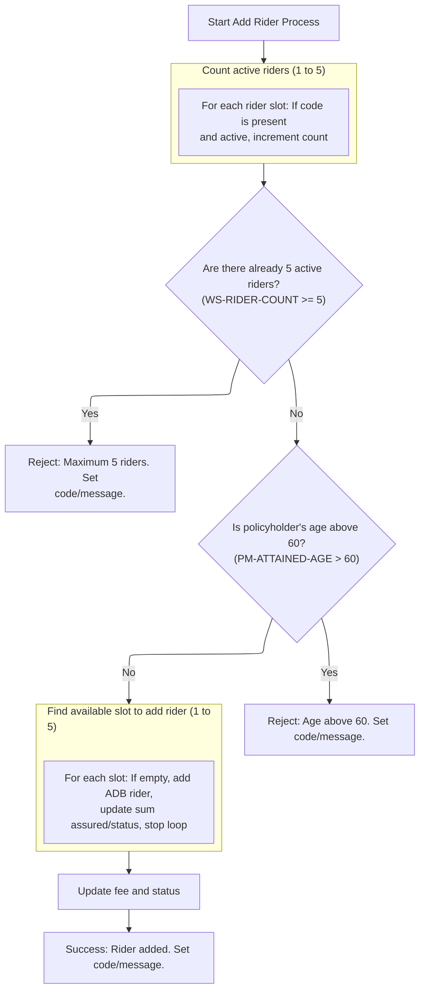

This section enforces business rules for adding a new rider to a policy, ensuring eligibility and updating policy details accordingly.

| Rule ID | Category        | Rule Name                                  | Description                                                                                                                                                                                                                                                                                                                                                                                                                                                                    | Implementation Details                                                                                                                                                                                                                                                                                                      |
| ------- | --------------- | ------------------------------------------ | ------------------------------------------------------------------------------------------------------------------------------------------------------------------------------------------------------------------------------------------------------------------------------------------------------------------------------------------------------------------------------------------------------------------------------------------------------------------------------ | --------------------------------------------------------------------------------------------------------------------------------------------------------------------------------------------------------------------------------------------------------------------------------------------------------------------------- |
| BR-001  | Data validation | Maximum rider limit                        | Reject adding a new rider if there are already 5 active riders on the policy. Set result code to 17 and message to 'MAXIMUM 5 RIDERS ALREADY ON POLICY'.                                                                                                                                                                                                                                                                                                                       | The maximum allowed active riders is 5. The result code is 17. The result message is a string up to 100 characters: 'MAXIMUM 5 RIDERS ALREADY ON POLICY'.                                                                                                                                                                   |
| BR-002  | Data validation | Age restriction for rider addition         | Reject adding a new rider if the policyholder's attained age is above 60. Set result code to 18 and message to 'ADB RIDER: CANNOT ADD ABOVE AGE 60'.                                                                                                                                                                                                                                                                                                                           | The age limit for adding a rider is 60. The result code is 18. The result message is a string up to 100 characters: 'ADB RIDER: CANNOT ADD ABOVE AGE 60'.                                                                                                                                                                   |
| BR-003  | Calculation     | Fee and status update after rider addition | After successfully adding a rider, increase the service fee by 1200, mark the amendment as applied, reset the result code, and set the success message to 'ADB RIDER ADDED'.                                                                                                                                                                                                                                                                                                   | The service fee is increased by 1200. Amendment status is set to 'AP'. Result code is reset to 0. Result message is a string up to 100 characters: 'ADB RIDER ADDED'.                                                                                                                                                       |
| BR-004  | Decision Making | Add ADB rider to available slot            | Add a new <SwmToken path="QCBLLESRC/SVCBILB.cbl" pos="355:4:4" line-data="                   MOVE &#39;ADB01&#39; TO PM-RIDER-CODE(WS-RIDER-IDX)">`ADB01`</SwmToken> rider to the first available slot if eligibility checks pass. Set rider code to <SwmToken path="QCBLLESRC/SVCBILB.cbl" pos="355:4:4" line-data="                   MOVE &#39;ADB01&#39; TO PM-RIDER-CODE(WS-RIDER-IDX)">`ADB01`</SwmToken>, sum assured to current policy sum assured, and status to 'A'. | The rider code added is <SwmToken path="QCBLLESRC/SVCBILB.cbl" pos="355:4:4" line-data="                   MOVE &#39;ADB01&#39; TO PM-RIDER-CODE(WS-RIDER-IDX)">`ADB01`</SwmToken>. The sum assured is set to the current policy sum assured. The rider status is set to 'A'. Rider slots are checked in order from 1 to 5. |

<SwmSnippet path="/QCBLLESRC/SVCBILB.cbl" line="329">

---

In <SwmToken path="QCBLLESRC/SVCBILB.cbl" pos="329:1:5" line-data="       2400-ADD-RIDER.">`2400-ADD-RIDER`</SwmToken>, we count active riders (max 5), check age restriction (must be <= 60), and prep to add a new <SwmToken path="QCBLLESRC/SVCBILB.cbl" pos="355:4:4" line-data="                   MOVE &#39;ADB01&#39; TO PM-RIDER-CODE(WS-RIDER-IDX)">`ADB01`</SwmToken> rider if allowed. These limits are hardcoded and drive the rider addition logic.

```cobol
       2400-ADD-RIDER.
           MOVE 0 TO WS-RIDER-COUNT
           PERFORM VARYING WS-RIDER-IDX FROM 1 BY 1
               UNTIL WS-RIDER-IDX > 5
               IF PM-RIDER-CODE(WS-RIDER-IDX) NOT = SPACES AND
                  PM-RIDER-ACTIVE(WS-RIDER-IDX)
                   ADD 1 TO WS-RIDER-COUNT
               END-IF
           END-PERFORM
```

---

</SwmSnippet>

<SwmSnippet path="/QCBLLESRC/SVCBILB.cbl" line="338">

---

Here we check if there are already 5 riders on the policy. If so, we set an error code and message, then exit without adding anything. This prevents exceeding the rider limit before moving on to age checks or insertion.

```cobol
           IF WS-RIDER-COUNT >= 5
               MOVE 17 TO WS-RESULT-CODE
               MOVE 'MAXIMUM 5 RIDERS ALREADY ON POLICY'
                   TO WS-RESULT-MESSAGE
               EXIT PARAGRAPH
           END-IF
```

---

</SwmSnippet>

<SwmSnippet path="/QCBLLESRC/SVCBILB.cbl" line="345">

---

Next we check if the insured's attained age is over 60. If so, we set an error code and message, then exit. This stops the rider addition for anyone above the age limit before trying to insert the rider.

```cobol
           IF PM-ATTAINED-AGE > 60
               MOVE 18 TO WS-RESULT-CODE
               MOVE 'ADB RIDER: CANNOT ADD ABOVE AGE 60'
                   TO WS-RESULT-MESSAGE
               EXIT PARAGRAPH
           END-IF
```

---

</SwmSnippet>

<SwmSnippet path="/QCBLLESRC/SVCBILB.cbl" line="352">

---

Here we loop through the rider slots to find the first empty one. When we hit a blank slot, we add the <SwmToken path="QCBLLESRC/SVCBILB.cbl" pos="355:4:4" line-data="                   MOVE &#39;ADB01&#39; TO PM-RIDER-CODE(WS-RIDER-IDX)">`ADB01`</SwmToken> rider, set its sum assured and status, then stop. This only happens if the earlier checks for max riders and age pass.

```cobol
           PERFORM VARYING WS-RIDER-IDX FROM 1 BY 1
               UNTIL WS-RIDER-IDX > 5
               IF PM-RIDER-CODE(WS-RIDER-IDX) = SPACES
                   MOVE 'ADB01' TO PM-RIDER-CODE(WS-RIDER-IDX)
                   MOVE PM-SUM-ASSURED
                       TO PM-RIDER-SUM-ASSURED(WS-RIDER-IDX)
                   MOVE 'A' TO PM-RIDER-STATUS(WS-RIDER-IDX)
                   STOP PERFORM
               END-IF
           END-PERFORM
```

---

</SwmSnippet>

<SwmSnippet path="/QCBLLESRC/SVCBILB.cbl" line="362">

---

After adding the rider, we call <SwmToken path="QCBLLESRC/SVCBILB.cbl" pos="362:3:7" line-data="           PERFORM 3100-REPRICE-POLICY">`3100-REPRICE-POLICY`</SwmToken> to recalculate the premium. This keeps the policy's billing up to date with the new coverage.

```cobol
           PERFORM 3100-REPRICE-POLICY
```

---

</SwmSnippet>

<SwmSnippet path="/QCBLLESRC/SVCBILB.cbl" line="363">

---

Back in <SwmToken path="QCBLLESRC/SVCBILB.cbl" pos="117:9:13" line-data="               WHEN &#39;AR&#39; PERFORM 2400-ADD-RIDER">`2400-ADD-RIDER`</SwmToken> after repricing, we add a fixed service fee, mark the amendment as applied, reset the result code, and set the success message. This wraps up the rider addition and updates the policy record.

```cobol
           ADD 1200 TO PM-SERVICE-FEE-CHARGED
           MOVE 'AP' TO PM-AMENDMENT-STATUS
           MOVE 0 TO WS-RESULT-CODE
           MOVE 'ADB RIDER ADDED' TO WS-RESULT-MESSAGE.
```

---

</SwmSnippet>

## Removing a rider from the policy

This section manages the targeted removal of the <SwmToken path="QCBLLESRC/SVCBILB.cbl" pos="355:4:4" line-data="                   MOVE &#39;ADB01&#39; TO PM-RIDER-CODE(WS-RIDER-IDX)">`ADB01`</SwmToken> rider from a policy, ensuring all related fields are updated and the policy is repriced accordingly.

| Rule ID | Category                        | Rule Name                                                                                                                                                                | Description                                                                                                                                                                                                                                                                         | Implementation Details                                                                                                                                               |
| ------- | ------------------------------- | ------------------------------------------------------------------------------------------------------------------------------------------------------------------------ | ----------------------------------------------------------------------------------------------------------------------------------------------------------------------------------------------------------------------------------------------------------------------------------- | -------------------------------------------------------------------------------------------------------------------------------------------------------------------- |
| BR-001  | Calculation                     | Service fee addition after rider removal                                                                                                                                 | A fixed service fee of 1000 is added to the policy after rider removal and repricing.                                                                                                                                                                                               | The service fee added is 1000. This is a numeric value added to the policy's service fee charged field.                                                              |
| BR-002  | Decision Making                 | <SwmToken path="QCBLLESRC/SVCBILB.cbl" pos="355:4:4" line-data="                   MOVE &#39;ADB01&#39; TO PM-RIDER-CODE(WS-RIDER-IDX)">`ADB01`</SwmToken> rider removal | When an active <SwmToken path="QCBLLESRC/SVCBILB.cbl" pos="355:4:4" line-data="                   MOVE &#39;ADB01&#39; TO PM-RIDER-CODE(WS-RIDER-IDX)">`ADB01`</SwmToken> rider is present in the policy, it is marked as removed, and its coverage and premium fields are cleared. | The rider status is set to 'R' (removed). Coverage and premium fields are set to zero. Coverage and premium fields are numeric values.                               |
| BR-003  | Writing Output                  | Amendment status update                                                                                                                                                  | The amendment status is updated to 'AP' after rider removal and repricing.                                                                                                                                                                                                          | The amendment status is set to 'AP'. This is an alphanumeric field indicating amendment applied.                                                                     |
| BR-004  | Writing Output                  | Result code and message update                                                                                                                                           | The result code is reset to 0 and the result message is set to 'ADB RIDER REMOVED' after rider removal.                                                                                                                                                                             | Result code is set to 0 (numeric). Result message is set to 'ADB RIDER REMOVED' (string, up to 100 characters).                                                      |
| BR-005  | Invoking a Service or a Process | Policy repricing after rider removal                                                                                                                                     | After removing the rider, the policy premium is recalculated to reflect the updated coverage.                                                                                                                                                                                       | The repricing is triggered immediately after rider removal. The recalculated premium is not detailed in this section, but is handled by the invoked repricing logic. |

<SwmSnippet path="/QCBLLESRC/SVCBILB.cbl" line="371">

---

In <SwmToken path="QCBLLESRC/SVCBILB.cbl" pos="371:1:5" line-data="       2500-REMOVE-RIDER.">`2500-REMOVE-RIDER`</SwmToken>, we loop through the rider slots to find the first active <SwmToken path="QCBLLESRC/SVCBILB.cbl" pos="375:19:19" line-data="               IF PM-RIDER-CODE(WS-RIDER-IDX) = &#39;ADB01&#39; AND">`ADB01`</SwmToken>. When found, we mark it as removed and clear its coverage and premium fields. This is a targeted removal based on business rules.

```cobol
       2500-REMOVE-RIDER.
           MOVE 'N' TO WS-ADB-FOUND OF PROCEDURE DIVISION
           PERFORM VARYING WS-RIDER-IDX FROM 1 BY 1
               UNTIL WS-RIDER-IDX > 5
               IF PM-RIDER-CODE(WS-RIDER-IDX) = 'ADB01' AND
                  PM-RIDER-ACTIVE(WS-RIDER-IDX)
                   MOVE 'R' TO PM-RIDER-STATUS(WS-RIDER-IDX)
                   MOVE ZEROS TO PM-RIDER-SUM-ASSURED(WS-RIDER-IDX)
                   MOVE ZEROS TO PM-RIDER-RATE(WS-RIDER-IDX)
                   MOVE ZEROS TO PM-RIDER-ANNUAL-PREM(WS-RIDER-IDX)
                   STOP PERFORM
               END-IF
           END-PERFORM
```

---

</SwmSnippet>

<SwmSnippet path="/QCBLLESRC/SVCBILB.cbl" line="384">

---

After removing the rider, we call <SwmToken path="QCBLLESRC/SVCBILB.cbl" pos="384:3:7" line-data="           PERFORM 3100-REPRICE-POLICY">`3100-REPRICE-POLICY`</SwmToken> to recalculate the premium. This keeps the policy's billing up to date with the new coverage.

```cobol
           PERFORM 3100-REPRICE-POLICY
```

---

</SwmSnippet>

<SwmSnippet path="/QCBLLESRC/SVCBILB.cbl" line="385">

---

Back in <SwmToken path="QCBLLESRC/SVCBILB.cbl" pos="118:9:13" line-data="               WHEN &#39;RR&#39; PERFORM 2500-REMOVE-RIDER">`2500-REMOVE-RIDER`</SwmToken> after repricing, we add a fixed service fee, mark the amendment as applied, reset the result code, and set the success message. This wraps up the rider removal and updates the policy record.

```cobol
           ADD 1000 TO PM-SERVICE-FEE-CHARGED
           MOVE 'AP' TO PM-AMENDMENT-STATUS
           MOVE 0 TO WS-RESULT-CODE
           MOVE 'ADB RIDER REMOVED' TO WS-RESULT-MESSAGE.
```

---

</SwmSnippet>

## Processing policy reinstatement

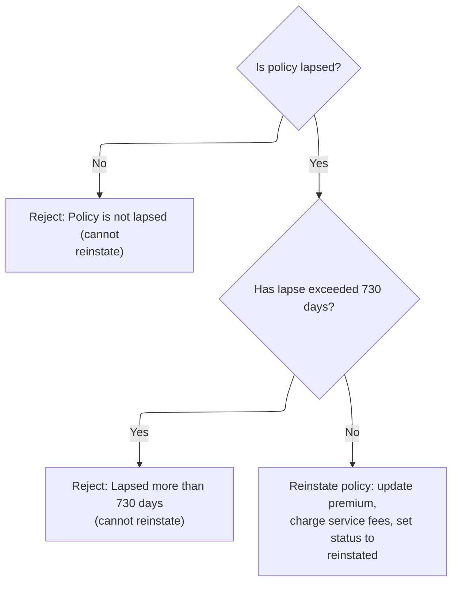

This section governs the business process for reinstating lapsed insurance policies. It enforces eligibility criteria, applies reinstatement limits, and updates the policy record upon successful reinstatement.

| Rule ID | Category        | Rule Name                    | Description                                                                                                                                                                                                                                             | Implementation Details                                                                                                                                                                                                                                                                                                                                        |
| ------- | --------------- | ---------------------------- | ------------------------------------------------------------------------------------------------------------------------------------------------------------------------------------------------------------------------------------------------------- | ------------------------------------------------------------------------------------------------------------------------------------------------------------------------------------------------------------------------------------------------------------------------------------------------------------------------------------------------------------- |
| BR-001  | Data validation | Lapsed status eligibility    | A policy is eligible for reinstatement only if its contract status is 'lapsed'. If the policy is not lapsed, the reinstatement request is rejected with a specific error code and message.                                                              | The error code is set to 21 and the error message is set to 'REINSTATEMENT: POLICY IS NOT LAPSED'. The result code is a number (2 digits), and the result message is a string (up to 100 characters).                                                                                                                                                         |
| BR-002  | Data validation | Lapse duration limit         | A policy cannot be reinstated if the lapse duration exceeds the allowed window of 730 days. If the lapse duration is greater than 730 days, the reinstatement request is rejected with a specific error code and message.                               | The lapse window is 730 days for all plan codes. The error code is set to 22 and the error message is set to 'REINSTATEMENT: LAPSED MORE THAN 730 DAYS'. The result code is a number (2 digits), and the result message is a string (up to 100 characters).                                                                                                   |
| BR-003  | Calculation     | Policy reinstatement actions | If a policy passes all eligibility checks, it is reinstated by updating the outstanding premium, charging two fixed service fees, setting the contract status to 'reinstated', updating the amendment status, and returning a success code and message. | Outstanding premium is set to the modal premium. Two service fees are added: 1500 and 2500 (units not specified). Contract status is set to 'RS' (reinstated). Amendment status is set to 'AP'. Result code is set to 0. Result message is set to 'POLICY REINSTATED'. Result code is a number (2 digits), result message is a string (up to 100 characters). |

<SwmSnippet path="/QCBLLESRC/SVCBILB.cbl" line="393">

---

In <SwmToken path="QCBLLESRC/SVCBILB.cbl" pos="393:1:5" line-data="       2600-PROCESS-REINSTATEMENT.">`2600-PROCESS-REINSTATEMENT`</SwmToken>, we first check if the policy is lapsed. If not, we set an error code and message, then exit. This enforces eligibility before moving on to lapse duration checks.

```cobol
       2600-PROCESS-REINSTATEMENT.
      * SV-901: ONLY LAPSED POLICIES
           IF NOT PM-STATUS-LAPSED
               MOVE 21 TO WS-RESULT-CODE
               MOVE 'REINSTATEMENT: POLICY IS NOT LAPSED'
                   TO WS-RESULT-MESSAGE
               EXIT PARAGRAPH
           END-IF
```

---

</SwmSnippet>

<SwmSnippet path="/QCBLLESRC/SVCBILB.cbl" line="402">

---

Next we calculate how long the policy has been lapsed. If it's over the allowed window, we set an error code and message, then exit. This enforces the maximum lapse period for reinstatement.

```cobol
           COMPUTE WS-DAYS-SINCE-LAPSE =
               PM-PROCESS-DATE - PM-PAID-TO-DATE
           IF WS-DAYS-SINCE-LAPSE > PM-REINSTATE-WINDOW
               MOVE 22 TO WS-RESULT-CODE
               MOVE 'REINSTATEMENT: LAPSED MORE THAN 730 DAYS'
                   TO WS-RESULT-MESSAGE
               EXIT PARAGRAPH
           END-IF
```

---

</SwmSnippet>

<SwmSnippet path="/QCBLLESRC/SVCBILB.cbl" line="411">

---

After passing the checks, we set the outstanding premium, add two fixed fees, update the contract and amendment status, reset the result code, and set the success message. This finalizes reinstatement and updates the policy record.

```cobol
           MOVE PM-MODAL-PREMIUM TO PM-OUTSTANDING-PREMIUM
           ADD 1500 TO PM-SERVICE-FEE-CHARGED
           ADD 2500 TO PM-SERVICE-FEE-CHARGED
           MOVE 'RS' TO PM-CONTRACT-STATUS
           MOVE 'AP' TO PM-AMENDMENT-STATUS
           MOVE 0 TO WS-RESULT-CODE
           MOVE 'POLICY REINSTATED' TO WS-RESULT-MESSAGE.
```

---

</SwmSnippet>

## Completing batch servicing and returning results

This section completes the batch servicing process by updating the policy master record with the final result, saving the record, and closing all files before returning control.

| Rule ID | Category       | Rule Name                           | Description                                                                                                       | Implementation Details                                                                                                                 |
| ------- | -------------- | ----------------------------------- | ----------------------------------------------------------------------------------------------------------------- | -------------------------------------------------------------------------------------------------------------------------------------- |
| BR-001  | Writing Output | Set result code in policy master    | The result code for the batch servicing process is set in the policy master record before the record is saved.    | The result code is a numeric value with two digits. It is stored in the policy master record's result code field.                      |
| BR-002  | Writing Output | Set result message in policy master | The result message for the batch servicing process is set in the policy master record before the record is saved. | The result message is an alphanumeric string of up to 100 characters. It is stored in the policy master record's result message field. |
| BR-003  | Writing Output | Save updated policy master record   | The updated policy master record is saved to persistent storage after the result code and message are set.        | The entire policy master record, including the updated result code and message, is saved to persistent storage.                        |
| BR-004  | Writing Output | Close files after batch servicing   | All files related to the policy master and servicing are closed at the end of the batch servicing process.        | All open files for the policy master and servicing are closed to release resources and ensure data integrity.                          |

<SwmSnippet path="/QCBLLESRC/SVCBILB.cbl" line="121">

---

We save the result, close everything, and finish the batch process.

```cobol
           MOVE WS-RESULT-CODE TO PM-RETURN-CODE
           MOVE WS-RESULT-MESSAGE TO PM-RETURN-MESSAGE
           REWRITE WS-POLICY-MASTER-REC
           CLOSE POLMST SVCPF
           GOBACK.
```

---

</SwmSnippet>

&nbsp;

*This is an auto-generated document by Swimm 🌊 and has not yet been verified by a human*

<SwmMeta version="3.0.0" repo-id="Z2l0aHViJTNBJTNBTElGRTQwMCUzQSUzQW11ZGFzaW4x" repo-name="LIFE400"><sup>Powered by [Swimm](https://app.swimm.io/)</sup></SwmMeta>
