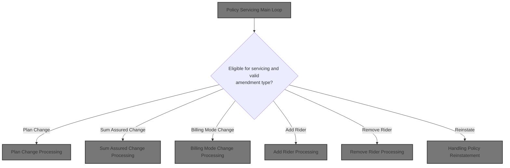
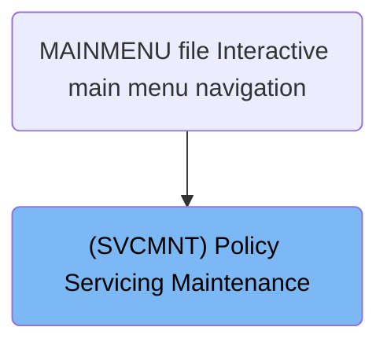
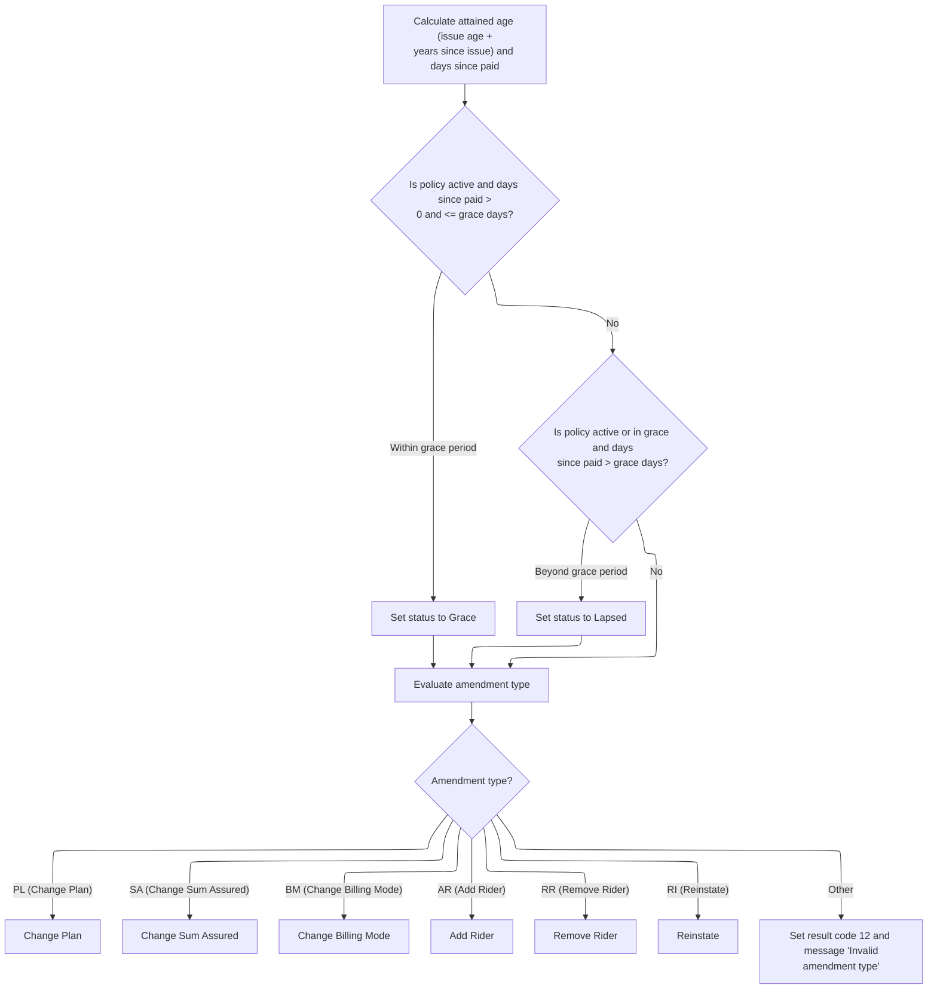
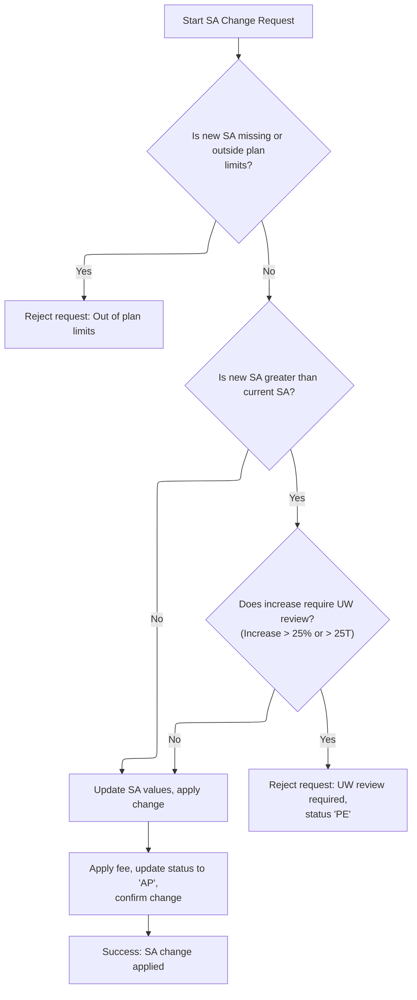
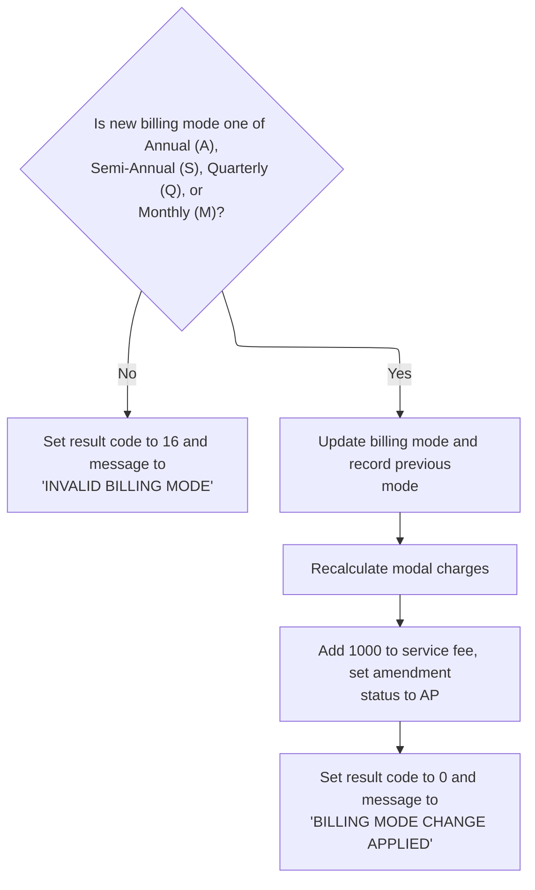
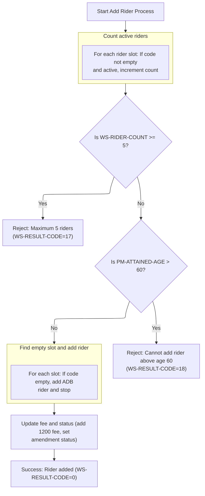
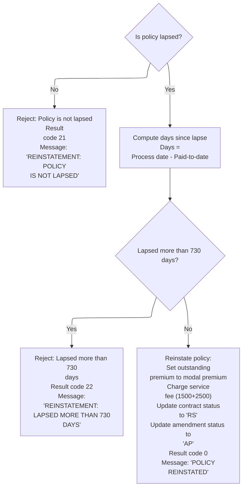

# Overview

This document describes the flow for interactive policy servicing maintenance. Users can look up policies, view details, and request amendments including plan changes, sum assured changes, billing mode changes, adding or removing riders, or reinstating lapsed policies. The system validates requests, applies business rules, updates policy records, and displays results.



## Dependencies

### Program

- SVCMNT (<SwmPath>[QCBLLESRC/SVCMNT.cbl](QCBLLESRC/SVCMNT.cbl)</SwmPath>)

### Copybook

- POLDATA (<SwmPath>[QCPYSRC/POLDATA.cpy](QCPYSRC/POLDATA.cpy)</SwmPath>)

# Where is this program used?

This program is used once, as represented in the following diagram:



## Input and Output Tables/Files used

### SVCMNT (<SwmPath>[QCBLLESRC/SVCMNT.cbl](QCBLLESRC/SVCMNT.cbl)</SwmPath>)

| Table / File Name                                                                                                                                                | Type | Description                                             | Usage Mode   | Key Fields / Layout Highlights |
| ---------------------------------------------------------------------------------------------------------------------------------------------------------------- | ---- | ------------------------------------------------------- | ------------ | ------------------------------ |
| POLMST                                                                                                                                                           | File | Indexed master file for life insurance policy records   | Input/Output | File resource                  |
| <SwmToken path="QCBLLESRC/SVCMNT.cbl" pos="88:3:7" line-data="                   WRITE SVC-DSP-RECORD FORMAT IS &#39;SVCRESULT&#39;">`SVC-DSP-RECORD`</SwmToken> | File | Screen record buffer for display and transaction output | Output       | File resource                  |
| SVCDSPF                                                                                                                                                          | File | User screen input/output for policy servicing actions   | Input/Output | File resource                  |
| SVCPF                                                                                                                                                            | File | Indexed file for policy servicing amendment records     | Input/Output | File resource                  |
| <SwmToken path="QCBLLESRC/SVCMNT.cbl" pos="191:3:5" line-data="           WRITE SVCPF-RECORD">`SVCPF-RECORD`</SwmToken>                                          | File | Buffer for writing servicing amendment transaction data | Output       | File resource                  |
| <SwmToken path="QCBLLESRC/SVCMNT.cbl" pos="190:3:9" line-data="           REWRITE WS-POLICY-MASTER-REC">`WS-POLICY-MASTER-REC`</SwmToken>                        | File | In-memory working copy of a policy master record        | Output       | File resource                  |

# Workflow

# Policy Servicing Main Loop

This section manages the main policy servicing loop, handling user input, policy lookup, display, and amendment processing. It governs the flow of user interaction and policy updates.

| Rule ID | Category        | Rule Name                         | Description                                                                                                                                                                                                                                                                                                                                                                                                                                  | Implementation Details                                                                                                                                                                                                                                                            |
| ------- | --------------- | --------------------------------- | -------------------------------------------------------------------------------------------------------------------------------------------------------------------------------------------------------------------------------------------------------------------------------------------------------------------------------------------------------------------------------------------------------------------------------------------- | --------------------------------------------------------------------------------------------------------------------------------------------------------------------------------------------------------------------------------------------------------------------------------- |
| BR-001  | Data validation | Policy not found error message    | If the policy lookup fails (status not '00'), an error message is displayed to the user and the loop iteration is skipped.                                                                                                                                                                                                                                                                                                                   | Error message 'POLICY NOT FOUND - PLEASE <SwmToken path="QCBLLESRC/SVCMNT.cbl" pos="86:14:16" line-data="                   MOVE &#39;POLICY NOT FOUND - PLEASE RE-ENTER&#39;">`RE-ENTER`</SwmToken>' is displayed. Output format is display record with message field populated. |
| BR-002  | Decision Making | User exit or cancel               | If the user triggers exit or cancel (via input flags \*<SwmToken path="QCBLLESRC/SVCMNT.cbl" pos="83:4:4" line-data="               IF *IN03 = &#39;1&#39; OR *IN12 = &#39;1&#39;">`IN03`</SwmToken> or \*<SwmToken path="QCBLLESRC/SVCMNT.cbl" pos="83:15:15" line-data="               IF *IN03 = &#39;1&#39; OR *IN12 = &#39;1&#39;">`IN12`</SwmToken>), the servicing loop is exited and no further processing occurs in this iteration. | Exit is triggered by input flags set to '1'. No output is generated except loop termination.                                                                                                                                                                                      |
| BR-003  | Decision Making | Reinstatement amendment           | If the user requests a reinstatement (via input flag \*<SwmToken path="QCBLLESRC/SVCMNT.cbl" pos="94:6:6" line-data="                   ELSE IF *IN10 = &#39;1&#39;">`IN10`</SwmToken>), the amendment type is set to 'RI' and the amendment is applied to the policy.                                                                                                                                                                       | Amendment type 'RI' is set. Amendment is applied via amendment routine. Output is updated policy data and result message.                                                                                                                                                         |
| BR-004  | Decision Making | Other amendment processing        | If the user requests other amendments (via input flag \*<SwmToken path="QCBLLESRC/SVCMNT.cbl" pos="97:6:6" line-data="                   ELSE IF *IN06 = &#39;1&#39;">`IN06`</SwmToken>), the amendment routine is invoked to apply the requested changes to the policy.                                                                                                                                                                     | Amendment routine is invoked. Output is updated policy data and result message.                                                                                                                                                                                                   |
| BR-005  | Writing Output  | Policy display and amendment info | If the policy is found, the policy details are displayed to the user, followed by amendment information.                                                                                                                                                                                                                                                                                                                                     | Policy details and amendment info are displayed in sequence. Output format is display record with policy fields and amendment info populated.                                                                                                                                     |

<SwmSnippet path="/QCBLLESRC/SVCMNT.cbl" line="77">

---

In <SwmToken path="QCBLLESRC/SVCMNT.cbl" pos="77:1:3" line-data="       MAIN-PROCESS.">`MAIN-PROCESS`</SwmToken>, we open the three main files (SVCDSPF, POLMST, SVCPF) for input/output. This sets up access to the display, policy master, and servicing data needed for the rest of the process. The main loop and all subsequent logic depend on these files being available.

```cobol
       MAIN-PROCESS.
           OPEN I-O SVCDSPF
           OPEN I-O POLMST
           OPEN I-O SVCPF
```

---

</SwmSnippet>

<SwmSnippet path="/QCBLLESRC/SVCMNT.cbl" line="81">

---

Right after opening the files, we call <SwmToken path="QCBLLESRC/SVCMNT.cbl" pos="82:3:7" line-data="               PERFORM 1000-DISPLAY-HEADER">`1000-DISPLAY-HEADER`</SwmToken> to show the policy search header and grab the current date and policy selection. This is needed to get the policy context for the rest of the loop.

```cobol
           PERFORM UNTIL WS-CONTINUE = 'N'
               PERFORM 1000-DISPLAY-HEADER
```

---

</SwmSnippet>

<SwmSnippet path="/QCBLLESRC/SVCMNT.cbl" line="105">

---

This part gets the date, loads the policy master record, and doesn't handle missing policies directly.

```cobol
       1000-DISPLAY-HEADER.
           MOVE SPACES TO SVCPOLID
      *Y2K-REVIEWED 1998-11-14
           ACCEPT SVCPRCDT FROM DATE YYYYMMDD
           WRITE SVC-DSP-RECORD FORMAT IS 'SVCHDR'
           READ SVCDSPF FORMAT IS 'SVCHDR'
           MOVE SVCPOLID TO PM-POLICY-ID
           MOVE SVCPRCDT TO PM-PROCESS-DATE
           READ POLMST KEY IS PM-POLICY-ID
               INVALID KEY
                   CONTINUE
               NOT INVALID KEY
                   CONTINUE
           END-READ.
```

---

</SwmSnippet>

<SwmSnippet path="/QCBLLESRC/SVCMNT.cbl" line="83">

---

Back in <SwmToken path="QCBLLESRC/SVCMNT.cbl" pos="77:1:3" line-data="       MAIN-PROCESS.">`MAIN-PROCESS`</SwmToken>, after returning from <SwmToken path="QCBLLESRC/SVCMNT.cbl" pos="82:3:7" line-data="               PERFORM 1000-DISPLAY-HEADER">`1000-DISPLAY-HEADER`</SwmToken>, we immediately check if \*<SwmToken path="QCBLLESRC/SVCMNT.cbl" pos="83:4:4" line-data="               IF *IN03 = &#39;1&#39; OR *IN12 = &#39;1&#39;">`IN03`</SwmToken> or \*<SwmToken path="QCBLLESRC/SVCMNT.cbl" pos="83:15:15" line-data="               IF *IN03 = &#39;1&#39; OR *IN12 = &#39;1&#39;">`IN12`</SwmToken> is set. If so, we set <SwmToken path="QCBLLESRC/SVCMNT.cbl" pos="84:9:11" line-data="                   MOVE &#39;N&#39; TO WS-CONTINUE">`WS-CONTINUE`</SwmToken> to 'N' to exit the loop. This is how user exit or cancel is handled right after the header step.

```cobol
               IF *IN03 = '1' OR *IN12 = '1'
                   MOVE 'N' TO WS-CONTINUE
```

---

</SwmSnippet>

<SwmSnippet path="/QCBLLESRC/SVCMNT.cbl" line="85">

---

If we didn't exit, we check <SwmToken path="QCBLLESRC/SVCMNT.cbl" pos="85:5:9" line-data="               ELSE IF WS-POLMST-STATUS NOT = &#39;00&#39;">`WS-POLMST-STATUS`</SwmToken>. If it's not '00', the policy wasn't found, so we display an error message and skip the rest of the loop iteration.

```cobol
               ELSE IF WS-POLMST-STATUS NOT = '00'
                   MOVE 'POLICY NOT FOUND - PLEASE RE-ENTER'
                       TO SVCMSG
                   WRITE SVC-DSP-RECORD FORMAT IS 'SVCRESULT'
```

---

</SwmSnippet>

<SwmSnippet path="/QCBLLESRC/SVCMNT.cbl" line="89">

---

If the policy is found, we call <SwmToken path="QCBLLESRC/SVCMNT.cbl" pos="90:3:7" line-data="                   PERFORM 2000-DISPLAY-POLICY">`2000-DISPLAY-POLICY`</SwmToken> to show the policy details, then <SwmToken path="QCBLLESRC/SVCMNT.cbl" pos="91:3:7" line-data="                   PERFORM 3000-DISPLAY-AMENDMENT">`3000-DISPLAY-AMENDMENT`</SwmToken> to show amendment info. This sets up the screen for the user to review or make changes.

```cobol
               ELSE
                   PERFORM 2000-DISPLAY-POLICY
                   PERFORM 3000-DISPLAY-AMENDMENT
```

---

</SwmSnippet>

<SwmSnippet path="/QCBLLESRC/SVCMNT.cbl" line="120">

---

<SwmToken path="QCBLLESRC/SVCMNT.cbl" pos="120:1:5" line-data="       2000-DISPLAY-POLICY.">`2000-DISPLAY-POLICY`</SwmToken> copies all the relevant policy master fields into the display structure, including recalculated values like attained age and modal premium, then writes out the display record for the user. The attained age calculation is a rough year difference.

```cobol
       2000-DISPLAY-POLICY.
           MOVE PM-PLAN-CODE TO SVCPLANC
           MOVE PM-CONTRACT-STATUS TO SVCCNTRST
           MOVE PM-BILLING-MODE TO SVCBILMD
           MOVE PM-SUM-ASSURED TO SVCSUMASR
           MOVE PM-MODAL-PREMIUM TO SVCMODPRM
           MOVE PM-INSURED-NAME TO SVCINSNAM
           MOVE PM-ISSUE-AGE TO SVCISSAGE
           MOVE PM-ATTAINED-AGE TO SVCATTNAG
           MOVE PM-ISSUE-DATE TO SVCISSDT
           MOVE PM-EXPIRY-DATE TO SVCEXPDT
           MOVE PM-PAID-TO-DATE TO SVCPAIDTO
           WRITE SVC-DSP-RECORD FORMAT IS 'SVCPOL'.
```

---

</SwmSnippet>

<SwmSnippet path="/QCBLLESRC/SVCMNT.cbl" line="92">

---

After returning from <SwmToken path="QCBLLESRC/SVCMNT.cbl" pos="90:3:7" line-data="                   PERFORM 2000-DISPLAY-POLICY">`2000-DISPLAY-POLICY`</SwmToken> in <SwmToken path="QCBLLESRC/SVCMNT.cbl" pos="77:1:3" line-data="       MAIN-PROCESS.">`MAIN-PROCESS`</SwmToken>, we check the input flags again. If \*<SwmToken path="QCBLLESRC/SVCMNT.cbl" pos="92:4:4" line-data="                   IF *IN03 = &#39;1&#39; OR *IN12 = &#39;1&#39;">`IN03`</SwmToken> or \*<SwmToken path="QCBLLESRC/SVCMNT.cbl" pos="92:15:15" line-data="                   IF *IN03 = &#39;1&#39; OR *IN12 = &#39;1&#39;">`IN12`</SwmToken> is set, we exit. If \*<SwmToken path="QCBLLESRC/SVCMNT.cbl" pos="94:6:6" line-data="                   ELSE IF *IN10 = &#39;1&#39;">`IN10`</SwmToken> is set, we prep for reinstatement and call <SwmToken path="QCBLLESRC/SVCMNT.cbl" pos="96:3:7" line-data="                       PERFORM 4000-APPLY-AMENDMENT">`4000-APPLY-AMENDMENT`</SwmToken>. If \*<SwmToken path="QCBLLESRC/SVCMNT.cbl" pos="97:6:6" line-data="                   ELSE IF *IN06 = &#39;1&#39;">`IN06`</SwmToken> is set, we call <SwmToken path="QCBLLESRC/SVCMNT.cbl" pos="96:3:7" line-data="                       PERFORM 4000-APPLY-AMENDMENT">`4000-APPLY-AMENDMENT`</SwmToken> for other amendments. This is where actual changes get applied based on user actions.

```cobol
                   IF *IN03 = '1' OR *IN12 = '1'
                       MOVE 'N' TO WS-CONTINUE
                   ELSE IF *IN10 = '1'
                       MOVE 'RI' TO PM-AMENDMENT-TYPE
                       PERFORM 4000-APPLY-AMENDMENT
                   ELSE IF *IN06 = '1'
                       PERFORM 4000-APPLY-AMENDMENT
                   END-IF
```

---

</SwmSnippet>

## Amendment Application Dispatcher

```mermaid
%%{init: {"flowchart": {"defaultRenderer": "elk"}} }%%
flowchart TD
    node1["Start amendment processing"] --> node2{"Is policy status 'Claimed' or
'Terminated'?"}
    click node1 openCode "QCBLLESRC/SVCMNT.cbl:149:161"
    node2 -->|"Yes"| node10["Display result: Cannot service
claimed/terminated policy"]
    click node2 openCode "QCBLLESRC/SVCMNT.cbl:155:161"
    click node10 openCode "QCBLLESRC/SVCMNT.cbl:159:160"
    node2 -->|"No"| node3["Plan Parameter Assignment"]
    
    node3 --> node4["Update attained age and days since paid"]
    click node4 openCode "QCBLLESRC/SVCMNT.cbl:164:169"
    node4 --> node5{"Is payment overdue but within grace
days?
(WS-DAYS-SINCE-PAID > 0 and <=
PM-GRACE-DAYS)"}
    click node5 openCode "QCBLLESRC/SVCMNT.cbl:170:173"
    node5 -->|"Yes"| node6["Mark policy as 'Grace'"]
    click node6 openCode "QCBLLESRC/SVCMNT.cbl:172:173"
    node6 --> node11["Update policy and display result"]
    node5 -->|"No"| node7{"Is payment overdue beyond grace
days?
(WS-DAYS-SINCE-PAID >
PM-GRACE-DAYS)"}
    click node7 openCode "QCBLLESRC/SVCMNT.cbl:174:177"
    node7 -->|"Yes"| node8["Mark policy as 'Lapsed'"]
    click node8 openCode "QCBLLESRC/SVCMNT.cbl:176:177"
    node8 --> node11["Update policy and display result"]
    node7 -->|"No"| node9{"What is the amendment
type?
(PM-AMENDMENT-TYPE)"}
    click node9 openCode "QCBLLESRC/SVCMNT.cbl:179:189"
    node9 -->|"PL"| node4a["Plan Change Processing"]
    
    node9 -->|"SA"| node5a["Sum Assured Change Processing"]
    
    node9 -->|"BM"| node6a["Billing Mode Change Processing"]
    
    node9 -->|"AR"| node7a["Add Rider Processing"]
    
    node9 -->|"RR"| node8a["Remove Rider Processing"]
    
    node9 -->|"RI"| node9a["Handling Policy Reinstatement"]
    
    node9 -->|"Other"| node10a["Display result: Invalid amendment type"]
    click node10a openCode "QCBLLESRC/SVCMNT.cbl:187:188"
    node4a --> node11["Update policy and display result"]
    node5a --> node11
    node6a --> node11
    node7a --> node11
    node8a --> node11
    node9a --> node11
    node10a --> node11
    click node11 openCode "QCBLLESRC/SVCMNT.cbl:190:192"
classDef HeadingStyle fill:#777777,stroke:#333,stroke-width:2px;
click node3 goToHeading "Plan Parameter Assignment"
node3:::HeadingStyle
click node4a goToHeading "Plan Change Processing"
node4a:::HeadingStyle
click node5a goToHeading "Sum Assured Change Processing"
node5a:::HeadingStyle
click node6a goToHeading "Billing Mode Change Processing"
node6a:::HeadingStyle
click node7a goToHeading "Add Rider Processing"
node7a:::HeadingStyle
click node8a goToHeading "Remove Rider Processing"
node8a:::HeadingStyle
click node9a goToHeading "Handling Policy Reinstatement"
node9a:::HeadingStyle

%% Swimm:
%% %%{init: {"flowchart": {"defaultRenderer": "elk"}} }%%
%% flowchart TD
%%     node1["Start amendment processing"] --> node2{"Is policy status 'Claimed' or
%% 'Terminated'?"}
%%     click node1 openCode "<SwmPath>[QCBLLESRC/SVCMNT.cbl](QCBLLESRC/SVCMNT.cbl)</SwmPath>:149:161"
%%     node2 -->|"Yes"| node10["Display result: Cannot service
%% claimed/terminated policy"]
%%     click node2 openCode "<SwmPath>[QCBLLESRC/SVCMNT.cbl](QCBLLESRC/SVCMNT.cbl)</SwmPath>:155:161"
%%     click node10 openCode "<SwmPath>[QCBLLESRC/SVCMNT.cbl](QCBLLESRC/SVCMNT.cbl)</SwmPath>:159:160"
%%     node2 -->|"No"| node3["Plan Parameter Assignment"]
%%     
%%     node3 --> node4["Update attained age and days since paid"]
%%     click node4 openCode "<SwmPath>[QCBLLESRC/SVCMNT.cbl](QCBLLESRC/SVCMNT.cbl)</SwmPath>:164:169"
%%     node4 --> node5{"Is payment overdue but within grace
%% days?
%% (<SwmToken path="QCBLLESRC/SVCMNT.cbl" pos="168:3:9" line-data="           COMPUTE WS-DAYS-SINCE-PAID =">`WS-DAYS-SINCE-PAID`</SwmToken> > 0 and <=
%% <SwmToken path="QCBLLESRC/SVCMNT.cbl" pos="171:11:15" line-data="              WS-DAYS-SINCE-PAID &lt;= PM-GRACE-DAYS">`PM-GRACE-DAYS`</SwmToken>)"}
%%     click node5 openCode "<SwmPath>[QCBLLESRC/SVCMNT.cbl](QCBLLESRC/SVCMNT.cbl)</SwmPath>:170:173"
%%     node5 -->|"Yes"| node6["Mark policy as 'Grace'"]
%%     click node6 openCode "<SwmPath>[QCBLLESRC/SVCMNT.cbl](QCBLLESRC/SVCMNT.cbl)</SwmPath>:172:173"
%%     node6 --> node11["Update policy and display result"]
%%     node5 -->|"No"| node7{"Is payment overdue beyond grace
%% days?
%% (<SwmToken path="QCBLLESRC/SVCMNT.cbl" pos="168:3:9" line-data="           COMPUTE WS-DAYS-SINCE-PAID =">`WS-DAYS-SINCE-PAID`</SwmToken> >
%% <SwmToken path="QCBLLESRC/SVCMNT.cbl" pos="171:11:15" line-data="              WS-DAYS-SINCE-PAID &lt;= PM-GRACE-DAYS">`PM-GRACE-DAYS`</SwmToken>)"}
%%     click node7 openCode "<SwmPath>[QCBLLESRC/SVCMNT.cbl](QCBLLESRC/SVCMNT.cbl)</SwmPath>:174:177"
%%     node7 -->|"Yes"| node8["Mark policy as 'Lapsed'"]
%%     click node8 openCode "<SwmPath>[QCBLLESRC/SVCMNT.cbl](QCBLLESRC/SVCMNT.cbl)</SwmPath>:176:177"
%%     node8 --> node11["Update policy and display result"]
%%     node7 -->|"No"| node9{"What is the amendment
%% type?
%% (<SwmToken path="QCBLLESRC/SVCMNT.cbl" pos="95:9:13" line-data="                       MOVE &#39;RI&#39; TO PM-AMENDMENT-TYPE">`PM-AMENDMENT-TYPE`</SwmToken>)"}
%%     click node9 openCode "<SwmPath>[QCBLLESRC/SVCMNT.cbl](QCBLLESRC/SVCMNT.cbl)</SwmPath>:179:189"
%%     node9 -->|"PL"| node4a["Plan Change Processing"]
%%     
%%     node9 -->|"SA"| node5a["Sum Assured Change Processing"]
%%     
%%     node9 -->|"BM"| node6a["Billing Mode Change Processing"]
%%     
%%     node9 -->|"AR"| node7a["Add Rider Processing"]
%%     
%%     node9 -->|"RR"| node8a["Remove Rider Processing"]
%%     
%%     node9 -->|"RI"| node9a["Handling Policy Reinstatement"]
%%     
%%     node9 -->|"Other"| node10a["Display result: Invalid amendment type"]
%%     click node10a openCode "<SwmPath>[QCBLLESRC/SVCMNT.cbl](QCBLLESRC/SVCMNT.cbl)</SwmPath>:187:188"
%%     node4a --> node11["Update policy and display result"]
%%     node5a --> node11
%%     node6a --> node11
%%     node7a --> node11
%%     node8a --> node11
%%     node9a --> node11
%%     node10a --> node11
%%     click node11 openCode "<SwmPath>[QCBLLESRC/SVCMNT.cbl](QCBLLESRC/SVCMNT.cbl)</SwmPath>:190:192"
%% classDef HeadingStyle fill:#777777,stroke:#333,stroke-width:2px;
%% click node3 goToHeading "Plan Parameter Assignment"
%% node3:::HeadingStyle
%% click node4a goToHeading "Plan Change Processing"
%% node4a:::HeadingStyle
%% click node5a goToHeading "Sum Assured Change Processing"
%% node5a:::HeadingStyle
%% click node6a goToHeading "Billing Mode Change Processing"
%% node6a:::HeadingStyle
%% click node7a goToHeading "Add Rider Processing"
%% node7a:::HeadingStyle
%% click node8a goToHeading "Remove Rider Processing"
%% node8a:::HeadingStyle
%% click node9a goToHeading "Handling Policy Reinstatement"
%% node9a:::HeadingStyle
```

This section determines whether a policy amendment can proceed, applies plan-specific logic, and dispatches the request to the appropriate amendment handler. It ensures business rules for eligibility, payment status, and amendment type are enforced before any changes are made.

| Rule ID | Category                        | Rule Name                       | Description                                                                                                                                                                                                                                                                 | Implementation Details                                                                                                                                   |
| ------- | ------------------------------- | ------------------------------- | --------------------------------------------------------------------------------------------------------------------------------------------------------------------------------------------------------------------------------------------------------------------------- | -------------------------------------------------------------------------------------------------------------------------------------------------------- |
| BR-001  | Reading Input                   | Plan Parameter Assignment       | Before processing any amendment, the plan parameters are loaded based on the plan code to ensure all subsequent logic uses current plan settings.                                                                                                                           | Plan parameters include maturity age, issue age range, sum assured limits, fees, grace days (30), and tax rate. Output is updated plan parameter values. |
| BR-002  | Decision Making                 | Claimed/Terminated Policy Block | If the policy status is 'Claimed' or 'Terminated', amendments are not allowed. The result code is set to 11 and the result message is set to 'CLAIMED OR TERMINATED: CANNOT SERVICE'.                                                                                       | Result code is 11 (number). Result message is 'CLAIMED OR TERMINATED: CANNOT SERVICE' (string, up to 100 characters).                                    |
| BR-003  | Decision Making                 | Grace Period Assignment         | If payment is overdue but within the grace period (days since paid > 0 and <= grace days), the policy is marked as 'Grace'.                                                                                                                                                 | Grace days is 30 for all plan codes. Policy status is updated to 'GR'.                                                                                   |
| BR-004  | Decision Making                 | Lapse Assignment                | If payment is overdue beyond the grace period (days since paid > grace days), the policy is marked as 'Lapsed'.                                                                                                                                                             | Grace days is 30 for all plan codes. Policy status is updated to 'LA'.                                                                                   |
| BR-005  | Writing Output                  | Result Display                  | After amendment processing, the result code and message are displayed to the user, reflecting the outcome of the amendment request.                                                                                                                                         | Result code (number, up to 2 digits). Result message (string, up to 100 characters).                                                                     |
| BR-006  | Invoking a Service or a Process | Amendment Type Dispatch         | The amendment type determines which processing routine is invoked. Supported types are: 'PL' (Plan Change), 'SA' (Sum Assured Change), 'BM' (Billing Mode Change), 'AR' (Add Rider), 'RR' (Remove Rider), 'RI' (Reinstatement). Any other type results in an error message. | Supported amendment types: 'PL', 'SA', 'BM', 'AR', 'RR', 'RI'. Invalid types result in error message 'INVALID AMENDMENT TYPE'.                           |

<SwmSnippet path="/QCBLLESRC/SVCMNT.cbl" line="149">

---

In <SwmToken path="QCBLLESRC/SVCMNT.cbl" pos="149:1:5" line-data="       4000-APPLY-AMENDMENT.">`4000-APPLY-AMENDMENT`</SwmToken>, we snapshot the old premium, clear result codes/messages, and check if the policy is claimed or terminated. If so, we set an error and exit early, since no amendments are allowed in those states.

```cobol
       4000-APPLY-AMENDMENT.
           MOVE PM-TOTAL-ANNUAL-PREMIUM TO WS-OLD-TOTAL-PREMIUM
           MOVE ZEROS TO WS-RESULT-CODE
           MOVE SPACES TO WS-RESULT-MESSAGE
           MOVE ZEROS TO PM-SERVICE-FEE-CHARGED
      * CHECK POLICY STATUS
           IF PM-STATUS-CLAIMED OR PM-STATUS-TERMINATED
               MOVE 11 TO WS-RESULT-CODE
               MOVE 'CLAIMED OR TERMINATED: CANNOT SERVICE'
                   TO WS-RESULT-MESSAGE
               PERFORM 9000-DISPLAY-RESULT
               EXIT PARAGRAPH
           END-IF
```

---

</SwmSnippet>

<SwmSnippet path="/QCBLLESRC/SVCMNT.cbl" line="163">

---

After the initial checks, we call <SwmToken path="QCBLLESRC/SVCMNT.cbl" pos="163:3:9" line-data="           PERFORM 1100-LOAD-PLAN-PARAMETERS">`1100-LOAD-PLAN-PARAMETERS`</SwmToken> to load all the plan-specific settings into the working storage. This is needed for any amendment logic that depends on plan rules.

```cobol
           PERFORM 1100-LOAD-PLAN-PARAMETERS
```

---

</SwmSnippet>

### Plan Parameter Assignment

```mermaid
%%{init: {"flowchart": {"defaultRenderer": "elk"}} }%%
flowchart TD
    node1["Start: Load plan parameters"] --> node2{"Which plan code?"}
    click node1 openCode "QCBLLESRC/SVCMNT.cbl:339:340"
    click node2 openCode "QCBLLESRC/SVCMNT.cbl:340:371"
    node2 -->|T1001| node3["Set: maturity age 70, min issue age 18,
max issue age 60, min sum assured
10000000000000, max sum assured
50000000000000, grace days 30, annual
fee 4500, service fee 1500, tax rate
0.0200"]
    click node3 openCode "QCBLLESRC/SVCMNT.cbl:341:350"
    node2 -->|T2001| node4["Set: maturity age 75, min issue age 18,
max issue age 55, min sum assured
10000000000000, max sum assured
90000000000000, grace days 30, annual
fee 5500, service fee 1500, tax rate
0.0200"]
    click node4 openCode "QCBLLESRC/SVCMNT.cbl:351:360"
    node2 -->|T6501| node5["Set: maturity age 65, min issue age 18,
max issue age 50, min sum assured
10000000000000, max sum assured
75000000000000, grace days 30, annual
fee 6000, service fee 1500, tax rate
0.0200"]
    click node5 openCode "QCBLLESRC/SVCMNT.cbl:361:370"
    node2 -->|"Other"| node6["Set: maturity age 65, min issue age 18,
max issue age 50, min sum assured
10000000000000, max sum assured
75000000000000, grace days 30, annual
fee 6000, service fee 1500, tax rate
0.0200"]
    click node6 openCode "QCBLLESRC/SVCMNT.cbl:361:370"

classDef HeadingStyle fill:#777777,stroke:#333,stroke-width:2px;

%% Swimm:
%% %%{init: {"flowchart": {"defaultRenderer": "elk"}} }%%
%% flowchart TD
%%     node1["Start: Load plan parameters"] --> node2{"Which plan code?"}
%%     click node1 openCode "<SwmPath>[QCBLLESRC/SVCMNT.cbl](QCBLLESRC/SVCMNT.cbl)</SwmPath>:339:340"
%%     click node2 openCode "<SwmPath>[QCBLLESRC/SVCMNT.cbl](QCBLLESRC/SVCMNT.cbl)</SwmPath>:340:371"
%%     node2 -->|<SwmToken path="QCBLLESRC/SVCMNT.cbl" pos="341:4:4" line-data="               WHEN &#39;T1001&#39;">`T1001`</SwmToken>| node3["Set: maturity age 70, min issue age 18,
%% max issue age 60, min sum assured
%% 10000000000000, max sum assured
%% 50000000000000, grace days 30, annual
%% fee 4500, service fee 1500, tax rate
%% <SwmToken path="QCBLLESRC/SVCMNT.cbl" pos="350:3:5" line-data="                   MOVE 0.0200 TO PM-TAX-RATE">`0.0200`</SwmToken>"]
%%     click node3 openCode "<SwmPath>[QCBLLESRC/SVCMNT.cbl](QCBLLESRC/SVCMNT.cbl)</SwmPath>:341:350"
%%     node2 -->|<SwmToken path="QCBLLESRC/SVCMNT.cbl" pos="351:4:4" line-data="               WHEN &#39;T2001&#39;">`T2001`</SwmToken>| node4["Set: maturity age 75, min issue age 18,
%% max issue age 55, min sum assured
%% 10000000000000, max sum assured
%% 90000000000000, grace days 30, annual
%% fee 5500, service fee 1500, tax rate
%% <SwmToken path="QCBLLESRC/SVCMNT.cbl" pos="350:3:5" line-data="                   MOVE 0.0200 TO PM-TAX-RATE">`0.0200`</SwmToken>"]
%%     click node4 openCode "<SwmPath>[QCBLLESRC/SVCMNT.cbl](QCBLLESRC/SVCMNT.cbl)</SwmPath>:351:360"
%%     node2 -->|<SwmToken path="QCBLLESRC/SVCMNT.cbl" pos="361:4:4" line-data="               WHEN &#39;T6501&#39;">`T6501`</SwmToken>| node5["Set: maturity age 65, min issue age 18,
%% max issue age 50, min sum assured
%% 10000000000000, max sum assured
%% 75000000000000, grace days 30, annual
%% fee 6000, service fee 1500, tax rate
%% <SwmToken path="QCBLLESRC/SVCMNT.cbl" pos="350:3:5" line-data="                   MOVE 0.0200 TO PM-TAX-RATE">`0.0200`</SwmToken>"]
%%     click node5 openCode "<SwmPath>[QCBLLESRC/SVCMNT.cbl](QCBLLESRC/SVCMNT.cbl)</SwmPath>:361:370"
%%     node2 -->|"Other"| node6["Set: maturity age 65, min issue age 18,
%% max issue age 50, min sum assured
%% 10000000000000, max sum assured
%% 75000000000000, grace days 30, annual
%% fee 6000, service fee 1500, tax rate
%% <SwmToken path="QCBLLESRC/SVCMNT.cbl" pos="350:3:5" line-data="                   MOVE 0.0200 TO PM-TAX-RATE">`0.0200`</SwmToken>"]
%%     click node6 openCode "<SwmPath>[QCBLLESRC/SVCMNT.cbl](QCBLLESRC/SVCMNT.cbl)</SwmPath>:361:370"
%% 
%% classDef HeadingStyle fill:#777777,stroke:#333,stroke-width:2px;
```



This section sets all key plan parameters based on the plan code. It ensures that downstream processes use the correct constants for each plan variant.

| Rule ID | Category        | Rule Name                                                                                                                                        | Description                                                                                                                                                                                                                                                                                                                                                                                                                                                                                                                | Implementation Details                                                                                                                                                                                                                                                                                                                                                                                                                |
| ------- | --------------- | ------------------------------------------------------------------------------------------------------------------------------------------------ | -------------------------------------------------------------------------------------------------------------------------------------------------------------------------------------------------------------------------------------------------------------------------------------------------------------------------------------------------------------------------------------------------------------------------------------------------------------------------------------------------------------------------- | ------------------------------------------------------------------------------------------------------------------------------------------------------------------------------------------------------------------------------------------------------------------------------------------------------------------------------------------------------------------------------------------------------------------------------------- |
| BR-001  | Decision Making | <SwmToken path="QCBLLESRC/SVCMNT.cbl" pos="341:4:4" line-data="               WHEN &#39;T1001&#39;">`T1001`</SwmToken> plan parameter assignment | When the plan code is <SwmToken path="QCBLLESRC/SVCMNT.cbl" pos="341:4:4" line-data="               WHEN &#39;T1001&#39;">`T1001`</SwmToken>, set maturity age to 70, minimum issue age to 18, maximum issue age to 60, minimum sum assured to 10000000000000, maximum sum assured to 50000000000000, grace days to 30, annual policy fee to 4500, service fee to 1500, and tax rate to <SwmToken path="QCBLLESRC/SVCMNT.cbl" pos="350:3:5" line-data="                   MOVE 0.0200 TO PM-TAX-RATE">`0.0200`</SwmToken>. | Values assigned: maturity age (number, 70), min issue age (number, 18), max issue age (number, 60), min sum assured (number, 10000000000000), max sum assured (number, 50000000000000), grace days (number, 30), annual policy fee (number, 4500), service fee (number, 1500), tax rate (decimal, <SwmToken path="QCBLLESRC/SVCMNT.cbl" pos="350:3:5" line-data="                   MOVE 0.0200 TO PM-TAX-RATE">`0.0200`</SwmToken>). |
| BR-002  | Decision Making | <SwmToken path="QCBLLESRC/SVCMNT.cbl" pos="351:4:4" line-data="               WHEN &#39;T2001&#39;">`T2001`</SwmToken> plan parameter assignment | When the plan code is <SwmToken path="QCBLLESRC/SVCMNT.cbl" pos="351:4:4" line-data="               WHEN &#39;T2001&#39;">`T2001`</SwmToken>, set maturity age to 75, minimum issue age to 18, maximum issue age to 55, minimum sum assured to 10000000000000, maximum sum assured to 90000000000000, grace days to 30, annual policy fee to 5500, service fee to 1500, and tax rate to <SwmToken path="QCBLLESRC/SVCMNT.cbl" pos="350:3:5" line-data="                   MOVE 0.0200 TO PM-TAX-RATE">`0.0200`</SwmToken>. | Values assigned: maturity age (number, 75), min issue age (number, 18), max issue age (number, 55), min sum assured (number, 10000000000000), max sum assured (number, 90000000000000), grace days (number, 30), annual policy fee (number, 5500), service fee (number, 1500), tax rate (decimal, <SwmToken path="QCBLLESRC/SVCMNT.cbl" pos="350:3:5" line-data="                   MOVE 0.0200 TO PM-TAX-RATE">`0.0200`</SwmToken>). |
| BR-003  | Decision Making | <SwmToken path="QCBLLESRC/SVCMNT.cbl" pos="361:4:4" line-data="               WHEN &#39;T6501&#39;">`T6501`</SwmToken> plan parameter assignment | When the plan code is <SwmToken path="QCBLLESRC/SVCMNT.cbl" pos="361:4:4" line-data="               WHEN &#39;T6501&#39;">`T6501`</SwmToken>, set maturity age to 65, minimum issue age to 18, maximum issue age to 50, minimum sum assured to 10000000000000, maximum sum assured to 75000000000000, grace days to 30, annual policy fee to 6000, service fee to 1500, and tax rate to <SwmToken path="QCBLLESRC/SVCMNT.cbl" pos="350:3:5" line-data="                   MOVE 0.0200 TO PM-TAX-RATE">`0.0200`</SwmToken>. | Values assigned: maturity age (number, 65), min issue age (number, 18), max issue age (number, 50), min sum assured (number, 10000000000000), max sum assured (number, 75000000000000), grace days (number, 30), annual policy fee (number, 6000), service fee (number, 1500), tax rate (decimal, <SwmToken path="QCBLLESRC/SVCMNT.cbl" pos="350:3:5" line-data="                   MOVE 0.0200 TO PM-TAX-RATE">`0.0200`</SwmToken>). |
| BR-004  | Decision Making | Unrecognized plan code handling                                                                                                                  | When the plan code is not recognized (not <SwmToken path="QCBLLESRC/SVCMNT.cbl" pos="341:4:4" line-data="               WHEN &#39;T1001&#39;">`T1001`</SwmToken>, <SwmToken path="QCBLLESRC/SVCMNT.cbl" pos="351:4:4" line-data="               WHEN &#39;T2001&#39;">`T2001`</SwmToken>, or <SwmToken path="QCBLLESRC/SVCMNT.cbl" pos="361:4:4" line-data="               WHEN &#39;T6501&#39;">`T6501`</SwmToken>), plan parameters are not set and retain their previous or default values.                             | No values are assigned; parameters retain previous or default values. This may result in undefined or garbage values downstream.                                                                                                                                                                                                                                                                                                      |

<SwmSnippet path="/QCBLLESRC/SVCMNT.cbl" line="339">

---

<SwmToken path="QCBLLESRC/SVCMNT.cbl" pos="339:1:7" line-data="       1100-LOAD-PLAN-PARAMETERS.">`1100-LOAD-PLAN-PARAMETERS`</SwmToken> assigns plan-specific constants to all the key parameters (maturity age, issue age limits, sum assured limits, fees, tax rate, etc.) based on the plan code. If the plan code isn't recognized, nothing gets set.

```cobol
       1100-LOAD-PLAN-PARAMETERS.
           EVALUATE PM-PLAN-CODE
               WHEN 'T1001'
                   MOVE 70 TO PM-MATURITY-AGE
                   MOVE 18 TO PM-MIN-ISSUE-AGE
                   MOVE 60 TO PM-MAX-ISSUE-AGE
                   MOVE 10000000000000 TO PM-MIN-SUM-ASSURED
                   MOVE 50000000000000 TO PM-MAX-SUM-ASSURED
                   MOVE 30 TO PM-GRACE-DAYS
                   MOVE 4500 TO PM-ANNUAL-POLICY-FEE
                   MOVE 1500 TO PM-SERVICE-FEE
                   MOVE 0.0200 TO PM-TAX-RATE
```

---

</SwmSnippet>

<SwmSnippet path="/QCBLLESRC/SVCMNT.cbl" line="351">

---

This part handles the next plan code (<SwmToken path="QCBLLESRC/SVCMNT.cbl" pos="351:4:4" line-data="               WHEN &#39;T2001&#39;">`T2001`</SwmToken>), assigning its specific constants. It's just another branch in the plan parameter setup, right after <SwmToken path="QCBLLESRC/SVCMNT.cbl" pos="341:4:4" line-data="               WHEN &#39;T1001&#39;">`T1001`</SwmToken> and before <SwmToken path="QCBLLESRC/SVCMNT.cbl" pos="361:4:4" line-data="               WHEN &#39;T6501&#39;">`T6501`</SwmToken>.

```cobol
               WHEN 'T2001'
                   MOVE 75 TO PM-MATURITY-AGE
                   MOVE 18 TO PM-MIN-ISSUE-AGE
                   MOVE 55 TO PM-MAX-ISSUE-AGE
                   MOVE 10000000000000 TO PM-MIN-SUM-ASSURED
                   MOVE 90000000000000 TO PM-MAX-SUM-ASSURED
                   MOVE 30 TO PM-GRACE-DAYS
                   MOVE 5500 TO PM-ANNUAL-POLICY-FEE
                   MOVE 1500 TO PM-SERVICE-FEE
                   MOVE 0.0200 TO PM-TAX-RATE
```

---

</SwmSnippet>

<SwmSnippet path="/QCBLLESRC/SVCMNT.cbl" line="361">

---

After all branches, the plan parameters for the selected code are set. If the code isn't handled, nothing is set and you get garbage values downstream.

```cobol
               WHEN 'T6501'
                   MOVE 65 TO PM-MATURITY-AGE
                   MOVE 18 TO PM-MIN-ISSUE-AGE
                   MOVE 50 TO PM-MAX-ISSUE-AGE
                   MOVE 10000000000000 TO PM-MIN-SUM-ASSURED
                   MOVE 75000000000000 TO PM-MAX-SUM-ASSURED
                   MOVE 30 TO PM-GRACE-DAYS
                   MOVE 6000 TO PM-ANNUAL-POLICY-FEE
                   MOVE 1500 TO PM-SERVICE-FEE
                   MOVE 0.0200 TO PM-TAX-RATE
           END-EVALUATE.
```

---

</SwmSnippet>

### Amendment Pre-Checks



This section determines the policy's current status based on payment history and grace period, then dispatches to the appropriate amendment routine or returns an error if the amendment type is invalid.

| Rule ID | Category        | Rule Name                      | Description                                                                                                                                              | Implementation Details                                                                                                                                             |
| ------- | --------------- | ------------------------------ | -------------------------------------------------------------------------------------------------------------------------------------------------------- | ------------------------------------------------------------------------------------------------------------------------------------------------------------------ |
| BR-001  | Data validation | Invalid amendment type error   | If the amendment type is not recognized, set the result code to 12 and the result message to 'INVALID AMENDMENT TYPE'.                                   | Result code is set to 12. Result message is set to the string 'INVALID AMENDMENT TYPE'.                                                                            |
| BR-002  | Decision Making | Grace period status assignment | If the policy is active, and the days since last payment is greater than 0 and less than or equal to the grace period, set the contract status to Grace. | Grace period is 30 days for all plan codes. Status 'GR' indicates Grace. Status 'AC' indicates Active.                                                             |
| BR-003  | Decision Making | Lapsed status assignment       | If the policy is active or in grace, and days since last payment exceeds the grace period, set the contract status to Lapsed.                            | Grace period is 30 days for all plan codes. Status 'LA' indicates Lapsed. Status 'GR' indicates Grace. Status 'AC' indicates Active.                               |
| BR-004  | Decision Making | Amendment type dispatch        | Each supported amendment type triggers its corresponding amendment routine.                                                                              | Supported amendment types are: 'PL' (Change Plan), 'SA' (Change Sum Assured), 'BM' (Change Billing Mode), 'AR' (Add Rider), 'RR' (Remove Rider), 'RI' (Reinstate). |

<SwmSnippet path="/QCBLLESRC/SVCMNT.cbl" line="164">

---

Back in <SwmToken path="QCBLLESRC/SVCMNT.cbl" pos="96:3:7" line-data="                       PERFORM 4000-APPLY-AMENDMENT">`4000-APPLY-AMENDMENT`</SwmToken>, now that plan parameters are loaded, we recalculate attained age and check payment status. This sets up the context for any amendment logic that follows.

```cobol
           COMPUTE PM-ATTAINED-AGE =
               PM-ISSUE-AGE +
               ((PM-PROCESS-DATE - PM-ISSUE-DATE) / 365)
      * EVALUATE PAYMENT STATUS
           COMPUTE WS-DAYS-SINCE-PAID =
               PM-PROCESS-DATE - PM-PAID-TO-DATE
           IF PM-STATUS-ACTIVE AND WS-DAYS-SINCE-PAID > 0 AND
              WS-DAYS-SINCE-PAID <= PM-GRACE-DAYS
               MOVE 'GR' TO PM-CONTRACT-STATUS
           END-IF
```

---

</SwmSnippet>

<SwmSnippet path="/QCBLLESRC/SVCMNT.cbl" line="174">

---

After updating payment status, we check if the policy is active or in grace but overdue past the grace period. If so, we mark it as lapsed. This is the last status check before dispatching to amendment routines.

```cobol
           IF (PM-STATUS-ACTIVE OR PM-STATUS-GRACE) AND
              WS-DAYS-SINCE-PAID > PM-GRACE-DAYS
               MOVE 'LA' TO PM-CONTRACT-STATUS
           END-IF
```

---

</SwmSnippet>

<SwmSnippet path="/QCBLLESRC/SVCMNT.cbl" line="179">

---

Now we branch based on the amendment type. Each type ('PL', 'SA', 'BM', etc.) calls its own routine to handle the specific change. If the type is invalid, we set an error and message.

```cobol
           EVALUATE PM-AMENDMENT-TYPE
               WHEN 'PL' PERFORM 4100-CHANGE-PLAN
               WHEN 'SA' PERFORM 4200-CHANGE-SA
               WHEN 'BM' PERFORM 4300-CHANGE-BM
               WHEN 'AR' PERFORM 4400-ADD-RIDER
               WHEN 'RR' PERFORM 4500-REMOVE-RIDER
               WHEN 'RI' PERFORM 4600-REINSTATE
               WHEN OTHER
                   MOVE 12 TO WS-RESULT-CODE
                   MOVE 'INVALID AMENDMENT TYPE' TO WS-RESULT-MESSAGE
           END-EVALUATE
```

---

</SwmSnippet>

### Plan Change Processing

This section governs the business logic for processing insurance plan changes, including eligibility checks, age calculations, and fee assignment.

| Rule ID | Category        | Rule Name                      | Description                                                                                                                                                                                                                                                                                                                                                       | Implementation Details                                                                                                                                                                                                                                                                             |
| ------- | --------------- | ------------------------------ | ----------------------------------------------------------------------------------------------------------------------------------------------------------------------------------------------------------------------------------------------------------------------------------------------------------------------------------------------------------------- | -------------------------------------------------------------------------------------------------------------------------------------------------------------------------------------------------------------------------------------------------------------------------------------------------- |
| BR-001  | Reading Input   | New plan code assignment       | The new plan code for a plan change is set to the value provided in the service request.                                                                                                                                                                                                                                                                          | New plan code is mapped directly from the input value.                                                                                                                                                                                                                                             |
| BR-002  | Reading Input   | Old plan code assignment       | The old plan code for a plan change is set to the current plan code of the policy.                                                                                                                                                                                                                                                                                | Old plan code is mapped directly from the current policy record.                                                                                                                                                                                                                                   |
| BR-003  | Calculation     | Attained age calculation       | The attained age for plan change eligibility is calculated as issue age plus the number of years between the service request date and the issue date, rounded down to the nearest year.                                                                                                                                                                           | Attained age formula: issue age + ((service request date - issue date) / 365), rounded down.                                                                                                                                                                                                       |
| BR-004  | Calculation     | Service fee assignment         | The service fee for a plan change is set to 1500 for all plan codes.                                                                                                                                                                                                                                                                                              | Service fee constant: 1500 for all plan codes.                                                                                                                                                                                                                                                     |
| BR-005  | Decision Making | Maximum issue age by plan code | The maximum issue age for a plan change is determined by the plan code: 60 for <SwmToken path="QCBLLESRC/SVCMNT.cbl" pos="341:4:4" line-data="               WHEN &#39;T1001&#39;">`T1001`</SwmToken>, 55 for <SwmToken path="QCBLLESRC/SVCMNT.cbl" pos="351:4:4" line-data="               WHEN &#39;T2001&#39;">`T2001`</SwmToken>, and 50 for all other codes. | Maximum issue age constants: 60 (<SwmToken path="QCBLLESRC/SVCMNT.cbl" pos="341:4:4" line-data="               WHEN &#39;T1001&#39;">`T1001`</SwmToken>), 55 (<SwmToken path="QCBLLESRC/SVCMNT.cbl" pos="351:4:4" line-data="               WHEN &#39;T2001&#39;">`T2001`</SwmToken>), 50 (other). |
| BR-006  | Decision Making | Minimum issue age              | The minimum issue age for a plan change is always 18, regardless of plan code.                                                                                                                                                                                                                                                                                    | Minimum issue age constant: 18 for all plan codes.                                                                                                                                                                                                                                                 |

See <SwmLink doc-title="Changing a Policyholder&#39;s Insurance Plan">[Changing a Policyholder's Insurance Plan](/.swm/changing-a-policyholders-insurance-plan.1ogi2aoz.sw.md)</SwmLink>

### Sum Assured Change Processing



This section governs the business logic for processing sum assured change requests, ensuring that changes comply with plan limits and underwriting requirements before applying the change and updating policy status.

| Rule ID | Category        | Rule Name                               | Description                                                                                                                                                                                        | Implementation Details                                                                                                                                                                                                                                                                                                                                                                                                                                                                 |
| ------- | --------------- | --------------------------------------- | -------------------------------------------------------------------------------------------------------------------------------------------------------------------------------------------------- | -------------------------------------------------------------------------------------------------------------------------------------------------------------------------------------------------------------------------------------------------------------------------------------------------------------------------------------------------------------------------------------------------------------------------------------------------------------------------------------- |
| BR-001  | Data validation | Plan limits enforcement                 | If the new sum assured is zero, below the plan minimum, or above the plan maximum, the request is rejected and an error message is returned.                                                       | Minimum sum assured: 10,000,000,000,000 (all plans); Maximum sum assured: 50,000,000,000,000 for plan <SwmToken path="QCBLLESRC/SVCMNT.cbl" pos="341:4:4" line-data="               WHEN &#39;T1001&#39;">`T1001`</SwmToken>, 90,000,000,000,000 for plan <SwmToken path="QCBLLESRC/SVCMNT.cbl" pos="351:4:4" line-data="               WHEN &#39;T2001&#39;">`T2001`</SwmToken>, 75,000,000,000,000 otherwise. Error code: 15. Error message: 'NEW SA MISSING OR OUT OF PLAN LIMITS'. |
| BR-002  | Data validation | Underwriting review for large increases | If the new sum assured is greater than the current sum assured and the increase is more than 25% or exceeds 25,000,000,000,000, underwriting review is required and the request is set to pending. | 25% increase threshold; Hard cap: 25,000,000,000,000. Status set to 'PE' (pending). Error code: 31. Error message: 'SA INCREASE REQUIRES UW REVIEW'.                                                                                                                                                                                                                                                                                                                                   |
| BR-003  | Writing Output  | Apply sum assured change                | If the sum assured change passes all checks, the new sum assured is applied, the service fee is added, the amendment status is set to applied, and a success message is returned.                  | Service fee: 1,500 (all plans). Status set to 'AP' (applied). Success code: 0. Success message: 'SUM ASSURED CHANGE APPLIED'.                                                                                                                                                                                                                                                                                                                                                          |

<SwmSnippet path="/QCBLLESRC/SVCMNT.cbl" line="218">

---

In <SwmToken path="QCBLLESRC/SVCMNT.cbl" pos="218:1:5" line-data="       4200-CHANGE-SA.">`4200-CHANGE-SA`</SwmToken>, we check if the new sum assured is zero or outside plan limits—if so, we set an error and exit. If it's a big increase (over 25% or above a hard cap), we require underwriting review and exit. Otherwise, we proceed to update the sum assured.

```cobol
       4200-CHANGE-SA.
           IF PM-NEW-SUM-ASSURED = 0 OR
              PM-NEW-SUM-ASSURED < PM-MIN-SUM-ASSURED OR
              PM-NEW-SUM-ASSURED > PM-MAX-SUM-ASSURED
               MOVE 15 TO WS-RESULT-CODE
               MOVE 'NEW SA MISSING OR OUT OF PLAN LIMITS'
                   TO WS-RESULT-MESSAGE
               EXIT PARAGRAPH
           END-IF
```

---

</SwmSnippet>

<SwmSnippet path="/QCBLLESRC/SVCMNT.cbl" line="227">

---

If the new sum assured is above the current, we check if the increase is over 25% or above the hard cap. If so, we flag for underwriting, set the amendment to pending, and exit. Otherwise, we keep going to actually apply the change.

```cobol
           IF PM-NEW-SUM-ASSURED > PM-SUM-ASSURED
               IF PM-NEW-SUM-ASSURED > (PM-SUM-ASSURED * 1.25) OR
                  PM-NEW-SUM-ASSURED > 25000000000000
                   MOVE 'Y' TO PM-UW-REQUIRED
                   MOVE 31 TO WS-RESULT-CODE
                   MOVE 'SA INCREASE REQUIRES UW REVIEW' TO WS-RESULT-MESSAGE
                   MOVE 'PE' TO PM-AMENDMENT-STATUS
                   EXIT PARAGRAPH
               END-IF
           END-IF
```

---

</SwmSnippet>

<SwmSnippet path="/QCBLLESRC/SVCMNT.cbl" line="237">

---

If the sum assured change passes all checks, we update the old and new values, then call <SwmToken path="QCBLLESRC/SVCMNT.cbl" pos="239:3:7" line-data="           PERFORM 3100-REPRICE-POLICY">`3100-REPRICE-POLICY`</SwmToken> to recalculate the premium based on the new sum assured.

```cobol
           MOVE PM-SUM-ASSURED TO PM-OLD-SUM-ASSURED
           MOVE PM-NEW-SUM-ASSURED TO PM-SUM-ASSURED
           PERFORM 3100-REPRICE-POLICY
```

---

</SwmSnippet>

<SwmSnippet path="/QCBLLESRC/SVCMNT.cbl" line="240">

---

After repricing in <SwmToken path="QCBLLESRC/SVCMNT.cbl" pos="181:9:13" line-data="               WHEN &#39;SA&#39; PERFORM 4200-CHANGE-SA">`4200-CHANGE-SA`</SwmToken>, we add the service fee, mark the amendment as applied, and set the result code/message to success. This finalizes the sum assured change if all checks passed.

```cobol
           ADD PM-SERVICE-FEE TO PM-SERVICE-FEE-CHARGED
           MOVE 'AP' TO PM-AMENDMENT-STATUS
           MOVE 0 TO WS-RESULT-CODE
           MOVE 'SUM ASSURED CHANGE APPLIED' TO WS-RESULT-MESSAGE.
```

---

</SwmSnippet>

### Billing Mode Change Processing



This section governs how a billing mode change request is validated and processed for a policy. It ensures only valid billing modes are accepted, applies the change, recalculates charges, and communicates the result.

| Rule ID | Category                        | Rule Name                                   | Description                                                                                                                                                                                    | Implementation Details                                                                                                                                                                                                                |
| ------- | ------------------------------- | ------------------------------------------- | ---------------------------------------------------------------------------------------------------------------------------------------------------------------------------------------------- | ------------------------------------------------------------------------------------------------------------------------------------------------------------------------------------------------------------------------------------- |
| BR-001  | Data validation                 | Allowed billing modes validation            | If the new billing mode is not Annual, Semi-Annual, Quarterly, or Monthly, the process sets the result code to 16, the result message to 'INVALID BILLING MODE', and stops further processing. | Allowed values: 'A' (Annual), 'S' (Semi-Annual), 'Q' (Quarterly), 'M' (Monthly). Result code: 16. Result message: 'INVALID BILLING MODE'. The result message is a string up to 100 characters, left-aligned, space-padded if shorter. |
| BR-002  | Calculation                     | Service fee adjustment and amendment status | After recalculating charges, the service fee is increased by 1000 and the amendment status is set to 'AP'.                                                                                     | Service fee is increased by 1000 (units not specified in code). Amendment status is set to 'AP'. Amendment status is a two-character code.                                                                                            |
| BR-003  | Decision Making                 | Billing mode update and audit               | When the new billing mode is valid, the previous billing mode is recorded, and the billing mode is updated to the new value.                                                                   | The previous billing mode is stored before updating. The new billing mode is set to the requested value. Both are single-character codes representing the billing frequency.                                                          |
| BR-004  | Writing Output                  | Success result reporting                    | When the billing mode change is successfully applied, the result code is set to 0 and the result message to 'BILLING MODE CHANGE APPLIED'.                                                     | Result code: 0. Result message: 'BILLING MODE CHANGE APPLIED'. The result message is a string up to 100 characters, left-aligned, space-padded if shorter.                                                                            |
| BR-005  | Invoking a Service or a Process | Modal charge recalculation                  | After updating the billing mode, the modal charges are recalculated to reflect the new billing frequency.                                                                                      | The recalculation is performed after the billing mode update. The recalculated charges reflect the new billing frequency. The recalculation logic is encapsulated in a separate process.                                              |

<SwmSnippet path="/QCBLLESRC/SVCMNT.cbl" line="245">

---

In <SwmToken path="QCBLLESRC/SVCMNT.cbl" pos="245:1:5" line-data="       4300-CHANGE-BM.">`4300-CHANGE-BM`</SwmToken>, we check if the new billing mode is one of the allowed values ('A', 'S', 'Q', 'M'). If not, we set an error and exit early.

```cobol
       4300-CHANGE-BM.
           IF PM-NEW-BILLING-MODE NOT = 'A' AND
              PM-NEW-BILLING-MODE NOT = 'S' AND
              PM-NEW-BILLING-MODE NOT = 'Q' AND
              PM-NEW-BILLING-MODE NOT = 'M'
               MOVE 16 TO WS-RESULT-CODE
               MOVE 'INVALID BILLING MODE' TO WS-RESULT-MESSAGE
               EXIT PARAGRAPH
           END-IF
```

---

</SwmSnippet>

<SwmSnippet path="/QCBLLESRC/SVCMNT.cbl" line="254">

---

If the new billing mode is valid, we update the old and new billing mode fields, then call <SwmToken path="QCBLLESRC/SVCMNT.cbl" pos="256:3:7" line-data="           PERFORM 3200-RECALCULATE-MODAL">`3200-RECALCULATE-MODAL`</SwmToken> to update the modal premium for the new billing frequency.

```cobol
           MOVE PM-BILLING-MODE TO PM-OLD-BILLING-MODE
           MOVE PM-NEW-BILLING-MODE TO PM-BILLING-MODE
           PERFORM 3200-RECALCULATE-MODAL
```

---

</SwmSnippet>

<SwmSnippet path="/QCBLLESRC/SVCMNT.cbl" line="257">

---

After recalculating in <SwmToken path="QCBLLESRC/SVCMNT.cbl" pos="182:9:13" line-data="               WHEN &#39;BM&#39; PERFORM 4300-CHANGE-BM">`4300-CHANGE-BM`</SwmToken>, we add 1000 to the service fee, mark the amendment as applied, and set the result code/message to success. That's the end of the billing mode change.

```cobol
           ADD 1000 TO PM-SERVICE-FEE-CHARGED
           MOVE 'AP' TO PM-AMENDMENT-STATUS
           MOVE 0 TO WS-RESULT-CODE
           MOVE 'BILLING MODE CHANGE APPLIED' TO WS-RESULT-MESSAGE.
```

---

</SwmSnippet>

### Add Rider Processing



This section enforces business constraints for adding an ADB rider to a policy. It ensures compliance with rider limits and age restrictions, and updates policy records and fees accordingly.

| Rule ID | Category        | Rule Name                                  | Description                                                                                                                                                                                                                                                                                                           | Implementation Details                                                                                                                                                                                                                                                                                                                                                       |
| ------- | --------------- | ------------------------------------------ | --------------------------------------------------------------------------------------------------------------------------------------------------------------------------------------------------------------------------------------------------------------------------------------------------------------------- | ---------------------------------------------------------------------------------------------------------------------------------------------------------------------------------------------------------------------------------------------------------------------------------------------------------------------------------------------------------------------------- |
| BR-001  | Data validation | Maximum active riders limit                | If there are already 5 active riders on the policy, the system rejects the addition of another rider and returns an error code and message.                                                                                                                                                                           | The maximum allowed active riders is 5. The error code returned is 17. The error message is 'MAXIMUM 5 RIDERS ALREADY ON POLICY'. The result code is a 2-digit number, and the message is a string up to 100 characters.                                                                                                                                                     |
| BR-002  | Data validation | Attained age limit for ADB rider           | If the policyholder's attained age is greater than 60, the system rejects the addition of the ADB rider and returns an error code and message.                                                                                                                                                                        | The maximum attained age for adding the ADB rider is 60. The error code returned is 18. The error message is 'ADB RIDER: CANNOT ADD ABOVE AGE 60'. The result code is a 2-digit number, and the message is a string up to 100 characters.                                                                                                                                    |
| BR-003  | Decision Making | Add ADB rider to first available slot      | When adding an ADB rider, the system finds the first available slot, assigns the rider code <SwmToken path="QCBLLESRC/SVCMNT.cbl" pos="286:4:4" line-data="                   MOVE &#39;ADB01&#39; TO PM-RIDER-CODE(WS-RIDER-IDX)">`ADB01`</SwmToken>, copies the current sum assured, and marks the rider as active. | The rider code assigned is <SwmToken path="QCBLLESRC/SVCMNT.cbl" pos="286:4:4" line-data="                   MOVE &#39;ADB01&#39; TO PM-RIDER-CODE(WS-RIDER-IDX)">`ADB01`</SwmToken>. The sum assured is copied from the current policy sum assured. The rider status is set to 'A' (active). Rider code is a string, sum assured is a number, status is a single character. |
| BR-004  | Writing Output  | Update fee and status after rider addition | After successfully adding an ADB rider, the system increases the service fee by 1200, marks the amendment as applied, and sets the result code and message to indicate success.                                                                                                                                       | The service fee is increased by 1200. The amendment status is set to 'AP'. The result code is set to 0. The result message is set to 'ADB RIDER ADDED'. Service fee is a number, amendment status is a 2-character string, result code is a 2-digit number, and result message is a string up to 100 characters.                                                             |

<SwmSnippet path="/QCBLLESRC/SVCMNT.cbl" line="262">

---

In <SwmToken path="QCBLLESRC/SVCMNT.cbl" pos="262:1:5" line-data="       4400-ADD-RIDER.">`4400-ADD-RIDER`</SwmToken>, we count active riders and block adding more if there are already 5. This is a hard limit—if you hit it, you get an error and can't add more.

```cobol
       4400-ADD-RIDER.
           MOVE 0 TO WS-RIDER-COUNT
           PERFORM VARYING WS-RIDER-IDX FROM 1 BY 1
               UNTIL WS-RIDER-IDX > 5
               IF PM-RIDER-CODE(WS-RIDER-IDX) NOT = SPACES AND
                  PM-RIDER-ACTIVE(WS-RIDER-IDX)
                   ADD 1 TO WS-RIDER-COUNT
               END-IF
           END-PERFORM
```

---

</SwmSnippet>

<SwmSnippet path="/QCBLLESRC/SVCMNT.cbl" line="271">

---

If the rider count is already 5 or more, we set an error and exit. No more riders can be added beyond this point.

```cobol
           IF WS-RIDER-COUNT >= 5
               MOVE 17 TO WS-RESULT-CODE
               MOVE 'MAXIMUM 5 RIDERS ALREADY ON POLICY'
                   TO WS-RESULT-MESSAGE
               EXIT PARAGRAPH
           END-IF
```

---

</SwmSnippet>

<SwmSnippet path="/QCBLLESRC/SVCMNT.cbl" line="277">

---

If the policyholder is over 60, we block adding the ADB rider and set an error. This is a hard business rule.

```cobol
           IF PM-ATTAINED-AGE > 60
               MOVE 18 TO WS-RESULT-CODE
               MOVE 'ADB RIDER: CANNOT ADD ABOVE AGE 60'
                   TO WS-RESULT-MESSAGE
               EXIT PARAGRAPH
           END-IF
```

---

</SwmSnippet>

<SwmSnippet path="/QCBLLESRC/SVCMNT.cbl" line="283">

---

We loop through the rider slots, find the first empty one, and add the ADB rider there with the current sum assured and set it active. Then we stop looking.

```cobol
           PERFORM VARYING WS-RIDER-IDX FROM 1 BY 1
               UNTIL WS-RIDER-IDX > 5
               IF PM-RIDER-CODE(WS-RIDER-IDX) = SPACES
                   MOVE 'ADB01' TO PM-RIDER-CODE(WS-RIDER-IDX)
                   MOVE PM-SUM-ASSURED
                       TO PM-RIDER-SUM-ASSURED(WS-RIDER-IDX)
                   MOVE 'A' TO PM-RIDER-STATUS(WS-RIDER-IDX)
                   STOP PERFORM
               END-IF
           END-PERFORM
```

---

</SwmSnippet>

<SwmSnippet path="/QCBLLESRC/SVCMNT.cbl" line="293">

---

After adding the rider, we call <SwmToken path="QCBLLESRC/SVCMNT.cbl" pos="293:3:7" line-data="           PERFORM 3100-REPRICE-POLICY">`3100-REPRICE-POLICY`</SwmToken> to update the premium, then add a 1200 fee and mark the amendment as applied. This wraps up the rider addition.

```cobol
           PERFORM 3100-REPRICE-POLICY
```

---

</SwmSnippet>

<SwmSnippet path="/QCBLLESRC/SVCMNT.cbl" line="294">

---

After repricing in <SwmToken path="QCBLLESRC/SVCMNT.cbl" pos="183:9:13" line-data="               WHEN &#39;AR&#39; PERFORM 4400-ADD-RIDER">`4400-ADD-RIDER`</SwmToken>, we add the service fee, set the amendment as applied, and set the result code/message to success. That's the end of the add rider flow.

```cobol
           ADD 1200 TO PM-SERVICE-FEE-CHARGED
           MOVE 'AP' TO PM-AMENDMENT-STATUS
           MOVE 0 TO WS-RESULT-CODE
           MOVE 'ADB RIDER ADDED' TO WS-RESULT-MESSAGE.
```

---

</SwmSnippet>

### Remove Rider Processing

```mermaid
%%{init: {"flowchart": {"defaultRenderer": "elk"}} }%%
flowchart TD
    node1["Start Remove Rider Process"]
    click node1 openCode "QCBLLESRC/SVCMNT.cbl:299:299"
    
    subgraph loop1["For each rider (1 to 5)"]
        node1 --> node2{"Is rider code ADB01?"}
        click node2 openCode "QCBLLESRC/SVCMNT.cbl:300:302"
        node2 -->|"Yes"| node3{"Is rider active ('A')?"}
        click node3 openCode "QCBLLESRC/SVCMNT.cbl:302:303"
        node2 -->|"No"| node2
        node3 -->|"Yes"| node4["Set status to 'R', sum assured and
premium to 0"]
        click node4 openCode "QCBLLESRC/SVCMNT.cbl:304:306"
        node3 -->|"No"| node2
        node4 --> node5["Stop loop (Rider removed)"]
        click node5 openCode "QCBLLESRC/SVCMNT.cbl:307:309"
    end
    node5 --> node6["Add 1000 to service fee, set amendment
status to 'AP', result code to 0,
message to 'ADB RIDER REMOVED'"]
    click node6 openCode "QCBLLESRC/SVCMNT.cbl:311:314"
classDef HeadingStyle fill:#777777,stroke:#333,stroke-width:2px;

%% Swimm:
%% %%{init: {"flowchart": {"defaultRenderer": "elk"}} }%%
%% flowchart TD
%%     node1["Start Remove Rider Process"]
%%     click node1 openCode "<SwmPath>[QCBLLESRC/SVCMNT.cbl](QCBLLESRC/SVCMNT.cbl)</SwmPath>:299:299"
%%     
%%     subgraph loop1["For each rider (1 to 5)"]
%%         node1 --> node2{"Is rider code <SwmToken path="QCBLLESRC/SVCMNT.cbl" pos="286:4:4" line-data="                   MOVE &#39;ADB01&#39; TO PM-RIDER-CODE(WS-RIDER-IDX)">`ADB01`</SwmToken>?"}
%%         click node2 openCode "<SwmPath>[QCBLLESRC/SVCMNT.cbl](QCBLLESRC/SVCMNT.cbl)</SwmPath>:300:302"
%%         node2 -->|"Yes"| node3{"Is rider active ('A')?"}
%%         click node3 openCode "<SwmPath>[QCBLLESRC/SVCMNT.cbl](QCBLLESRC/SVCMNT.cbl)</SwmPath>:302:303"
%%         node2 -->|"No"| node2
%%         node3 -->|"Yes"| node4["Set status to 'R', sum assured and
%% premium to 0"]
%%         click node4 openCode "<SwmPath>[QCBLLESRC/SVCMNT.cbl](QCBLLESRC/SVCMNT.cbl)</SwmPath>:304:306"
%%         node3 -->|"No"| node2
%%         node4 --> node5["Stop loop (Rider removed)"]
%%         click node5 openCode "<SwmPath>[QCBLLESRC/SVCMNT.cbl](QCBLLESRC/SVCMNT.cbl)</SwmPath>:307:309"
%%     end
%%     node5 --> node6["Add 1000 to service fee, set amendment
%% status to 'AP', result code to 0,
%% message to 'ADB RIDER REMOVED'"]
%%     click node6 openCode "<SwmPath>[QCBLLESRC/SVCMNT.cbl](QCBLLESRC/SVCMNT.cbl)</SwmPath>:311:314"
%% classDef HeadingStyle fill:#777777,stroke:#333,stroke-width:2px;
```



This section removes the first active <SwmToken path="QCBLLESRC/SVCMNT.cbl" pos="286:4:4" line-data="                   MOVE &#39;ADB01&#39; TO PM-RIDER-CODE(WS-RIDER-IDX)">`ADB01`</SwmToken> rider from a policy, updates relevant policy fields, and signals completion with a result message.

| Rule ID | Category        | Rule Name            | Description                                                                                                                                                                                                                                                                                                    | Implementation Details                                                                                                                                                                                                                                  |
| ------- | --------------- | -------------------- | -------------------------------------------------------------------------------------------------------------------------------------------------------------------------------------------------------------------------------------------------------------------------------------------------------------- | ------------------------------------------------------------------------------------------------------------------------------------------------------------------------------------------------------------------------------------------------------- |
| BR-001  | Calculation     | Rider removal update | When a matching rider is removed, its status is set to 'R', and both sum assured and annual premium are set to zero.                                                                                                                                                                                           | Status is set to 'R' (removed). Sum assured and annual premium are set to 0 (number format).                                                                                                                                                            |
| BR-002  | Calculation     | Post-removal update  | After removing the rider, a fixed service fee of 1000 is added to the policy, amendment status is set to 'AP', result code is set to 0, and result message is set to 'ADB RIDER REMOVED'.                                                                                                                      | Service fee is increased by 1000 (number). Amendment status is set to 'AP' (string, 2 characters). Result code is set to 0 (number). Result message is set to 'ADB RIDER REMOVED' (string, up to 100 characters, left-aligned, space-padded if needed). |
| BR-003  | Decision Making | Single rider removal | When processing rider removal, only the first rider with code <SwmToken path="QCBLLESRC/SVCMNT.cbl" pos="286:4:4" line-data="                   MOVE &#39;ADB01&#39; TO PM-RIDER-CODE(WS-RIDER-IDX)">`ADB01`</SwmToken> and active status ('A') is affected. Subsequent riders are not processed in this call. | Only one rider is removed per call. Rider code is a string, status is a single character ('A' for active, 'R' for removed).                                                                                                                             |

<SwmSnippet path="/QCBLLESRC/SVCMNT.cbl" line="299">

---

In <SwmToken path="QCBLLESRC/SVCMNT.cbl" pos="299:1:5" line-data="       4500-REMOVE-RIDER.">`4500-REMOVE-RIDER`</SwmToken>, we loop through the rider slots, find the first active <SwmToken path="QCBLLESRC/SVCMNT.cbl" pos="302:19:19" line-data="               IF PM-RIDER-CODE(WS-RIDER-IDX) = &#39;ADB01&#39; AND">`ADB01`</SwmToken> rider, mark it as removed, zero out its values, and stop. Only one rider is affected per call.

```cobol
       4500-REMOVE-RIDER.
           PERFORM VARYING WS-RIDER-IDX FROM 1 BY 1
               UNTIL WS-RIDER-IDX > 5
               IF PM-RIDER-CODE(WS-RIDER-IDX) = 'ADB01' AND
                  PM-RIDER-ACTIVE(WS-RIDER-IDX)
                   MOVE 'R' TO PM-RIDER-STATUS(WS-RIDER-IDX)
                   MOVE ZEROS TO PM-RIDER-SUM-ASSURED(WS-RIDER-IDX)
                   MOVE ZEROS TO PM-RIDER-ANNUAL-PREM(WS-RIDER-IDX)
                   STOP PERFORM
               END-IF
           END-PERFORM
```

---

</SwmSnippet>

<SwmSnippet path="/QCBLLESRC/SVCMNT.cbl" line="310">

---

After removing the rider, we call <SwmToken path="QCBLLESRC/SVCMNT.cbl" pos="310:3:7" line-data="           PERFORM 3100-REPRICE-POLICY">`3100-REPRICE-POLICY`</SwmToken> to update the premium so the policy reflects the new coverage and cost.

```cobol
           PERFORM 3100-REPRICE-POLICY
```

---

</SwmSnippet>

<SwmSnippet path="/QCBLLESRC/SVCMNT.cbl" line="311">

---

After returning from <SwmToken path="QCBLLESRC/SVCMNT.cbl" pos="239:3:7" line-data="           PERFORM 3100-REPRICE-POLICY">`3100-REPRICE-POLICY`</SwmToken> in <SwmToken path="QCBLLESRC/SVCMNT.cbl" pos="184:9:13" line-data="               WHEN &#39;RR&#39; PERFORM 4500-REMOVE-RIDER">`4500-REMOVE-RIDER`</SwmToken>, we add a fixed service fee of 1000 to <SwmToken path="QCBLLESRC/SVCMNT.cbl" pos="311:7:13" line-data="           ADD 1000 TO PM-SERVICE-FEE-CHARGED">`PM-SERVICE-FEE-CHARGED`</SwmToken>, update the amendment status to 'AP', and set the result code/message to indicate successful removal of the ADB rider. This wraps up the rider removal flow and signals completion to the rest of the process.

```cobol
           ADD 1000 TO PM-SERVICE-FEE-CHARGED
           MOVE 'AP' TO PM-AMENDMENT-STATUS
           MOVE 0 TO WS-RESULT-CODE
           MOVE 'ADB RIDER REMOVED' TO WS-RESULT-MESSAGE.
```

---

</SwmSnippet>

### Handling Policy Reinstatement



This section determines whether a lapsed policy can be reinstated, applies fees, and updates policy status and messaging based on eligibility criteria.

| Rule ID | Category        | Rule Name                | Description                                                                                                                                                                                                                                                         | Implementation Details                                                                                                                                                                                                                                                                                                                                                                                                                                                                                                                                                                                                                                              |
| ------- | --------------- | ------------------------ | ------------------------------------------------------------------------------------------------------------------------------------------------------------------------------------------------------------------------------------------------------------------- | ------------------------------------------------------------------------------------------------------------------------------------------------------------------------------------------------------------------------------------------------------------------------------------------------------------------------------------------------------------------------------------------------------------------------------------------------------------------------------------------------------------------------------------------------------------------------------------------------------------------------------------------------------------------- |
| BR-001  | Calculation     | Reinstatement processing | If the policy is eligible for reinstatement, outstanding premium is set to the modal premium, a service fee of 4000 is charged, contract status is updated to 'RS', amendment status is updated to 'AP', and result code 0 with message 'POLICY REINSTATED' is set. | Service fee charged is 4000 (1500 + 2500). Contract status is updated to 'RS'. Amendment status is updated to 'AP'. Result code is 0. Message is 'POLICY REINSTATED'. Output format: result code is a number (2 digits), message is a string (up to 100 characters). Outstanding premium is set to modal premium, which is calculated as (((((sum assured/1000)*base mortality rate*gender factor*smoker factor*occupation factor*UW factor)+rider annual total+annual policy fee)+((((sum assured/1000)base mortality rate*gender factorsmoker factor*occupation factor*UW factor)+rider annual total+annual policy fee)\*tax rate))/modal divisor)\*modal factor. |
| BR-002  | Decision Making | Lapsed status check      | If the policy is not lapsed, reinstatement is rejected and a result code of 21 with the message 'REINSTATEMENT: POLICY IS NOT LAPSED' is set.                                                                                                                       | Result code is 21. Message is 'REINSTATEMENT: POLICY IS NOT LAPSED'. Output format: result code is a number (2 digits), message is a string (up to 100 characters).                                                                                                                                                                                                                                                                                                                                                                                                                                                                                                 |
| BR-003  | Decision Making | Maximum lapse window     | If the policy has been lapsed for more than 730 days, reinstatement is rejected and a result code of 22 with the message 'REINSTATEMENT: LAPSED MORE THAN 730 DAYS' is set.                                                                                         | Result code is 22. Message is 'REINSTATEMENT: LAPSED MORE THAN 730 DAYS'. Output format: result code is a number (2 digits), message is a string (up to 100 characters). The lapse window is 730 days.                                                                                                                                                                                                                                                                                                                                                                                                                                                              |

<SwmSnippet path="/QCBLLESRC/SVCMNT.cbl" line="316">

---

In <SwmToken path="QCBLLESRC/SVCMNT.cbl" pos="316:1:3" line-data="       4600-REINSTATE.">`4600-REINSTATE`</SwmToken>, we first check if the policy is actually lapsed. If not, we set a result code and message to indicate reinstatement isn't allowed, then exit. This prevents reinstating policies that aren't eligible.

```cobol
       4600-REINSTATE.
           IF NOT PM-STATUS-LAPSED
               MOVE 21 TO WS-RESULT-CODE
               MOVE 'REINSTATEMENT: POLICY IS NOT LAPSED'
                   TO WS-RESULT-MESSAGE
               EXIT PARAGRAPH
           END-IF
```

---

</SwmSnippet>

<SwmSnippet path="/QCBLLESRC/SVCMNT.cbl" line="323">

---

Next in <SwmToken path="QCBLLESRC/SVCMNT.cbl" pos="185:9:11" line-data="               WHEN &#39;RI&#39; PERFORM 4600-REINSTATE">`4600-REINSTATE`</SwmToken>, we calculate how long the policy has been lapsed. If it's more than 730 days, we set a result code and message to block reinstatement and exit. This enforces the maximum lapse window.

```cobol
           COMPUTE WS-DAYS-SINCE-LAPSE =
               PM-PROCESS-DATE - PM-PAID-TO-DATE
           IF WS-DAYS-SINCE-LAPSE > 730
               MOVE 22 TO WS-RESULT-CODE
               MOVE 'REINSTATEMENT: LAPSED MORE THAN 730 DAYS'
                   TO WS-RESULT-MESSAGE
               EXIT PARAGRAPH
           END-IF
```

---

</SwmSnippet>

<SwmSnippet path="/QCBLLESRC/SVCMNT.cbl" line="331">

---

We update the premium, add the fees, mark the policy as reinstated, and set the result message to show reinstatement worked.

```cobol
           MOVE PM-MODAL-PREMIUM TO PM-OUTSTANDING-PREMIUM
           ADD 1500 TO PM-SERVICE-FEE-CHARGED
           ADD 2500 TO PM-SERVICE-FEE-CHARGED
           MOVE 'RS' TO PM-CONTRACT-STATUS
           MOVE 'AP' TO PM-AMENDMENT-STATUS
           MOVE 0 TO WS-RESULT-CODE
           MOVE 'POLICY REINSTATED' TO WS-RESULT-MESSAGE.
```

---

</SwmSnippet>

### Finalizing Amendment Changes

<SwmSnippet path="/QCBLLESRC/SVCMNT.cbl" line="190">

---

Back in <SwmToken path="QCBLLESRC/SVCMNT.cbl" pos="96:3:7" line-data="                       PERFORM 4000-APPLY-AMENDMENT">`4000-APPLY-AMENDMENT`</SwmToken>, we rewrite the updated policy master record, write a servicing record, and call <SwmToken path="QCBLLESRC/SVCMNT.cbl" pos="192:3:7" line-data="           PERFORM 9000-DISPLAY-RESULT.">`9000-DISPLAY-RESULT`</SwmToken> to show the outcome to the user. This wraps up the amendment application and makes sure all changes are saved and visible.

```cobol
           REWRITE WS-POLICY-MASTER-REC
           WRITE SVCPF-RECORD
           PERFORM 9000-DISPLAY-RESULT.
```

---

</SwmSnippet>

## Completing the Main Servicing Loop

<SwmSnippet path="/QCBLLESRC/SVCMNT.cbl" line="100">

---

Once the loop ends, we close the files and exit the program.

```cobol
               END-IF
           END-PERFORM
           CLOSE SVCDSPF POLMST SVCPF
           GOBACK.
```

---

</SwmSnippet>

&nbsp;

*This is an auto-generated document by Swimm 🌊 and has not yet been verified by a human*

<SwmMeta version="3.0.0" repo-id="Z2l0aHViJTNBJTNBTElGRTQwMCUzQSUzQW11ZGFzaW4x" repo-name="LIFE400"><sup>Powered by [Swimm](https://app.swimm.io/)</sup></SwmMeta>
